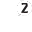
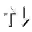

## Example of using:

```lua
local function addBlipForCoords(blipname,bliphash,coords)
	--blipHash  = {
	--	142522696, -not work
	--	1664425300,
	--	1673015813,
	--	-186344087,
	--	1299840260,
	--	-2086635932,
	--	1877557666, --Red color timer blips (5 sec)
	--	408396114, --Yellow Blip
	--	-1180414027,
	--	-108658760,
	--	618936128, -- Purple Color
	--	`BLIP_STYLE_PICKUP`
	--}
	local blip = Citizen.InvokeNative(0x554D9D53F696D002,1664425300, coords[1], coords[2], coords[3])
	SetBlipSprite(blip,bliphash,true)
	SetBlipScale(blip,0.2)
	Citizen.InvokeNative(0x9CB1A1623062F402, blip, blipname)
end

addBlipForCoords("STABLE",GetHashKey("BLIP_AMBIENT_HORSE"),{2508.1557617188,-1450.2551269531,44.610553741455})
```

<h3>Texture dictionary hashname (hash):</h3>
<h2>BLIPS (-437533031)</h2>

| Texture hashname                   | Texture hash | Texture example                                                                            | Download Image                                                                                                                                                                            |
| ---------------------------------- | ------------ | ------------------------------------------------------------------------------------------ | ----------------------------------------------------------------------------------------------------------------------------------------------------------------------------------------- |
| blip_ambient_bounty_hunter         | -861219276   |                  | <a href='https://raw.githubusercontent.com/abdulkadiraktas/rdr3_discoveries/master/useful_info_from_rpfs/textures/blips/images/blips/blip_ambient_bounty_hunter.png'>Download</a>         |
| blip_ambient_bounty_hunter_higher  | -535302224   |    | <a href='https://raw.githubusercontent.com/abdulkadiraktas/rdr3_discoveries/master/useful_info_from_rpfs/textures/blips/images/blips/blip_ambient_bounty_hunter_higher.png'>Download</a>  |
| blip_ambient_bounty_hunter_lower   | 28148096     |      | <a href='https://raw.githubusercontent.com/abdulkadiraktas/rdr3_discoveries/master/useful_info_from_rpfs/textures/blips/images/blips/blip_ambient_bounty_hunter_lower.png'>Download</a>   |
| blip_ambient_bounty_target         | 1481032477   |                  | <a href='https://raw.githubusercontent.com/abdulkadiraktas/rdr3_discoveries/master/useful_info_from_rpfs/textures/blips/images/blips/blip_ambient_bounty_target.png'>Download</a>         |
| blip_ambient_chore                 | 1321928545   |                                  | <a href='https://raw.githubusercontent.com/abdulkadiraktas/rdr3_discoveries/master/useful_info_from_rpfs/textures/blips/images/blips/blip_ambient_chore.png'>Download</a>                 |
| blip_ambient_coach                 | 1012165077   |                                  | <a href='https://raw.githubusercontent.com/abdulkadiraktas/rdr3_discoveries/master/useful_info_from_rpfs/textures/blips/images/blips/blip_ambient_coach.png'>Download</a>                 |
| blip_ambient_companion             | -185399168   |                          | <a href='https://raw.githubusercontent.com/abdulkadiraktas/rdr3_discoveries/master/useful_info_from_rpfs/textures/blips/images/blips/blip_ambient_companion.png'>Download</a>             |
| blip_ambient_companion_higher      | 54149631     |            | <a href='https://raw.githubusercontent.com/abdulkadiraktas/rdr3_discoveries/master/useful_info_from_rpfs/textures/blips/images/blips/blip_ambient_companion_higher.png'>Download</a>      |
| blip_ambient_companion_lower       | -1971029474  |              | <a href='https://raw.githubusercontent.com/abdulkadiraktas/rdr3_discoveries/master/useful_info_from_rpfs/textures/blips/images/blips/blip_ambient_companion_lower.png'>Download</a>       |
| blip_ambient_corpse                | -1116208957  |                                | <a href='https://raw.githubusercontent.com/abdulkadiraktas/rdr3_discoveries/master/useful_info_from_rpfs/textures/blips/images/blips/blip_ambient_corpse.png'>Download</a>                |
| blip_ambient_death                 | 350569997    |                                  | <a href='https://raw.githubusercontent.com/abdulkadiraktas/rdr3_discoveries/master/useful_info_from_rpfs/textures/blips/images/blips/blip_ambient_death.png'>Download</a>                 |
| blip_ambient_eyewitness            | -2018361632  |                        | <a href='https://raw.githubusercontent.com/abdulkadiraktas/rdr3_discoveries/master/useful_info_from_rpfs/textures/blips/images/blips/blip_ambient_eyewitness.png'>Download</a>            |
| blip_ambient_gang_leader           | -1489164512  |                      | <a href='https://raw.githubusercontent.com/abdulkadiraktas/rdr3_discoveries/master/useful_info_from_rpfs/textures/blips/images/blips/blip_ambient_gang_leader.png'>Download</a>           |
| blip_ambient_herd                  | 423351566    |                                    | <a href='https://raw.githubusercontent.com/abdulkadiraktas/rdr3_discoveries/master/useful_info_from_rpfs/textures/blips/images/blips/blip_ambient_herd.png'>Download</a>                  |
| blip_ambient_herd_straggler        | -1979146842  |                | <a href='https://raw.githubusercontent.com/abdulkadiraktas/rdr3_discoveries/master/useful_info_from_rpfs/textures/blips/images/blips/blip_ambient_herd_straggler.png'>Download</a>        |
| blip_ambient_higher                | -920572370   |                                | <a href='https://raw.githubusercontent.com/abdulkadiraktas/rdr3_discoveries/master/useful_info_from_rpfs/textures/blips/images/blips/blip_ambient_higher.png'>Download</a>                |
| blip_ambient_hitching_post         | 1220803671   |                  | <a href='https://raw.githubusercontent.com/abdulkadiraktas/rdr3_discoveries/master/useful_info_from_rpfs/textures/blips/images/blips/blip_ambient_hitching_post.png'>Download</a>         |
| blip_ambient_horse                 | -643888085   |                                  | <a href='https://raw.githubusercontent.com/abdulkadiraktas/rdr3_discoveries/master/useful_info_from_rpfs/textures/blips/images/blips/blip_ambient_horse.png'>Download</a>                 |
| blip_ambient_law                   | -1596758107  |                                      | <a href='https://raw.githubusercontent.com/abdulkadiraktas/rdr3_discoveries/master/useful_info_from_rpfs/textures/blips/images/blips/blip_ambient_law.png'>Download</a>                   |
| blip_ambient_loan_shark            | 1838354131   |                        | <a href='https://raw.githubusercontent.com/abdulkadiraktas/rdr3_discoveries/master/useful_info_from_rpfs/textures/blips/images/blips/blip_ambient_loan_shark.png'>Download</a>            |
| blip_ambient_lower                 | -1843639063  |                                  | <a href='https://raw.githubusercontent.com/abdulkadiraktas/rdr3_discoveries/master/useful_info_from_rpfs/textures/blips/images/blips/blip_ambient_lower.png'>Download</a>                 |
| blip_ambient_new                   | 419258445    |                                      | <a href='https://raw.githubusercontent.com/abdulkadiraktas/rdr3_discoveries/master/useful_info_from_rpfs/textures/blips/images/blips/blip_ambient_new.png'>Download</a>                   |
| blip_ambient_newspaper             | 587827268    |                          | <a href='https://raw.githubusercontent.com/abdulkadiraktas/rdr3_discoveries/master/useful_info_from_rpfs/textures/blips/images/blips/blip_ambient_newspaper.png'>Download</a>             |
| blip_ambient_npc                   | 305281166    |                                      | <a href='https://raw.githubusercontent.com/abdulkadiraktas/rdr3_discoveries/master/useful_info_from_rpfs/textures/blips/images/blips/blip_ambient_npc.png'>Download</a>                   |
| blip_ambient_npc_higher            | 978474677    |                        | <a href='https://raw.githubusercontent.com/abdulkadiraktas/rdr3_discoveries/master/useful_info_from_rpfs/textures/blips/images/blips/blip_ambient_npc_higher.png'>Download</a>            |
| blip_ambient_npc_lower             | -67528377    |                          | <a href='https://raw.githubusercontent.com/abdulkadiraktas/rdr3_discoveries/master/useful_info_from_rpfs/textures/blips/images/blips/blip_ambient_npc_lower.png'>Download</a>             |
| blip_ambient_ped_downed            | 1453767378   |                        | <a href='https://raw.githubusercontent.com/abdulkadiraktas/rdr3_discoveries/master/useful_info_from_rpfs/textures/blips/images/blips/blip_ambient_ped_downed.png'>Download</a>            |
| blip_ambient_ped_medium            | -1350763423  |                        | <a href='https://raw.githubusercontent.com/abdulkadiraktas/rdr3_discoveries/master/useful_info_from_rpfs/textures/blips/images/blips/blip_ambient_ped_medium.png'>Download</a>            |
| blip_ambient_ped_medium_higher     | 1386031480   |          | <a href='https://raw.githubusercontent.com/abdulkadiraktas/rdr3_discoveries/master/useful_info_from_rpfs/textures/blips/images/blips/blip_ambient_ped_medium_higher.png'>Download</a>     |
| blip_ambient_ped_medium_lower      | 1995891146   |            | <a href='https://raw.githubusercontent.com/abdulkadiraktas/rdr3_discoveries/master/useful_info_from_rpfs/textures/blips/images/blips/blip_ambient_ped_medium_lower.png'>Download</a>      |
| blip_ambient_ped_small             | 692310       |                          | <a href='https://raw.githubusercontent.com/abdulkadiraktas/rdr3_discoveries/master/useful_info_from_rpfs/textures/blips/images/blips/blip_ambient_ped_small.png'>Download</a>             |
| blip_ambient_ped_small_higher      | 195811413    |            | <a href='https://raw.githubusercontent.com/abdulkadiraktas/rdr3_discoveries/master/useful_info_from_rpfs/textures/blips/images/blips/blip_ambient_ped_small_higher.png'>Download</a>      |
| blip_ambient_ped_small_lower       | 511626456    |              | <a href='https://raw.githubusercontent.com/abdulkadiraktas/rdr3_discoveries/master/useful_info_from_rpfs/textures/blips/images/blips/blip_ambient_ped_small_lower.png'>Download</a>       |
| blip_ambient_quartermaster         | 249721687    |                  | <a href='https://raw.githubusercontent.com/abdulkadiraktas/rdr3_discoveries/master/useful_info_from_rpfs/textures/blips/images/blips/blip_ambient_quartermaster.png'>Download</a>         |
| blip_ambient_riverboat             | 2033397166   |                          | <a href='https://raw.githubusercontent.com/abdulkadiraktas/rdr3_discoveries/master/useful_info_from_rpfs/textures/blips/images/blips/blip_ambient_riverboat.png'>Download</a>             |
| blip_ambient_secret                | 675509286    |                                | <a href='https://raw.githubusercontent.com/abdulkadiraktas/rdr3_discoveries/master/useful_info_from_rpfs/textures/blips/images/blips/blip_ambient_secret.png'>Download</a>                |
| blip_ambient_sheriff               | -693644997   |                              | <a href='https://raw.githubusercontent.com/abdulkadiraktas/rdr3_discoveries/master/useful_info_from_rpfs/textures/blips/images/blips/blip_ambient_sheriff.png'>Download</a>               |
| blip_ambient_telegraph             | 503049244    |                          | <a href='https://raw.githubusercontent.com/abdulkadiraktas/rdr3_discoveries/master/useful_info_from_rpfs/textures/blips/images/blips/blip_ambient_telegraph.png'>Download</a>             |
| blip_ambient_theatre               | -417940443   |                              | <a href='https://raw.githubusercontent.com/abdulkadiraktas/rdr3_discoveries/master/useful_info_from_rpfs/textures/blips/images/blips/blip_ambient_theatre.png'>Download</a>               |
| blip_ambient_tithing               | -1954662204  |                              | <a href='https://raw.githubusercontent.com/abdulkadiraktas/rdr3_discoveries/master/useful_info_from_rpfs/textures/blips/images/blips/blip_ambient_tithing.png'>Download</a>               |
| blip_ambient_tracking              | -1580514024  |                            | <a href='https://raw.githubusercontent.com/abdulkadiraktas/rdr3_discoveries/master/useful_info_from_rpfs/textures/blips/images/blips/blip_ambient_tracking.png'>Download</a>              |
| blip_ambient_train                 | -250506368   |                                  | <a href='https://raw.githubusercontent.com/abdulkadiraktas/rdr3_discoveries/master/useful_info_from_rpfs/textures/blips/images/blips/blip_ambient_train.png'>Download</a>                 |
| blip_ambient_wagon                 | 874255393    |                                  | <a href='https://raw.githubusercontent.com/abdulkadiraktas/rdr3_discoveries/master/useful_info_from_rpfs/textures/blips/images/blips/blip_ambient_wagon.png'>Download</a>                 |
| blip_ambient_warp                  | 784218150    |                                    | <a href='https://raw.githubusercontent.com/abdulkadiraktas/rdr3_discoveries/master/useful_info_from_rpfs/textures/blips/images/blips/blip_ambient_warp.png'>Download</a>                  |
| blip_ammo_arrow                    | 573732443    |                                        | <a href='https://raw.githubusercontent.com/abdulkadiraktas/rdr3_discoveries/master/useful_info_from_rpfs/textures/blips/images/blips/blip_ammo_arrow.png'>Download</a>                    |
| blip_ammo_bullets                  | 1445158214   |                                    | <a href='https://raw.githubusercontent.com/abdulkadiraktas/rdr3_discoveries/master/useful_info_from_rpfs/textures/blips/images/blips/blip_ammo_bullets.png'>Download</a>                  |
| blip_animal                        | -1646261997  |                                                | <a href='https://raw.githubusercontent.com/abdulkadiraktas/rdr3_discoveries/master/useful_info_from_rpfs/textures/blips/images/blips/blip_animal.png'>Download</a>                        |
| blip_animal_dead                   | 1340161527   |                                      | <a href='https://raw.githubusercontent.com/abdulkadiraktas/rdr3_discoveries/master/useful_info_from_rpfs/textures/blips/images/blips/blip_animal_dead.png'>Download</a>                   |
| blip_animal_quality_01             | 1996684768   |                          | <a href='https://raw.githubusercontent.com/abdulkadiraktas/rdr3_discoveries/master/useful_info_from_rpfs/textures/blips/images/blips/blip_animal_quality_01.png'>Download</a>             |
| blip_animal_quality_02             | -171082889   |                          | <a href='https://raw.githubusercontent.com/abdulkadiraktas/rdr3_discoveries/master/useful_info_from_rpfs/textures/blips/images/blips/blip_animal_quality_02.png'>Download</a>             |
| blip_animal_quality_03             | -480291173   |                          | <a href='https://raw.githubusercontent.com/abdulkadiraktas/rdr3_discoveries/master/useful_info_from_rpfs/textures/blips/images/blips/blip_animal_quality_03.png'>Download</a>             |
| blip_animal_skin                   | 218395012    |                                      | <a href='https://raw.githubusercontent.com/abdulkadiraktas/rdr3_discoveries/master/useful_info_from_rpfs/textures/blips/images/blips/blip_animal_skin.png'>Download</a>                   |
| blip_app_connected                 | 1173759417   |                                  | <a href='https://raw.githubusercontent.com/abdulkadiraktas/rdr3_discoveries/master/useful_info_from_rpfs/textures/blips/images/blips/blip_app_connected.png'>Download</a>                 |
| blip_attention                     | -774688241   |                                          | <a href='https://raw.githubusercontent.com/abdulkadiraktas/rdr3_discoveries/master/useful_info_from_rpfs/textures/blips/images/blips/blip_attention.png'>Download</a>                     |
| blip_bank_debt                     | 1869246576   |                                          | <a href='https://raw.githubusercontent.com/abdulkadiraktas/rdr3_discoveries/master/useful_info_from_rpfs/textures/blips/images/blips/blip_bank_debt.png'>Download</a>                     |
| blip_bath_house                    | -304640465   |                                        | <a href='https://raw.githubusercontent.com/abdulkadiraktas/rdr3_discoveries/master/useful_info_from_rpfs/textures/blips/images/blips/blip_bath_house.png'>Download</a>                    |
| blip_camp                          | 327180499    |                                                    | <a href='https://raw.githubusercontent.com/abdulkadiraktas/rdr3_discoveries/master/useful_info_from_rpfs/textures/blips/images/blips/blip_camp.png'>Download</a>                          |
| blip_camp_request                  | -1043855483  |                                    | <a href='https://raw.githubusercontent.com/abdulkadiraktas/rdr3_discoveries/master/useful_info_from_rpfs/textures/blips/images/blips/blip_camp_request.png'>Download</a>                  |
| blip_camp_tent                     | -910004446   |                                          | <a href='https://raw.githubusercontent.com/abdulkadiraktas/rdr3_discoveries/master/useful_info_from_rpfs/textures/blips/images/blips/blip_camp_tent.png'>Download</a>                     |
| blip_campfire                      | 1754365229   |                                            | <a href='https://raw.githubusercontent.com/abdulkadiraktas/rdr3_discoveries/master/useful_info_from_rpfs/textures/blips/images/blips/blip_campfire.png'>Download</a>                      |
| blip_campfire_full                 | 773587962    |                                  | <a href='https://raw.githubusercontent.com/abdulkadiraktas/rdr3_discoveries/master/useful_info_from_rpfs/textures/blips/images/blips/blip_campfire_full.png'>Download</a>                 |
| blip_canoe                         | 62421675     |                                                  | <a href='https://raw.githubusercontent.com/abdulkadiraktas/rdr3_discoveries/master/useful_info_from_rpfs/textures/blips/images/blips/blip_canoe.png'>Download</a>                         |
| blip_cash_arthur                   | 1420154945   |                                      | <a href='https://raw.githubusercontent.com/abdulkadiraktas/rdr3_discoveries/master/useful_info_from_rpfs/textures/blips/images/blips/blip_cash_arthur.png'>Download</a>                   |
| blip_cash_bag                      | 688589278    |                                            | <a href='https://raw.githubusercontent.com/abdulkadiraktas/rdr3_discoveries/master/useful_info_from_rpfs/textures/blips/images/blips/blip_cash_bag.png'>Download</a>                      |
| blip_chest                         | -1138864184  |                                                  | <a href='https://raw.githubusercontent.com/abdulkadiraktas/rdr3_discoveries/master/useful_info_from_rpfs/textures/blips/images/blips/blip_chest.png'>Download</a>                         |
| blip_code_center                   | -758439257   |                                      | <a href='https://raw.githubusercontent.com/abdulkadiraktas/rdr3_discoveries/master/useful_info_from_rpfs/textures/blips/images/blips/blip_code_center.png'>Download</a>                   |
| blip_code_center_on_horse          | 648067515    |                    | <a href='https://raw.githubusercontent.com/abdulkadiraktas/rdr3_discoveries/master/useful_info_from_rpfs/textures/blips/images/blips/blip_code_center_on_horse.png'>Download</a>          |
| blip_code_waypoint                 | 960467426    |                                  | <a href='https://raw.githubusercontent.com/abdulkadiraktas/rdr3_discoveries/master/useful_info_from_rpfs/textures/blips/images/blips/blip_code_waypoint.png'>Download</a>                 |
| blip_deadeye_cross                 | 1754506823   |                                  | <a href='https://raw.githubusercontent.com/abdulkadiraktas/rdr3_discoveries/master/useful_info_from_rpfs/textures/blips/images/blips/blip_deadeye_cross.png'>Download</a>                 |
| blip_destroy                       | 456887900    |                                              | <a href='https://raw.githubusercontent.com/abdulkadiraktas/rdr3_discoveries/master/useful_info_from_rpfs/textures/blips/images/blips/blip_destroy.png'>Download</a>                       |
| blip_direction_pointer             | 51988200     |                          | <a href='https://raw.githubusercontent.com/abdulkadiraktas/rdr3_discoveries/master/useful_info_from_rpfs/textures/blips/images/blips/blip_direction_pointer.png'>Download</a>             |
| blip_donate_food                   | -1236018085  |                                      | <a href='https://raw.githubusercontent.com/abdulkadiraktas/rdr3_discoveries/master/useful_info_from_rpfs/textures/blips/images/blips/blip_donate_food.png'>Download</a>                   |
| blip_event_appleseed               | 1904459580   |                              | <a href='https://raw.githubusercontent.com/abdulkadiraktas/rdr3_discoveries/master/useful_info_from_rpfs/textures/blips/images/blips/blip_event_appleseed.png'>Download</a>               |
| blip_event_castor                  | -1989725258  |                                    | <a href='https://raw.githubusercontent.com/abdulkadiraktas/rdr3_discoveries/master/useful_info_from_rpfs/textures/blips/images/blips/blip_event_castor.png'>Download</a>                  |
| blip_event_railroad_camp           | -487631996   |                      | <a href='https://raw.githubusercontent.com/abdulkadiraktas/rdr3_discoveries/master/useful_info_from_rpfs/textures/blips/images/blips/blip_event_railroad_camp.png'>Download</a>           |
| blip_event_riggs_camp              | -1944395098  |                            | <a href='https://raw.githubusercontent.com/abdulkadiraktas/rdr3_discoveries/master/useful_info_from_rpfs/textures/blips/images/blips/blip_event_riggs_camp.png'>Download</a>              |
| blip_fence_building                | -1179229323  |                                | <a href='https://raw.githubusercontent.com/abdulkadiraktas/rdr3_discoveries/master/useful_info_from_rpfs/textures/blips/images/blips/blip_fence_building.png'>Download</a>                |
| blip_for_sale                      | -1383036426  |                                            | <a href='https://raw.githubusercontent.com/abdulkadiraktas/rdr3_discoveries/master/useful_info_from_rpfs/textures/blips/images/blips/blip_for_sale.png'>Download</a>                      |
| blip_gang_savings                  | 571063529    |                                    | <a href='https://raw.githubusercontent.com/abdulkadiraktas/rdr3_discoveries/master/useful_info_from_rpfs/textures/blips/images/blips/blip_gang_savings.png'>Download</a>                  |
| blip_gang_savings_special          | 1350383321   |                    | <a href='https://raw.githubusercontent.com/abdulkadiraktas/rdr3_discoveries/master/useful_info_from_rpfs/textures/blips/images/blips/blip_gang_savings_special.png'>Download</a>          |
| blip_grub                          | 935247438    |                                                    | <a href='https://raw.githubusercontent.com/abdulkadiraktas/rdr3_discoveries/master/useful_info_from_rpfs/textures/blips/images/blips/blip_grub.png'>Download</a>                          |
| blip_hat                           | 990667866    |                                                      | <a href='https://raw.githubusercontent.com/abdulkadiraktas/rdr3_discoveries/master/useful_info_from_rpfs/textures/blips/images/blips/blip_hat.png'>Download</a>                           |
| blip_horse_higher                  | 600220762    |                                    | <a href='https://raw.githubusercontent.com/abdulkadiraktas/rdr3_discoveries/master/useful_info_from_rpfs/textures/blips/images/blips/blip_horse_higher.png'>Download</a>                  |
| blip_horse_lower                   | 2131881492   |                                      | <a href='https://raw.githubusercontent.com/abdulkadiraktas/rdr3_discoveries/master/useful_info_from_rpfs/textures/blips/images/blips/blip_horse_lower.png'>Download</a>                   |
| blip_horse_owned                   | -1715189579  |                                      | <a href='https://raw.githubusercontent.com/abdulkadiraktas/rdr3_discoveries/master/useful_info_from_rpfs/textures/blips/images/blips/blip_horse_owned.png'>Download</a>                   |
| blip_horse_owned_active            | 1210165179   |                        | <a href='https://raw.githubusercontent.com/abdulkadiraktas/rdr3_discoveries/master/useful_info_from_rpfs/textures/blips/images/blips/blip_horse_owned_active.png'>Download</a>            |
| blip_horse_owned_bonding_0         | -217389439   |                  | <a href='https://raw.githubusercontent.com/abdulkadiraktas/rdr3_discoveries/master/useful_info_from_rpfs/textures/blips/images/blips/blip_horse_owned_bonding_0.png'>Download</a>         |
| blip_horse_owned_bonding_1         | 13992470     |                  | <a href='https://raw.githubusercontent.com/abdulkadiraktas/rdr3_discoveries/master/useful_info_from_rpfs/textures/blips/images/blips/blip_horse_owned_bonding_1.png'>Download</a>         |
| blip_horse_owned_bonding_2         | 396341162    |                  | <a href='https://raw.githubusercontent.com/abdulkadiraktas/rdr3_discoveries/master/useful_info_from_rpfs/textures/blips/images/blips/blip_horse_owned_bonding_2.png'>Download</a>         |
| blip_horse_owned_bonding_3         | 623069873    |                  | <a href='https://raw.githubusercontent.com/abdulkadiraktas/rdr3_discoveries/master/useful_info_from_rpfs/textures/blips/images/blips/blip_horse_owned_bonding_3.png'>Download</a>         |
| blip_horse_owned_bonding_4         | -637422489   |                  | <a href='https://raw.githubusercontent.com/abdulkadiraktas/rdr3_discoveries/master/useful_info_from_rpfs/textures/blips/images/blips/blip_horse_owned_bonding_4.png'>Download</a>         |
| blip_horse_owned_hitched           | -44909892    |                      | <a href='https://raw.githubusercontent.com/abdulkadiraktas/rdr3_discoveries/master/useful_info_from_rpfs/textures/blips/images/blips/blip_horse_owned_hitched.png'>Download</a>           |
| blip_horse_temp                    | -641397381   |                                        | <a href='https://raw.githubusercontent.com/abdulkadiraktas/rdr3_discoveries/master/useful_info_from_rpfs/textures/blips/images/blips/blip_horse_temp.png'>Download</a>                    |
| blip_horse_temp_bonding_0          | 937553910    |                    | <a href='https://raw.githubusercontent.com/abdulkadiraktas/rdr3_discoveries/master/useful_info_from_rpfs/textures/blips/images/blips/blip_horse_temp_bonding_0.png'>Download</a>          |
| blip_horse_temp_bonding_1          | 489732756    |                    | <a href='https://raw.githubusercontent.com/abdulkadiraktas/rdr3_discoveries/master/useful_info_from_rpfs/textures/blips/images/blips/blip_horse_temp_bonding_1.png'>Download</a>          |
| blip_horse_temp_bonding_2          | 195204984    |                    | <a href='https://raw.githubusercontent.com/abdulkadiraktas/rdr3_discoveries/master/useful_info_from_rpfs/textures/blips/images/blips/blip_horse_temp_bonding_2.png'>Download</a>          |
| blip_horse_temp_bonding_3          | -103418913   |                    | <a href='https://raw.githubusercontent.com/abdulkadiraktas/rdr3_discoveries/master/useful_info_from_rpfs/textures/blips/images/blips/blip_horse_temp_bonding_3.png'>Download</a>          |
| blip_horse_temp_bonding_4          | -815685893   |                    | <a href='https://raw.githubusercontent.com/abdulkadiraktas/rdr3_discoveries/master/useful_info_from_rpfs/textures/blips/images/blips/blip_horse_temp_bonding_4.png'>Download</a>          |
| blip_horse_temp_hitched            | 444737100    |                        | <a href='https://raw.githubusercontent.com/abdulkadiraktas/rdr3_discoveries/master/useful_info_from_rpfs/textures/blips/images/blips/blip_horse_temp_hitched.png'>Download</a>            |
| blip_horseshoe_0                   | 1887082874   |                                      | <a href='https://raw.githubusercontent.com/abdulkadiraktas/rdr3_discoveries/master/useful_info_from_rpfs/textures/blips/images/blips/blip_horseshoe_0.png'>Download</a>                   |
| blip_horseshoe_1                   | 2100933368   |                                      | <a href='https://raw.githubusercontent.com/abdulkadiraktas/rdr3_discoveries/master/useful_info_from_rpfs/textures/blips/images/blips/blip_horseshoe_1.png'>Download</a>                   |
| blip_horseshoe_2                   | 1166328735   |                                      | <a href='https://raw.githubusercontent.com/abdulkadiraktas/rdr3_discoveries/master/useful_info_from_rpfs/textures/blips/images/blips/blip_horseshoe_2.png'>Download</a>                   |
| blip_horseshoe_3                   | 1463641872   |                                      | <a href='https://raw.githubusercontent.com/abdulkadiraktas/rdr3_discoveries/master/useful_info_from_rpfs/textures/blips/images/blips/blip_horseshoe_3.png'>Download</a>                   |
| blip_horseshoe_4                   | 687278724    |                                      | <a href='https://raw.githubusercontent.com/abdulkadiraktas/rdr3_discoveries/master/useful_info_from_rpfs/textures/blips/images/blips/blip_horseshoe_4.png'>Download</a>                   |
| blip_hotel_bed                     | -211556852   |                                          | <a href='https://raw.githubusercontent.com/abdulkadiraktas/rdr3_discoveries/master/useful_info_from_rpfs/textures/blips/images/blips/blip_hotel_bed.png'>Download</a>                     |
| blip_job                           | -986795390   |                                                      | <a href='https://raw.githubusercontent.com/abdulkadiraktas/rdr3_discoveries/master/useful_info_from_rpfs/textures/blips/images/blips/blip_job.png'>Download</a>                           |
| blip_location_higher               | -902701436   |                              | <a href='https://raw.githubusercontent.com/abdulkadiraktas/rdr3_discoveries/master/useful_info_from_rpfs/textures/blips/images/blips/blip_location_higher.png'>Download</a>               |
| blip_location_lower                | -432067112   |                                | <a href='https://raw.githubusercontent.com/abdulkadiraktas/rdr3_discoveries/master/useful_info_from_rpfs/textures/blips/images/blips/blip_location_lower.png'>Download</a>                |
| blip_locked                        | 1255312268   |                                                | <a href='https://raw.githubusercontent.com/abdulkadiraktas/rdr3_discoveries/master/useful_info_from_rpfs/textures/blips/images/blips/blip_locked.png'>Download</a>                        |
| blip_mg_blackjack                  | 595820042    |                                    | <a href='https://raw.githubusercontent.com/abdulkadiraktas/rdr3_discoveries/master/useful_info_from_rpfs/textures/blips/images/blips/blip_mg_blackjack.png'>Download</a>                  |
| blip_mg_dominoes                   | -1650465405  |                                      | <a href='https://raw.githubusercontent.com/abdulkadiraktas/rdr3_discoveries/master/useful_info_from_rpfs/textures/blips/images/blips/blip_mg_dominoes.png'>Download</a>                   |
| blip_mg_dominoes_all3s             | -1581061148  |                          | <a href='https://raw.githubusercontent.com/abdulkadiraktas/rdr3_discoveries/master/useful_info_from_rpfs/textures/blips/images/blips/blip_mg_dominoes_all3s.png'>Download</a>             |
| blip_mg_dominoes_all5s             | -48718882    |                          | <a href='https://raw.githubusercontent.com/abdulkadiraktas/rdr3_discoveries/master/useful_info_from_rpfs/textures/blips/images/blips/blip_mg_dominoes_all5s.png'>Download</a>             |
| blip_mg_dominoes_draw              | -379108622   |                            | <a href='https://raw.githubusercontent.com/abdulkadiraktas/rdr3_discoveries/master/useful_info_from_rpfs/textures/blips/images/blips/blip_mg_dominoes_draw.png'>Download</a>              |
| blip_mg_drinking                   | 1242464081   |                                      | <a href='https://raw.githubusercontent.com/abdulkadiraktas/rdr3_discoveries/master/useful_info_from_rpfs/textures/blips/images/blips/blip_mg_drinking.png'>Download</a>                   |
| blip_mg_fishing                    | -1575595762  |                                        | <a href='https://raw.githubusercontent.com/abdulkadiraktas/rdr3_discoveries/master/useful_info_from_rpfs/textures/blips/images/blips/blip_mg_fishing.png'>Download</a>                    |
| blip_mg_five_finger_fillet         | 1974815632   |                  | <a href='https://raw.githubusercontent.com/abdulkadiraktas/rdr3_discoveries/master/useful_info_from_rpfs/textures/blips/images/blips/blip_mg_five_finger_fillet.png'>Download</a>         |
| blip_mg_five_finger_fillet_burnout | 1015604260   |  | <a href='https://raw.githubusercontent.com/abdulkadiraktas/rdr3_discoveries/master/useful_info_from_rpfs/textures/blips/images/blips/blip_mg_five_finger_fillet_burnout.png'>Download</a> |
| blip_mg_five_finger_fillet_guts    | 126262516    |        | <a href='https://raw.githubusercontent.com/abdulkadiraktas/rdr3_discoveries/master/useful_info_from_rpfs/textures/blips/images/blips/blip_mg_five_finger_fillet_guts.png'>Download</a>    |
| blip_mg_poker                      | 1243830185   |                                            | <a href='https://raw.githubusercontent.com/abdulkadiraktas/rdr3_discoveries/master/useful_info_from_rpfs/textures/blips/images/blips/blip_mg_poker.png'>Download</a>                      |
| blip_mission_area_beau             | -1477394468  |                          | <a href='https://raw.githubusercontent.com/abdulkadiraktas/rdr3_discoveries/master/useful_info_from_rpfs/textures/blips/images/blips/blip_mission_area_beau.png'>Download</a>             |
| blip_mission_area_bill             | 455154152    |                          | <a href='https://raw.githubusercontent.com/abdulkadiraktas/rdr3_discoveries/master/useful_info_from_rpfs/textures/blips/images/blips/blip_mission_area_bill.png'>Download</a>             |
| blip_mission_area_bounty           | 2125146709   |                      | <a href='https://raw.githubusercontent.com/abdulkadiraktas/rdr3_discoveries/master/useful_info_from_rpfs/textures/blips/images/blips/blip_mission_area_bounty.png'>Download</a>           |
| blip_mission_area_bronte           | -702538745   |                      | <a href='https://raw.githubusercontent.com/abdulkadiraktas/rdr3_discoveries/master/useful_info_from_rpfs/textures/blips/images/blips/blip_mission_area_bronte.png'>Download</a>           |
| blip_mission_area_david_geddes     | 1403865185   |          | <a href='https://raw.githubusercontent.com/abdulkadiraktas/rdr3_discoveries/master/useful_info_from_rpfs/textures/blips/images/blips/blip_mission_area_david_geddes.png'>Download</a>     |
| blip_mission_area_dutch            | 1729623738   |                        | <a href='https://raw.githubusercontent.com/abdulkadiraktas/rdr3_discoveries/master/useful_info_from_rpfs/textures/blips/images/blips/blip_mission_area_dutch.png'>Download</a>            |
| blip_mission_area_eagle_flies      | 508736310    |            | <a href='https://raw.githubusercontent.com/abdulkadiraktas/rdr3_discoveries/master/useful_info_from_rpfs/textures/blips/images/blips/blip_mission_area_eagle_flies.png'>Download</a>      |
| blip_mission_area_edith            | -486409706   |                        | <a href='https://raw.githubusercontent.com/abdulkadiraktas/rdr3_discoveries/master/useful_info_from_rpfs/textures/blips/images/blips/blip_mission_area_edith.png'>Download</a>            |
| blip_mission_area_grays            | 1876890949   |                        | <a href='https://raw.githubusercontent.com/abdulkadiraktas/rdr3_discoveries/master/useful_info_from_rpfs/textures/blips/images/blips/blip_mission_area_grays.png'>Download</a>            |
| blip_mission_area_gunslinger_1     | -1849394918  |          | <a href='https://raw.githubusercontent.com/abdulkadiraktas/rdr3_discoveries/master/useful_info_from_rpfs/textures/blips/images/blips/blip_mission_area_gunslinger_1.png'>Download</a>     |
| blip_mission_area_gunslinger_2     | 1665113105   |          | <a href='https://raw.githubusercontent.com/abdulkadiraktas/rdr3_discoveries/master/useful_info_from_rpfs/textures/blips/images/blips/blip_mission_area_gunslinger_2.png'>Download</a>     |
| blip_mission_area_henri            | 1048219592   |                        | <a href='https://raw.githubusercontent.com/abdulkadiraktas/rdr3_discoveries/master/useful_info_from_rpfs/textures/blips/images/blips/blip_mission_area_henri.png'>Download</a>            |
| blip_mission_area_hosea            | 783937097    |                        | <a href='https://raw.githubusercontent.com/abdulkadiraktas/rdr3_discoveries/master/useful_info_from_rpfs/textures/blips/images/blips/blip_mission_area_hosea.png'>Download</a>            |
| blip_mission_area_javier           | 495717394    |                      | <a href='https://raw.githubusercontent.com/abdulkadiraktas/rdr3_discoveries/master/useful_info_from_rpfs/textures/blips/images/blips/blip_mission_area_javier.png'>Download</a>           |
| blip_mission_area_john             | 231806605    |                          | <a href='https://raw.githubusercontent.com/abdulkadiraktas/rdr3_discoveries/master/useful_info_from_rpfs/textures/blips/images/blips/blip_mission_area_john.png'>Download</a>             |
| blip_mission_area_kitty            | 1003036114   |                        | <a href='https://raw.githubusercontent.com/abdulkadiraktas/rdr3_discoveries/master/useful_info_from_rpfs/textures/blips/images/blips/blip_mission_area_kitty.png'>Download</a>            |
| blip_mission_area_leon             | -686621143   |                          | <a href='https://raw.githubusercontent.com/abdulkadiraktas/rdr3_discoveries/master/useful_info_from_rpfs/textures/blips/images/blips/blip_mission_area_leon.png'>Download</a>             |
| blip_mission_area_lightning        | 1084717321   |                | <a href='https://raw.githubusercontent.com/abdulkadiraktas/rdr3_discoveries/master/useful_info_from_rpfs/textures/blips/images/blips/blip_mission_area_lightning.png'>Download</a>        |
| blip_mission_area_loanshark        | -1034306897  |                | <a href='https://raw.githubusercontent.com/abdulkadiraktas/rdr3_discoveries/master/useful_info_from_rpfs/textures/blips/images/blips/blip_mission_area_loanshark.png'>Download</a>        |
| blip_mission_area_mary             | -925245417   |                          | <a href='https://raw.githubusercontent.com/abdulkadiraktas/rdr3_discoveries/master/useful_info_from_rpfs/textures/blips/images/blips/blip_mission_area_mary.png'>Download</a>             |
| blip_mission_area_micah            | -977737823   |                        | <a href='https://raw.githubusercontent.com/abdulkadiraktas/rdr3_discoveries/master/useful_info_from_rpfs/textures/blips/images/blips/blip_mission_area_micah.png'>Download</a>            |
| blip_mission_area_rains            | 1255014523   |                        | <a href='https://raw.githubusercontent.com/abdulkadiraktas/rdr3_discoveries/master/useful_info_from_rpfs/textures/blips/images/blips/blip_mission_area_rains.png'>Download</a>            |
| blip_mission_area_rc               | -1998899839  |                              | <a href='https://raw.githubusercontent.com/abdulkadiraktas/rdr3_discoveries/master/useful_info_from_rpfs/textures/blips/images/blips/blip_mission_area_rc.png'>Download</a>               |
| blip_mission_area_reverend         | -164151171   |                  | <a href='https://raw.githubusercontent.com/abdulkadiraktas/rdr3_discoveries/master/useful_info_from_rpfs/textures/blips/images/blips/blip_mission_area_reverend.png'>Download</a>         |
| blip_mission_area_sadie            | 1631595563   |                        | <a href='https://raw.githubusercontent.com/abdulkadiraktas/rdr3_discoveries/master/useful_info_from_rpfs/textures/blips/images/blips/blip_mission_area_sadie.png'>Download</a>            |
| blip_mission_area_strauss          | -721238161   |                    | <a href='https://raw.githubusercontent.com/abdulkadiraktas/rdr3_discoveries/master/useful_info_from_rpfs/textures/blips/images/blips/blip_mission_area_strauss.png'>Download</a>          |
| blip_mission_area_trelawney        | -1245830589  |                | <a href='https://raw.githubusercontent.com/abdulkadiraktas/rdr3_discoveries/master/useful_info_from_rpfs/textures/blips/images/blips/blip_mission_area_trelawney.png'>Download</a>        |
| blip_mission_bg                    | -125278436   |                                        | <a href='https://raw.githubusercontent.com/abdulkadiraktas/rdr3_discoveries/master/useful_info_from_rpfs/textures/blips/images/blips/blip_mission_bg.png'>Download</a>                    |
| blip_mission_bill                  | 944812202    |                                    | <a href='https://raw.githubusercontent.com/abdulkadiraktas/rdr3_discoveries/master/useful_info_from_rpfs/textures/blips/images/blips/blip_mission_bill.png'>Download</a>                  |
| blip_mission_bounty                | -907204276   |                                | <a href='https://raw.githubusercontent.com/abdulkadiraktas/rdr3_discoveries/master/useful_info_from_rpfs/textures/blips/images/blips/blip_mission_bounty.png'>Download</a>                |
| blip_mission_camp                  | -1125110489  |                                    | <a href='https://raw.githubusercontent.com/abdulkadiraktas/rdr3_discoveries/master/useful_info_from_rpfs/textures/blips/images/blips/blip_mission_camp.png'>Download</a>                  |
| blip_mission_dutch                 | -106554210   |                                  | <a href='https://raw.githubusercontent.com/abdulkadiraktas/rdr3_discoveries/master/useful_info_from_rpfs/textures/blips/images/blips/blip_mission_dutch.png'>Download</a>                 |
| blip_mission_higher                | 1605798866   |                                | <a href='https://raw.githubusercontent.com/abdulkadiraktas/rdr3_discoveries/master/useful_info_from_rpfs/textures/blips/images/blips/blip_mission_higher.png'>Download</a>                |
| blip_mission_hosea                 | -1724301546  |                                  | <a href='https://raw.githubusercontent.com/abdulkadiraktas/rdr3_discoveries/master/useful_info_from_rpfs/textures/blips/images/blips/blip_mission_hosea.png'>Download</a>                 |
| blip_mission_john                  | -887880659   |                                    | <a href='https://raw.githubusercontent.com/abdulkadiraktas/rdr3_discoveries/master/useful_info_from_rpfs/textures/blips/images/blips/blip_mission_john.png'>Download</a>                  |
| blip_mission_lower                 | -839061276   |                                  | <a href='https://raw.githubusercontent.com/abdulkadiraktas/rdr3_discoveries/master/useful_info_from_rpfs/textures/blips/images/blips/blip_mission_lower.png'>Download</a>                 |
| blip_mission_micah                 | 1267381595   |                                  | <a href='https://raw.githubusercontent.com/abdulkadiraktas/rdr3_discoveries/master/useful_info_from_rpfs/textures/blips/images/blips/blip_mission_micah.png'>Download</a>                 |
| blip_mp_pickup                     | 1109348405   |                                          | <a href='https://raw.githubusercontent.com/abdulkadiraktas/rdr3_discoveries/master/useful_info_from_rpfs/textures/blips/images/blips/blip_mp_pickup.png'>Download</a>                     |
| blip_npc_search                    | 2031478856   |                                        | <a href='https://raw.githubusercontent.com/abdulkadiraktas/rdr3_discoveries/master/useful_info_from_rpfs/textures/blips/images/blips/blip_npc_search.png'>Download</a>                    |
| blip_objective                     | -570710357   |                                          | <a href='https://raw.githubusercontent.com/abdulkadiraktas/rdr3_discoveries/master/useful_info_from_rpfs/textures/blips/images/blips/blip_objective.png'>Download</a>                     |
| blip_objective_minor               | 1192138201   |                              | <a href='https://raw.githubusercontent.com/abdulkadiraktas/rdr3_discoveries/master/useful_info_from_rpfs/textures/blips/images/blips/blip_objective_minor.png'>Download</a>               |
| blip_overlay_1                     | 480724882    |                                          | <a href='https://raw.githubusercontent.com/abdulkadiraktas/rdr3_discoveries/master/useful_info_from_rpfs/textures/blips/images/blips/blip_overlay_1.png'>Download</a>                     |
| blip_overlay_2                     | -300946848   |                                          | <a href='https://raw.githubusercontent.com/abdulkadiraktas/rdr3_discoveries/master/useful_info_from_rpfs/textures/blips/images/blips/blip_overlay_2.png'>Download</a>                     |
| blip_overlay_3                     | 7900981      |                                          | <a href='https://raw.githubusercontent.com/abdulkadiraktas/rdr3_discoveries/master/useful_info_from_rpfs/textures/blips/images/blips/blip_overlay_3.png'>Download</a>                     |
| blip_overlay_4                     | 1675187701   |                                          | <a href='https://raw.githubusercontent.com/abdulkadiraktas/rdr3_discoveries/master/useful_info_from_rpfs/textures/blips/images/blips/blip_overlay_4.png'>Download</a>                     |
| blip_overlay_5                     | 1846307419   |                                          | <a href='https://raw.githubusercontent.com/abdulkadiraktas/rdr3_discoveries/master/useful_info_from_rpfs/textures/blips/images/blips/blip_overlay_5.png'>Download</a>                     |
| blip_overlay_bill                  | 68100707     |                                    | <a href='https://raw.githubusercontent.com/abdulkadiraktas/rdr3_discoveries/master/useful_info_from_rpfs/textures/blips/images/blips/blip_overlay_bill.png'>Download</a>                  |
| blip_overlay_charles               | -674292488   |                              | <a href='https://raw.githubusercontent.com/abdulkadiraktas/rdr3_discoveries/master/useful_info_from_rpfs/textures/blips/images/blips/blip_overlay_charles.png'>Download</a>               |
| blip_overlay_hosea                 | -985772686   |                                  | <a href='https://raw.githubusercontent.com/abdulkadiraktas/rdr3_discoveries/master/useful_info_from_rpfs/textures/blips/images/blips/blip_overlay_hosea.png'>Download</a>                 |
| blip_overlay_javier                | 495452413    |                                | <a href='https://raw.githubusercontent.com/abdulkadiraktas/rdr3_discoveries/master/useful_info_from_rpfs/textures/blips/images/blips/blip_overlay_javier.png'>Download</a>                |
| blip_overlay_john                  | -1764128257  |                                    | <a href='https://raw.githubusercontent.com/abdulkadiraktas/rdr3_discoveries/master/useful_info_from_rpfs/textures/blips/images/blips/blip_overlay_john.png'>Download</a>                  |
| blip_overlay_karen                 | -1283959649  |                                  | <a href='https://raw.githubusercontent.com/abdulkadiraktas/rdr3_discoveries/master/useful_info_from_rpfs/textures/blips/images/blips/blip_overlay_karen.png'>Download</a>                 |
| blip_overlay_kieran                | 577712810    |                                | <a href='https://raw.githubusercontent.com/abdulkadiraktas/rdr3_discoveries/master/useful_info_from_rpfs/textures/blips/images/blips/blip_overlay_kieran.png'>Download</a>                |
| blip_overlay_lenny                 | -1491306790  |                                  | <a href='https://raw.githubusercontent.com/abdulkadiraktas/rdr3_discoveries/master/useful_info_from_rpfs/textures/blips/images/blips/blip_overlay_lenny.png'>Download</a>                 |
| blip_overlay_loanshark             | -1713383509  |                          | <a href='https://raw.githubusercontent.com/abdulkadiraktas/rdr3_discoveries/master/useful_info_from_rpfs/textures/blips/images/blips/blip_overlay_loanshark.png'>Download</a>             |
| blip_overlay_micah                 | 809358939    |                                  | <a href='https://raw.githubusercontent.com/abdulkadiraktas/rdr3_discoveries/master/useful_info_from_rpfs/textures/blips/images/blips/blip_overlay_micah.png'>Download</a>                 |
| blip_overlay_party                 | 1097265030   |                                  | <a href='https://raw.githubusercontent.com/abdulkadiraktas/rdr3_discoveries/master/useful_info_from_rpfs/textures/blips/images/blips/blip_overlay_party.png'>Download</a>                 |
| blip_overlay_pearson               | 1083384676   |                              | <a href='https://raw.githubusercontent.com/abdulkadiraktas/rdr3_discoveries/master/useful_info_from_rpfs/textures/blips/images/blips/blip_overlay_pearson.png'>Download</a>               |
| blip_overlay_ring                  | -184692826   |                                    | <a href='https://raw.githubusercontent.com/abdulkadiraktas/rdr3_discoveries/master/useful_info_from_rpfs/textures/blips/images/blips/blip_overlay_ring.png'>Download</a>                  |
| blip_overlay_saddle                | -271586249   |                                | <a href='https://raw.githubusercontent.com/abdulkadiraktas/rdr3_discoveries/master/useful_info_from_rpfs/textures/blips/images/blips/blip_overlay_saddle.png'>Download</a>                |
| blip_overlay_sean                  | -656301087   |                                    | <a href='https://raw.githubusercontent.com/abdulkadiraktas/rdr3_discoveries/master/useful_info_from_rpfs/textures/blips/images/blips/blip_overlay_sean.png'>Download</a>                  |
| blip_overlay_strauss               | 1737923688   |                              | <a href='https://raw.githubusercontent.com/abdulkadiraktas/rdr3_discoveries/master/useful_info_from_rpfs/textures/blips/images/blips/blip_overlay_strauss.png'>Download</a>               |
| blip_overlay_tilly                 | 2009192597   |                                  | <a href='https://raw.githubusercontent.com/abdulkadiraktas/rdr3_discoveries/master/useful_info_from_rpfs/textures/blips/images/blips/blip_overlay_tilly.png'>Download</a>                 |
| blip_overlay_uncle                 | -1706952903  |                                  | <a href='https://raw.githubusercontent.com/abdulkadiraktas/rdr3_discoveries/master/useful_info_from_rpfs/textures/blips/images/blips/blip_overlay_uncle.png'>Download</a>                 |
| blip_overlay_white_1               | -810005617   |                              | <a href='https://raw.githubusercontent.com/abdulkadiraktas/rdr3_discoveries/master/useful_info_from_rpfs/textures/blips/images/blips/blip_overlay_white_1.png'>Download</a>               |
| blip_overlay_white_2               | -512626942   |                              | <a href='https://raw.githubusercontent.com/abdulkadiraktas/rdr3_discoveries/master/useful_info_from_rpfs/textures/blips/images/blips/blip_overlay_white_2.png'>Download</a>               |
| blip_overlay_white_3               | -1268149006  |                              | <a href='https://raw.githubusercontent.com/abdulkadiraktas/rdr3_discoveries/master/useful_info_from_rpfs/textures/blips/images/blips/blip_overlay_white_3.png'>Download</a>               |
| blip_overlay_white_4               | -969951106   |                              | <a href='https://raw.githubusercontent.com/abdulkadiraktas/rdr3_discoveries/master/useful_info_from_rpfs/textures/blips/images/blips/blip_overlay_white_4.png'>Download</a>               |
| blip_overlay_white_5               | 1222000069   |                              | <a href='https://raw.githubusercontent.com/abdulkadiraktas/rdr3_discoveries/master/useful_info_from_rpfs/textures/blips/images/blips/blip_overlay_white_5.png'>Download</a>               |
| blip_photo_studio                  | 1364029453   |                                    | <a href='https://raw.githubusercontent.com/abdulkadiraktas/rdr3_discoveries/master/useful_info_from_rpfs/textures/blips/images/blips/blip_photo_studio.png'>Download</a>                  |
| blip_plant                         | -675651933   |                                                  | <a href='https://raw.githubusercontent.com/abdulkadiraktas/rdr3_discoveries/master/useful_info_from_rpfs/textures/blips/images/blips/blip_plant.png'>Download</a>                         |
| blip_player                        | -523921054   |                                                | <a href='https://raw.githubusercontent.com/abdulkadiraktas/rdr3_discoveries/master/useful_info_from_rpfs/textures/blips/images/blips/blip_player.png'>Download</a>                        |
| blip_player_coach                  | -361388975   |                                    | <a href='https://raw.githubusercontent.com/abdulkadiraktas/rdr3_discoveries/master/useful_info_from_rpfs/textures/blips/images/blips/blip_player_coach.png'>Download</a>                  |
| blip_poi                           | -2039778370  |                                                      | <a href='https://raw.githubusercontent.com/abdulkadiraktas/rdr3_discoveries/master/useful_info_from_rpfs/textures/blips/images/blips/blip_poi.png'>Download</a>                           |
| blip_post_office                   | 1861010125   |                                      | <a href='https://raw.githubusercontent.com/abdulkadiraktas/rdr3_discoveries/master/useful_info_from_rpfs/textures/blips/images/blips/blip_post_office.png'>Download</a>                   |
| blip_post_office_rec               | 1475382911   |                              | <a href='https://raw.githubusercontent.com/abdulkadiraktas/rdr3_discoveries/master/useful_info_from_rpfs/textures/blips/images/blips/blip_post_office_rec.png'>Download</a>               |
| blip_proc_bank                     | -2128054417  |                                          | <a href='https://raw.githubusercontent.com/abdulkadiraktas/rdr3_discoveries/master/useful_info_from_rpfs/textures/blips/images/blips/blip_proc_bank.png'>Download</a>                     |
| blip_proc_bounty_poster            | -1636832113  |                        | <a href='https://raw.githubusercontent.com/abdulkadiraktas/rdr3_discoveries/master/useful_info_from_rpfs/textures/blips/images/blips/blip_proc_bounty_poster.png'>Download</a>            |
| blip_proc_home                     | 1586273744   |                                          | <a href='https://raw.githubusercontent.com/abdulkadiraktas/rdr3_discoveries/master/useful_info_from_rpfs/textures/blips/images/blips/blip_proc_home.png'>Download</a>                     |
| blip_proc_home_locked              | -1498696713  |                            | <a href='https://raw.githubusercontent.com/abdulkadiraktas/rdr3_discoveries/master/useful_info_from_rpfs/textures/blips/images/blips/blip_proc_home_locked.png'>Download</a>              |
| blip_proc_loanshark                | -997121570   |                                | <a href='https://raw.githubusercontent.com/abdulkadiraktas/rdr3_discoveries/master/useful_info_from_rpfs/textures/blips/images/blips/blip_proc_loanshark.png'>Download</a>                |
| blip_proc_track                    | 421058601    |                                        | <a href='https://raw.githubusercontent.com/abdulkadiraktas/rdr3_discoveries/master/useful_info_from_rpfs/textures/blips/images/blips/blip_proc_track.png'>Download</a>                    |
| blip_radar_edge_pointer            | -1192977721  |                        | <a href='https://raw.githubusercontent.com/abdulkadiraktas/rdr3_discoveries/master/useful_info_from_rpfs/textures/blips/images/blips/blip_radar_edge_pointer.png'>Download</a>            |
| blip_radius_search                 | 150441873    |                                  | <a href='https://raw.githubusercontent.com/abdulkadiraktas/rdr3_discoveries/master/useful_info_from_rpfs/textures/blips/images/blips/blip_radius_search.png'>Download</a>                 |
| blip_rc                            | -1822497728  |                                                        | <a href='https://raw.githubusercontent.com/abdulkadiraktas/rdr3_discoveries/master/useful_info_from_rpfs/textures/blips/images/blips/blip_rc.png'>Download</a>                            |
| blip_rc_albert                     | -1259688762  |                                          | <a href='https://raw.githubusercontent.com/abdulkadiraktas/rdr3_discoveries/master/useful_info_from_rpfs/textures/blips/images/blips/blip_rc_albert.png'>Download</a>                     |
| blip_rc_algernon_wasp              | 2107943776   |                            | <a href='https://raw.githubusercontent.com/abdulkadiraktas/rdr3_discoveries/master/useful_info_from_rpfs/textures/blips/images/blips/blip_rc_algernon_wasp.png'>Download</a>              |
| blip_rc_art                        | -434412386   |                                                | <a href='https://raw.githubusercontent.com/abdulkadiraktas/rdr3_discoveries/master/useful_info_from_rpfs/textures/blips/images/blips/blip_rc_art.png'>Download</a>                        |
| blip_rc_calloway                   | -1744398657  |                                      | <a href='https://raw.githubusercontent.com/abdulkadiraktas/rdr3_discoveries/master/useful_info_from_rpfs/textures/blips/images/blips/blip_rc_calloway.png'>Download</a>                   |
| blip_rc_chain_gang                 | -622951465   |                                  | <a href='https://raw.githubusercontent.com/abdulkadiraktas/rdr3_discoveries/master/useful_info_from_rpfs/textures/blips/images/blips/blip_rc_chain_gang.png'>Download</a>                 |
| blip_rc_charlotte_balfour          | -1676833170  |                    | <a href='https://raw.githubusercontent.com/abdulkadiraktas/rdr3_discoveries/master/useful_info_from_rpfs/textures/blips/images/blips/blip_rc_charlotte_balfour.png'>Download</a>          |
| blip_rc_crackpot                   | 877823184    |                                      | <a href='https://raw.githubusercontent.com/abdulkadiraktas/rdr3_discoveries/master/useful_info_from_rpfs/textures/blips/images/blips/blip_rc_crackpot.png'>Download</a>                   |
| blip_rc_deborah                    | 1162303770   |                                        | <a href='https://raw.githubusercontent.com/abdulkadiraktas/rdr3_discoveries/master/useful_info_from_rpfs/textures/blips/images/blips/blip_rc_deborah.png'>Download</a>                    |
| blip_rc_gunslinger_1               | 858349040    |                              | <a href='https://raw.githubusercontent.com/abdulkadiraktas/rdr3_discoveries/master/useful_info_from_rpfs/textures/blips/images/blips/blip_rc_gunslinger_1.png'>Download</a>               |
| blip_rc_gunslinger_2               | 479604938    |                              | <a href='https://raw.githubusercontent.com/abdulkadiraktas/rdr3_discoveries/master/useful_info_from_rpfs/textures/blips/images/blips/blip_rc_gunslinger_2.png'>Download</a>               |
| blip_rc_gunslinger_3               | 240424007    |                              | <a href='https://raw.githubusercontent.com/abdulkadiraktas/rdr3_discoveries/master/useful_info_from_rpfs/textures/blips/images/blips/blip_rc_gunslinger_3.png'>Download</a>               |
| blip_rc_gunslinger_5               | 1813565390   |                              | <a href='https://raw.githubusercontent.com/abdulkadiraktas/rdr3_discoveries/master/useful_info_from_rpfs/textures/blips/images/blips/blip_rc_gunslinger_5.png'>Download</a>               |
| blip_rc_henri                      | -340501579   |                                            | <a href='https://raw.githubusercontent.com/abdulkadiraktas/rdr3_discoveries/master/useful_info_from_rpfs/textures/blips/images/blips/blip_rc_henri.png'>Download</a>                      |
| blip_rc_hobbs                      | 1986498931   |                                            | <a href='https://raw.githubusercontent.com/abdulkadiraktas/rdr3_discoveries/master/useful_info_from_rpfs/textures/blips/images/blips/blip_rc_hobbs.png'>Download</a>                      |
| blip_rc_jeremy_gill                | -273196610   |                                | <a href='https://raw.githubusercontent.com/abdulkadiraktas/rdr3_discoveries/master/useful_info_from_rpfs/textures/blips/images/blips/blip_rc_jeremy_gill.png'>Download</a>                |
| blip_rc_kitty                      | 1970061205   |                                            | <a href='https://raw.githubusercontent.com/abdulkadiraktas/rdr3_discoveries/master/useful_info_from_rpfs/textures/blips/images/blips/blip_rc_kitty.png'>Download</a>                      |
| blip_rc_lightning                  | -1962480616  |                                    | <a href='https://raw.githubusercontent.com/abdulkadiraktas/rdr3_discoveries/master/useful_info_from_rpfs/textures/blips/images/blips/blip_rc_lightning.png'>Download</a>                  |
| blip_rc_obediah_hinton             | 415367144    |                          | <a href='https://raw.githubusercontent.com/abdulkadiraktas/rdr3_discoveries/master/useful_info_from_rpfs/textures/blips/images/blips/blip_rc_obediah_hinton.png'>Download</a>             |
| blip_rc_odd_fellows                | 825960713    |                                | <a href='https://raw.githubusercontent.com/abdulkadiraktas/rdr3_discoveries/master/useful_info_from_rpfs/textures/blips/images/blips/blip_rc_odd_fellows.png'>Download</a>                |
| blip_rc_oh_brother                 | -1280269885  |                                  | <a href='https://raw.githubusercontent.com/abdulkadiraktas/rdr3_discoveries/master/useful_info_from_rpfs/textures/blips/images/blips/blip_rc_oh_brother.png'>Download</a>                 |
| blip_rc_old_flame                  | 1429600911   |                                    | <a href='https://raw.githubusercontent.com/abdulkadiraktas/rdr3_discoveries/master/useful_info_from_rpfs/textures/blips/images/blips/blip_rc_old_flame.png'>Download</a>                  |
| blip_rc_slave_catcher              | 194953189    |                            | <a href='https://raw.githubusercontent.com/abdulkadiraktas/rdr3_discoveries/master/useful_info_from_rpfs/textures/blips/images/blips/blip_rc_slave_catcher.png'>Download</a>              |
| blip_rc_war_veteran                | 1770336866   |                                | <a href='https://raw.githubusercontent.com/abdulkadiraktas/rdr3_discoveries/master/useful_info_from_rpfs/textures/blips/images/blips/blip_rc_war_veteran.png'>Download</a>                |
| blip_region_caravan                | -1606321000  |                                | <a href='https://raw.githubusercontent.com/abdulkadiraktas/rdr3_discoveries/master/useful_info_from_rpfs/textures/blips/images/blips/blip_region_caravan.png'>Download</a>                |
| blip_region_hideout                | -428972082   |                                | <a href='https://raw.githubusercontent.com/abdulkadiraktas/rdr3_discoveries/master/useful_info_from_rpfs/textures/blips/images/blips/blip_region_hideout.png'>Download</a>                |
| blip_region_hunting                | 500148876    |                                | <a href='https://raw.githubusercontent.com/abdulkadiraktas/rdr3_discoveries/master/useful_info_from_rpfs/textures/blips/images/blips/blip_region_hunting.png'>Download</a>                |
| blip_robbery_bank                  | 623155783    |                                    | <a href='https://raw.githubusercontent.com/abdulkadiraktas/rdr3_discoveries/master/useful_info_from_rpfs/textures/blips/images/blips/blip_robbery_bank.png'>Download</a>                  |
| blip_robbery_coach                 | -729441538   |                                  | <a href='https://raw.githubusercontent.com/abdulkadiraktas/rdr3_discoveries/master/useful_info_from_rpfs/textures/blips/images/blips/blip_robbery_coach.png'>Download</a>                 |
| blip_robbery_home                  | 444204045    |                                    | <a href='https://raw.githubusercontent.com/abdulkadiraktas/rdr3_discoveries/master/useful_info_from_rpfs/textures/blips/images/blips/blip_robbery_home.png'>Download</a>                  |
| blip_rpg_overweight                | -1107942598  |                                | <a href='https://raw.githubusercontent.com/abdulkadiraktas/rdr3_discoveries/master/useful_info_from_rpfs/textures/blips/images/blips/blip_rpg_overweight.png'>Download</a>                |
| blip_rpg_underweight               | 1111652008   |                              | <a href='https://raw.githubusercontent.com/abdulkadiraktas/rdr3_discoveries/master/useful_info_from_rpfs/textures/blips/images/blips/blip_rpg_underweight.png'>Download</a>               |
| blip_saddle                        | -1327110633  |                                                | <a href='https://raw.githubusercontent.com/abdulkadiraktas/rdr3_discoveries/master/useful_info_from_rpfs/textures/blips/images/blips/blip_saddle.png'>Download</a>                        |
| blip_saloon                        | 1879260108   |                                                | <a href='https://raw.githubusercontent.com/abdulkadiraktas/rdr3_discoveries/master/useful_info_from_rpfs/textures/blips/images/blips/blip_saloon.png'>Download</a>                        |
| blip_scm_abe_stablehand            | 469700298    |                        | <a href='https://raw.githubusercontent.com/abdulkadiraktas/rdr3_discoveries/master/useful_info_from_rpfs/textures/blips/images/blips/blip_scm_abe_stablehand.png'>Download</a>            |
| blip_scm_abigail                   | 2134645637   |                                      | <a href='https://raw.githubusercontent.com/abdulkadiraktas/rdr3_discoveries/master/useful_info_from_rpfs/textures/blips/images/blips/blip_scm_abigail.png'>Download</a>                   |
| blip_scm_albert_cakes              | 2125693359   |                            | <a href='https://raw.githubusercontent.com/abdulkadiraktas/rdr3_discoveries/master/useful_info_from_rpfs/textures/blips/images/blips/blip_scm_albert_cakes.png'>Download</a>              |
| blip_scm_andreas                   | -68985291    |                                      | <a href='https://raw.githubusercontent.com/abdulkadiraktas/rdr3_discoveries/master/useful_info_from_rpfs/textures/blips/images/blips/blip_scm_andreas.png'>Download</a>                   |
| blip_scm_ansel_atherton            | -194220735   |                        | <a href='https://raw.githubusercontent.com/abdulkadiraktas/rdr3_discoveries/master/useful_info_from_rpfs/textures/blips/images/blips/blip_scm_ansel_atherton.png'>Download</a>            |
| blip_scm_beau                      | 1301148265   |                                            | <a href='https://raw.githubusercontent.com/abdulkadiraktas/rdr3_discoveries/master/useful_info_from_rpfs/textures/blips/images/blips/blip_scm_beau.png'>Download</a>                      |
| blip_scm_bronte                    | -1137631263  |                                        | <a href='https://raw.githubusercontent.com/abdulkadiraktas/rdr3_discoveries/master/useful_info_from_rpfs/textures/blips/images/blips/blip_scm_bronte.png'>Download</a>                    |
| blip_scm_calderon                  | -809133732   |                                    | <a href='https://raw.githubusercontent.com/abdulkadiraktas/rdr3_discoveries/master/useful_info_from_rpfs/textures/blips/images/blips/blip_scm_calderon.png'>Download</a>                  |
| blip_scm_charles                   | -1419869332  |                                      | <a href='https://raw.githubusercontent.com/abdulkadiraktas/rdr3_discoveries/master/useful_info_from_rpfs/textures/blips/images/blips/blip_scm_charles.png'>Download</a>                   |
| blip_scm_david_geddes              | -1715293734  |                            | <a href='https://raw.githubusercontent.com/abdulkadiraktas/rdr3_discoveries/master/useful_info_from_rpfs/textures/blips/images/blips/blip_scm_david_geddes.png'>Download</a>              |
| blip_scm_dorkins                   | 332378857    |                                      | <a href='https://raw.githubusercontent.com/abdulkadiraktas/rdr3_discoveries/master/useful_info_from_rpfs/textures/blips/images/blips/blip_scm_dorkins.png'>Download</a>                   |
| blip_scm_eagle_flies               | 1079956634   |                              | <a href='https://raw.githubusercontent.com/abdulkadiraktas/rdr3_discoveries/master/useful_info_from_rpfs/textures/blips/images/blips/blip_scm_eagle_flies.png'>Download</a>               |
| blip_scm_edith                     | -661151214   |                                          | <a href='https://raw.githubusercontent.com/abdulkadiraktas/rdr3_discoveries/master/useful_info_from_rpfs/textures/blips/images/blips/blip_scm_edith.png'>Download</a>                     |
| blip_scm_evelyn                    | -1610853131  |                                        | <a href='https://raw.githubusercontent.com/abdulkadiraktas/rdr3_discoveries/master/useful_info_from_rpfs/textures/blips/images/blips/blip_scm_evelyn.png'>Download</a>                    |
| blip_scm_frances                   | -781551276   |                                      | <a href='https://raw.githubusercontent.com/abdulkadiraktas/rdr3_discoveries/master/useful_info_from_rpfs/textures/blips/images/blips/blip_scm_frances.png'>Download</a>                   |
| blip_scm_grays                     | -982604554   |                                          | <a href='https://raw.githubusercontent.com/abdulkadiraktas/rdr3_discoveries/master/useful_info_from_rpfs/textures/blips/images/blips/blip_scm_grays.png'>Download</a>                     |
| blip_scm_jack                      | 388668855    |                                            | <a href='https://raw.githubusercontent.com/abdulkadiraktas/rdr3_discoveries/master/useful_info_from_rpfs/textures/blips/images/blips/blip_scm_jack.png'>Download</a>                      |
| blip_scm_javier                    | -2071559757  |                                        | <a href='https://raw.githubusercontent.com/abdulkadiraktas/rdr3_discoveries/master/useful_info_from_rpfs/textures/blips/images/blips/blip_scm_javier.png'>Download</a>                    |
| blip_scm_kieran                    | -420584813   |                                        | <a href='https://raw.githubusercontent.com/abdulkadiraktas/rdr3_discoveries/master/useful_info_from_rpfs/textures/blips/images/blips/blip_scm_kieran.png'>Download</a>                    |
| blip_scm_lenny                     | 818727011    |                                          | <a href='https://raw.githubusercontent.com/abdulkadiraktas/rdr3_discoveries/master/useful_info_from_rpfs/textures/blips/images/blips/blip_scm_lenny.png'>Download</a>                     |
| blip_scm_leon                      | -491324266   |                                            | <a href='https://raw.githubusercontent.com/abdulkadiraktas/rdr3_discoveries/master/useful_info_from_rpfs/textures/blips/images/blips/blip_scm_leon.png'>Download</a>                      |
| blip_scm_letter                    | -2100584570  |                                        | <a href='https://raw.githubusercontent.com/abdulkadiraktas/rdr3_discoveries/master/useful_info_from_rpfs/textures/blips/images/blips/blip_scm_letter.png'>Download</a>                    |
| blip_scm_marybeth                  | 611792857    |                                    | <a href='https://raw.githubusercontent.com/abdulkadiraktas/rdr3_discoveries/master/useful_info_from_rpfs/textures/blips/images/blips/blip_scm_marybeth.png'>Download</a>                  |
| blip_scm_molly_oshea               | 1306049414   |                              | <a href='https://raw.githubusercontent.com/abdulkadiraktas/rdr3_discoveries/master/useful_info_from_rpfs/textures/blips/images/blips/blip_scm_molly_oshea.png'>Download</a>               |
| blip_scm_monroe                    | -301979999   |                                        | <a href='https://raw.githubusercontent.com/abdulkadiraktas/rdr3_discoveries/master/useful_info_from_rpfs/textures/blips/images/blips/blip_scm_monroe.png'>Download</a>                    |
| blip_scm_pearson                   | -699499938   |                                      | <a href='https://raw.githubusercontent.com/abdulkadiraktas/rdr3_discoveries/master/useful_info_from_rpfs/textures/blips/images/blips/blip_scm_pearson.png'>Download</a>                   |
| blip_scm_penelope                  | -510064667   |                                    | <a href='https://raw.githubusercontent.com/abdulkadiraktas/rdr3_discoveries/master/useful_info_from_rpfs/textures/blips/images/blips/blip_scm_penelope.png'>Download</a>                  |
| blip_scm_rains                     | -264232183   |                                          | <a href='https://raw.githubusercontent.com/abdulkadiraktas/rdr3_discoveries/master/useful_info_from_rpfs/textures/blips/images/blips/blip_scm_rains.png'>Download</a>                     |
| blip_scm_reverend                  | -675600022   |                                    | <a href='https://raw.githubusercontent.com/abdulkadiraktas/rdr3_discoveries/master/useful_info_from_rpfs/textures/blips/images/blips/blip_scm_reverend.png'>Download</a>                  |
| blip_scm_sadie                     | 1232829146   |                                          | <a href='https://raw.githubusercontent.com/abdulkadiraktas/rdr3_discoveries/master/useful_info_from_rpfs/textures/blips/images/blips/blip_scm_sadie.png'>Download</a>                     |
| blip_scm_sean                      | 1598675467   |                                            | <a href='https://raw.githubusercontent.com/abdulkadiraktas/rdr3_discoveries/master/useful_info_from_rpfs/textures/blips/images/blips/blip_scm_sean.png'>Download</a>                      |
| blip_scm_strauss                   | 2145479193   |                                      | <a href='https://raw.githubusercontent.com/abdulkadiraktas/rdr3_discoveries/master/useful_info_from_rpfs/textures/blips/images/blips/blip_scm_strauss.png'>Download</a>                   |
| blip_scm_susan                     | 1010322007   |                                          | <a href='https://raw.githubusercontent.com/abdulkadiraktas/rdr3_discoveries/master/useful_info_from_rpfs/textures/blips/images/blips/blip_scm_susan.png'>Download</a>                     |
| blip_scm_tom_dickens               | -1295983414  |                              | <a href='https://raw.githubusercontent.com/abdulkadiraktas/rdr3_discoveries/master/useful_info_from_rpfs/textures/blips/images/blips/blip_scm_tom_dickens.png'>Download</a>               |
| blip_scm_trelawney                 | -1151477989  |                                  | <a href='https://raw.githubusercontent.com/abdulkadiraktas/rdr3_discoveries/master/useful_info_from_rpfs/textures/blips/images/blips/blip_scm_trelawney.png'>Download</a>                 |
| blip_scm_uncle                     | -338536163   |                                          | <a href='https://raw.githubusercontent.com/abdulkadiraktas/rdr3_discoveries/master/useful_info_from_rpfs/textures/blips/images/blips/blip_scm_uncle.png'>Download</a>                     |
| blip_shop_animal_trapper           | -1406874050  |                      | <a href='https://raw.githubusercontent.com/abdulkadiraktas/rdr3_discoveries/master/useful_info_from_rpfs/textures/blips/images/blips/blip_shop_animal_trapper.png'>Download</a>           |
| blip_shop_barber                   | -2090472724  |                                      | <a href='https://raw.githubusercontent.com/abdulkadiraktas/rdr3_discoveries/master/useful_info_from_rpfs/textures/blips/images/blips/blip_shop_barber.png'>Download</a>                   |
| blip_shop_blacksmith               | -758970771   |                              | <a href='https://raw.githubusercontent.com/abdulkadiraktas/rdr3_discoveries/master/useful_info_from_rpfs/textures/blips/images/blips/blip_shop_blacksmith.png'>Download</a>               |
| blip_shop_butcher                  | -1665418949  |                                    | <a href='https://raw.githubusercontent.com/abdulkadiraktas/rdr3_discoveries/master/useful_info_from_rpfs/textures/blips/images/blips/blip_shop_butcher.png'>Download</a>                  |
| blip_shop_coach_fencing            | -1989306548  |                        | <a href='https://raw.githubusercontent.com/abdulkadiraktas/rdr3_discoveries/master/useful_info_from_rpfs/textures/blips/images/blips/blip_shop_coach_fencing.png'>Download</a>            |
| blip_shop_doctor                   | -1739686743  |                                      | <a href='https://raw.githubusercontent.com/abdulkadiraktas/rdr3_discoveries/master/useful_info_from_rpfs/textures/blips/images/blips/blip_shop_doctor.png'>Download</a>                   |
| blip_shop_gunsmith                 | -145868367   |                                  | <a href='https://raw.githubusercontent.com/abdulkadiraktas/rdr3_discoveries/master/useful_info_from_rpfs/textures/blips/images/blips/blip_shop_gunsmith.png'>Download</a>                 |
| blip_shop_horse                    | 1938782895   |                                        | <a href='https://raw.githubusercontent.com/abdulkadiraktas/rdr3_discoveries/master/useful_info_from_rpfs/textures/blips/images/blips/blip_shop_horse.png'>Download</a>                    |
| blip_shop_horse_fencing            | -1456209806  |                        | <a href='https://raw.githubusercontent.com/abdulkadiraktas/rdr3_discoveries/master/useful_info_from_rpfs/textures/blips/images/blips/blip_shop_horse_fencing.png'>Download</a>            |
| blip_shop_horse_saddle             | 469827317    |                          | <a href='https://raw.githubusercontent.com/abdulkadiraktas/rdr3_discoveries/master/useful_info_from_rpfs/textures/blips/images/blips/blip_shop_horse_saddle.png'>Download</a>             |
| blip_shop_market_stall             | 819673798    |                          | <a href='https://raw.githubusercontent.com/abdulkadiraktas/rdr3_discoveries/master/useful_info_from_rpfs/textures/blips/images/blips/blip_shop_market_stall.png'>Download</a>             |
| blip_shop_shady_store              | 531267562    |                            | <a href='https://raw.githubusercontent.com/abdulkadiraktas/rdr3_discoveries/master/useful_info_from_rpfs/textures/blips/images/blips/blip_shop_shady_store.png'>Download</a>              |
| blip_shop_store                    | 1475879922   |                                        | <a href='https://raw.githubusercontent.com/abdulkadiraktas/rdr3_discoveries/master/useful_info_from_rpfs/textures/blips/images/blips/blip_shop_store.png'>Download</a>                    |
| blip_shop_tackle                   | -852241114   |                                      | <a href='https://raw.githubusercontent.com/abdulkadiraktas/rdr3_discoveries/master/useful_info_from_rpfs/textures/blips/images/blips/blip_shop_tackle.png'>Download</a>                   |
| blip_shop_tailor                   | 1195729388   |                                      | <a href='https://raw.githubusercontent.com/abdulkadiraktas/rdr3_discoveries/master/useful_info_from_rpfs/textures/blips/images/blips/blip_shop_tailor.png'>Download</a>                   |
| blip_shop_train                    | 103490298    |                                        | <a href='https://raw.githubusercontent.com/abdulkadiraktas/rdr3_discoveries/master/useful_info_from_rpfs/textures/blips/images/blips/blip_shop_train.png'>Download</a>                    |
| blip_shop_trainer                  | 1542275196   |                                    | <a href='https://raw.githubusercontent.com/abdulkadiraktas/rdr3_discoveries/master/useful_info_from_rpfs/textures/blips/images/blips/blip_shop_trainer.png'>Download</a>                  |
| blip_stable                        | -73168905    |                                                | <a href='https://raw.githubusercontent.com/abdulkadiraktas/rdr3_discoveries/master/useful_info_from_rpfs/textures/blips/images/blips/blip_stable.png'>Download</a>                        |
| blip_summer_cow                    | 1078668923   |                                        | <a href='https://raw.githubusercontent.com/abdulkadiraktas/rdr3_discoveries/master/useful_info_from_rpfs/textures/blips/images/blips/blip_summer_cow.png'>Download</a>                    |
| blip_summer_feed                   | 669307703    |                                      | <a href='https://raw.githubusercontent.com/abdulkadiraktas/rdr3_discoveries/master/useful_info_from_rpfs/textures/blips/images/blips/blip_summer_feed.png'>Download</a>                   |
| blip_summer_guard                  | -1735903728  |                                    | <a href='https://raw.githubusercontent.com/abdulkadiraktas/rdr3_discoveries/master/useful_info_from_rpfs/textures/blips/images/blips/blip_summer_guard.png'>Download</a>                  |
| blip_summer_horse                  | 552659337    |                                    | <a href='https://raw.githubusercontent.com/abdulkadiraktas/rdr3_discoveries/master/useful_info_from_rpfs/textures/blips/images/blips/blip_summer_horse.png'>Download</a>                  |
| blip_supplies_ammo                 | 1576459965   |                                  | <a href='https://raw.githubusercontent.com/abdulkadiraktas/rdr3_discoveries/master/useful_info_from_rpfs/textures/blips/images/blips/blip_supplies_ammo.png'>Download</a>                 |
| blip_supplies_food                 | -1852063472  |                                  | <a href='https://raw.githubusercontent.com/abdulkadiraktas/rdr3_discoveries/master/useful_info_from_rpfs/textures/blips/images/blips/blip_supplies_food.png'>Download</a>                 |
| blip_supplies_health               | -695368421   |                              | <a href='https://raw.githubusercontent.com/abdulkadiraktas/rdr3_discoveries/master/useful_info_from_rpfs/textures/blips/images/blips/blip_supplies_health.png'>Download</a>               |
| blip_supply_icon_ammo              | 1378990590   |                            | <a href='https://raw.githubusercontent.com/abdulkadiraktas/rdr3_discoveries/master/useful_info_from_rpfs/textures/blips/images/blips/blip_supply_icon_ammo.png'>Download</a>              |
| blip_supply_icon_food              | 412928073    |                            | <a href='https://raw.githubusercontent.com/abdulkadiraktas/rdr3_discoveries/master/useful_info_from_rpfs/textures/blips/images/blips/blip_supply_icon_food.png'>Download</a>              |
| blip_supply_icon_health            | -924021303   |                        | <a href='https://raw.githubusercontent.com/abdulkadiraktas/rdr3_discoveries/master/useful_info_from_rpfs/textures/blips/images/blips/blip_supply_icon_health.png'>Download</a>            |
| blip_swap                          | -1505442625  |                                                    | <a href='https://raw.githubusercontent.com/abdulkadiraktas/rdr3_discoveries/master/useful_info_from_rpfs/textures/blips/images/blips/blip_swap.png'>Download</a>                          |
| blip_taxidermist                   | -1733535731  |                                      | <a href='https://raw.githubusercontent.com/abdulkadiraktas/rdr3_discoveries/master/useful_info_from_rpfs/textures/blips/images/blips/blip_taxidermist.png'>Download</a>                   |
| blip_time_of_day                   | -369711600   |                                      | <a href='https://raw.githubusercontent.com/abdulkadiraktas/rdr3_discoveries/master/useful_info_from_rpfs/textures/blips/images/blips/blip_time_of_day.png'>Download</a>                   |
| blip_town                          | -1258576797  |                                                    | <a href='https://raw.githubusercontent.com/abdulkadiraktas/rdr3_discoveries/master/useful_info_from_rpfs/textures/blips/images/blips/blip_town.png'>Download</a>                          |
| blip_weapon                        | 549686661    |                                                | <a href='https://raw.githubusercontent.com/abdulkadiraktas/rdr3_discoveries/master/useful_info_from_rpfs/textures/blips/images/blips/blip_weapon.png'>Download</a>                        |
| blip_weapon_bow                    | -132369645   |                                        | <a href='https://raw.githubusercontent.com/abdulkadiraktas/rdr3_discoveries/master/useful_info_from_rpfs/textures/blips/images/blips/blip_weapon_bow.png'>Download</a>                    |
| blip_weapon_cannon                 | -363516712   |                                  | <a href='https://raw.githubusercontent.com/abdulkadiraktas/rdr3_discoveries/master/useful_info_from_rpfs/textures/blips/images/blips/blip_weapon_cannon.png'>Download</a>                 |
| blip_weapon_dynamite               | 1125369187   |                              | <a href='https://raw.githubusercontent.com/abdulkadiraktas/rdr3_discoveries/master/useful_info_from_rpfs/textures/blips/images/blips/blip_weapon_dynamite.png'>Download</a>               |
| blip_weapon_gatling                | 2120954438   |                                | <a href='https://raw.githubusercontent.com/abdulkadiraktas/rdr3_discoveries/master/useful_info_from_rpfs/textures/blips/images/blips/blip_weapon_gatling.png'>Download</a>                |
| blip_weapon_handgun                | -1052367340  |                                | <a href='https://raw.githubusercontent.com/abdulkadiraktas/rdr3_discoveries/master/useful_info_from_rpfs/textures/blips/images/blips/blip_weapon_handgun.png'>Download</a>                |
| blip_weapon_longarm                | -995686252   |                                | <a href='https://raw.githubusercontent.com/abdulkadiraktas/rdr3_discoveries/master/useful_info_from_rpfs/textures/blips/images/blips/blip_weapon_longarm.png'>Download</a>                |
| blip_weapon_melee                  | 501323084    |                                    | <a href='https://raw.githubusercontent.com/abdulkadiraktas/rdr3_discoveries/master/useful_info_from_rpfs/textures/blips/images/blips/blip_weapon_melee.png'>Download</a>                  |
| blip_weapon_molotov                | 526225529    |                                | <a href='https://raw.githubusercontent.com/abdulkadiraktas/rdr3_discoveries/master/useful_info_from_rpfs/textures/blips/images/blips/blip_weapon_molotov.png'>Download</a>                |
| blip_weapon_shotgun                | -1796682476  |                                | <a href='https://raw.githubusercontent.com/abdulkadiraktas/rdr3_discoveries/master/useful_info_from_rpfs/textures/blips/images/blips/blip_weapon_shotgun.png'>Download</a>                |
| blip_weapon_sniper                 | -1634577211  |                                  | <a href='https://raw.githubusercontent.com/abdulkadiraktas/rdr3_discoveries/master/useful_info_from_rpfs/textures/blips/images/blips/blip_weapon_sniper.png'>Download</a>                 |
| blip_weapon_throwable              | 1482572802   |                            | <a href='https://raw.githubusercontent.com/abdulkadiraktas/rdr3_discoveries/master/useful_info_from_rpfs/textures/blips/images/blips/blip_weapon_throwable.png'>Download</a>              |
| blip_weapon_throwing_knife         | 908365526    |                  | <a href='https://raw.githubusercontent.com/abdulkadiraktas/rdr3_discoveries/master/useful_info_from_rpfs/textures/blips/images/blips/blip_weapon_throwing_knife.png'>Download</a>         |
| blip_weapon_tomahawk               | 1480984695   |                              | <a href='https://raw.githubusercontent.com/abdulkadiraktas/rdr3_discoveries/master/useful_info_from_rpfs/textures/blips/images/blips/blip_weapon_tomahawk.png'>Download</a>               |
| blip_weapon_torch                  | 2119944996   |                                    | <a href='https://raw.githubusercontent.com/abdulkadiraktas/rdr3_discoveries/master/useful_info_from_rpfs/textures/blips/images/blips/blip_weapon_torch.png'>Download</a>                  |
