## Example of using:

```lua
local function DrawTexture(textureStreamed,textureName,x, y, width, height,rotation,r, g, b, a, p11)
    if not HasStreamedTextureDictLoaded(textureStreamed) then
       RequestStreamedTextureDict(textureStreamed, false);
    else
        DrawSprite(textureStreamed, textureName, x, y, width, height, rotation, r, g, b, a, p11);
    end
end
Citizen.CreateThread(function()
    while true do
    	Citizen.Wait(0)
		DrawTexture("inventory_items", "ammo_arrow_poison", 0.5, 0.5, 0.051, 0.051, 0.0, 0, 0, 0, 240, false);
	end
end)
```

<a href='part1'>Part - 1</a>  
<a href='part2'>Part - 2</a>

<h2>satchel_textures (-1353431871)</h2>

| Texture hashname                 | Texture hash | Texture example                                                                                    | Download Image                                                                                                                                                                                               |
| -------------------------------- | ------------ | -------------------------------------------------------------------------------------------------- | ------------------------------------------------------------------------------------------------------------------------------------------------------------------------------------------------------------ |
| \_placeholder                    | -1102349958  |                                          | <a href='https://raw.githubusercontent.com/abdulkadiraktas/rdr3_discoveries/master/useful_info_from_rpfs/textures/inventory_items/images/satchel_textures/_placeholder.png'>Download</a>                     |
| animal_alligator                 | 819636878    |                                  | <a href='https://raw.githubusercontent.com/abdulkadiraktas/rdr3_discoveries/master/useful_info_from_rpfs/textures/inventory_items/images/satchel_textures/animal_alligator.png'>Download</a>                 |
| animal_alligator_big             | -220483463   |                          | <a href='https://raw.githubusercontent.com/abdulkadiraktas/rdr3_discoveries/master/useful_info_from_rpfs/textures/inventory_items/images/satchel_textures/animal_alligator_big.png'>Download</a>             |
| animal_alligator_medium          | -493623912   | 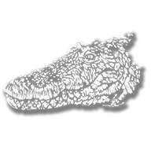                   | <a href='https://raw.githubusercontent.com/abdulkadiraktas/rdr3_discoveries/master/useful_info_from_rpfs/textures/inventory_items/images/satchel_textures/animal_alligator_medium.png'>Download</a>          |
| animal_armadillo                 | 605897178    |                                  | <a href='https://raw.githubusercontent.com/abdulkadiraktas/rdr3_discoveries/master/useful_info_from_rpfs/textures/inventory_items/images/satchel_textures/animal_armadillo.png'>Download</a>                 |
| animal_badger                    | -1396861869  |                                        | <a href='https://raw.githubusercontent.com/abdulkadiraktas/rdr3_discoveries/master/useful_info_from_rpfs/textures/inventory_items/images/satchel_textures/animal_badger.png'>Download</a>                    |
| animal_bat                       | -708983040   |                                              | <a href='https://raw.githubusercontent.com/abdulkadiraktas/rdr3_discoveries/master/useful_info_from_rpfs/textures/inventory_items/images/satchel_textures/animal_bat.png'>Download</a>                       |
| animal_bear                      | -1910470009  |                                            | <a href='https://raw.githubusercontent.com/abdulkadiraktas/rdr3_discoveries/master/useful_info_from_rpfs/textures/inventory_items/images/satchel_textures/animal_bear.png'>Download</a>                      |
| animal_bear_black                | 154434388    |                                | <a href='https://raw.githubusercontent.com/abdulkadiraktas/rdr3_discoveries/master/useful_info_from_rpfs/textures/inventory_items/images/satchel_textures/animal_bear_black.png'>Download</a>                |
| animal_beaver                    | -1070674946  |                                        | <a href='https://raw.githubusercontent.com/abdulkadiraktas/rdr3_discoveries/master/useful_info_from_rpfs/textures/inventory_items/images/satchel_textures/animal_beaver.png'>Download</a>                    |
| animal_bighornram                | 1698422427   |                                | <a href='https://raw.githubusercontent.com/abdulkadiraktas/rdr3_discoveries/master/useful_info_from_rpfs/textures/inventory_items/images/satchel_textures/animal_bighornram.png'>Download</a>                |
| animal_bighornram_f              | -1028412992  |                            | <a href='https://raw.githubusercontent.com/abdulkadiraktas/rdr3_discoveries/master/useful_info_from_rpfs/textures/inventory_items/images/satchel_textures/animal_bighornram_f.png'>Download</a>              |
| animal_bluejay                   | -205563189   |                                      | <a href='https://raw.githubusercontent.com/abdulkadiraktas/rdr3_discoveries/master/useful_info_from_rpfs/textures/inventory_items/images/satchel_textures/animal_bluejay.png'>Download</a>                   |
| animal_boar                      | -277882047   |                                            | <a href='https://raw.githubusercontent.com/abdulkadiraktas/rdr3_discoveries/master/useful_info_from_rpfs/textures/inventory_items/images/satchel_textures/animal_boar.png'>Download</a>                      |
| animal_bobcat                    | 1552240788   |                                        | <a href='https://raw.githubusercontent.com/abdulkadiraktas/rdr3_discoveries/master/useful_info_from_rpfs/textures/inventory_items/images/satchel_textures/animal_bobcat.png'>Download</a>                    |
| animal_buck                      | -2050837685  |                                            | <a href='https://raw.githubusercontent.com/abdulkadiraktas/rdr3_discoveries/master/useful_info_from_rpfs/textures/inventory_items/images/satchel_textures/animal_buck.png'>Download</a>                      |
| animal_buffalo                   | -1557011477  |                                      | <a href='https://raw.githubusercontent.com/abdulkadiraktas/rdr3_discoveries/master/useful_info_from_rpfs/textures/inventory_items/images/satchel_textures/animal_buffalo.png'>Download</a>                   |
| animal_bull_angus                | -141592380   |                                | <a href='https://raw.githubusercontent.com/abdulkadiraktas/rdr3_discoveries/master/useful_info_from_rpfs/textures/inventory_items/images/satchel_textures/animal_bull_angus.png'>Download</a>                |
| animal_bull_devon                | -159808049   |                                | <a href='https://raw.githubusercontent.com/abdulkadiraktas/rdr3_discoveries/master/useful_info_from_rpfs/textures/inventory_items/images/satchel_textures/animal_bull_devon.png'>Download</a>                |
| animal_bull_hereford             | 145447411    |                          | <a href='https://raw.githubusercontent.com/abdulkadiraktas/rdr3_discoveries/master/useful_info_from_rpfs/textures/inventory_items/images/satchel_textures/animal_bull_hereford.png'>Download</a>             |
| animal_bullfrog                  | -751460088   | 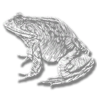                                   | <a href='https://raw.githubusercontent.com/abdulkadiraktas/rdr3_discoveries/master/useful_info_from_rpfs/textures/inventory_items/images/satchel_textures/animal_bullfrog.png'>Download</a>                  |
| animal_californiancondor         | 137404805    |                  | <a href='https://raw.githubusercontent.com/abdulkadiraktas/rdr3_discoveries/master/useful_info_from_rpfs/textures/inventory_items/images/satchel_textures/animal_californiancondor.png'>Download</a>         |
| animal_cardinal                  | 1242242692   |                                    | <a href='https://raw.githubusercontent.com/abdulkadiraktas/rdr3_discoveries/master/useful_info_from_rpfs/textures/inventory_items/images/satchel_textures/animal_cardinal.png'>Download</a>                  |
| animal_carolinaparakeet          | 919663183    |                    | <a href='https://raw.githubusercontent.com/abdulkadiraktas/rdr3_discoveries/master/useful_info_from_rpfs/textures/inventory_items/images/satchel_textures/animal_carolinaparakeet.png'>Download</a>          |
| animal_cat                       | -1355808024  |                                              | <a href='https://raw.githubusercontent.com/abdulkadiraktas/rdr3_discoveries/master/useful_info_from_rpfs/textures/inventory_items/images/satchel_textures/animal_cat.png'>Download</a>                       |
| animal_cedar_waxwing             | 879876931    |                          | <a href='https://raw.githubusercontent.com/abdulkadiraktas/rdr3_discoveries/master/useful_info_from_rpfs/textures/inventory_items/images/satchel_textures/animal_cedar_waxwing.png'>Download</a>             |
| animal_cedarwaxwing              | 1525059354   |                            | <a href='https://raw.githubusercontent.com/abdulkadiraktas/rdr3_discoveries/master/useful_info_from_rpfs/textures/inventory_items/images/satchel_textures/animal_cedarwaxwing.png'>Download</a>              |
| animal_chicken_dominique         | -1009121071  | 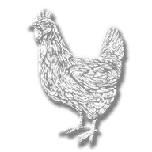                 | <a href='https://raw.githubusercontent.com/abdulkadiraktas/rdr3_discoveries/master/useful_info_from_rpfs/textures/inventory_items/images/satchel_textures/animal_chicken_dominique.png'>Download</a>         |
| animal_chicken_java              | -2023524568  | 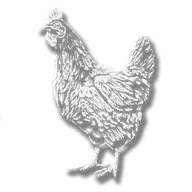                           | <a href='https://raw.githubusercontent.com/abdulkadiraktas/rdr3_discoveries/master/useful_info_from_rpfs/textures/inventory_items/images/satchel_textures/animal_chicken_java.png'>Download</a>              |
| animal_chicken_leghorn           | 1674033270   |                      | <a href='https://raw.githubusercontent.com/abdulkadiraktas/rdr3_discoveries/master/useful_info_from_rpfs/textures/inventory_items/images/satchel_textures/animal_chicken_leghorn.png'>Download</a>           |
| animal_chipmunk                  | -1581337607  |                                    | <a href='https://raw.githubusercontent.com/abdulkadiraktas/rdr3_discoveries/master/useful_info_from_rpfs/textures/inventory_items/images/satchel_textures/animal_chipmunk.png'>Download</a>                  |
| animal_condor                    | 2054066644   |                                        | <a href='https://raw.githubusercontent.com/abdulkadiraktas/rdr3_discoveries/master/useful_info_from_rpfs/textures/inventory_items/images/satchel_textures/animal_condor.png'>Download</a>                    |
| animal_cormorant                 | -1284131787  |                                  | <a href='https://raw.githubusercontent.com/abdulkadiraktas/rdr3_discoveries/master/useful_info_from_rpfs/textures/inventory_items/images/satchel_textures/animal_cormorant.png'>Download</a>                 |
| animal_cormorant_doublecrested   | -628290361   |      | <a href='https://raw.githubusercontent.com/abdulkadiraktas/rdr3_discoveries/master/useful_info_from_rpfs/textures/inventory_items/images/satchel_textures/animal_cormorant_doublecrested.png'>Download</a>   |
| animal_cormorant_neotropic       | 176638491    |              | <a href='https://raw.githubusercontent.com/abdulkadiraktas/rdr3_discoveries/master/useful_info_from_rpfs/textures/inventory_items/images/satchel_textures/animal_cormorant_neotropic.png'>Download</a>       |
| animal_cougar                    | 47996580     |                                        | <a href='https://raw.githubusercontent.com/abdulkadiraktas/rdr3_discoveries/master/useful_info_from_rpfs/textures/inventory_items/images/satchel_textures/animal_cougar.png'>Download</a>                    |
| animal_cow                       | -817157430   |                                              | <a href='https://raw.githubusercontent.com/abdulkadiraktas/rdr3_discoveries/master/useful_info_from_rpfs/textures/inventory_items/images/satchel_textures/animal_cow.png'>Download</a>                       |
| animal_coyote                    | -309753861   |                                        | <a href='https://raw.githubusercontent.com/abdulkadiraktas/rdr3_discoveries/master/useful_info_from_rpfs/textures/inventory_items/images/satchel_textures/animal_coyote.png'>Download</a>                    |
| animal_crab                      | 2136862769   |                                            | <a href='https://raw.githubusercontent.com/abdulkadiraktas/rdr3_discoveries/master/useful_info_from_rpfs/textures/inventory_items/images/satchel_textures/animal_crab.png'>Download</a>                      |
| animal_crane                     | -2012964484  | 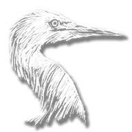                                         | <a href='https://raw.githubusercontent.com/abdulkadiraktas/rdr3_discoveries/master/useful_info_from_rpfs/textures/inventory_items/images/satchel_textures/animal_crane.png'>Download</a>                     |
| animal_cranewhooping_sandhill    | 2089815782   |        | <a href='https://raw.githubusercontent.com/abdulkadiraktas/rdr3_discoveries/master/useful_info_from_rpfs/textures/inventory_items/images/satchel_textures/animal_cranewhooping_sandhill.png'>Download</a>    |
| animal_cranewhooping_whooping    | 1936236274   |        | <a href='https://raw.githubusercontent.com/abdulkadiraktas/rdr3_discoveries/master/useful_info_from_rpfs/textures/inventory_items/images/satchel_textures/animal_cranewhooping_whooping.png'>Download</a>    |
| animal_crawfish                  | 783884804    |                                    | <a href='https://raw.githubusercontent.com/abdulkadiraktas/rdr3_discoveries/master/useful_info_from_rpfs/textures/inventory_items/images/satchel_textures/animal_crawfish.png'>Download</a>                  |
| animal_crow                      | -2011516728  |                                            | <a href='https://raw.githubusercontent.com/abdulkadiraktas/rdr3_discoveries/master/useful_info_from_rpfs/textures/inventory_items/images/satchel_textures/animal_crow.png'>Download</a>                      |
| animal_deer                      | -1271681936  |                                            | <a href='https://raw.githubusercontent.com/abdulkadiraktas/rdr3_discoveries/master/useful_info_from_rpfs/textures/inventory_items/images/satchel_textures/animal_deer.png'>Download</a>                      |
| animal_dog_americanfoxhound      | 948602795    |            | <a href='https://raw.githubusercontent.com/abdulkadiraktas/rdr3_discoveries/master/useful_info_from_rpfs/textures/inventory_items/images/satchel_textures/animal_dog_americanfoxhound.png'>Download</a>      |
| animal_dog_australianshepherd    | -179569337   |        | <a href='https://raw.githubusercontent.com/abdulkadiraktas/rdr3_discoveries/master/useful_info_from_rpfs/textures/inventory_items/images/satchel_textures/animal_dog_australianshepherd.png'>Download</a>    |
| animal_dog_bluetickcoonhound     | -258709563   |          | <a href='https://raw.githubusercontent.com/abdulkadiraktas/rdr3_discoveries/master/useful_info_from_rpfs/textures/inventory_items/images/satchel_textures/animal_dog_bluetickcoonhound.png'>Download</a>     |
| animal_dog_catahoularcur         | -1204793362  |                  | <a href='https://raw.githubusercontent.com/abdulkadiraktas/rdr3_discoveries/master/useful_info_from_rpfs/textures/inventory_items/images/satchel_textures/animal_dog_catahoularcur.png'>Download</a>         |
| animal_dog_chesbayretriever      | -906611731   |            | <a href='https://raw.githubusercontent.com/abdulkadiraktas/rdr3_discoveries/master/useful_info_from_rpfs/textures/inventory_items/images/satchel_textures/animal_dog_chesbayretriever.png'>Download</a>      |
| animal_dog_collie                | 800607657    |                                | <a href='https://raw.githubusercontent.com/abdulkadiraktas/rdr3_discoveries/master/useful_info_from_rpfs/textures/inventory_items/images/satchel_textures/animal_dog_collie.png'>Download</a>                |
| animal_dog_hound                 | -116757115   |                                  | <a href='https://raw.githubusercontent.com/abdulkadiraktas/rdr3_discoveries/master/useful_info_from_rpfs/textures/inventory_items/images/satchel_textures/animal_dog_hound.png'>Download</a>                 |
| animal_dog_husky                 | 1017379173   |                                  | <a href='https://raw.githubusercontent.com/abdulkadiraktas/rdr3_discoveries/master/useful_info_from_rpfs/textures/inventory_items/images/satchel_textures/animal_dog_husky.png'>Download</a>                 |
| animal_dog_lab                   | -1249264467  |                                      | <a href='https://raw.githubusercontent.com/abdulkadiraktas/rdr3_discoveries/master/useful_info_from_rpfs/textures/inventory_items/images/satchel_textures/animal_dog_lab.png'>Download</a>                   |
| animal_dog_poodle                | 793653235    |                                | <a href='https://raw.githubusercontent.com/abdulkadiraktas/rdr3_discoveries/master/useful_info_from_rpfs/textures/inventory_items/images/satchel_textures/animal_dog_poodle.png'>Download</a>                |
| animal_dog_street                | 901662100    |                                | <a href='https://raw.githubusercontent.com/abdulkadiraktas/rdr3_discoveries/master/useful_info_from_rpfs/textures/inventory_items/images/satchel_textures/animal_dog_street.png'>Download</a>                |
| animal_donkey                    | 23753523     |                                        | <a href='https://raw.githubusercontent.com/abdulkadiraktas/rdr3_discoveries/master/useful_info_from_rpfs/textures/inventory_items/images/satchel_textures/animal_donkey.png'>Download</a>                    |
| animal_duck_mallard              | -133684325   | 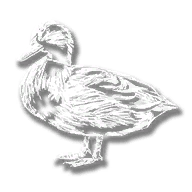                           | <a href='https://raw.githubusercontent.com/abdulkadiraktas/rdr3_discoveries/master/useful_info_from_rpfs/textures/inventory_items/images/satchel_textures/animal_duck_mallard.png'>Download</a>              |
| animal_duck_pekin                | 1574931396   |                                | <a href='https://raw.githubusercontent.com/abdulkadiraktas/rdr3_discoveries/master/useful_info_from_rpfs/textures/inventory_items/images/satchel_textures/animal_duck_pekin.png'>Download</a>                |
| animal_eagle                     | 1953451925   |                                          | <a href='https://raw.githubusercontent.com/abdulkadiraktas/rdr3_discoveries/master/useful_info_from_rpfs/textures/inventory_items/images/satchel_textures/animal_eagle.png'>Download</a>                     |
| animal_eagle_bald                | 2001673467   |                                | <a href='https://raw.githubusercontent.com/abdulkadiraktas/rdr3_discoveries/master/useful_info_from_rpfs/textures/inventory_items/images/satchel_textures/animal_eagle_bald.png'>Download</a>                |
| animal_eagle_golden              | 2110302460   |                            | <a href='https://raw.githubusercontent.com/abdulkadiraktas/rdr3_discoveries/master/useful_info_from_rpfs/textures/inventory_items/images/satchel_textures/animal_eagle_golden.png'>Download</a>              |
| animal_egret_little              | 651622512    |                            | <a href='https://raw.githubusercontent.com/abdulkadiraktas/rdr3_discoveries/master/useful_info_from_rpfs/textures/inventory_items/images/satchel_textures/animal_egret_little.png'>Download</a>              |
| animal_egret_reddish             | -1482894380  |                          | <a href='https://raw.githubusercontent.com/abdulkadiraktas/rdr3_discoveries/master/useful_info_from_rpfs/textures/inventory_items/images/satchel_textures/animal_egret_reddish.png'>Download</a>             |
| animal_egret_snowy               | 1987310306   |                              | <a href='https://raw.githubusercontent.com/abdulkadiraktas/rdr3_discoveries/master/useful_info_from_rpfs/textures/inventory_items/images/satchel_textures/animal_egret_snowy.png'>Download</a>               |
| animal_elk                       | 1646630811   |                                              | <a href='https://raw.githubusercontent.com/abdulkadiraktas/rdr3_discoveries/master/useful_info_from_rpfs/textures/inventory_items/images/satchel_textures/animal_elk.png'>Download</a>                       |
| animal_elk_rocky                 | -1234232194  |                                  | <a href='https://raw.githubusercontent.com/abdulkadiraktas/rdr3_discoveries/master/useful_info_from_rpfs/textures/inventory_items/images/satchel_textures/animal_elk_rocky.png'>Download</a>                 |
| animal_elk_tule                  | 879222313    |                                    | <a href='https://raw.githubusercontent.com/abdulkadiraktas/rdr3_discoveries/master/useful_info_from_rpfs/textures/inventory_items/images/satchel_textures/animal_elk_tule.png'>Download</a>                  |
| animal_fox_grey                  | 472851099    |                                    | <a href='https://raw.githubusercontent.com/abdulkadiraktas/rdr3_discoveries/master/useful_info_from_rpfs/textures/inventory_items/images/satchel_textures/animal_fox_grey.png'>Download</a>                  |
| animal_fox_red                   | -1663282774  |                                      | <a href='https://raw.githubusercontent.com/abdulkadiraktas/rdr3_discoveries/master/useful_info_from_rpfs/textures/inventory_items/images/satchel_textures/animal_fox_red.png'>Download</a>                   |
| animal_fox_silver                | 946451060    |                                | <a href='https://raw.githubusercontent.com/abdulkadiraktas/rdr3_discoveries/master/useful_info_from_rpfs/textures/inventory_items/images/satchel_textures/animal_fox_silver.png'>Download</a>                |
| animal_frogbull                  | -103588359   |                                    | <a href='https://raw.githubusercontent.com/abdulkadiraktas/rdr3_discoveries/master/useful_info_from_rpfs/textures/inventory_items/images/satchel_textures/animal_frogbull.png'>Download</a>                  |
| animal_gila_monster              | 256963399    |                            | <a href='https://raw.githubusercontent.com/abdulkadiraktas/rdr3_discoveries/master/useful_info_from_rpfs/textures/inventory_items/images/satchel_textures/animal_gila_monster.png'>Download</a>              |
| animal_goat                      | -150039504   |                                            | <a href='https://raw.githubusercontent.com/abdulkadiraktas/rdr3_discoveries/master/useful_info_from_rpfs/textures/inventory_items/images/satchel_textures/animal_goat.png'>Download</a>                      |
| animal_goosecanada               | 844056343    |                              | <a href='https://raw.githubusercontent.com/abdulkadiraktas/rdr3_discoveries/master/useful_info_from_rpfs/textures/inventory_items/images/satchel_textures/animal_goosecanada.png'>Download</a>               |
| animal_hawk_ferruginous          | -527008092   |                    | <a href='https://raw.githubusercontent.com/abdulkadiraktas/rdr3_discoveries/master/useful_info_from_rpfs/textures/inventory_items/images/satchel_textures/animal_hawk_ferruginous.png'>Download</a>          |
| animal_hawk_redtailed            | 2124390355   |                        | <a href='https://raw.githubusercontent.com/abdulkadiraktas/rdr3_discoveries/master/useful_info_from_rpfs/textures/inventory_items/images/satchel_textures/animal_hawk_redtailed.png'>Download</a>            |
| animal_hawk_roughlegged          | 863774326    |                    | <a href='https://raw.githubusercontent.com/abdulkadiraktas/rdr3_discoveries/master/useful_info_from_rpfs/textures/inventory_items/images/satchel_textures/animal_hawk_roughlegged.png'>Download</a>          |
| animal_heron_greatblue           | -1551732144  |                      | <a href='https://raw.githubusercontent.com/abdulkadiraktas/rdr3_discoveries/master/useful_info_from_rpfs/textures/inventory_items/images/satchel_textures/animal_heron_greatblue.png'>Download</a>           |
| animal_heron_tricolour           | -1096213391  |                      | <a href='https://raw.githubusercontent.com/abdulkadiraktas/rdr3_discoveries/master/useful_info_from_rpfs/textures/inventory_items/images/satchel_textures/animal_heron_tricolour.png'>Download</a>           |
| animal_horse                     | -1061153684  |                                          | <a href='https://raw.githubusercontent.com/abdulkadiraktas/rdr3_discoveries/master/useful_info_from_rpfs/textures/inventory_items/images/satchel_textures/animal_horse.png'>Download</a>                     |
| animal_iguana                    | 1797318305   |                                        | <a href='https://raw.githubusercontent.com/abdulkadiraktas/rdr3_discoveries/master/useful_info_from_rpfs/textures/inventory_items/images/satchel_textures/animal_iguana.png'>Download</a>                    |
| animal_iguanadesert              | 2038778494   |                            | <a href='https://raw.githubusercontent.com/abdulkadiraktas/rdr3_discoveries/master/useful_info_from_rpfs/textures/inventory_items/images/satchel_textures/animal_iguanadesert.png'>Download</a>              |
| animal_javelina                  | 1424014684   |                                    | <a href='https://raw.githubusercontent.com/abdulkadiraktas/rdr3_discoveries/master/useful_info_from_rpfs/textures/inventory_items/images/satchel_textures/animal_javelina.png'>Download</a>                  |
| animal_legendary_bear            | -886035642   |                        | <a href='https://raw.githubusercontent.com/abdulkadiraktas/rdr3_discoveries/master/useful_info_from_rpfs/textures/inventory_items/images/satchel_textures/animal_legendary_bear.png'>Download</a>            |
| animal_legendary_beaver          | 1747634711   |                    | <a href='https://raw.githubusercontent.com/abdulkadiraktas/rdr3_discoveries/master/useful_info_from_rpfs/textures/inventory_items/images/satchel_textures/animal_legendary_beaver.png'>Download</a>          |
| animal_legendary_bighornram      | -337986593   |            | <a href='https://raw.githubusercontent.com/abdulkadiraktas/rdr3_discoveries/master/useful_info_from_rpfs/textures/inventory_items/images/satchel_textures/animal_legendary_bighornram.png'>Download</a>      |
| animal_legendary_boar            | -318344819   |                        | <a href='https://raw.githubusercontent.com/abdulkadiraktas/rdr3_discoveries/master/useful_info_from_rpfs/textures/inventory_items/images/satchel_textures/animal_legendary_boar.png'>Download</a>            |
| animal_legendary_buck            | 178671132    |                        | <a href='https://raw.githubusercontent.com/abdulkadiraktas/rdr3_discoveries/master/useful_info_from_rpfs/textures/inventory_items/images/satchel_textures/animal_legendary_buck.png'>Download</a>            |
| animal_legendary_buffalo_takanta | -1755411085  |  | <a href='https://raw.githubusercontent.com/abdulkadiraktas/rdr3_discoveries/master/useful_info_from_rpfs/textures/inventory_items/images/satchel_textures/animal_legendary_buffalo_takanta.png'>Download</a> |
| animal_legendary_buffalo_white   | 401355368    |      | <a href='https://raw.githubusercontent.com/abdulkadiraktas/rdr3_discoveries/master/useful_info_from_rpfs/textures/inventory_items/images/satchel_textures/animal_legendary_buffalo_white.png'>Download</a>   |
| animal_legendary_cougar_giaguaro | 233661842    |  | <a href='https://raw.githubusercontent.com/abdulkadiraktas/rdr3_discoveries/master/useful_info_from_rpfs/textures/inventory_items/images/satchel_textures/animal_legendary_cougar_giaguaro.png'>Download</a> |
| animal_legendary_coyote          | -1542485981  |                    | <a href='https://raw.githubusercontent.com/abdulkadiraktas/rdr3_discoveries/master/useful_info_from_rpfs/textures/inventory_items/images/satchel_textures/animal_legendary_coyote.png'>Download</a>          |
| animal_legendary_elk             | -378500088   |                          | <a href='https://raw.githubusercontent.com/abdulkadiraktas/rdr3_discoveries/master/useful_info_from_rpfs/textures/inventory_items/images/satchel_textures/animal_legendary_elk.png'>Download</a>             |
| animal_legendary_fox             | 2008552131   |                          | <a href='https://raw.githubusercontent.com/abdulkadiraktas/rdr3_discoveries/master/useful_info_from_rpfs/textures/inventory_items/images/satchel_textures/animal_legendary_fox.png'>Download</a>             |
| animal_legendary_moose           | 541788383    |                      | <a href='https://raw.githubusercontent.com/abdulkadiraktas/rdr3_discoveries/master/useful_info_from_rpfs/textures/inventory_items/images/satchel_textures/animal_legendary_moose.png'>Download</a>           |
| animal_legendary_panther         | 1952787435   |                  | <a href='https://raw.githubusercontent.com/abdulkadiraktas/rdr3_discoveries/master/useful_info_from_rpfs/textures/inventory_items/images/satchel_textures/animal_legendary_panther.png'>Download</a>         |
| animal_legendary_pronghorn       | -1484403532  |              | <a href='https://raw.githubusercontent.com/abdulkadiraktas/rdr3_discoveries/master/useful_info_from_rpfs/textures/inventory_items/images/satchel_textures/animal_legendary_pronghorn.png'>Download</a>       |
| animal_legendary_wolf            | -510249359   |                        | <a href='https://raw.githubusercontent.com/abdulkadiraktas/rdr3_discoveries/master/useful_info_from_rpfs/textures/inventory_items/images/satchel_textures/animal_legendary_wolf.png'>Download</a>            |
| animal_loon_common               | 878490194    |                              | <a href='https://raw.githubusercontent.com/abdulkadiraktas/rdr3_discoveries/master/useful_info_from_rpfs/textures/inventory_items/images/satchel_textures/animal_loon_common.png'>Download</a>               |
| animal_loon_pacific              | 1981820985   | 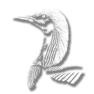                           | <a href='https://raw.githubusercontent.com/abdulkadiraktas/rdr3_discoveries/master/useful_info_from_rpfs/textures/inventory_items/images/satchel_textures/animal_loon_pacific.png'>Download</a>              |
| animal_loon_yellowbilled         | -2057796976  |                  | <a href='https://raw.githubusercontent.com/abdulkadiraktas/rdr3_discoveries/master/useful_info_from_rpfs/textures/inventory_items/images/satchel_textures/animal_loon_yellowbilled.png'>Download</a>         |
| animal_moose                     | 1430876379   |                                          | <a href='https://raw.githubusercontent.com/abdulkadiraktas/rdr3_discoveries/master/useful_info_from_rpfs/textures/inventory_items/images/satchel_textures/animal_moose.png'>Download</a>                     |
| animal_mountain_cow_elk          | 534434075    |                    | <a href='https://raw.githubusercontent.com/abdulkadiraktas/rdr3_discoveries/master/useful_info_from_rpfs/textures/inventory_items/images/satchel_textures/animal_mountain_cow_elk.png'>Download</a>          |
| animal_mule                      | 1319967867   |                                            | <a href='https://raw.githubusercontent.com/abdulkadiraktas/rdr3_discoveries/master/useful_info_from_rpfs/textures/inventory_items/images/satchel_textures/animal_mule.png'>Download</a>                      |
| animal_muskrat                   | 1071271732   |                                      | <a href='https://raw.githubusercontent.com/abdulkadiraktas/rdr3_discoveries/master/useful_info_from_rpfs/textures/inventory_items/images/satchel_textures/animal_muskrat.png'>Download</a>                   |
| animal_opossum                   | 539909092    |                                      | <a href='https://raw.githubusercontent.com/abdulkadiraktas/rdr3_discoveries/master/useful_info_from_rpfs/textures/inventory_items/images/satchel_textures/animal_opossum.png'>Download</a>                   |
| animal_oriole_baltimore          | 537974592    |                    | <a href='https://raw.githubusercontent.com/abdulkadiraktas/rdr3_discoveries/master/useful_info_from_rpfs/textures/inventory_items/images/satchel_textures/animal_oriole_baltimore.png'>Download</a>          |
| animal_oriole_hooded             | -1199758568  | 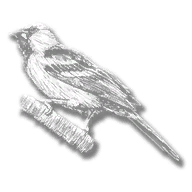                         | <a href='https://raw.githubusercontent.com/abdulkadiraktas/rdr3_discoveries/master/useful_info_from_rpfs/textures/inventory_items/images/satchel_textures/animal_oriole_hooded.png'>Download</a>             |
| animal_owl_californian           | 647908865    |                      | <a href='https://raw.githubusercontent.com/abdulkadiraktas/rdr3_discoveries/master/useful_info_from_rpfs/textures/inventory_items/images/satchel_textures/animal_owl_californian.png'>Download</a>           |
| animal_owl_coastal               | 2140355906   |                              | <a href='https://raw.githubusercontent.com/abdulkadiraktas/rdr3_discoveries/master/useful_info_from_rpfs/textures/inventory_items/images/satchel_textures/animal_owl_coastal.png'>Download</a>               |
| animal_owl_great                 | 792052902    |                                  | <a href='https://raw.githubusercontent.com/abdulkadiraktas/rdr3_discoveries/master/useful_info_from_rpfs/textures/inventory_items/images/satchel_textures/animal_owl_great.png'>Download</a>                 |
| animal_ox_angus                  | -587083933   |                                    | <a href='https://raw.githubusercontent.com/abdulkadiraktas/rdr3_discoveries/master/useful_info_from_rpfs/textures/inventory_items/images/satchel_textures/animal_ox_angus.png'>Download</a>                  |
| animal_ox_devon                  | 729268726    |                                    | <a href='https://raw.githubusercontent.com/abdulkadiraktas/rdr3_discoveries/master/useful_info_from_rpfs/textures/inventory_items/images/satchel_textures/animal_ox_devon.png'>Download</a>                  |
| animal_panther                   | -1471155784  |                                      | <a href='https://raw.githubusercontent.com/abdulkadiraktas/rdr3_discoveries/master/useful_info_from_rpfs/textures/inventory_items/images/satchel_textures/animal_panther.png'>Download</a>                   |
| animal_panther_florida           | -658521914   |                      | <a href='https://raw.githubusercontent.com/abdulkadiraktas/rdr3_discoveries/master/useful_info_from_rpfs/textures/inventory_items/images/satchel_textures/animal_panther_florida.png'>Download</a>           |
| animal_parakeet                  | -139474892   |                                    | <a href='https://raw.githubusercontent.com/abdulkadiraktas/rdr3_discoveries/master/useful_info_from_rpfs/textures/inventory_items/images/satchel_textures/animal_parakeet.png'>Download</a>                  |
| animal_parrot_blueyellow         | 1729375577   |                  | <a href='https://raw.githubusercontent.com/abdulkadiraktas/rdr3_discoveries/master/useful_info_from_rpfs/textures/inventory_items/images/satchel_textures/animal_parrot_blueyellow.png'>Download</a>         |
| animal_parrot_greatgreen         | -982864509   |                  | <a href='https://raw.githubusercontent.com/abdulkadiraktas/rdr3_discoveries/master/useful_info_from_rpfs/textures/inventory_items/images/satchel_textures/animal_parrot_greatgreen.png'>Download</a>         |
| animal_parrot_scarlet            | -667670436   |                        | <a href='https://raw.githubusercontent.com/abdulkadiraktas/rdr3_discoveries/master/useful_info_from_rpfs/textures/inventory_items/images/satchel_textures/animal_parrot_scarlet.png'>Download</a>            |
| animal_pelican_brown             | 2029275522   |                          | <a href='https://raw.githubusercontent.com/abdulkadiraktas/rdr3_discoveries/master/useful_info_from_rpfs/textures/inventory_items/images/satchel_textures/animal_pelican_brown.png'>Download</a>             |
| animal_pelican_white             | -1256921586  |                          | <a href='https://raw.githubusercontent.com/abdulkadiraktas/rdr3_discoveries/master/useful_info_from_rpfs/textures/inventory_items/images/satchel_textures/animal_pelican_white.png'>Download</a>             |
| animal_pheasant_chinese          | 1195415334   |                    | <a href='https://raw.githubusercontent.com/abdulkadiraktas/rdr3_discoveries/master/useful_info_from_rpfs/textures/inventory_items/images/satchel_textures/animal_pheasant_chinese.png'>Download</a>          |
| animal_pheasant_ringneck         | -444820413   |                  | <a href='https://raw.githubusercontent.com/abdulkadiraktas/rdr3_discoveries/master/useful_info_from_rpfs/textures/inventory_items/images/satchel_textures/animal_pheasant_ringneck.png'>Download</a>         |
| animal_pig_berkshire             | 1578922231   |                          | <a href='https://raw.githubusercontent.com/abdulkadiraktas/rdr3_discoveries/master/useful_info_from_rpfs/textures/inventory_items/images/satchel_textures/animal_pig_berkshire.png'>Download</a>             |
| animal_pig_bigchina              | -1373726614  |                            | <a href='https://raw.githubusercontent.com/abdulkadiraktas/rdr3_discoveries/master/useful_info_from_rpfs/textures/inventory_items/images/satchel_textures/animal_pig_bigchina.png'>Download</a>              |
| animal_pig_oldspot               | -49480581    |                              | <a href='https://raw.githubusercontent.com/abdulkadiraktas/rdr3_discoveries/master/useful_info_from_rpfs/textures/inventory_items/images/satchel_textures/animal_pig_oldspot.png'>Download</a>               |
| animal_pigeon                    | -1205156364  |                                        | <a href='https://raw.githubusercontent.com/abdulkadiraktas/rdr3_discoveries/master/useful_info_from_rpfs/textures/inventory_items/images/satchel_textures/animal_pigeon.png'>Download</a>                    |
| animal_pigeon_bandtailed         | -399614419   |                  | <a href='https://raw.githubusercontent.com/abdulkadiraktas/rdr3_discoveries/master/useful_info_from_rpfs/textures/inventory_items/images/satchel_textures/animal_pigeon_bandtailed.png'>Download</a>         |
| animal_prairie_chicken           | -666778210   | 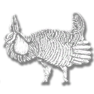                     | <a href='https://raw.githubusercontent.com/abdulkadiraktas/rdr3_discoveries/master/useful_info_from_rpfs/textures/inventory_items/images/satchel_textures/animal_prairie_chicken.png'>Download</a>           |
| animal_pronghorn                 | 435990380    |                                  | <a href='https://raw.githubusercontent.com/abdulkadiraktas/rdr3_discoveries/master/useful_info_from_rpfs/textures/inventory_items/images/satchel_textures/animal_pronghorn.png'>Download</a>                 |
| animal_pronghorn_baja            | -1201577560  |                        | <a href='https://raw.githubusercontent.com/abdulkadiraktas/rdr3_discoveries/master/useful_info_from_rpfs/textures/inventory_items/images/satchel_textures/animal_pronghorn_baja.png'>Download</a>            |
| animal_pronghorn_f               | 28493899     |                              | <a href='https://raw.githubusercontent.com/abdulkadiraktas/rdr3_discoveries/master/useful_info_from_rpfs/textures/inventory_items/images/satchel_textures/animal_pronghorn_f.png'>Download</a>               |
| animal_pronghorn_sonaran         | 39161135     |                  | <a href='https://raw.githubusercontent.com/abdulkadiraktas/rdr3_discoveries/master/useful_info_from_rpfs/textures/inventory_items/images/satchel_textures/animal_pronghorn_sonaran.png'>Download</a>         |
| animal_quail                     | 1673845170   | 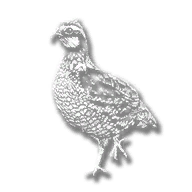                                         | <a href='https://raw.githubusercontent.com/abdulkadiraktas/rdr3_discoveries/master/useful_info_from_rpfs/textures/inventory_items/images/satchel_textures/animal_quail.png'>Download</a>                     |
| animal_rabbit                    | -313772375   |                                        | <a href='https://raw.githubusercontent.com/abdulkadiraktas/rdr3_discoveries/master/useful_info_from_rpfs/textures/inventory_items/images/satchel_textures/animal_rabbit.png'>Download</a>                    |
| animal_raccoon                   | 875396707    |                                      | <a href='https://raw.githubusercontent.com/abdulkadiraktas/rdr3_discoveries/master/useful_info_from_rpfs/textures/inventory_items/images/satchel_textures/animal_raccoon.png'>Download</a>                   |
| animal_ram                       | 106822578    |                                              | <a href='https://raw.githubusercontent.com/abdulkadiraktas/rdr3_discoveries/master/useful_info_from_rpfs/textures/inventory_items/images/satchel_textures/animal_ram.png'>Download</a>                       |
| animal_rat                       | 2028921042   |                                              | <a href='https://raw.githubusercontent.com/abdulkadiraktas/rdr3_discoveries/master/useful_info_from_rpfs/textures/inventory_items/images/satchel_textures/animal_rat.png'>Download</a>                       |
| animal_rat_black                 | 1401434804   |                                  | <a href='https://raw.githubusercontent.com/abdulkadiraktas/rdr3_discoveries/master/useful_info_from_rpfs/textures/inventory_items/images/satchel_textures/animal_rat_black.png'>Download</a>                 |
| animal_rat_brown                 | -1820498285  |                                  | <a href='https://raw.githubusercontent.com/abdulkadiraktas/rdr3_discoveries/master/useful_info_from_rpfs/textures/inventory_items/images/satchel_textures/animal_rat_brown.png'>Download</a>                 |
| animal_raven                     | 657691181    | 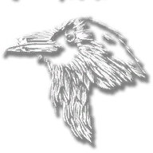                                         | <a href='https://raw.githubusercontent.com/abdulkadiraktas/rdr3_discoveries/master/useful_info_from_rpfs/textures/inventory_items/images/satchel_textures/animal_raven.png'>Download</a>                     |
| animal_red_footed_booby          | 917406995    | 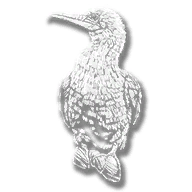                   | <a href='https://raw.githubusercontent.com/abdulkadiraktas/rdr3_discoveries/master/useful_info_from_rpfs/textures/inventory_items/images/satchel_textures/animal_red_footed_booby.png'>Download</a>          |
| animal_redfootedbooby            | 525255984    |                        | <a href='https://raw.githubusercontent.com/abdulkadiraktas/rdr3_discoveries/master/useful_info_from_rpfs/textures/inventory_items/images/satchel_textures/animal_redfootedbooby.png'>Download</a>            |
| animal_robin                     | -1871716680  |                                          | <a href='https://raw.githubusercontent.com/abdulkadiraktas/rdr3_discoveries/master/useful_info_from_rpfs/textures/inventory_items/images/satchel_textures/animal_robin.png'>Download</a>                     |
| animal_rooster                   | 2009546807   |                                      | <a href='https://raw.githubusercontent.com/abdulkadiraktas/rdr3_discoveries/master/useful_info_from_rpfs/textures/inventory_items/images/satchel_textures/animal_rooster.png'>Download</a>                   |
| animal_rooster_dominique         | -1763539699  |                  | <a href='https://raw.githubusercontent.com/abdulkadiraktas/rdr3_discoveries/master/useful_info_from_rpfs/textures/inventory_items/images/satchel_textures/animal_rooster_dominique.png'>Download</a>         |
| animal_roseate_spoonbill         | -175176518   |                  | <a href='https://raw.githubusercontent.com/abdulkadiraktas/rdr3_discoveries/master/useful_info_from_rpfs/textures/inventory_items/images/satchel_textures/animal_roseate_spoonbill.png'>Download</a>         |
| animal_roseatespoonbill          | 429334500    |                    | <a href='https://raw.githubusercontent.com/abdulkadiraktas/rdr3_discoveries/master/useful_info_from_rpfs/textures/inventory_items/images/satchel_textures/animal_roseatespoonbill.png'>Download</a>          |
| animal_seagull                   | -608440234   |                                      | <a href='https://raw.githubusercontent.com/abdulkadiraktas/rdr3_discoveries/master/useful_info_from_rpfs/textures/inventory_items/images/satchel_textures/animal_seagull.png'>Download</a>                   |
| animal_seagull_herring           | 1757467995   |                      | <a href='https://raw.githubusercontent.com/abdulkadiraktas/rdr3_discoveries/master/useful_info_from_rpfs/textures/inventory_items/images/satchel_textures/animal_seagull_herring.png'>Download</a>           |
| animal_seagull_laughing          | 19803626     |                    | <a href='https://raw.githubusercontent.com/abdulkadiraktas/rdr3_discoveries/master/useful_info_from_rpfs/textures/inventory_items/images/satchel_textures/animal_seagull_laughing.png'>Download</a>          |
| animal_seagull_ring_billed       | -679420644   |              | <a href='https://raw.githubusercontent.com/abdulkadiraktas/rdr3_discoveries/master/useful_info_from_rpfs/textures/inventory_items/images/satchel_textures/animal_seagull_ring_billed.png'>Download</a>       |
| animal_shark_hammerhead          | -638690623   | 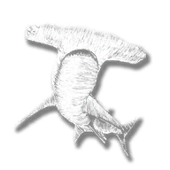                   | <a href='https://raw.githubusercontent.com/abdulkadiraktas/rdr3_discoveries/master/useful_info_from_rpfs/textures/inventory_items/images/satchel_textures/animal_shark_hammerhead.png'>Download</a>          |
| animal_shark_tiger               | 545446684    |                              | <a href='https://raw.githubusercontent.com/abdulkadiraktas/rdr3_discoveries/master/useful_info_from_rpfs/textures/inventory_items/images/satchel_textures/animal_shark_tiger.png'>Download</a>               |
| animal_sheep                     | 723961219    |                                          | <a href='https://raw.githubusercontent.com/abdulkadiraktas/rdr3_discoveries/master/useful_info_from_rpfs/textures/inventory_items/images/satchel_textures/animal_sheep.png'>Download</a>                     |
| animal_skunk                     | -245824963   |                                          | <a href='https://raw.githubusercontent.com/abdulkadiraktas/rdr3_discoveries/master/useful_info_from_rpfs/textures/inventory_items/images/satchel_textures/animal_skunk.png'>Download</a>                     |
| animal_snake                     | 1927933555   | 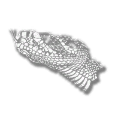                                         | <a href='https://raw.githubusercontent.com/abdulkadiraktas/rdr3_discoveries/master/useful_info_from_rpfs/textures/inventory_items/images/satchel_textures/animal_snake.png'>Download</a>                     |
| animal_snakeblacktailrattle      | -1463878798  | 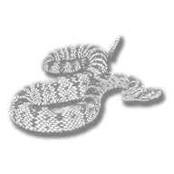           | <a href='https://raw.githubusercontent.com/abdulkadiraktas/rdr3_discoveries/master/useful_info_from_rpfs/textures/inventory_items/images/satchel_textures/animal_snakeblacktailrattle.png'>Download</a>      |
| animal_snakecopperhead           | -939177927   | 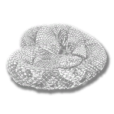                     | <a href='https://raw.githubusercontent.com/abdulkadiraktas/rdr3_discoveries/master/useful_info_from_rpfs/textures/inventory_items/images/satchel_textures/animal_snakecopperhead.png'>Download</a>           |
| animal_snakecoral                | 832932061    | 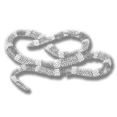                               | <a href='https://raw.githubusercontent.com/abdulkadiraktas/rdr3_discoveries/master/useful_info_from_rpfs/textures/inventory_items/images/satchel_textures/animal_snakecoral.png'>Download</a>                |
| animal_snakeferdelance           | 1639257636   | 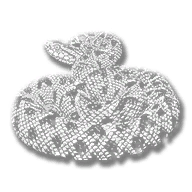                     | <a href='https://raw.githubusercontent.com/abdulkadiraktas/rdr3_discoveries/master/useful_info_from_rpfs/textures/inventory_items/images/satchel_textures/animal_snakeferdelance.png'>Download</a>           |
| animal_snakeredboa               | -1750496802  | 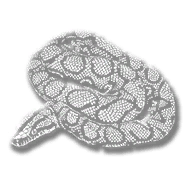                             | <a href='https://raw.githubusercontent.com/abdulkadiraktas/rdr3_discoveries/master/useful_info_from_rpfs/textures/inventory_items/images/satchel_textures/animal_snakeredboa.png'>Download</a>               |
| animal_snakewater                | 2057736305   | 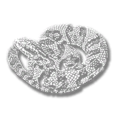                               | <a href='https://raw.githubusercontent.com/abdulkadiraktas/rdr3_discoveries/master/useful_info_from_rpfs/textures/inventory_items/images/satchel_textures/animal_snakewater.png'>Download</a>                |
| animal_snapping_turtle           | -459180947   |                      | <a href='https://raw.githubusercontent.com/abdulkadiraktas/rdr3_discoveries/master/useful_info_from_rpfs/textures/inventory_items/images/satchel_textures/animal_snapping_turtle.png'>Download</a>           |
| animal_songbird                  | -253112372   |                                    | <a href='https://raw.githubusercontent.com/abdulkadiraktas/rdr3_discoveries/master/useful_info_from_rpfs/textures/inventory_items/images/satchel_textures/animal_songbird.png'>Download</a>                  |
| animal_songbird_scarlet          | 1938962014   |                    | <a href='https://raw.githubusercontent.com/abdulkadiraktas/rdr3_discoveries/master/useful_info_from_rpfs/textures/inventory_items/images/satchel_textures/animal_songbird_scarlet.png'>Download</a>          |
| animal_sparrow                   | -1734773346  |                                      | <a href='https://raw.githubusercontent.com/abdulkadiraktas/rdr3_discoveries/master/useful_info_from_rpfs/textures/inventory_items/images/satchel_textures/animal_sparrow.png'>Download</a>                   |
| animal_sparrow_eurasian          | -1133822835  |                    | <a href='https://raw.githubusercontent.com/abdulkadiraktas/rdr3_discoveries/master/useful_info_from_rpfs/textures/inventory_items/images/satchel_textures/animal_sparrow_eurasian.png'>Download</a>          |
| animal_sparrow_golden            | 1473321578   |                        | <a href='https://raw.githubusercontent.com/abdulkadiraktas/rdr3_discoveries/master/useful_info_from_rpfs/textures/inventory_items/images/satchel_textures/animal_sparrow_golden.png'>Download</a>            |
| animal_squirrel                  | -1382009501  |                                    | <a href='https://raw.githubusercontent.com/abdulkadiraktas/rdr3_discoveries/master/useful_info_from_rpfs/textures/inventory_items/images/satchel_textures/animal_squirrel.png'>Download</a>                  |
| animal_squirrel_black            | 827625410    |                        | <a href='https://raw.githubusercontent.com/abdulkadiraktas/rdr3_discoveries/master/useful_info_from_rpfs/textures/inventory_items/images/satchel_textures/animal_squirrel_black.png'>Download</a>            |
| animal_squirrel_grey             | 388233691    | 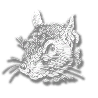                         | <a href='https://raw.githubusercontent.com/abdulkadiraktas/rdr3_discoveries/master/useful_info_from_rpfs/textures/inventory_items/images/satchel_textures/animal_squirrel_grey.png'>Download</a>             |
| animal_toad                      | 663847180    |                                            | <a href='https://raw.githubusercontent.com/abdulkadiraktas/rdr3_discoveries/master/useful_info_from_rpfs/textures/inventory_items/images/satchel_textures/animal_toad.png'>Download</a>                      |
| animal_turkey_eastern            | -1713918140  |                        | <a href='https://raw.githubusercontent.com/abdulkadiraktas/rdr3_discoveries/master/useful_info_from_rpfs/textures/inventory_items/images/satchel_textures/animal_turkey_eastern.png'>Download</a>            |
| animal_turkey_riogrande          | 297138026    | 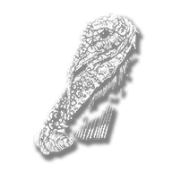                   | <a href='https://raw.githubusercontent.com/abdulkadiraktas/rdr3_discoveries/master/useful_info_from_rpfs/textures/inventory_items/images/satchel_textures/animal_turkey_riogrande.png'>Download</a>          |
| animal_turtle_sea                | -714517863   |                                | <a href='https://raw.githubusercontent.com/abdulkadiraktas/rdr3_discoveries/master/useful_info_from_rpfs/textures/inventory_items/images/satchel_textures/animal_turtle_sea.png'>Download</a>                |
| animal_vulture_eastern           | -1339143179  |                      | <a href='https://raw.githubusercontent.com/abdulkadiraktas/rdr3_discoveries/master/useful_info_from_rpfs/textures/inventory_items/images/satchel_textures/animal_vulture_eastern.png'>Download</a>           |
| animal_vulture_western           | 1311722858   |                      | <a href='https://raw.githubusercontent.com/abdulkadiraktas/rdr3_discoveries/master/useful_info_from_rpfs/textures/inventory_items/images/satchel_textures/animal_vulture_western.png'>Download</a>           |
| animal_wolf_gray                 | -2025464689  |                                  | <a href='https://raw.githubusercontent.com/abdulkadiraktas/rdr3_discoveries/master/useful_info_from_rpfs/textures/inventory_items/images/satchel_textures/animal_wolf_gray.png'>Download</a>                 |
| animal_wolf_timber               | -370314975   |                              | <a href='https://raw.githubusercontent.com/abdulkadiraktas/rdr3_discoveries/master/useful_info_from_rpfs/textures/inventory_items/images/satchel_textures/animal_wolf_timber.png'>Download</a>               |
| animal_woodpecker_pileated       | -333303313   |              | <a href='https://raw.githubusercontent.com/abdulkadiraktas/rdr3_discoveries/master/useful_info_from_rpfs/textures/inventory_items/images/satchel_textures/animal_woodpecker_pileated.png'>Download</a>       |
| animal_woodpecker_redbellied     | 2043728015   | 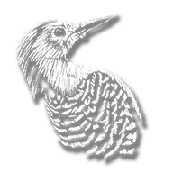         | <a href='https://raw.githubusercontent.com/abdulkadiraktas/rdr3_discoveries/master/useful_info_from_rpfs/textures/inventory_items/images/satchel_textures/animal_woodpecker_redbellied.png'>Download</a>     |
| cmpndm_ampaint                   | -1482012299  |                                      | <a href='https://raw.githubusercontent.com/abdulkadiraktas/rdr3_discoveries/master/useful_info_from_rpfs/textures/inventory_items/images/satchel_textures/cmpndm_ampaint.png'>Download</a>                   |
| cmpndm_amstdbred                 | 759827715    |                                  | <a href='https://raw.githubusercontent.com/abdulkadiraktas/rdr3_discoveries/master/useful_info_from_rpfs/textures/inventory_items/images/satchel_textures/cmpndm_amstdbred.png'>Download</a>                 |
| cmpndm_andalusian                | 869531568    |                                | <a href='https://raw.githubusercontent.com/abdulkadiraktas/rdr3_discoveries/master/useful_info_from_rpfs/textures/inventory_items/images/satchel_textures/cmpndm_andalusian.png'>Download</a>                |
| cmpndm_appaloosa                 | -992740252   |                                  | <a href='https://raw.githubusercontent.com/abdulkadiraktas/rdr3_discoveries/master/useful_info_from_rpfs/textures/inventory_items/images/satchel_textures/cmpndm_appaloosa.png'>Download</a>                 |
| cmpndm_arabian                   | -347409484   |                                      | <a href='https://raw.githubusercontent.com/abdulkadiraktas/rdr3_discoveries/master/useful_info_from_rpfs/textures/inventory_items/images/satchel_textures/cmpndm_arabian.png'>Download</a>                   |
| cmpndm_ardennes                  | 627770430    |                                    | <a href='https://raw.githubusercontent.com/abdulkadiraktas/rdr3_discoveries/master/useful_info_from_rpfs/textures/inventory_items/images/satchel_textures/cmpndm_ardennes.png'>Download</a>                  |
| cmpndm_beldraft                  | -9220771     |                                    | <a href='https://raw.githubusercontent.com/abdulkadiraktas/rdr3_discoveries/master/useful_info_from_rpfs/textures/inventory_items/images/satchel_textures/cmpndm_beldraft.png'>Download</a>                  |
| cmpndm_dutchwm                   | 423368104    |                                      | <a href='https://raw.githubusercontent.com/abdulkadiraktas/rdr3_discoveries/master/useful_info_from_rpfs/textures/inventory_items/images/satchel_textures/cmpndm_dutchwm.png'>Download</a>                   |
| cmpndm_hunghalf                  | 839961286    |                                    | <a href='https://raw.githubusercontent.com/abdulkadiraktas/rdr3_discoveries/master/useful_info_from_rpfs/textures/inventory_items/images/satchel_textures/cmpndm_hunghalf.png'>Download</a>                  |
| cmpndm_kysaddler                 | -260273643   |                                  | <a href='https://raw.githubusercontent.com/abdulkadiraktas/rdr3_discoveries/master/useful_info_from_rpfs/textures/inventory_items/images/satchel_textures/cmpndm_kysaddler.png'>Download</a>                 |
| cmpndm_mofoxtrot                 | -273349897   |                                  | <a href='https://raw.githubusercontent.com/abdulkadiraktas/rdr3_discoveries/master/useful_info_from_rpfs/textures/inventory_items/images/satchel_textures/cmpndm_mofoxtrot.png'>Download</a>                 |
| cmpndm_morgan                    | 1147628846   |                                        | <a href='https://raw.githubusercontent.com/abdulkadiraktas/rdr3_discoveries/master/useful_info_from_rpfs/textures/inventory_items/images/satchel_textures/cmpndm_morgan.png'>Download</a>                    |
| cmpndm_mustang                   | 471538596    |                                      | <a href='https://raw.githubusercontent.com/abdulkadiraktas/rdr3_discoveries/master/useful_info_from_rpfs/textures/inventory_items/images/satchel_textures/cmpndm_mustang.png'>Download</a>                   |
| cmpndm_nokota                    | 473837533    |                                        | <a href='https://raw.githubusercontent.com/abdulkadiraktas/rdr3_discoveries/master/useful_info_from_rpfs/textures/inventory_items/images/satchel_textures/cmpndm_nokota.png'>Download</a>                    |
| cmpndm_shire                     | 307767709    | 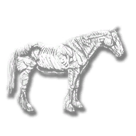                                         | <a href='https://raw.githubusercontent.com/abdulkadiraktas/rdr3_discoveries/master/useful_info_from_rpfs/textures/inventory_items/images/satchel_textures/cmpndm_shire.png'>Download</a>                     |
| cmpndm_sufpunch                  | -1349187819  |                                    | <a href='https://raw.githubusercontent.com/abdulkadiraktas/rdr3_discoveries/master/useful_info_from_rpfs/textures/inventory_items/images/satchel_textures/cmpndm_sufpunch.png'>Download</a>                  |
| cmpndm_thorobred                 | 765492891    |                                  | <a href='https://raw.githubusercontent.com/abdulkadiraktas/rdr3_discoveries/master/useful_info_from_rpfs/textures/inventory_items/images/satchel_textures/cmpndm_thorobred.png'>Download</a>                 |
| cmpndm_tnwalker                  | 2046068999   | 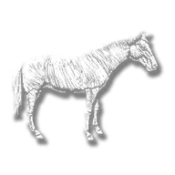                                   | <a href='https://raw.githubusercontent.com/abdulkadiraktas/rdr3_discoveries/master/useful_info_from_rpfs/textures/inventory_items/images/satchel_textures/cmpndm_tnwalker.png'>Download</a>                  |
| cmpndm_turkoman                  | 1073944581   |                                    | <a href='https://raw.githubusercontent.com/abdulkadiraktas/rdr3_discoveries/master/useful_info_from_rpfs/textures/inventory_items/images/satchel_textures/cmpndm_turkoman.png'>Download</a>                  |
| feathers_crafting                | -229093614   |                                | <a href='https://raw.githubusercontent.com/abdulkadiraktas/rdr3_discoveries/master/useful_info_from_rpfs/textures/inventory_items/images/satchel_textures/feathers_crafting.png'>Download</a>                |
| feathers_crafting_premium        | -1442816556  |                | <a href='https://raw.githubusercontent.com/abdulkadiraktas/rdr3_discoveries/master/useful_info_from_rpfs/textures/inventory_items/images/satchel_textures/feathers_crafting_premium.png'>Download</a>        |
| feathers_plume                   | 1266810501   |                                      | <a href='https://raw.githubusercontent.com/abdulkadiraktas/rdr3_discoveries/master/useful_info_from_rpfs/textures/inventory_items/images/satchel_textures/feathers_plume.png'>Download</a>                   |
| generic_animal_beak              | 696777419    |                            | <a href='https://raw.githubusercontent.com/abdulkadiraktas/rdr3_discoveries/master/useful_info_from_rpfs/textures/inventory_items/images/satchel_textures/generic_animal_beak.png'>Download</a>              |
| generic_animal_claw              | 1022482496   | 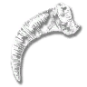                           | <a href='https://raw.githubusercontent.com/abdulkadiraktas/rdr3_discoveries/master/useful_info_from_rpfs/textures/inventory_items/images/satchel_textures/generic_animal_claw.png'>Download</a>              |
| generic_animal_fat               | 1373622156   | 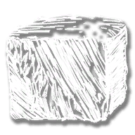                             | <a href='https://raw.githubusercontent.com/abdulkadiraktas/rdr3_discoveries/master/useful_info_from_rpfs/textures/inventory_items/images/satchel_textures/generic_animal_fat.png'>Download</a>               |
| generic_animal_feather_large     | -1624429356  | 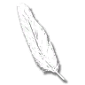         | <a href='https://raw.githubusercontent.com/abdulkadiraktas/rdr3_discoveries/master/useful_info_from_rpfs/textures/inventory_items/images/satchel_textures/generic_animal_feather_large.png'>Download</a>     |
| generic_animal_feather_small     | 1578752850   |          | <a href='https://raw.githubusercontent.com/abdulkadiraktas/rdr3_discoveries/master/useful_info_from_rpfs/textures/inventory_items/images/satchel_textures/generic_animal_feather_small.png'>Download</a>     |
| generic_animal_heart             | 1734889893   | 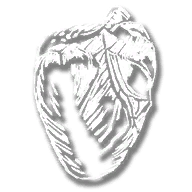                         | <a href='https://raw.githubusercontent.com/abdulkadiraktas/rdr3_discoveries/master/useful_info_from_rpfs/textures/inventory_items/images/satchel_textures/generic_animal_heart.png'>Download</a>             |
| generic_animal_horn              | -1268110696  |                            | <a href='https://raw.githubusercontent.com/abdulkadiraktas/rdr3_discoveries/master/useful_info_from_rpfs/textures/inventory_items/images/satchel_textures/generic_animal_horn.png'>Download</a>              |
| generic_animal_tooth             | -2068939027  | 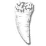                         | <a href='https://raw.githubusercontent.com/abdulkadiraktas/rdr3_discoveries/master/useful_info_from_rpfs/textures/inventory_items/images/satchel_textures/generic_animal_tooth.png'>Download</a>             |
| provision_alligator_skin         | -802026654   | 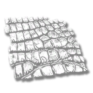                 | <a href='https://raw.githubusercontent.com/abdulkadiraktas/rdr3_discoveries/master/useful_info_from_rpfs/textures/inventory_items/images/satchel_textures/provision_alligator_skin.png'>Download</a>         |
| provision_armadillo_skin         | 27448453     |                  | <a href='https://raw.githubusercontent.com/abdulkadiraktas/rdr3_discoveries/master/useful_info_from_rpfs/textures/inventory_items/images/satchel_textures/provision_armadillo_skin.png'>Download</a>         |
| provision_badger_pelt            | -467109021   |                        | <a href='https://raw.githubusercontent.com/abdulkadiraktas/rdr3_discoveries/master/useful_info_from_rpfs/textures/inventory_items/images/satchel_textures/provision_badger_pelt.png'>Download</a>            |
| provision_bat_wing               | -800510665   | 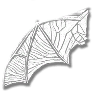                             | <a href='https://raw.githubusercontent.com/abdulkadiraktas/rdr3_discoveries/master/useful_info_from_rpfs/textures/inventory_items/images/satchel_textures/provision_bat_wing.png'>Download</a>               |
| provision_bear_claw              | -1394561808  | 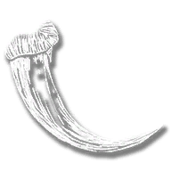                           | <a href='https://raw.githubusercontent.com/abdulkadiraktas/rdr3_discoveries/master/useful_info_from_rpfs/textures/inventory_items/images/satchel_textures/provision_bear_claw.png'>Download</a>              |
| provision_bear_fur               | 143941906    |                              | <a href='https://raw.githubusercontent.com/abdulkadiraktas/rdr3_discoveries/master/useful_info_from_rpfs/textures/inventory_items/images/satchel_textures/provision_bear_fur.png'>Download</a>               |
| provision_bear_heart             | 2123228046   |                          | <a href='https://raw.githubusercontent.com/abdulkadiraktas/rdr3_discoveries/master/useful_info_from_rpfs/textures/inventory_items/images/satchel_textures/provision_bear_heart.png'>Download</a>             |
| provision_beaver_fur             | -2059726619  | 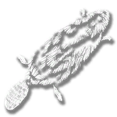                         | <a href='https://raw.githubusercontent.com/abdulkadiraktas/rdr3_discoveries/master/useful_info_from_rpfs/textures/inventory_items/images/satchel_textures/provision_beaver_fur.png'>Download</a>             |
| provision_beaver_scentgland      | -1034009399  | 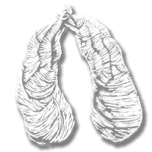           | <a href='https://raw.githubusercontent.com/abdulkadiraktas/rdr3_discoveries/master/useful_info_from_rpfs/textures/inventory_items/images/satchel_textures/provision_beaver_scentgland.png'>Download</a>      |
| provision_beaver_tail            | 901991174    | 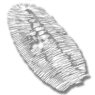                       | <a href='https://raw.githubusercontent.com/abdulkadiraktas/rdr3_discoveries/master/useful_info_from_rpfs/textures/inventory_items/images/satchel_textures/provision_beaver_tail.png'>Download</a>            |
| provision_bird_feather_flight    | 236757114    |        | <a href='https://raw.githubusercontent.com/abdulkadiraktas/rdr3_discoveries/master/useful_info_from_rpfs/textures/inventory_items/images/satchel_textures/provision_bird_feather_flight.png'>Download</a>    |
| provision_bison_horn             | 2142606707   | 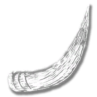                         | <a href='https://raw.githubusercontent.com/abdulkadiraktas/rdr3_discoveries/master/useful_info_from_rpfs/textures/inventory_items/images/satchel_textures/provision_bison_horn.png'>Download</a>             |
| provision_black_bear_fur         | 1490032862   | 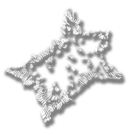                 | <a href='https://raw.githubusercontent.com/abdulkadiraktas/rdr3_discoveries/master/useful_info_from_rpfs/textures/inventory_items/images/satchel_textures/provision_black_bear_fur.png'>Download</a>         |
| provision_boar_skin              | 2116849039   |                            | <a href='https://raw.githubusercontent.com/abdulkadiraktas/rdr3_discoveries/master/useful_info_from_rpfs/textures/inventory_items/images/satchel_textures/provision_boar_skin.png'>Download</a>              |
| provision_boar_tusk              | -884176343   | 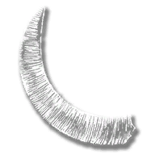                           | <a href='https://raw.githubusercontent.com/abdulkadiraktas/rdr3_discoveries/master/useful_info_from_rpfs/textures/inventory_items/images/satchel_textures/provision_boar_tusk.png'>Download</a>              |
| provision_bobcat_claws           | 667270623    | 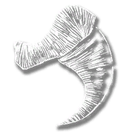                     | <a href='https://raw.githubusercontent.com/abdulkadiraktas/rdr3_discoveries/master/useful_info_from_rpfs/textures/inventory_items/images/satchel_textures/provision_bobcat_claws.png'>Download</a>           |
| provision_bobcat_fur             | -874025382   | 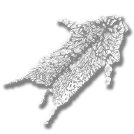                         | <a href='https://raw.githubusercontent.com/abdulkadiraktas/rdr3_discoveries/master/useful_info_from_rpfs/textures/inventory_items/images/satchel_textures/provision_bobcat_fur.png'>Download</a>             |
| provision_booby_feather          | -832559263   | 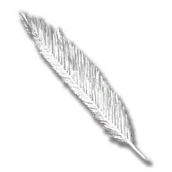                   | <a href='https://raw.githubusercontent.com/abdulkadiraktas/rdr3_discoveries/master/useful_info_from_rpfs/textures/inventory_items/images/satchel_textures/provision_booby_feather.png'>Download</a>          |
| provision_buck_antlers           | 529305859    | 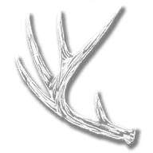                     | <a href='https://raw.githubusercontent.com/abdulkadiraktas/rdr3_discoveries/master/useful_info_from_rpfs/textures/inventory_items/images/satchel_textures/provision_buck_antlers.png'>Download</a>           |
| provision_buck_fur               | -868657362   | 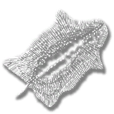                             | <a href='https://raw.githubusercontent.com/abdulkadiraktas/rdr3_discoveries/master/useful_info_from_rpfs/textures/inventory_items/images/satchel_textures/provision_buck_fur.png'>Download</a>               |
| provision_buffalo_fur            | -591117838   | 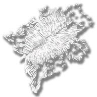                       | <a href='https://raw.githubusercontent.com/abdulkadiraktas/rdr3_discoveries/master/useful_info_from_rpfs/textures/inventory_items/images/satchel_textures/provision_buffalo_fur.png'>Download</a>            |
| provision_buffalo_horn           | -1618402788  |                      | <a href='https://raw.githubusercontent.com/abdulkadiraktas/rdr3_discoveries/master/useful_info_from_rpfs/textures/inventory_items/images/satchel_textures/provision_buffalo_horn.png'>Download</a>           |
| provision_bull_gator_eye         | 518343187    |                  | <a href='https://raw.githubusercontent.com/abdulkadiraktas/rdr3_discoveries/master/useful_info_from_rpfs/textures/inventory_items/images/satchel_textures/provision_bull_gator_eye.png'>Download</a>         |
| provision_bull_hide              | -336086818   |                            | <a href='https://raw.githubusercontent.com/abdulkadiraktas/rdr3_discoveries/master/useful_info_from_rpfs/textures/inventory_items/images/satchel_textures/provision_bull_hide.png'>Download</a>              |
| provision_bull_horns             | -1065098050  | 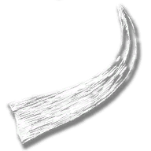                         | <a href='https://raw.githubusercontent.com/abdulkadiraktas/rdr3_discoveries/master/useful_info_from_rpfs/textures/inventory_items/images/satchel_textures/provision_bull_horns.png'>Download</a>             |
| provision_cormorant_feather      | 544782507    |            | <a href='https://raw.githubusercontent.com/abdulkadiraktas/rdr3_discoveries/master/useful_info_from_rpfs/textures/inventory_items/images/satchel_textures/provision_cormorant_feather.png'>Download</a>      |
| provision_cougar_claw            | -1615206776  | 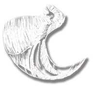                       | <a href='https://raw.githubusercontent.com/abdulkadiraktas/rdr3_discoveries/master/useful_info_from_rpfs/textures/inventory_items/images/satchel_textures/provision_cougar_claw.png'>Download</a>            |
| provision_cougar_fang            | 1712162117   | 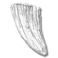                       | <a href='https://raw.githubusercontent.com/abdulkadiraktas/rdr3_discoveries/master/useful_info_from_rpfs/textures/inventory_items/images/satchel_textures/provision_cougar_fang.png'>Download</a>            |
| provision_cougar_fur             | 459744337    | 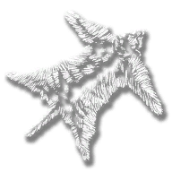                         | <a href='https://raw.githubusercontent.com/abdulkadiraktas/rdr3_discoveries/master/useful_info_from_rpfs/textures/inventory_items/images/satchel_textures/provision_cougar_fur.png'>Download</a>             |
| provision_cow_hide               | 1150594075   |                              | <a href='https://raw.githubusercontent.com/abdulkadiraktas/rdr3_discoveries/master/useful_info_from_rpfs/textures/inventory_items/images/satchel_textures/provision_cow_hide.png'>Download</a>               |
| provision_coyote_fang            | 820186837    | 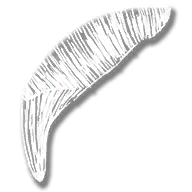                       | <a href='https://raw.githubusercontent.com/abdulkadiraktas/rdr3_discoveries/master/useful_info_from_rpfs/textures/inventory_items/images/satchel_textures/provision_coyote_fang.png'>Download</a>            |
| provision_coyote_fur             | 1150939141   |                          | <a href='https://raw.githubusercontent.com/abdulkadiraktas/rdr3_discoveries/master/useful_info_from_rpfs/textures/inventory_items/images/satchel_textures/provision_coyote_fur.png'>Download</a>             |
| provision_crow_beak              | 607085580    |                            | <a href='https://raw.githubusercontent.com/abdulkadiraktas/rdr3_discoveries/master/useful_info_from_rpfs/textures/inventory_items/images/satchel_textures/provision_crow_beak.png'>Download</a>              |
| provision_crow_feather           | 376217292    |                      | <a href='https://raw.githubusercontent.com/abdulkadiraktas/rdr3_discoveries/master/useful_info_from_rpfs/textures/inventory_items/images/satchel_textures/provision_crow_feather.png'>Download</a>           |
| provision_deer_hide              | -1827027577  |                            | <a href='https://raw.githubusercontent.com/abdulkadiraktas/rdr3_discoveries/master/useful_info_from_rpfs/textures/inventory_items/images/satchel_textures/provision_deer_hide.png'>Download</a>              |
| provision_eagle_talon            | 1637109059   |                        | <a href='https://raw.githubusercontent.com/abdulkadiraktas/rdr3_discoveries/master/useful_info_from_rpfs/textures/inventory_items/images/satchel_textures/provision_eagle_talon.png'>Download</a>            |
| provision_egret_feather          | 844750136    |                    | <a href='https://raw.githubusercontent.com/abdulkadiraktas/rdr3_discoveries/master/useful_info_from_rpfs/textures/inventory_items/images/satchel_textures/provision_egret_feather.png'>Download</a>          |
| provision_elk_antlers            | -407659715   |                        | <a href='https://raw.githubusercontent.com/abdulkadiraktas/rdr3_discoveries/master/useful_info_from_rpfs/textures/inventory_items/images/satchel_textures/provision_elk_antlers.png'>Download</a>            |
| provision_elk_fur                | 1181652728   |                                | <a href='https://raw.githubusercontent.com/abdulkadiraktas/rdr3_discoveries/master/useful_info_from_rpfs/textures/inventory_items/images/satchel_textures/provision_elk_fur.png'>Download</a>                |
| provision_fox_claw               | -1159997179  |                              | <a href='https://raw.githubusercontent.com/abdulkadiraktas/rdr3_discoveries/master/useful_info_from_rpfs/textures/inventory_items/images/satchel_textures/provision_fox_claw.png'>Download</a>               |
| provision_fox_fur                | 238733925    |                                | <a href='https://raw.githubusercontent.com/abdulkadiraktas/rdr3_discoveries/master/useful_info_from_rpfs/textures/inventory_items/images/satchel_textures/provision_fox_fur.png'>Download</a>                |
| provision_frog_skin              | -732511557   |                            | <a href='https://raw.githubusercontent.com/abdulkadiraktas/rdr3_discoveries/master/useful_info_from_rpfs/textures/inventory_items/images/satchel_textures/provision_frog_skin.png'>Download</a>              |
| provision_goat_hair              | 1710714415   |                            | <a href='https://raw.githubusercontent.com/abdulkadiraktas/rdr3_discoveries/master/useful_info_from_rpfs/textures/inventory_items/images/satchel_textures/provision_goat_hair.png'>Download</a>              |
| provision_hawk_feather           | -31982783    |                      | <a href='https://raw.githubusercontent.com/abdulkadiraktas/rdr3_discoveries/master/useful_info_from_rpfs/textures/inventory_items/images/satchel_textures/provision_hawk_feather.png'>Download</a>           |
| provision_iguana_skin            | 1204918860   |                        | <a href='https://raw.githubusercontent.com/abdulkadiraktas/rdr3_discoveries/master/useful_info_from_rpfs/textures/inventory_items/images/satchel_textures/provision_iguana_skin.png'>Download</a>            |
| provision_javelina_skin          | -1379330323  |                    | <a href='https://raw.githubusercontent.com/abdulkadiraktas/rdr3_discoveries/master/useful_info_from_rpfs/textures/inventory_items/images/satchel_textures/provision_javelina_skin.png'>Download</a>          |
| provision_javelina_tusk          | 696159276    |                    | <a href='https://raw.githubusercontent.com/abdulkadiraktas/rdr3_discoveries/master/useful_info_from_rpfs/textures/inventory_items/images/satchel_textures/provision_javelina_tusk.png'>Download</a>          |
| provision_lions_paw              | 580970876    |                            | <a href='https://raw.githubusercontent.com/abdulkadiraktas/rdr3_discoveries/master/useful_info_from_rpfs/textures/inventory_items/images/satchel_textures/provision_lions_paw.png'>Download</a>              |
| provision_meat_big_game          | 1058147103   |                    | <a href='https://raw.githubusercontent.com/abdulkadiraktas/rdr3_discoveries/master/useful_info_from_rpfs/textures/inventory_items/images/satchel_textures/provision_meat_big_game.png'>Download</a>          |
| provision_meat_crustacean        | -1088693887  |                | <a href='https://raw.githubusercontent.com/abdulkadiraktas/rdr3_discoveries/master/useful_info_from_rpfs/textures/inventory_items/images/satchel_textures/provision_meat_crustacean.png'>Download</a>        |
| provision_meat_exotic_bird       | 170122788    |              | <a href='https://raw.githubusercontent.com/abdulkadiraktas/rdr3_discoveries/master/useful_info_from_rpfs/textures/inventory_items/images/satchel_textures/provision_meat_exotic_bird.png'>Download</a>       |
| provision_meat_flakey_fish       | 1215263057   |              | <a href='https://raw.githubusercontent.com/abdulkadiraktas/rdr3_discoveries/master/useful_info_from_rpfs/textures/inventory_items/images/satchel_textures/provision_meat_flakey_fish.png'>Download</a>       |
| provision_meat_game              | -1873792930  |                            | <a href='https://raw.githubusercontent.com/abdulkadiraktas/rdr3_discoveries/master/useful_info_from_rpfs/textures/inventory_items/images/satchel_textures/provision_meat_game.png'>Download</a>              |
| provision_meat_gamey_bird        | 605068259    |                | <a href='https://raw.githubusercontent.com/abdulkadiraktas/rdr3_discoveries/master/useful_info_from_rpfs/textures/inventory_items/images/satchel_textures/provision_meat_gamey_bird.png'>Download</a>        |
| provision_meat_gristly_mutton    | 1225586542   |        | <a href='https://raw.githubusercontent.com/abdulkadiraktas/rdr3_discoveries/master/useful_info_from_rpfs/textures/inventory_items/images/satchel_textures/provision_meat_gristly_mutton.png'>Download</a>    |
| provision_meat_gritty_fish       | 1619317713   |              | <a href='https://raw.githubusercontent.com/abdulkadiraktas/rdr3_discoveries/master/useful_info_from_rpfs/textures/inventory_items/images/satchel_textures/provision_meat_gritty_fish.png'>Download</a>       |
| provision_meat_herptile          | 1623287893   |                    | <a href='https://raw.githubusercontent.com/abdulkadiraktas/rdr3_discoveries/master/useful_info_from_rpfs/textures/inventory_items/images/satchel_textures/provision_meat_herptile.png'>Download</a>          |
| provision_meat_mature_venison    | -1451695106  |        | <a href='https://raw.githubusercontent.com/abdulkadiraktas/rdr3_discoveries/master/useful_info_from_rpfs/textures/inventory_items/images/satchel_textures/provision_meat_mature_venison.png'>Download</a>    |
| provision_meat_plump_bird        | -88969383    |                | <a href='https://raw.githubusercontent.com/abdulkadiraktas/rdr3_discoveries/master/useful_info_from_rpfs/textures/inventory_items/images/satchel_textures/provision_meat_plump_bird.png'>Download</a>        |
| provision_meat_prime_beef        | 438164617    |                | <a href='https://raw.githubusercontent.com/abdulkadiraktas/rdr3_discoveries/master/useful_info_from_rpfs/textures/inventory_items/images/satchel_textures/provision_meat_prime_beef.png'>Download</a>        |
| provision_meat_stringy           | -2146868124  |                      | <a href='https://raw.githubusercontent.com/abdulkadiraktas/rdr3_discoveries/master/useful_info_from_rpfs/textures/inventory_items/images/satchel_textures/provision_meat_stringy.png'>Download</a>           |
| provision_meat_succulent_fish    | 269571680    |        | <a href='https://raw.githubusercontent.com/abdulkadiraktas/rdr3_discoveries/master/useful_info_from_rpfs/textures/inventory_items/images/satchel_textures/provision_meat_succulent_fish.png'>Download</a>    |
| provision_meat_tender_pork       | 1619964604   |              | <a href='https://raw.githubusercontent.com/abdulkadiraktas/rdr3_discoveries/master/useful_info_from_rpfs/textures/inventory_items/images/satchel_textures/provision_meat_tender_pork.png'>Download</a>       |
| provision_moose_antler           | 895033262    |                      | <a href='https://raw.githubusercontent.com/abdulkadiraktas/rdr3_discoveries/master/useful_info_from_rpfs/textures/inventory_items/images/satchel_textures/provision_moose_antler.png'>Download</a>           |
| provision_moose_fur              | 1636891382   |                            | <a href='https://raw.githubusercontent.com/abdulkadiraktas/rdr3_discoveries/master/useful_info_from_rpfs/textures/inventory_items/images/satchel_textures/provision_moose_fur.png'>Download</a>              |
| provision_muskrat_fur            | -771861010   |                        | <a href='https://raw.githubusercontent.com/abdulkadiraktas/rdr3_discoveries/master/useful_info_from_rpfs/textures/inventory_items/images/satchel_textures/provision_muskrat_fur.png'>Download</a>            |
| provision_muskrat_scentgland     | -1635005387  |          | <a href='https://raw.githubusercontent.com/abdulkadiraktas/rdr3_discoveries/master/useful_info_from_rpfs/textures/inventory_items/images/satchel_textures/provision_muskrat_scentgland.png'>Download</a>     |
| provision_opossum_fur            | 416535067    |                        | <a href='https://raw.githubusercontent.com/abdulkadiraktas/rdr3_discoveries/master/useful_info_from_rpfs/textures/inventory_items/images/satchel_textures/provision_opossum_fur.png'>Download</a>            |
| provision_owl_feather            | -1067479455  |                        | <a href='https://raw.githubusercontent.com/abdulkadiraktas/rdr3_discoveries/master/useful_info_from_rpfs/textures/inventory_items/images/satchel_textures/provision_owl_feather.png'>Download</a>            |
| provision_oxen_hide              | 1208128650   |                            | <a href='https://raw.githubusercontent.com/abdulkadiraktas/rdr3_discoveries/master/useful_info_from_rpfs/textures/inventory_items/images/satchel_textures/provision_oxen_hide.png'>Download</a>              |
| provision_oxen_horn              | 1503728435   |                            | <a href='https://raw.githubusercontent.com/abdulkadiraktas/rdr3_discoveries/master/useful_info_from_rpfs/textures/inventory_items/images/satchel_textures/provision_oxen_horn.png'>Download</a>              |
| provision_panther_eye            | -1707070981  |                        | <a href='https://raw.githubusercontent.com/abdulkadiraktas/rdr3_discoveries/master/useful_info_from_rpfs/textures/inventory_items/images/satchel_textures/provision_panther_eye.png'>Download</a>            |
| provision_panther_fur            | -395646254   |                        | <a href='https://raw.githubusercontent.com/abdulkadiraktas/rdr3_discoveries/master/useful_info_from_rpfs/textures/inventory_items/images/satchel_textures/provision_panther_fur.png'>Download</a>            |
| provision_panther_heart          | 24363919     |                    | <a href='https://raw.githubusercontent.com/abdulkadiraktas/rdr3_discoveries/master/useful_info_from_rpfs/textures/inventory_items/images/satchel_textures/provision_panther_heart.png'>Download</a>          |
| provision_parrot_feather         | 1607779195   |                  | <a href='https://raw.githubusercontent.com/abdulkadiraktas/rdr3_discoveries/master/useful_info_from_rpfs/textures/inventory_items/images/satchel_textures/provision_parrot_feather.png'>Download</a>         |
| provision_pelican_feather        | -2068566007  |                | <a href='https://raw.githubusercontent.com/abdulkadiraktas/rdr3_discoveries/master/useful_info_from_rpfs/textures/inventory_items/images/satchel_textures/provision_pelican_feather.png'>Download</a>        |
| provision_pig_skin               | -57190831    |                              | <a href='https://raw.githubusercontent.com/abdulkadiraktas/rdr3_discoveries/master/useful_info_from_rpfs/textures/inventory_items/images/satchel_textures/provision_pig_skin.png'>Download</a>               |
| provision_pronghorn_fur          | 554578289    |                    | <a href='https://raw.githubusercontent.com/abdulkadiraktas/rdr3_discoveries/master/useful_info_from_rpfs/textures/inventory_items/images/satchel_textures/provision_pronghorn_fur.png'>Download</a>          |
| provision_pronghorn_horn         | -1564072701  |                  | <a href='https://raw.githubusercontent.com/abdulkadiraktas/rdr3_discoveries/master/useful_info_from_rpfs/textures/inventory_items/images/satchel_textures/provision_pronghorn_horn.png'>Download</a>         |
| provision_rabbit_pelt            | 149018327    |                        | <a href='https://raw.githubusercontent.com/abdulkadiraktas/rdr3_discoveries/master/useful_info_from_rpfs/textures/inventory_items/images/satchel_textures/provision_rabbit_pelt.png'>Download</a>            |
| provision_raccoon_fur            | -1178296218  |                        | <a href='https://raw.githubusercontent.com/abdulkadiraktas/rdr3_discoveries/master/useful_info_from_rpfs/textures/inventory_items/images/satchel_textures/provision_raccoon_fur.png'>Download</a>            |
| provision_ram_hide               | -476045512   |                              | <a href='https://raw.githubusercontent.com/abdulkadiraktas/rdr3_discoveries/master/useful_info_from_rpfs/textures/inventory_items/images/satchel_textures/provision_ram_hide.png'>Download</a>               |
| provision_ram_horn               | -922132359   |                              | <a href='https://raw.githubusercontent.com/abdulkadiraktas/rdr3_discoveries/master/useful_info_from_rpfs/textures/inventory_items/images/satchel_textures/provision_ram_horn.png'>Download</a>               |
| provision_rat_fur                | -409451878   |                                | <a href='https://raw.githubusercontent.com/abdulkadiraktas/rdr3_discoveries/master/useful_info_from_rpfs/textures/inventory_items/images/satchel_textures/provision_rat_fur.png'>Download</a>                |
| provision_raven_claw             | -2048658382  |                          | <a href='https://raw.githubusercontent.com/abdulkadiraktas/rdr3_discoveries/master/useful_info_from_rpfs/textures/inventory_items/images/satchel_textures/provision_raven_claw.png'>Download</a>             |
| provision_raven_feather          | -1181539987  |                    | <a href='https://raw.githubusercontent.com/abdulkadiraktas/rdr3_discoveries/master/useful_info_from_rpfs/textures/inventory_items/images/satchel_textures/provision_raven_feather.png'>Download</a>          |
| provision_sheep_wool             | -1317365569  |                          | <a href='https://raw.githubusercontent.com/abdulkadiraktas/rdr3_discoveries/master/useful_info_from_rpfs/textures/inventory_items/images/satchel_textures/provision_sheep_wool.png'>Download</a>             |
| provision_skunk_fur              | 1925227409   |                            | <a href='https://raw.githubusercontent.com/abdulkadiraktas/rdr3_discoveries/master/useful_info_from_rpfs/textures/inventory_items/images/satchel_textures/provision_skunk_fur.png'>Download</a>              |
| provision_snake_skin             | 1126133763   |                          | <a href='https://raw.githubusercontent.com/abdulkadiraktas/rdr3_discoveries/master/useful_info_from_rpfs/textures/inventory_items/images/satchel_textures/provision_snake_skin.png'>Download</a>             |
| provision_squirrel_pelt          | -896290892   |                    | <a href='https://raw.githubusercontent.com/abdulkadiraktas/rdr3_discoveries/master/useful_info_from_rpfs/textures/inventory_items/images/satchel_textures/provision_squirrel_pelt.png'>Download</a>          |
| provision_squirrel_tail          | 2016225967   |                    | <a href='https://raw.githubusercontent.com/abdulkadiraktas/rdr3_discoveries/master/useful_info_from_rpfs/textures/inventory_items/images/satchel_textures/provision_squirrel_tail.png'>Download</a>          |
| provision_squirrel_tooth         | -146284181   |                  | <a href='https://raw.githubusercontent.com/abdulkadiraktas/rdr3_discoveries/master/useful_info_from_rpfs/textures/inventory_items/images/satchel_textures/provision_squirrel_tooth.png'>Download</a>         |
| provision_vulture_feather        | -1397737565  |                | <a href='https://raw.githubusercontent.com/abdulkadiraktas/rdr3_discoveries/master/useful_info_from_rpfs/textures/inventory_items/images/satchel_textures/provision_vulture_feather.png'>Download</a>        |
| provision_whooping_crane_feather | 1761014306   |  | <a href='https://raw.githubusercontent.com/abdulkadiraktas/rdr3_discoveries/master/useful_info_from_rpfs/textures/inventory_items/images/satchel_textures/provision_whooping_crane_feather.png'>Download</a> |
| provision_wolf_fur               | 1145777975   |                              | <a href='https://raw.githubusercontent.com/abdulkadiraktas/rdr3_discoveries/master/useful_info_from_rpfs/textures/inventory_items/images/satchel_textures/provision_wolf_fur.png'>Download</a>               |
| satchel_nav_all                  | 443945499    |                                    | <a href='https://raw.githubusercontent.com/abdulkadiraktas/rdr3_discoveries/master/useful_info_from_rpfs/textures/inventory_items/images/satchel_textures/satchel_nav_all.png'>Download</a>                  |
| satchel_nav_animals              | 1679412458   |                            | <a href='https://raw.githubusercontent.com/abdulkadiraktas/rdr3_discoveries/master/useful_info_from_rpfs/textures/inventory_items/images/satchel_textures/satchel_nav_animals.png'>Download</a>              |
| satchel_nav_documents            | 1761254900   |                        | <a href='https://raw.githubusercontent.com/abdulkadiraktas/rdr3_discoveries/master/useful_info_from_rpfs/textures/inventory_items/images/satchel_textures/satchel_nav_documents.png'>Download</a>            |
| satchel_nav_donate               | -1966717115  |                              | <a href='https://raw.githubusercontent.com/abdulkadiraktas/rdr3_discoveries/master/useful_info_from_rpfs/textures/inventory_items/images/satchel_textures/satchel_nav_donate.png'>Download</a>               |
| satchel_nav_fire                 | -980050591   |                                  | <a href='https://raw.githubusercontent.com/abdulkadiraktas/rdr3_discoveries/master/useful_info_from_rpfs/textures/inventory_items/images/satchel_textures/satchel_nav_fire.png'>Download</a>                 |
| satchel_nav_fish_sack            | -1709502968  |                        | <a href='https://raw.githubusercontent.com/abdulkadiraktas/rdr3_discoveries/master/useful_info_from_rpfs/textures/inventory_items/images/satchel_textures/satchel_nav_fish_sack.png'>Download</a>            |
| satchel_nav_herbs                | 1146313124   |                                | <a href='https://raw.githubusercontent.com/abdulkadiraktas/rdr3_discoveries/master/useful_info_from_rpfs/textures/inventory_items/images/satchel_textures/satchel_nav_herbs.png'>Download</a>                |
| satchel_nav_horse                | 771764772    |                                | <a href='https://raw.githubusercontent.com/abdulkadiraktas/rdr3_discoveries/master/useful_info_from_rpfs/textures/inventory_items/images/satchel_textures/satchel_nav_horse.png'>Download</a>                |
| satchel_nav_horse_items          | 626217179    |                    | <a href='https://raw.githubusercontent.com/abdulkadiraktas/rdr3_discoveries/master/useful_info_from_rpfs/textures/inventory_items/images/satchel_textures/satchel_nav_horse_items.png'>Download</a>          |
| satchel_nav_ingredients          | 1063323264   |                    | <a href='https://raw.githubusercontent.com/abdulkadiraktas/rdr3_discoveries/master/useful_info_from_rpfs/textures/inventory_items/images/satchel_textures/satchel_nav_ingredients.png'>Download</a>          |
| satchel_nav_kit                  | -461468653   |                                    | <a href='https://raw.githubusercontent.com/abdulkadiraktas/rdr3_discoveries/master/useful_info_from_rpfs/textures/inventory_items/images/satchel_textures/satchel_nav_kit.png'>Download</a>                  |
| satchel_nav_loot                 | 182259145    |                                  | <a href='https://raw.githubusercontent.com/abdulkadiraktas/rdr3_discoveries/master/useful_info_from_rpfs/textures/inventory_items/images/satchel_textures/satchel_nav_loot.png'>Download</a>                 |
| satchel_nav_materials            | -2096783589  |                        | <a href='https://raw.githubusercontent.com/abdulkadiraktas/rdr3_discoveries/master/useful_info_from_rpfs/textures/inventory_items/images/satchel_textures/satchel_nav_materials.png'>Download</a>            |
| satchel_nav_provisions           | 2049523496   |                      | <a href='https://raw.githubusercontent.com/abdulkadiraktas/rdr3_discoveries/master/useful_info_from_rpfs/textures/inventory_items/images/satchel_textures/satchel_nav_provisions.png'>Download</a>           |
| satchel_nav_remedies             | -607937119   |                          | <a href='https://raw.githubusercontent.com/abdulkadiraktas/rdr3_discoveries/master/useful_info_from_rpfs/textures/inventory_items/images/satchel_textures/satchel_nav_remedies.png'>Download</a>             |
| satchel_nav_sell                 | -1523466777  |                                  | <a href='https://raw.githubusercontent.com/abdulkadiraktas/rdr3_discoveries/master/useful_info_from_rpfs/textures/inventory_items/images/satchel_textures/satchel_nav_sell.png'>Download</a>                 |
| satchel_nav_send                 | -1346803962  |                                  | <a href='https://raw.githubusercontent.com/abdulkadiraktas/rdr3_discoveries/master/useful_info_from_rpfs/textures/inventory_items/images/satchel_textures/satchel_nav_send.png'>Download</a>                 |
| satchel_nav_valuables            | -2043887681  |                        | <a href='https://raw.githubusercontent.com/abdulkadiraktas/rdr3_discoveries/master/useful_info_from_rpfs/textures/inventory_items/images/satchel_textures/satchel_nav_valuables.png'>Download</a>            |
