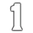
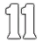
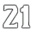
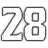
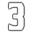
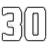
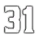
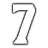
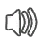

## Example of using:

```lua
local function DrawTexture(textureStreamed,textureName,x, y, width, height,rotation,r, g, b, a, p11)
    if not HasStreamedTextureDictLoaded(textureStreamed) then
       RequestStreamedTextureDict(textureStreamed, false);
    else
        DrawSprite(textureStreamed, textureName, x, y, width, height, rotation, r, g, b, a, p11);
    end
end
Citizen.CreateThread(function()
    while true do
    	Citizen.Wait(0)
		DrawTexture("overhead", "overhead_ambient_hunter", 0.5, 0.5, 0.251, 0.251, 0.0, 0, 0, 0, 240, false);
	end
end)
```

<h3>Texture dictionary hashname (hash):</h3>

<h2>overhead (0x1BF8D88A)</h2>

| Texture hashname           | Texture hash | Texture example                                                                | Download Image                                                                                                                                                                          |
| -------------------------- | ------------ | ------------------------------------------------------------------------------ | --------------------------------------------------------------------------------------------------------------------------------------------------------------------------------------- |
| overhead_ambient_hunter    | 0x2C5FA6B9   |        | <a href='https://raw.githubusercontent.com/abdulkadiraktas/rdr3_discoveries/master/useful_info_from_rpfs/textures/overhead/images/overhead/overhead_ambient_hunter.png'>Download</a>    |
| overhead_bounty            | 0x92D3352B   |                        | <a href='https://raw.githubusercontent.com/abdulkadiraktas/rdr3_discoveries/master/useful_info_from_rpfs/textures/overhead/images/overhead/overhead_bounty.png'>Download</a>            |
| overhead_cash_bag          | 0xA243B5A4   |                    | <a href='https://raw.githubusercontent.com/abdulkadiraktas/rdr3_discoveries/master/useful_info_from_rpfs/textures/overhead/images/overhead/overhead_cash_bag.png'>Download</a>          |
| overhead_deadeye           | 0x2077F4CC   |                      | <a href='https://raw.githubusercontent.com/abdulkadiraktas/rdr3_discoveries/master/useful_info_from_rpfs/textures/overhead/images/overhead/overhead_deadeye.png'>Download</a>           |
| overhead_deputy            | 0xD057BD70   |                        | <a href='https://raw.githubusercontent.com/abdulkadiraktas/rdr3_discoveries/master/useful_info_from_rpfs/textures/overhead/images/overhead/overhead_deputy.png'>Download</a>            |
| overhead_generic_arrow     | 0xC3270FD1   |          | <a href='https://raw.githubusercontent.com/abdulkadiraktas/rdr3_discoveries/master/useful_info_from_rpfs/textures/overhead/images/overhead/overhead_generic_arrow.png'>Download</a>     |
| overhead_generic_bag       | 0x85ADACE2   |              | <a href='https://raw.githubusercontent.com/abdulkadiraktas/rdr3_discoveries/master/useful_info_from_rpfs/textures/overhead/images/overhead/overhead_generic_bag.png'>Download</a>       |
| overhead_kill_1            | 0xE1FD0C6E   |                        | <a href='https://raw.githubusercontent.com/abdulkadiraktas/rdr3_discoveries/master/useful_info_from_rpfs/textures/overhead/images/overhead/overhead_kill_1.png'>Download</a>            |
| overhead_kill_10           | 0x9CDE6A9C   |                      | <a href='https://raw.githubusercontent.com/abdulkadiraktas/rdr3_discoveries/master/useful_info_from_rpfs/textures/overhead/images/overhead/overhead_kill_10.png'>Download</a>           |
| overhead_kill_11           | 0xAB8C87F8   |                      | <a href='https://raw.githubusercontent.com/abdulkadiraktas/rdr3_discoveries/master/useful_info_from_rpfs/textures/overhead/images/overhead/overhead_kill_11.png'>Download</a>           |
| overhead_kill_12           | 0x35C99C70   |                      | <a href='https://raw.githubusercontent.com/abdulkadiraktas/rdr3_discoveries/master/useful_info_from_rpfs/textures/overhead/images/overhead/overhead_kill_12.png'>Download</a>           |
| overhead_kill_13           | 0x440838ED   |                      | <a href='https://raw.githubusercontent.com/abdulkadiraktas/rdr3_discoveries/master/useful_info_from_rpfs/textures/overhead/images/overhead/overhead_kill_13.png'>Download</a>           |
| overhead_kill_14           | 0x5219550F   |                      | <a href='https://raw.githubusercontent.com/abdulkadiraktas/rdr3_discoveries/master/useful_info_from_rpfs/textures/overhead/images/overhead/overhead_kill_14.png'>Download</a>           |
| overhead_kill_15           | 0x606AF1B2   |                      | <a href='https://raw.githubusercontent.com/abdulkadiraktas/rdr3_discoveries/master/useful_info_from_rpfs/textures/overhead/images/overhead/overhead_kill_15.png'>Download</a>           |
| overhead_kill_16           | 0x53D6581D   |                      | <a href='https://raw.githubusercontent.com/abdulkadiraktas/rdr3_discoveries/master/useful_info_from_rpfs/textures/overhead/images/overhead/overhead_kill_16.png'>Download</a>           |
| overhead_kill_17           | 0x468BBD88   |                      | <a href='https://raw.githubusercontent.com/abdulkadiraktas/rdr3_discoveries/master/useful_info_from_rpfs/textures/overhead/images/overhead/overhead_kill_17.png'>Download</a>           |
| overhead_kill_18           | 0x30A491BA   |                      | <a href='https://raw.githubusercontent.com/abdulkadiraktas/rdr3_discoveries/master/useful_info_from_rpfs/textures/overhead/images/overhead/overhead_kill_18.png'>Download</a>           |
| overhead_kill_19           | 0x226EF54F   |                      | <a href='https://raw.githubusercontent.com/abdulkadiraktas/rdr3_discoveries/master/useful_info_from_rpfs/textures/overhead/images/overhead/overhead_kill_19.png'>Download</a>           |
| overhead_kill_2            | 0x4FBBE7EA   |                        | <a href='https://raw.githubusercontent.com/abdulkadiraktas/rdr3_discoveries/master/useful_info_from_rpfs/textures/overhead/images/overhead/overhead_kill_2.png'>Download</a>            |
| overhead_kill_20           | 0xF6881EAE   |                      | <a href='https://raw.githubusercontent.com/abdulkadiraktas/rdr3_discoveries/master/useful_info_from_rpfs/textures/overhead/images/overhead/overhead_kill_20.png'>Download</a>           |
| overhead_kill_21           | 0xE4677A69   |                      | <a href='https://raw.githubusercontent.com/abdulkadiraktas/rdr3_discoveries/master/useful_info_from_rpfs/textures/overhead/images/overhead/overhead_kill_21.png'>Download</a>           |
| overhead_kill_22           | 0xB9F8258B   |                      | <a href='https://raw.githubusercontent.com/abdulkadiraktas/rdr3_discoveries/master/useful_info_from_rpfs/textures/overhead/images/overhead/overhead_kill_22.png'>Download</a>           |
| overhead_kill_23           | 0xA7BA8110   |                      | <a href='https://raw.githubusercontent.com/abdulkadiraktas/rdr3_discoveries/master/useful_info_from_rpfs/textures/overhead/images/overhead/overhead_kill_23.png'>Download</a>           |
| overhead_kill_24           | 0x4D3FCC10   |                      | <a href='https://raw.githubusercontent.com/abdulkadiraktas/rdr3_discoveries/master/useful_info_from_rpfs/textures/overhead/images/overhead/overhead_kill_24.png'>Download</a>           |
| overhead_kill_25           | 0x42E9B764   |                      | <a href='https://raw.githubusercontent.com/abdulkadiraktas/rdr3_discoveries/master/useful_info_from_rpfs/textures/overhead/images/overhead/overhead_kill_25.png'>Download</a>           |
| overhead_kill_26           | 0x311C13C9   |                      | <a href='https://raw.githubusercontent.com/abdulkadiraktas/rdr3_discoveries/master/useful_info_from_rpfs/textures/overhead/images/overhead/overhead_kill_26.png'>Download</a>           |
| overhead_kill_27           | 0x2718FFC3   |                      | <a href='https://raw.githubusercontent.com/abdulkadiraktas/rdr3_discoveries/master/useful_info_from_rpfs/textures/overhead/images/overhead/overhead_kill_27.png'>Download</a>           |
| overhead_kill_28           | 0xA4437A1A   |                      | <a href='https://raw.githubusercontent.com/abdulkadiraktas/rdr3_discoveries/master/useful_info_from_rpfs/textures/overhead/images/overhead/overhead_kill_28.png'>Download</a>           |
| overhead_kill_29           | 0x7A9326BA   |                      | <a href='https://raw.githubusercontent.com/abdulkadiraktas/rdr3_discoveries/master/useful_info_from_rpfs/textures/overhead/images/overhead/overhead_kill_29.png'>Download</a>           |
| overhead_kill_3            | 0xCCAA61C5   |                        | <a href='https://raw.githubusercontent.com/abdulkadiraktas/rdr3_discoveries/master/useful_info_from_rpfs/textures/overhead/images/overhead/overhead_kill_3.png'>Download</a>            |
| overhead_kill_30           | 0x8CF6BAF1   |                      | <a href='https://raw.githubusercontent.com/abdulkadiraktas/rdr3_discoveries/master/useful_info_from_rpfs/textures/overhead/images/overhead/overhead_kill_30.png'>Download</a>           |
| overhead_kill_31           | 0x9041C187   |                      | <a href='https://raw.githubusercontent.com/abdulkadiraktas/rdr3_discoveries/master/useful_info_from_rpfs/textures/overhead/images/overhead/overhead_kill_31.png'>Download</a>           |
| overhead_kill_32           | 0x6AFCF706   |                      | <a href='https://raw.githubusercontent.com/abdulkadiraktas/rdr3_discoveries/master/useful_info_from_rpfs/textures/overhead/images/overhead/overhead_kill_32.png'>Download</a>           |
| overhead_kill_4            | 0xBE83C578   |                        | <a href='https://raw.githubusercontent.com/abdulkadiraktas/rdr3_discoveries/master/useful_info_from_rpfs/textures/overhead/images/overhead/overhead_kill_4.png'>Download</a>            |
| overhead_kill_5            | 0xA9239AB8   |                        | <a href='https://raw.githubusercontent.com/abdulkadiraktas/rdr3_discoveries/master/useful_info_from_rpfs/textures/overhead/images/overhead/overhead_kill_5.png'>Download</a>            |
| overhead_kill_6            | 0x1AD4FE1D   |                        | <a href='https://raw.githubusercontent.com/abdulkadiraktas/rdr3_discoveries/master/useful_info_from_rpfs/textures/overhead/images/overhead/overhead_kill_6.png'>Download</a>            |
| overhead_kill_7            | 0x9764F73B   |                        | <a href='https://raw.githubusercontent.com/abdulkadiraktas/rdr3_discoveries/master/useful_info_from_rpfs/textures/overhead/images/overhead/overhead_kill_7.png'>Download</a>            |
| overhead_kill_8            | 0x8131CAD5   |                        | <a href='https://raw.githubusercontent.com/abdulkadiraktas/rdr3_discoveries/master/useful_info_from_rpfs/textures/overhead/images/overhead/overhead_kill_8.png'>Download</a>            |
| overhead_kill_9            | 0x6FC82802   |                        | <a href='https://raw.githubusercontent.com/abdulkadiraktas/rdr3_discoveries/master/useful_info_from_rpfs/textures/overhead/images/overhead/overhead_kill_9.png'>Download</a>            |
| overhead_king              | 0x9530990F   |                            | <a href='https://raw.githubusercontent.com/abdulkadiraktas/rdr3_discoveries/master/useful_info_from_rpfs/textures/overhead/images/overhead/overhead_king.png'>Download</a>              |
| overhead_leader            | 0x0C0E0A84   |                        | <a href='https://raw.githubusercontent.com/abdulkadiraktas/rdr3_discoveries/master/useful_info_from_rpfs/textures/overhead/images/overhead/overhead_leader.png'>Download</a>            |
| overhead_marked_for_death  | 0xA16AAA75   |    | <a href='https://raw.githubusercontent.com/abdulkadiraktas/rdr3_discoveries/master/useful_info_from_rpfs/textures/overhead/images/overhead/overhead_marked_for_death.png'>Download</a>  |
| overhead_normal            | 0x4D09FCF5   |                        | <a href='https://raw.githubusercontent.com/abdulkadiraktas/rdr3_discoveries/master/useful_info_from_rpfs/textures/overhead/images/overhead/overhead_normal.png'>Download</a>            |
| overhead_objective         | 0x0A3D9901   |                  | <a href='https://raw.githubusercontent.com/abdulkadiraktas/rdr3_discoveries/master/useful_info_from_rpfs/textures/overhead/images/overhead/overhead_objective.png'>Download</a>         |
| overhead_player_horse      | 0x715072A5   |            | <a href='https://raw.githubusercontent.com/abdulkadiraktas/rdr3_discoveries/master/useful_info_from_rpfs/textures/overhead/images/overhead/overhead_player_horse.png'>Download</a>      |
| overhead_player_horse_temp | 0x9A926FAB   |  | <a href='https://raw.githubusercontent.com/abdulkadiraktas/rdr3_discoveries/master/useful_info_from_rpfs/textures/overhead/images/overhead/overhead_player_horse_temp.png'>Download</a> |
| overhead_revive            | 0x1E7EE23A   |                        | <a href='https://raw.githubusercontent.com/abdulkadiraktas/rdr3_discoveries/master/useful_info_from_rpfs/textures/overhead/images/overhead/overhead_revive.png'>Download</a>            |
| overhead_shield            | 0x08EEAEF0   |                        | <a href='https://raw.githubusercontent.com/abdulkadiraktas/rdr3_discoveries/master/useful_info_from_rpfs/textures/overhead/images/overhead/overhead_shield.png'>Download</a>            |
| overhead_skull             | 0x11C37263   |                          | <a href='https://raw.githubusercontent.com/abdulkadiraktas/rdr3_discoveries/master/useful_info_from_rpfs/textures/overhead/images/overhead/overhead_skull.png'>Download</a>             |
| overhead_speaker           | 0xF84480BB   |                      | <a href='https://raw.githubusercontent.com/abdulkadiraktas/rdr3_discoveries/master/useful_info_from_rpfs/textures/overhead/images/overhead/overhead_speaker.png'>Download</a>           |
| overhead_speaker_off       | 0x878B4B6C   |              | <a href='https://raw.githubusercontent.com/abdulkadiraktas/rdr3_discoveries/master/useful_info_from_rpfs/textures/overhead/images/overhead/overhead_speaker_off.png'>Download</a>       |
| overhead_trophy            | 0x705F1A66   |                        | <a href='https://raw.githubusercontent.com/abdulkadiraktas/rdr3_discoveries/master/useful_info_from_rpfs/textures/overhead/images/overhead/overhead_trophy.png'>Download</a>            |
| overhead_vip               | 0x0E630EB5   |                              | <a href='https://raw.githubusercontent.com/abdulkadiraktas/rdr3_discoveries/master/useful_info_from_rpfs/textures/overhead/images/overhead/overhead_vip.png'>Download</a>               |
| overhead_wagon             | 0x22421E9D   |                          | <a href='https://raw.githubusercontent.com/abdulkadiraktas/rdr3_discoveries/master/useful_info_from_rpfs/textures/overhead/images/overhead/overhead_wagon.png'>Download</a>             |
