## Example of using:

```lua
local function DrawTexture(textureStreamed,textureName,x, y, width, height,rotation,r, g, b, a, p11)
    if not HasStreamedTextureDictLoaded(textureStreamed) then
       RequestStreamedTextureDict(textureStreamed, false);
    else
        DrawSprite(textureStreamed, textureName, x, y, width, height, rotation, r, g, b, a, p11);
    end
end
Citizen.CreateThread(function()
    while true do
    	Citizen.Wait(0)
		DrawTexture("card_set_1", "back", 0.5, 0.5, 0.251, 0.251, 0.0, 0, 0, 0, 240, false);
	end
end)
```

<h3>Texture dictionary hashname (hash):</h3>

<h2>card_set_1 (-695324944)</h2>

| Texture hashname | Texture hash | Texture example                                   | Download Image                                                                                                                                                                        |
| ---------------- | ------------ | ------------------------------------------------- | ------------------------------------------------------------------------------------------------------------------------------------------------------------------------------------- |
| back             | 927041140    |                | <a href='https://raw.githubusercontent.com/abdulkadiraktas/rdr3_discoveries/master/useful_info_from_rpfs/textures//ui_minigames/cards/images/card_set_1/back.png'>Download</a>        |
| clubs_10         | 181192003    |        | <a href='https://raw.githubusercontent.com/abdulkadiraktas/rdr3_discoveries/master/useful_info_from_rpfs/textures//ui_minigames/cards/images/card_set_1/clubs_10.png'>Download</a>    |
| clubs_2          | -750453743   |          | <a href='https://raw.githubusercontent.com/abdulkadiraktas/rdr3_discoveries/master/useful_info_from_rpfs/textures//ui_minigames/cards/images/card_set_1/clubs_2.png'>Download</a>     |
| clubs_3          | -1641180701  |          | <a href='https://raw.githubusercontent.com/abdulkadiraktas/rdr3_discoveries/master/useful_info_from_rpfs/textures//ui_minigames/cards/images/card_set_1/clubs_3.png'>Download</a>     |
| clubs_4          | -1343015570  |          | <a href='https://raw.githubusercontent.com/abdulkadiraktas/rdr3_discoveries/master/useful_info_from_rpfs/textures//ui_minigames/cards/images/card_set_1/clubs_4.png'>Download</a>     |
| clubs_5          | 749219542    |          | <a href='https://raw.githubusercontent.com/abdulkadiraktas/rdr3_discoveries/master/useful_info_from_rpfs/textures//ui_minigames/cards/images/card_set_1/clubs_5.png'>Download</a>     |
| clubs_6          | 1985921602   |          | <a href='https://raw.githubusercontent.com/abdulkadiraktas/rdr3_discoveries/master/useful_info_from_rpfs/textures//ui_minigames/cards/images/card_set_1/clubs_6.png'>Download</a>     |
| clubs_7          | -2022808479  |          | <a href='https://raw.githubusercontent.com/abdulkadiraktas/rdr3_discoveries/master/useful_info_from_rpfs/textures//ui_minigames/cards/images/card_set_1/clubs_7.png'>Download</a>     |
| clubs_8          | 1932999667   |          | <a href='https://raw.githubusercontent.com/abdulkadiraktas/rdr3_discoveries/master/useful_info_from_rpfs/textures//ui_minigames/cards/images/card_set_1/clubs_8.png'>Download</a>     |
| clubs_9          | 1804151899   |          | <a href='https://raw.githubusercontent.com/abdulkadiraktas/rdr3_discoveries/master/useful_info_from_rpfs/textures//ui_minigames/cards/images/card_set_1/clubs_9.png'>Download</a>     |
| clubs_a          | 302512466    |          | <a href='https://raw.githubusercontent.com/abdulkadiraktas/rdr3_discoveries/master/useful_info_from_rpfs/textures//ui_minigames/cards/images/card_set_1/clubs_a.png'>Download</a>     |
| clubs_j          | 2043431141   |          | <a href='https://raw.githubusercontent.com/abdulkadiraktas/rdr3_discoveries/master/useful_info_from_rpfs/textures//ui_minigames/cards/images/card_set_1/clubs_j.png'>Download</a>     |
| clubs_k          | 744762902    |          | <a href='https://raw.githubusercontent.com/abdulkadiraktas/rdr3_discoveries/master/useful_info_from_rpfs/textures//ui_minigames/cards/images/card_set_1/clubs_k.png'>Download</a>     |
| clubs_q          | -286379221   |          | <a href='https://raw.githubusercontent.com/abdulkadiraktas/rdr3_discoveries/master/useful_info_from_rpfs/textures//ui_minigames/cards/images/card_set_1/clubs_q.png'>Download</a>     |
| diamonds_10      | -67534240    |  | <a href='https://raw.githubusercontent.com/abdulkadiraktas/rdr3_discoveries/master/useful_info_from_rpfs/textures//ui_minigames/cards/images/card_set_1/diamonds_10.png'>Download</a> |
| diamonds_2       | -1065483005  |    | <a href='https://raw.githubusercontent.com/abdulkadiraktas/rdr3_discoveries/master/useful_info_from_rpfs/textures//ui_minigames/cards/images/card_set_1/diamonds_2.png'>Download</a>  |
| diamonds_3       | -1985407142  |    | <a href='https://raw.githubusercontent.com/abdulkadiraktas/rdr3_discoveries/master/useful_info_from_rpfs/textures//ui_minigames/cards/images/card_set_1/diamonds_3.png'>Download</a>  |
| diamonds_4       | -1687209242  |    | <a href='https://raw.githubusercontent.com/abdulkadiraktas/rdr3_discoveries/master/useful_info_from_rpfs/textures//ui_minigames/cards/images/card_set_1/diamonds_4.png'>Download</a>  |
| diamonds_5       | 936997816    |    | <a href='https://raw.githubusercontent.com/abdulkadiraktas/rdr3_discoveries/master/useful_info_from_rpfs/textures//ui_minigames/cards/images/card_set_1/diamonds_5.png'>Download</a>  |
| diamonds_6       | 160143133    |    | <a href='https://raw.githubusercontent.com/abdulkadiraktas/rdr3_discoveries/master/useful_info_from_rpfs/textures//ui_minigames/cards/images/card_set_1/diamonds_6.png'>Download</a>  |
| diamonds_7       | -759879311   |    | <a href='https://raw.githubusercontent.com/abdulkadiraktas/rdr3_discoveries/master/useful_info_from_rpfs/textures//ui_minigames/cards/images/card_set_1/diamonds_7.png'>Download</a>  |
| diamonds_8       | 604982308    |    | <a href='https://raw.githubusercontent.com/abdulkadiraktas/rdr3_discoveries/master/useful_info_from_rpfs/textures//ui_minigames/cards/images/card_set_1/diamonds_8.png'>Download</a>  |
| diamonds_9       | 2068085389   |    | <a href='https://raw.githubusercontent.com/abdulkadiraktas/rdr3_discoveries/master/useful_info_from_rpfs/textures//ui_minigames/cards/images/card_set_1/diamonds_9.png'>Download</a>  |
| diamonds_a       | -6192287     |    | <a href='https://raw.githubusercontent.com/abdulkadiraktas/rdr3_discoveries/master/useful_info_from_rpfs/textures//ui_minigames/cards/images/card_set_1/diamonds_a.png'>Download</a>  |
| diamonds_j       | 2135032480   |    | <a href='https://raw.githubusercontent.com/abdulkadiraktas/rdr3_discoveries/master/useful_info_from_rpfs/textures//ui_minigames/cards/images/card_set_1/diamonds_j.png'>Download</a>  |
| diamonds_k       | -184160730   |    | <a href='https://raw.githubusercontent.com/abdulkadiraktas/rdr3_discoveries/master/useful_info_from_rpfs/textures//ui_minigames/cards/images/card_set_1/diamonds_k.png'>Download</a>  |
| diamonds_q       | 450771414    |    | <a href='https://raw.githubusercontent.com/abdulkadiraktas/rdr3_discoveries/master/useful_info_from_rpfs/textures//ui_minigames/cards/images/card_set_1/diamonds_q.png'>Download</a>  |
| hearts_10        | -1236274559  |      | <a href='https://raw.githubusercontent.com/abdulkadiraktas/rdr3_discoveries/master/useful_info_from_rpfs/textures//ui_minigames/cards/images/card_set_1/hearts_10.png'>Download</a>   |
| hearts_2         | 1097864158   |        | <a href='https://raw.githubusercontent.com/abdulkadiraktas/rdr3_discoveries/master/useful_info_from_rpfs/textures//ui_minigames/cards/images/card_set_1/hearts_2.png'>Download</a>    |
| hearts_3         | 1589071468   |        | <a href='https://raw.githubusercontent.com/abdulkadiraktas/rdr3_discoveries/master/useful_info_from_rpfs/textures//ui_minigames/cards/images/card_set_1/hearts_3.png'>Download</a>    |
| hearts_4         | 1809115303   |        | <a href='https://raw.githubusercontent.com/abdulkadiraktas/rdr3_discoveries/master/useful_info_from_rpfs/textures//ui_minigames/cards/images/card_set_1/hearts_4.png'>Download</a>    |
| hearts_5         | 2064844579   |        | <a href='https://raw.githubusercontent.com/abdulkadiraktas/rdr3_discoveries/master/useful_info_from_rpfs/textures//ui_minigames/cards/images/card_set_1/hearts_5.png'>Download</a>    |
| hearts_6         | -2009620116  |        | <a href='https://raw.githubusercontent.com/abdulkadiraktas/rdr3_discoveries/master/useful_info_from_rpfs/textures//ui_minigames/cards/images/card_set_1/hearts_6.png'>Download</a>    |
| hearts_7         | -1517364198  |        | <a href='https://raw.githubusercontent.com/abdulkadiraktas/rdr3_discoveries/master/useful_info_from_rpfs/textures//ui_minigames/cards/images/card_set_1/hearts_7.png'>Download</a>    |
| hearts_8         | -1267303959  |        | <a href='https://raw.githubusercontent.com/abdulkadiraktas/rdr3_discoveries/master/useful_info_from_rpfs/textures//ui_minigames/cards/images/card_set_1/hearts_8.png'>Download</a>    |
| hearts_9         | -1036085891  |        | <a href='https://raw.githubusercontent.com/abdulkadiraktas/rdr3_discoveries/master/useful_info_from_rpfs/textures//ui_minigames/cards/images/card_set_1/hearts_9.png'>Download</a>    |
| hearts_a         | 495471607    |        | <a href='https://raw.githubusercontent.com/abdulkadiraktas/rdr3_discoveries/master/useful_info_from_rpfs/textures//ui_minigames/cards/images/card_set_1/hearts_a.png'>Download</a>    |
| hearts_j         | 1072730319   |        | <a href='https://raw.githubusercontent.com/abdulkadiraktas/rdr3_discoveries/master/useful_info_from_rpfs/textures//ui_minigames/cards/images/card_set_1/hearts_j.png'>Download</a>    |
| hearts_k         | 822342298    |        | <a href='https://raw.githubusercontent.com/abdulkadiraktas/rdr3_discoveries/master/useful_info_from_rpfs/textures//ui_minigames/cards/images/card_set_1/hearts_k.png'>Download</a>    |
| hearts_q         | -866932421   |        | <a href='https://raw.githubusercontent.com/abdulkadiraktas/rdr3_discoveries/master/useful_info_from_rpfs/textures//ui_minigames/cards/images/card_set_1/hearts_q.png'>Download</a>    |
| spades_10        | -688474420   |      | <a href='https://raw.githubusercontent.com/abdulkadiraktas/rdr3_discoveries/master/useful_info_from_rpfs/textures//ui_minigames/cards/images/card_set_1/spades_10.png'>Download</a>   |
| spades_2         | 1791671870   |        | <a href='https://raw.githubusercontent.com/abdulkadiraktas/rdr3_discoveries/master/useful_info_from_rpfs/textures//ui_minigames/cards/images/card_set_1/spades_2.png'>Download</a>    |
| spades_3         | 1049716172   |        | <a href='https://raw.githubusercontent.com/abdulkadiraktas/rdr3_discoveries/master/useful_info_from_rpfs/textures//ui_minigames/cards/images/card_set_1/spades_3.png'>Download</a>    |
| spades_4         | -652305684   |        | <a href='https://raw.githubusercontent.com/abdulkadiraktas/rdr3_discoveries/master/useful_info_from_rpfs/textures//ui_minigames/cards/images/card_set_1/spades_4.png'>Download</a>    |
| spades_5         | 566537267    |        | <a href='https://raw.githubusercontent.com/abdulkadiraktas/rdr3_discoveries/master/useful_info_from_rpfs/textures//ui_minigames/cards/images/card_set_1/spades_5.png'>Download</a>    |
| spades_6         | 734904389    |        | <a href='https://raw.githubusercontent.com/abdulkadiraktas/rdr3_discoveries/master/useful_info_from_rpfs/textures//ui_minigames/cards/images/card_set_1/spades_6.png'>Download</a>    |
| spades_7         | -1400094260  |        | <a href='https://raw.githubusercontent.com/abdulkadiraktas/rdr3_discoveries/master/useful_info_from_rpfs/textures//ui_minigames/cards/images/card_set_1/spades_7.png'>Download</a>    |
| spades_8         | -1121590529  |        | <a href='https://raw.githubusercontent.com/abdulkadiraktas/rdr3_discoveries/master/useful_info_from_rpfs/textures//ui_minigames/cards/images/card_set_1/spades_8.png'>Download</a>    |
| spades_9         | -1880389493  |        | <a href='https://raw.githubusercontent.com/abdulkadiraktas/rdr3_discoveries/master/useful_info_from_rpfs/textures//ui_minigames/cards/images/card_set_1/spades_9.png'>Download</a>    |
| spades_a         | 943085858    |        | <a href='https://raw.githubusercontent.com/abdulkadiraktas/rdr3_discoveries/master/useful_info_from_rpfs/textures//ui_minigames/cards/images/card_set_1/spades_a.png'>Download</a>    |
| spades_j         | -2046036780  |        | <a href='https://raw.githubusercontent.com/abdulkadiraktas/rdr3_discoveries/master/useful_info_from_rpfs/textures//ui_minigames/cards/images/card_set_1/spades_j.png'>Download</a>    |
| spades_k         | 1122004606   |        | <a href='https://raw.githubusercontent.com/abdulkadiraktas/rdr3_discoveries/master/useful_info_from_rpfs/textures//ui_minigames/cards/images/card_set_1/spades_k.png'>Download</a>    |
| spades_q         | -1842606824  |        | <a href='https://raw.githubusercontent.com/abdulkadiraktas/rdr3_discoveries/master/useful_info_from_rpfs/textures//ui_minigames/cards/images/card_set_1/spades_q.png'>Download</a>    |

<h2>card_set_2 (-1403954569)</h2>

| Texture hashname | Texture hash | Texture example                                   | Download Image                                                                                                                                                                        |
| ---------------- | ------------ | ------------------------------------------------- | ------------------------------------------------------------------------------------------------------------------------------------------------------------------------------------- |
| back             | 927041140    |                | <a href='https://raw.githubusercontent.com/abdulkadiraktas/rdr3_discoveries/master/useful_info_from_rpfs/textures//ui_minigames/cards/images/card_set_2/back.png'>Download</a>        |
| clubs_10         | 181192003    |        | <a href='https://raw.githubusercontent.com/abdulkadiraktas/rdr3_discoveries/master/useful_info_from_rpfs/textures//ui_minigames/cards/images/card_set_2/clubs_10.png'>Download</a>    |
| clubs_2          | -750453743   |          | <a href='https://raw.githubusercontent.com/abdulkadiraktas/rdr3_discoveries/master/useful_info_from_rpfs/textures//ui_minigames/cards/images/card_set_2/clubs_2.png'>Download</a>     |
| clubs_3          | -1641180701  |          | <a href='https://raw.githubusercontent.com/abdulkadiraktas/rdr3_discoveries/master/useful_info_from_rpfs/textures//ui_minigames/cards/images/card_set_2/clubs_3.png'>Download</a>     |
| clubs_4          | -1343015570  |          | <a href='https://raw.githubusercontent.com/abdulkadiraktas/rdr3_discoveries/master/useful_info_from_rpfs/textures//ui_minigames/cards/images/card_set_2/clubs_4.png'>Download</a>     |
| clubs_5          | 749219542    |          | <a href='https://raw.githubusercontent.com/abdulkadiraktas/rdr3_discoveries/master/useful_info_from_rpfs/textures//ui_minigames/cards/images/card_set_2/clubs_5.png'>Download</a>     |
| clubs_6          | 1985921602   |          | <a href='https://raw.githubusercontent.com/abdulkadiraktas/rdr3_discoveries/master/useful_info_from_rpfs/textures//ui_minigames/cards/images/card_set_2/clubs_6.png'>Download</a>     |
| clubs_7          | -2022808479  |          | <a href='https://raw.githubusercontent.com/abdulkadiraktas/rdr3_discoveries/master/useful_info_from_rpfs/textures//ui_minigames/cards/images/card_set_2/clubs_7.png'>Download</a>     |
| clubs_8          | 1932999667   |          | <a href='https://raw.githubusercontent.com/abdulkadiraktas/rdr3_discoveries/master/useful_info_from_rpfs/textures//ui_minigames/cards/images/card_set_2/clubs_8.png'>Download</a>     |
| clubs_9          | 1804151899   |          | <a href='https://raw.githubusercontent.com/abdulkadiraktas/rdr3_discoveries/master/useful_info_from_rpfs/textures//ui_minigames/cards/images/card_set_2/clubs_9.png'>Download</a>     |
| clubs_a          | 302512466    |          | <a href='https://raw.githubusercontent.com/abdulkadiraktas/rdr3_discoveries/master/useful_info_from_rpfs/textures//ui_minigames/cards/images/card_set_2/clubs_a.png'>Download</a>     |
| clubs_j          | 2043431141   |          | <a href='https://raw.githubusercontent.com/abdulkadiraktas/rdr3_discoveries/master/useful_info_from_rpfs/textures//ui_minigames/cards/images/card_set_2/clubs_j.png'>Download</a>     |
| clubs_k          | 744762902    |          | <a href='https://raw.githubusercontent.com/abdulkadiraktas/rdr3_discoveries/master/useful_info_from_rpfs/textures//ui_minigames/cards/images/card_set_2/clubs_k.png'>Download</a>     |
| clubs_q          | -286379221   |          | <a href='https://raw.githubusercontent.com/abdulkadiraktas/rdr3_discoveries/master/useful_info_from_rpfs/textures//ui_minigames/cards/images/card_set_2/clubs_q.png'>Download</a>     |
| diamonds_10      | -67534240    |  | <a href='https://raw.githubusercontent.com/abdulkadiraktas/rdr3_discoveries/master/useful_info_from_rpfs/textures//ui_minigames/cards/images/card_set_2/diamonds_10.png'>Download</a> |
| diamonds_2       | -1065483005  |    | <a href='https://raw.githubusercontent.com/abdulkadiraktas/rdr3_discoveries/master/useful_info_from_rpfs/textures//ui_minigames/cards/images/card_set_2/diamonds_2.png'>Download</a>  |
| diamonds_3       | -1985407142  |    | <a href='https://raw.githubusercontent.com/abdulkadiraktas/rdr3_discoveries/master/useful_info_from_rpfs/textures//ui_minigames/cards/images/card_set_2/diamonds_3.png'>Download</a>  |
| diamonds_4       | -1687209242  |    | <a href='https://raw.githubusercontent.com/abdulkadiraktas/rdr3_discoveries/master/useful_info_from_rpfs/textures//ui_minigames/cards/images/card_set_2/diamonds_4.png'>Download</a>  |
| diamonds_5       | 936997816    |    | <a href='https://raw.githubusercontent.com/abdulkadiraktas/rdr3_discoveries/master/useful_info_from_rpfs/textures//ui_minigames/cards/images/card_set_2/diamonds_5.png'>Download</a>  |
| diamonds_6       | 160143133    |    | <a href='https://raw.githubusercontent.com/abdulkadiraktas/rdr3_discoveries/master/useful_info_from_rpfs/textures//ui_minigames/cards/images/card_set_2/diamonds_6.png'>Download</a>  |
| diamonds_7       | -759879311   |    | <a href='https://raw.githubusercontent.com/abdulkadiraktas/rdr3_discoveries/master/useful_info_from_rpfs/textures//ui_minigames/cards/images/card_set_2/diamonds_7.png'>Download</a>  |
| diamonds_8       | 604982308    |    | <a href='https://raw.githubusercontent.com/abdulkadiraktas/rdr3_discoveries/master/useful_info_from_rpfs/textures//ui_minigames/cards/images/card_set_2/diamonds_8.png'>Download</a>  |
| diamonds_9       | 2068085389   |    | <a href='https://raw.githubusercontent.com/abdulkadiraktas/rdr3_discoveries/master/useful_info_from_rpfs/textures//ui_minigames/cards/images/card_set_2/diamonds_9.png'>Download</a>  |
| diamonds_a       | -6192287     |    | <a href='https://raw.githubusercontent.com/abdulkadiraktas/rdr3_discoveries/master/useful_info_from_rpfs/textures//ui_minigames/cards/images/card_set_2/diamonds_a.png'>Download</a>  |
| diamonds_j       | 2135032480   |    | <a href='https://raw.githubusercontent.com/abdulkadiraktas/rdr3_discoveries/master/useful_info_from_rpfs/textures//ui_minigames/cards/images/card_set_2/diamonds_j.png'>Download</a>  |
| diamonds_k       | -184160730   |    | <a href='https://raw.githubusercontent.com/abdulkadiraktas/rdr3_discoveries/master/useful_info_from_rpfs/textures//ui_minigames/cards/images/card_set_2/diamonds_k.png'>Download</a>  |
| diamonds_q       | 450771414    |    | <a href='https://raw.githubusercontent.com/abdulkadiraktas/rdr3_discoveries/master/useful_info_from_rpfs/textures//ui_minigames/cards/images/card_set_2/diamonds_q.png'>Download</a>  |
| hearts_10        | -1236274559  |      | <a href='https://raw.githubusercontent.com/abdulkadiraktas/rdr3_discoveries/master/useful_info_from_rpfs/textures//ui_minigames/cards/images/card_set_2/hearts_10.png'>Download</a>   |
| hearts_2         | 1097864158   |        | <a href='https://raw.githubusercontent.com/abdulkadiraktas/rdr3_discoveries/master/useful_info_from_rpfs/textures//ui_minigames/cards/images/card_set_2/hearts_2.png'>Download</a>    |
| hearts_3         | 1589071468   |        | <a href='https://raw.githubusercontent.com/abdulkadiraktas/rdr3_discoveries/master/useful_info_from_rpfs/textures//ui_minigames/cards/images/card_set_2/hearts_3.png'>Download</a>    |
| hearts_4         | 1809115303   |        | <a href='https://raw.githubusercontent.com/abdulkadiraktas/rdr3_discoveries/master/useful_info_from_rpfs/textures//ui_minigames/cards/images/card_set_2/hearts_4.png'>Download</a>    |
| hearts_5         | 2064844579   |        | <a href='https://raw.githubusercontent.com/abdulkadiraktas/rdr3_discoveries/master/useful_info_from_rpfs/textures//ui_minigames/cards/images/card_set_2/hearts_5.png'>Download</a>    |
| hearts_6         | -2009620116  |        | <a href='https://raw.githubusercontent.com/abdulkadiraktas/rdr3_discoveries/master/useful_info_from_rpfs/textures//ui_minigames/cards/images/card_set_2/hearts_6.png'>Download</a>    |
| hearts_7         | -1517364198  |        | <a href='https://raw.githubusercontent.com/abdulkadiraktas/rdr3_discoveries/master/useful_info_from_rpfs/textures//ui_minigames/cards/images/card_set_2/hearts_7.png'>Download</a>    |
| hearts_8         | -1267303959  |        | <a href='https://raw.githubusercontent.com/abdulkadiraktas/rdr3_discoveries/master/useful_info_from_rpfs/textures//ui_minigames/cards/images/card_set_2/hearts_8.png'>Download</a>    |
| hearts_9         | -1036085891  |        | <a href='https://raw.githubusercontent.com/abdulkadiraktas/rdr3_discoveries/master/useful_info_from_rpfs/textures//ui_minigames/cards/images/card_set_2/hearts_9.png'>Download</a>    |
| hearts_a         | 495471607    |        | <a href='https://raw.githubusercontent.com/abdulkadiraktas/rdr3_discoveries/master/useful_info_from_rpfs/textures//ui_minigames/cards/images/card_set_2/hearts_a.png'>Download</a>    |
| hearts_j         | 1072730319   |        | <a href='https://raw.githubusercontent.com/abdulkadiraktas/rdr3_discoveries/master/useful_info_from_rpfs/textures//ui_minigames/cards/images/card_set_2/hearts_j.png'>Download</a>    |
| hearts_k         | 822342298    |        | <a href='https://raw.githubusercontent.com/abdulkadiraktas/rdr3_discoveries/master/useful_info_from_rpfs/textures//ui_minigames/cards/images/card_set_2/hearts_k.png'>Download</a>    |
| hearts_q         | -866932421   |        | <a href='https://raw.githubusercontent.com/abdulkadiraktas/rdr3_discoveries/master/useful_info_from_rpfs/textures//ui_minigames/cards/images/card_set_2/hearts_q.png'>Download</a>    |
| spades_10        | -688474420   |      | <a href='https://raw.githubusercontent.com/abdulkadiraktas/rdr3_discoveries/master/useful_info_from_rpfs/textures//ui_minigames/cards/images/card_set_2/spades_10.png'>Download</a>   |
| spades_2         | 1791671870   |        | <a href='https://raw.githubusercontent.com/abdulkadiraktas/rdr3_discoveries/master/useful_info_from_rpfs/textures//ui_minigames/cards/images/card_set_2/spades_2.png'>Download</a>    |
| spades_3         | 1049716172   |        | <a href='https://raw.githubusercontent.com/abdulkadiraktas/rdr3_discoveries/master/useful_info_from_rpfs/textures//ui_minigames/cards/images/card_set_2/spades_3.png'>Download</a>    |
| spades_4         | -652305684   |        | <a href='https://raw.githubusercontent.com/abdulkadiraktas/rdr3_discoveries/master/useful_info_from_rpfs/textures//ui_minigames/cards/images/card_set_2/spades_4.png'>Download</a>    |
| spades_5         | 566537267    |        | <a href='https://raw.githubusercontent.com/abdulkadiraktas/rdr3_discoveries/master/useful_info_from_rpfs/textures//ui_minigames/cards/images/card_set_2/spades_5.png'>Download</a>    |
| spades_6         | 734904389    |        | <a href='https://raw.githubusercontent.com/abdulkadiraktas/rdr3_discoveries/master/useful_info_from_rpfs/textures//ui_minigames/cards/images/card_set_2/spades_6.png'>Download</a>    |
| spades_7         | -1400094260  |        | <a href='https://raw.githubusercontent.com/abdulkadiraktas/rdr3_discoveries/master/useful_info_from_rpfs/textures//ui_minigames/cards/images/card_set_2/spades_7.png'>Download</a>    |
| spades_8         | -1121590529  |        | <a href='https://raw.githubusercontent.com/abdulkadiraktas/rdr3_discoveries/master/useful_info_from_rpfs/textures//ui_minigames/cards/images/card_set_2/spades_8.png'>Download</a>    |
| spades_9         | -1880389493  |        | <a href='https://raw.githubusercontent.com/abdulkadiraktas/rdr3_discoveries/master/useful_info_from_rpfs/textures//ui_minigames/cards/images/card_set_2/spades_9.png'>Download</a>    |
| spades_a         | 943085858    |        | <a href='https://raw.githubusercontent.com/abdulkadiraktas/rdr3_discoveries/master/useful_info_from_rpfs/textures//ui_minigames/cards/images/card_set_2/spades_a.png'>Download</a>    |
| spades_j         | -2046036780  |        | <a href='https://raw.githubusercontent.com/abdulkadiraktas/rdr3_discoveries/master/useful_info_from_rpfs/textures//ui_minigames/cards/images/card_set_2/spades_j.png'>Download</a>    |
| spades_k         | 1122004606   |        | <a href='https://raw.githubusercontent.com/abdulkadiraktas/rdr3_discoveries/master/useful_info_from_rpfs/textures//ui_minigames/cards/images/card_set_2/spades_k.png'>Download</a>    |
| spades_q         | -1842606824  |        | <a href='https://raw.githubusercontent.com/abdulkadiraktas/rdr3_discoveries/master/useful_info_from_rpfs/textures//ui_minigames/cards/images/card_set_2/spades_q.png'>Download</a>    |

<h2>card_set_3  (-1173195271)</h2>

| Texture hashname | Texture hash | Texture example                                   | Download Image                                                                                                                                                                        |
| ---------------- | ------------ | ------------------------------------------------- | ------------------------------------------------------------------------------------------------------------------------------------------------------------------------------------- |
| back             | 927041140    |                | <a href='https://raw.githubusercontent.com/abdulkadiraktas/rdr3_discoveries/master/useful_info_from_rpfs/textures//ui_minigames/cards/images/card_set_3/back.png'>Download</a>        |
| clubs_10         | 181192003    |        | <a href='https://raw.githubusercontent.com/abdulkadiraktas/rdr3_discoveries/master/useful_info_from_rpfs/textures//ui_minigames/cards/images/card_set_3/clubs_10.png'>Download</a>    |
| clubs_2          | -750453743   |          | <a href='https://raw.githubusercontent.com/abdulkadiraktas/rdr3_discoveries/master/useful_info_from_rpfs/textures//ui_minigames/cards/images/card_set_3/clubs_2.png'>Download</a>     |
| clubs_3          | -1641180701  |          | <a href='https://raw.githubusercontent.com/abdulkadiraktas/rdr3_discoveries/master/useful_info_from_rpfs/textures//ui_minigames/cards/images/card_set_3/clubs_3.png'>Download</a>     |
| clubs_4          | -1343015570  |          | <a href='https://raw.githubusercontent.com/abdulkadiraktas/rdr3_discoveries/master/useful_info_from_rpfs/textures//ui_minigames/cards/images/card_set_3/clubs_4.png'>Download</a>     |
| clubs_5          | 749219542    |          | <a href='https://raw.githubusercontent.com/abdulkadiraktas/rdr3_discoveries/master/useful_info_from_rpfs/textures//ui_minigames/cards/images/card_set_3/clubs_5.png'>Download</a>     |
| clubs_6          | 1985921602   |          | <a href='https://raw.githubusercontent.com/abdulkadiraktas/rdr3_discoveries/master/useful_info_from_rpfs/textures//ui_minigames/cards/images/card_set_3/clubs_6.png'>Download</a>     |
| clubs_7          | -2022808479  |          | <a href='https://raw.githubusercontent.com/abdulkadiraktas/rdr3_discoveries/master/useful_info_from_rpfs/textures//ui_minigames/cards/images/card_set_3/clubs_7.png'>Download</a>     |
| clubs_8          | 1932999667   |          | <a href='https://raw.githubusercontent.com/abdulkadiraktas/rdr3_discoveries/master/useful_info_from_rpfs/textures//ui_minigames/cards/images/card_set_3/clubs_8.png'>Download</a>     |
| clubs_9          | 1804151899   |          | <a href='https://raw.githubusercontent.com/abdulkadiraktas/rdr3_discoveries/master/useful_info_from_rpfs/textures//ui_minigames/cards/images/card_set_3/clubs_9.png'>Download</a>     |
| clubs_a          | 302512466    |          | <a href='https://raw.githubusercontent.com/abdulkadiraktas/rdr3_discoveries/master/useful_info_from_rpfs/textures//ui_minigames/cards/images/card_set_3/clubs_a.png'>Download</a>     |
| clubs_j          | 2043431141   |          | <a href='https://raw.githubusercontent.com/abdulkadiraktas/rdr3_discoveries/master/useful_info_from_rpfs/textures//ui_minigames/cards/images/card_set_3/clubs_j.png'>Download</a>     |
| clubs_k          | 744762902    |          | <a href='https://raw.githubusercontent.com/abdulkadiraktas/rdr3_discoveries/master/useful_info_from_rpfs/textures//ui_minigames/cards/images/card_set_3/clubs_k.png'>Download</a>     |
| clubs_q          | -286379221   |          | <a href='https://raw.githubusercontent.com/abdulkadiraktas/rdr3_discoveries/master/useful_info_from_rpfs/textures//ui_minigames/cards/images/card_set_3/clubs_q.png'>Download</a>     |
| diamonds_10      | -67534240    |  | <a href='https://raw.githubusercontent.com/abdulkadiraktas/rdr3_discoveries/master/useful_info_from_rpfs/textures//ui_minigames/cards/images/card_set_3/diamonds_10.png'>Download</a> |
| diamonds_2       | -1065483005  |    | <a href='https://raw.githubusercontent.com/abdulkadiraktas/rdr3_discoveries/master/useful_info_from_rpfs/textures//ui_minigames/cards/images/card_set_3/diamonds_2.png'>Download</a>  |
| diamonds_3       | -1985407142  |    | <a href='https://raw.githubusercontent.com/abdulkadiraktas/rdr3_discoveries/master/useful_info_from_rpfs/textures//ui_minigames/cards/images/card_set_3/diamonds_3.png'>Download</a>  |
| diamonds_4       | -1687209242  |    | <a href='https://raw.githubusercontent.com/abdulkadiraktas/rdr3_discoveries/master/useful_info_from_rpfs/textures//ui_minigames/cards/images/card_set_3/diamonds_4.png'>Download</a>  |
| diamonds_5       | 936997816    |    | <a href='https://raw.githubusercontent.com/abdulkadiraktas/rdr3_discoveries/master/useful_info_from_rpfs/textures//ui_minigames/cards/images/card_set_3/diamonds_5.png'>Download</a>  |
| diamonds_6       | 160143133    |    | <a href='https://raw.githubusercontent.com/abdulkadiraktas/rdr3_discoveries/master/useful_info_from_rpfs/textures//ui_minigames/cards/images/card_set_3/diamonds_6.png'>Download</a>  |
| diamonds_7       | -759879311   |    | <a href='https://raw.githubusercontent.com/abdulkadiraktas/rdr3_discoveries/master/useful_info_from_rpfs/textures//ui_minigames/cards/images/card_set_3/diamonds_7.png'>Download</a>  |
| diamonds_8       | 604982308    |    | <a href='https://raw.githubusercontent.com/abdulkadiraktas/rdr3_discoveries/master/useful_info_from_rpfs/textures//ui_minigames/cards/images/card_set_3/diamonds_8.png'>Download</a>  |
| diamonds_9       | 2068085389   |    | <a href='https://raw.githubusercontent.com/abdulkadiraktas/rdr3_discoveries/master/useful_info_from_rpfs/textures//ui_minigames/cards/images/card_set_3/diamonds_9.png'>Download</a>  |
| diamonds_a       | -6192287     |    | <a href='https://raw.githubusercontent.com/abdulkadiraktas/rdr3_discoveries/master/useful_info_from_rpfs/textures//ui_minigames/cards/images/card_set_3/diamonds_a.png'>Download</a>  |
| diamonds_j       | 2135032480   |    | <a href='https://raw.githubusercontent.com/abdulkadiraktas/rdr3_discoveries/master/useful_info_from_rpfs/textures//ui_minigames/cards/images/card_set_3/diamonds_j.png'>Download</a>  |
| diamonds_k       | -184160730   |    | <a href='https://raw.githubusercontent.com/abdulkadiraktas/rdr3_discoveries/master/useful_info_from_rpfs/textures//ui_minigames/cards/images/card_set_3/diamonds_k.png'>Download</a>  |
| diamonds_q       | 450771414    |    | <a href='https://raw.githubusercontent.com/abdulkadiraktas/rdr3_discoveries/master/useful_info_from_rpfs/textures//ui_minigames/cards/images/card_set_3/diamonds_q.png'>Download</a>  |
| hearts_10        | -1236274559  |      | <a href='https://raw.githubusercontent.com/abdulkadiraktas/rdr3_discoveries/master/useful_info_from_rpfs/textures//ui_minigames/cards/images/card_set_3/hearts_10.png'>Download</a>   |
| hearts_2         | 1097864158   |        | <a href='https://raw.githubusercontent.com/abdulkadiraktas/rdr3_discoveries/master/useful_info_from_rpfs/textures//ui_minigames/cards/images/card_set_3/hearts_2.png'>Download</a>    |
| hearts_3         | 1589071468   |        | <a href='https://raw.githubusercontent.com/abdulkadiraktas/rdr3_discoveries/master/useful_info_from_rpfs/textures//ui_minigames/cards/images/card_set_3/hearts_3.png'>Download</a>    |
| hearts_4         | 1809115303   |        | <a href='https://raw.githubusercontent.com/abdulkadiraktas/rdr3_discoveries/master/useful_info_from_rpfs/textures//ui_minigames/cards/images/card_set_3/hearts_4.png'>Download</a>    |
| hearts_5         | 2064844579   |        | <a href='https://raw.githubusercontent.com/abdulkadiraktas/rdr3_discoveries/master/useful_info_from_rpfs/textures//ui_minigames/cards/images/card_set_3/hearts_5.png'>Download</a>    |
| hearts_6         | -2009620116  |        | <a href='https://raw.githubusercontent.com/abdulkadiraktas/rdr3_discoveries/master/useful_info_from_rpfs/textures//ui_minigames/cards/images/card_set_3/hearts_6.png'>Download</a>    |
| hearts_7         | -1517364198  |        | <a href='https://raw.githubusercontent.com/abdulkadiraktas/rdr3_discoveries/master/useful_info_from_rpfs/textures//ui_minigames/cards/images/card_set_3/hearts_7.png'>Download</a>    |
| hearts_8         | -1267303959  |        | <a href='https://raw.githubusercontent.com/abdulkadiraktas/rdr3_discoveries/master/useful_info_from_rpfs/textures//ui_minigames/cards/images/card_set_3/hearts_8.png'>Download</a>    |
| hearts_9         | -1036085891  |        | <a href='https://raw.githubusercontent.com/abdulkadiraktas/rdr3_discoveries/master/useful_info_from_rpfs/textures//ui_minigames/cards/images/card_set_3/hearts_9.png'>Download</a>    |
| hearts_a         | 495471607    |        | <a href='https://raw.githubusercontent.com/abdulkadiraktas/rdr3_discoveries/master/useful_info_from_rpfs/textures//ui_minigames/cards/images/card_set_3/hearts_a.png'>Download</a>    |
| hearts_j         | 1072730319   |        | <a href='https://raw.githubusercontent.com/abdulkadiraktas/rdr3_discoveries/master/useful_info_from_rpfs/textures//ui_minigames/cards/images/card_set_3/hearts_j.png'>Download</a>    |
| hearts_k         | 822342298    |        | <a href='https://raw.githubusercontent.com/abdulkadiraktas/rdr3_discoveries/master/useful_info_from_rpfs/textures//ui_minigames/cards/images/card_set_3/hearts_k.png'>Download</a>    |
| hearts_q         | -866932421   |        | <a href='https://raw.githubusercontent.com/abdulkadiraktas/rdr3_discoveries/master/useful_info_from_rpfs/textures//ui_minigames/cards/images/card_set_3/hearts_q.png'>Download</a>    |
| spades_10        | -688474420   |      | <a href='https://raw.githubusercontent.com/abdulkadiraktas/rdr3_discoveries/master/useful_info_from_rpfs/textures//ui_minigames/cards/images/card_set_3/spades_10.png'>Download</a>   |
| spades_2         | 1791671870   |        | <a href='https://raw.githubusercontent.com/abdulkadiraktas/rdr3_discoveries/master/useful_info_from_rpfs/textures//ui_minigames/cards/images/card_set_3/spades_2.png'>Download</a>    |
| spades_3         | 1049716172   |        | <a href='https://raw.githubusercontent.com/abdulkadiraktas/rdr3_discoveries/master/useful_info_from_rpfs/textures//ui_minigames/cards/images/card_set_3/spades_3.png'>Download</a>    |
| spades_4         | -652305684   |        | <a href='https://raw.githubusercontent.com/abdulkadiraktas/rdr3_discoveries/master/useful_info_from_rpfs/textures//ui_minigames/cards/images/card_set_3/spades_4.png'>Download</a>    |
| spades_5         | 566537267    |        | <a href='https://raw.githubusercontent.com/abdulkadiraktas/rdr3_discoveries/master/useful_info_from_rpfs/textures//ui_minigames/cards/images/card_set_3/spades_5.png'>Download</a>    |
| spades_6         | 734904389    |        | <a href='https://raw.githubusercontent.com/abdulkadiraktas/rdr3_discoveries/master/useful_info_from_rpfs/textures//ui_minigames/cards/images/card_set_3/spades_6.png'>Download</a>    |
| spades_7         | -1400094260  |        | <a href='https://raw.githubusercontent.com/abdulkadiraktas/rdr3_discoveries/master/useful_info_from_rpfs/textures//ui_minigames/cards/images/card_set_3/spades_7.png'>Download</a>    |
| spades_8         | -1121590529  |        | <a href='https://raw.githubusercontent.com/abdulkadiraktas/rdr3_discoveries/master/useful_info_from_rpfs/textures//ui_minigames/cards/images/card_set_3/spades_8.png'>Download</a>    |
| spades_9         | -1880389493  |        | <a href='https://raw.githubusercontent.com/abdulkadiraktas/rdr3_discoveries/master/useful_info_from_rpfs/textures//ui_minigames/cards/images/card_set_3/spades_9.png'>Download</a>    |
| spades_a         | 943085858    |        | <a href='https://raw.githubusercontent.com/abdulkadiraktas/rdr3_discoveries/master/useful_info_from_rpfs/textures//ui_minigames/cards/images/card_set_3/spades_a.png'>Download</a>    |
| spades_j         | -2046036780  |        | <a href='https://raw.githubusercontent.com/abdulkadiraktas/rdr3_discoveries/master/useful_info_from_rpfs/textures//ui_minigames/cards/images/card_set_3/spades_j.png'>Download</a>    |
| spades_k         | 1122004606   |        | <a href='https://raw.githubusercontent.com/abdulkadiraktas/rdr3_discoveries/master/useful_info_from_rpfs/textures//ui_minigames/cards/images/card_set_3/spades_k.png'>Download</a>    |
| spades_q         | -1842606824  |        | <a href='https://raw.githubusercontent.com/abdulkadiraktas/rdr3_discoveries/master/useful_info_from_rpfs/textures//ui_minigames/cards/images/card_set_3/spades_q.png'>Download</a>    |

<h2>card_set_4  (1875796338)</h2>

| Texture hashname | Texture hash | Texture example                                   | Download Image                                                                                                                                                                        |
| ---------------- | ------------ | ------------------------------------------------- | ------------------------------------------------------------------------------------------------------------------------------------------------------------------------------------- |
| back             | 927041140    |                | <a href='https://raw.githubusercontent.com/abdulkadiraktas/rdr3_discoveries/master/useful_info_from_rpfs/textures//ui_minigames/cards/images/card_set_4/back.png'>Download</a>        |
| clubs_10         | 181192003    |        | <a href='https://raw.githubusercontent.com/abdulkadiraktas/rdr3_discoveries/master/useful_info_from_rpfs/textures//ui_minigames/cards/images/card_set_4/clubs_10.png'>Download</a>    |
| clubs_2          | -750453743   | 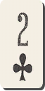         | <a href='https://raw.githubusercontent.com/abdulkadiraktas/rdr3_discoveries/master/useful_info_from_rpfs/textures//ui_minigames/cards/images/card_set_4/clubs_2.png'>Download</a>     |
| clubs_3          | -1641180701  | 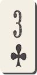         | <a href='https://raw.githubusercontent.com/abdulkadiraktas/rdr3_discoveries/master/useful_info_from_rpfs/textures//ui_minigames/cards/images/card_set_4/clubs_3.png'>Download</a>     |
| clubs_4          | -1343015570  | 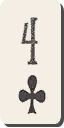         | <a href='https://raw.githubusercontent.com/abdulkadiraktas/rdr3_discoveries/master/useful_info_from_rpfs/textures//ui_minigames/cards/images/card_set_4/clubs_4.png'>Download</a>     |
| clubs_5          | 749219542    |          | <a href='https://raw.githubusercontent.com/abdulkadiraktas/rdr3_discoveries/master/useful_info_from_rpfs/textures//ui_minigames/cards/images/card_set_4/clubs_5.png'>Download</a>     |
| clubs_6          | 1985921602   | 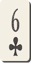         | <a href='https://raw.githubusercontent.com/abdulkadiraktas/rdr3_discoveries/master/useful_info_from_rpfs/textures//ui_minigames/cards/images/card_set_4/clubs_6.png'>Download</a>     |
| clubs_7          | -2022808479  |          | <a href='https://raw.githubusercontent.com/abdulkadiraktas/rdr3_discoveries/master/useful_info_from_rpfs/textures//ui_minigames/cards/images/card_set_4/clubs_7.png'>Download</a>     |
| clubs_8          | 1932999667   |          | <a href='https://raw.githubusercontent.com/abdulkadiraktas/rdr3_discoveries/master/useful_info_from_rpfs/textures//ui_minigames/cards/images/card_set_4/clubs_8.png'>Download</a>     |
| clubs_9          | 1804151899   | 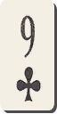         | <a href='https://raw.githubusercontent.com/abdulkadiraktas/rdr3_discoveries/master/useful_info_from_rpfs/textures//ui_minigames/cards/images/card_set_4/clubs_9.png'>Download</a>     |
| clubs_a          | 302512466    |          | <a href='https://raw.githubusercontent.com/abdulkadiraktas/rdr3_discoveries/master/useful_info_from_rpfs/textures//ui_minigames/cards/images/card_set_4/clubs_a.png'>Download</a>     |
| clubs_j          | 2043431141   |          | <a href='https://raw.githubusercontent.com/abdulkadiraktas/rdr3_discoveries/master/useful_info_from_rpfs/textures//ui_minigames/cards/images/card_set_4/clubs_j.png'>Download</a>     |
| clubs_k          | 744762902    |          | <a href='https://raw.githubusercontent.com/abdulkadiraktas/rdr3_discoveries/master/useful_info_from_rpfs/textures//ui_minigames/cards/images/card_set_4/clubs_k.png'>Download</a>     |
| clubs_q          | -286379221   |          | <a href='https://raw.githubusercontent.com/abdulkadiraktas/rdr3_discoveries/master/useful_info_from_rpfs/textures//ui_minigames/cards/images/card_set_4/clubs_q.png'>Download</a>     |
| diamonds_10      | -67534240    |  | <a href='https://raw.githubusercontent.com/abdulkadiraktas/rdr3_discoveries/master/useful_info_from_rpfs/textures//ui_minigames/cards/images/card_set_4/diamonds_10.png'>Download</a> |
| diamonds_2       | -1065483005  |    | <a href='https://raw.githubusercontent.com/abdulkadiraktas/rdr3_discoveries/master/useful_info_from_rpfs/textures//ui_minigames/cards/images/card_set_4/diamonds_2.png'>Download</a>  |
| diamonds_3       | -1985407142  |    | <a href='https://raw.githubusercontent.com/abdulkadiraktas/rdr3_discoveries/master/useful_info_from_rpfs/textures//ui_minigames/cards/images/card_set_4/diamonds_3.png'>Download</a>  |
| diamonds_4       | -1687209242  |    | <a href='https://raw.githubusercontent.com/abdulkadiraktas/rdr3_discoveries/master/useful_info_from_rpfs/textures//ui_minigames/cards/images/card_set_4/diamonds_4.png'>Download</a>  |
| diamonds_5       | 936997816    |    | <a href='https://raw.githubusercontent.com/abdulkadiraktas/rdr3_discoveries/master/useful_info_from_rpfs/textures//ui_minigames/cards/images/card_set_4/diamonds_5.png'>Download</a>  |
| diamonds_6       | 160143133    |    | <a href='https://raw.githubusercontent.com/abdulkadiraktas/rdr3_discoveries/master/useful_info_from_rpfs/textures//ui_minigames/cards/images/card_set_4/diamonds_6.png'>Download</a>  |
| diamonds_7       | -759879311   |    | <a href='https://raw.githubusercontent.com/abdulkadiraktas/rdr3_discoveries/master/useful_info_from_rpfs/textures//ui_minigames/cards/images/card_set_4/diamonds_7.png'>Download</a>  |
| diamonds_8       | 604982308    |    | <a href='https://raw.githubusercontent.com/abdulkadiraktas/rdr3_discoveries/master/useful_info_from_rpfs/textures//ui_minigames/cards/images/card_set_4/diamonds_8.png'>Download</a>  |
| diamonds_9       | 2068085389   |    | <a href='https://raw.githubusercontent.com/abdulkadiraktas/rdr3_discoveries/master/useful_info_from_rpfs/textures//ui_minigames/cards/images/card_set_4/diamonds_9.png'>Download</a>  |
| diamonds_a       | -6192287     |    | <a href='https://raw.githubusercontent.com/abdulkadiraktas/rdr3_discoveries/master/useful_info_from_rpfs/textures//ui_minigames/cards/images/card_set_4/diamonds_a.png'>Download</a>  |
| diamonds_j       | 2135032480   |    | <a href='https://raw.githubusercontent.com/abdulkadiraktas/rdr3_discoveries/master/useful_info_from_rpfs/textures//ui_minigames/cards/images/card_set_4/diamonds_j.png'>Download</a>  |
| diamonds_k       | -184160730   |    | <a href='https://raw.githubusercontent.com/abdulkadiraktas/rdr3_discoveries/master/useful_info_from_rpfs/textures//ui_minigames/cards/images/card_set_4/diamonds_k.png'>Download</a>  |
| diamonds_q       | 450771414    |    | <a href='https://raw.githubusercontent.com/abdulkadiraktas/rdr3_discoveries/master/useful_info_from_rpfs/textures//ui_minigames/cards/images/card_set_4/diamonds_q.png'>Download</a>  |
| hearts_10        | -1236274559  |      | <a href='https://raw.githubusercontent.com/abdulkadiraktas/rdr3_discoveries/master/useful_info_from_rpfs/textures//ui_minigames/cards/images/card_set_4/hearts_10.png'>Download</a>   |
| hearts_2         | 1097864158   |        | <a href='https://raw.githubusercontent.com/abdulkadiraktas/rdr3_discoveries/master/useful_info_from_rpfs/textures//ui_minigames/cards/images/card_set_4/hearts_2.png'>Download</a>    |
| hearts_3         | 1589071468   |        | <a href='https://raw.githubusercontent.com/abdulkadiraktas/rdr3_discoveries/master/useful_info_from_rpfs/textures//ui_minigames/cards/images/card_set_4/hearts_3.png'>Download</a>    |
| hearts_4         | 1809115303   |        | <a href='https://raw.githubusercontent.com/abdulkadiraktas/rdr3_discoveries/master/useful_info_from_rpfs/textures//ui_minigames/cards/images/card_set_4/hearts_4.png'>Download</a>    |
| hearts_5         | 2064844579   |        | <a href='https://raw.githubusercontent.com/abdulkadiraktas/rdr3_discoveries/master/useful_info_from_rpfs/textures//ui_minigames/cards/images/card_set_4/hearts_5.png'>Download</a>    |
| hearts_6         | -2009620116  |        | <a href='https://raw.githubusercontent.com/abdulkadiraktas/rdr3_discoveries/master/useful_info_from_rpfs/textures//ui_minigames/cards/images/card_set_4/hearts_6.png'>Download</a>    |
| hearts_7         | -1517364198  |        | <a href='https://raw.githubusercontent.com/abdulkadiraktas/rdr3_discoveries/master/useful_info_from_rpfs/textures//ui_minigames/cards/images/card_set_4/hearts_7.png'>Download</a>    |
| hearts_8         | -1267303959  |        | <a href='https://raw.githubusercontent.com/abdulkadiraktas/rdr3_discoveries/master/useful_info_from_rpfs/textures//ui_minigames/cards/images/card_set_4/hearts_8.png'>Download</a>    |
| hearts_9         | -1036085891  |        | <a href='https://raw.githubusercontent.com/abdulkadiraktas/rdr3_discoveries/master/useful_info_from_rpfs/textures//ui_minigames/cards/images/card_set_4/hearts_9.png'>Download</a>    |
| hearts_a         | 495471607    |        | <a href='https://raw.githubusercontent.com/abdulkadiraktas/rdr3_discoveries/master/useful_info_from_rpfs/textures//ui_minigames/cards/images/card_set_4/hearts_a.png'>Download</a>    |
| hearts_j         | 1072730319   |        | <a href='https://raw.githubusercontent.com/abdulkadiraktas/rdr3_discoveries/master/useful_info_from_rpfs/textures//ui_minigames/cards/images/card_set_4/hearts_j.png'>Download</a>    |
| hearts_k         | 822342298    |        | <a href='https://raw.githubusercontent.com/abdulkadiraktas/rdr3_discoveries/master/useful_info_from_rpfs/textures//ui_minigames/cards/images/card_set_4/hearts_k.png'>Download</a>    |
| hearts_q         | -866932421   |        | <a href='https://raw.githubusercontent.com/abdulkadiraktas/rdr3_discoveries/master/useful_info_from_rpfs/textures//ui_minigames/cards/images/card_set_4/hearts_q.png'>Download</a>    |
| spades_10        | -688474420   |      | <a href='https://raw.githubusercontent.com/abdulkadiraktas/rdr3_discoveries/master/useful_info_from_rpfs/textures//ui_minigames/cards/images/card_set_4/spades_10.png'>Download</a>   |
| spades_2         | 1791671870   | 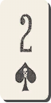       | <a href='https://raw.githubusercontent.com/abdulkadiraktas/rdr3_discoveries/master/useful_info_from_rpfs/textures//ui_minigames/cards/images/card_set_4/spades_2.png'>Download</a>    |
| spades_3         | 1049716172   | 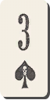       | <a href='https://raw.githubusercontent.com/abdulkadiraktas/rdr3_discoveries/master/useful_info_from_rpfs/textures//ui_minigames/cards/images/card_set_4/spades_3.png'>Download</a>    |
| spades_4         | -652305684   | 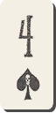       | <a href='https://raw.githubusercontent.com/abdulkadiraktas/rdr3_discoveries/master/useful_info_from_rpfs/textures//ui_minigames/cards/images/card_set_4/spades_4.png'>Download</a>    |
| spades_5         | 566537267    |        | <a href='https://raw.githubusercontent.com/abdulkadiraktas/rdr3_discoveries/master/useful_info_from_rpfs/textures//ui_minigames/cards/images/card_set_4/spades_5.png'>Download</a>    |
| spades_6         | 734904389    | 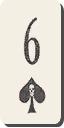       | <a href='https://raw.githubusercontent.com/abdulkadiraktas/rdr3_discoveries/master/useful_info_from_rpfs/textures//ui_minigames/cards/images/card_set_4/spades_6.png'>Download</a>    |
| spades_7         | -1400094260  |        | <a href='https://raw.githubusercontent.com/abdulkadiraktas/rdr3_discoveries/master/useful_info_from_rpfs/textures//ui_minigames/cards/images/card_set_4/spades_7.png'>Download</a>    |
| spades_8         | -1121590529  |        | <a href='https://raw.githubusercontent.com/abdulkadiraktas/rdr3_discoveries/master/useful_info_from_rpfs/textures//ui_minigames/cards/images/card_set_4/spades_8.png'>Download</a>    |
| spades_9         | -1880389493  | 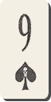       | <a href='https://raw.githubusercontent.com/abdulkadiraktas/rdr3_discoveries/master/useful_info_from_rpfs/textures//ui_minigames/cards/images/card_set_4/spades_9.png'>Download</a>    |
| spades_a         | 943085858    |        | <a href='https://raw.githubusercontent.com/abdulkadiraktas/rdr3_discoveries/master/useful_info_from_rpfs/textures//ui_minigames/cards/images/card_set_4/spades_a.png'>Download</a>    |
| spades_j         | -2046036780  |        | <a href='https://raw.githubusercontent.com/abdulkadiraktas/rdr3_discoveries/master/useful_info_from_rpfs/textures//ui_minigames/cards/images/card_set_4/spades_j.png'>Download</a>    |
| spades_k         | 1122004606   |        | <a href='https://raw.githubusercontent.com/abdulkadiraktas/rdr3_discoveries/master/useful_info_from_rpfs/textures//ui_minigames/cards/images/card_set_4/spades_k.png'>Download</a>    |
| spades_q         | -1842606824  |        | <a href='https://raw.githubusercontent.com/abdulkadiraktas/rdr3_discoveries/master/useful_info_from_rpfs/textures//ui_minigames/cards/images/card_set_4/spades_q.png'>Download</a>    |

<h2>card_set_5  (-1651983130)</h2>

| Texture hashname | Texture hash | Texture example                                   | Download Image                                                                                                                                                                        |
| ---------------- | ------------ | ------------------------------------------------- | ------------------------------------------------------------------------------------------------------------------------------------------------------------------------------------- |
| back             | 927041140    |                | <a href='https://raw.githubusercontent.com/abdulkadiraktas/rdr3_discoveries/master/useful_info_from_rpfs/textures//ui_minigames/cards/images/card_set_5/back.png'>Download</a>        |
| clubs_10         | 181192003    |        | <a href='https://raw.githubusercontent.com/abdulkadiraktas/rdr3_discoveries/master/useful_info_from_rpfs/textures//ui_minigames/cards/images/card_set_5/clubs_10.png'>Download</a>    |
| clubs_2          | -750453743   |          | <a href='https://raw.githubusercontent.com/abdulkadiraktas/rdr3_discoveries/master/useful_info_from_rpfs/textures//ui_minigames/cards/images/card_set_5/clubs_2.png'>Download</a>     |
| clubs_3          | -1641180701  |          | <a href='https://raw.githubusercontent.com/abdulkadiraktas/rdr3_discoveries/master/useful_info_from_rpfs/textures//ui_minigames/cards/images/card_set_5/clubs_3.png'>Download</a>     |
| clubs_4          | -1343015570  |          | <a href='https://raw.githubusercontent.com/abdulkadiraktas/rdr3_discoveries/master/useful_info_from_rpfs/textures//ui_minigames/cards/images/card_set_5/clubs_4.png'>Download</a>     |
| clubs_5          | 749219542    |          | <a href='https://raw.githubusercontent.com/abdulkadiraktas/rdr3_discoveries/master/useful_info_from_rpfs/textures//ui_minigames/cards/images/card_set_5/clubs_5.png'>Download</a>     |
| clubs_6          | 1985921602   |          | <a href='https://raw.githubusercontent.com/abdulkadiraktas/rdr3_discoveries/master/useful_info_from_rpfs/textures//ui_minigames/cards/images/card_set_5/clubs_6.png'>Download</a>     |
| clubs_7          | -2022808479  |          | <a href='https://raw.githubusercontent.com/abdulkadiraktas/rdr3_discoveries/master/useful_info_from_rpfs/textures//ui_minigames/cards/images/card_set_5/clubs_7.png'>Download</a>     |
| clubs_8          | 1932999667   |          | <a href='https://raw.githubusercontent.com/abdulkadiraktas/rdr3_discoveries/master/useful_info_from_rpfs/textures//ui_minigames/cards/images/card_set_5/clubs_8.png'>Download</a>     |
| clubs_9          | 1804151899   |          | <a href='https://raw.githubusercontent.com/abdulkadiraktas/rdr3_discoveries/master/useful_info_from_rpfs/textures//ui_minigames/cards/images/card_set_5/clubs_9.png'>Download</a>     |
| clubs_a          | 302512466    |          | <a href='https://raw.githubusercontent.com/abdulkadiraktas/rdr3_discoveries/master/useful_info_from_rpfs/textures//ui_minigames/cards/images/card_set_5/clubs_a.png'>Download</a>     |
| clubs_j          | 2043431141   |          | <a href='https://raw.githubusercontent.com/abdulkadiraktas/rdr3_discoveries/master/useful_info_from_rpfs/textures//ui_minigames/cards/images/card_set_5/clubs_j.png'>Download</a>     |
| clubs_k          | 744762902    |          | <a href='https://raw.githubusercontent.com/abdulkadiraktas/rdr3_discoveries/master/useful_info_from_rpfs/textures//ui_minigames/cards/images/card_set_5/clubs_k.png'>Download</a>     |
| clubs_q          | -286379221   |          | <a href='https://raw.githubusercontent.com/abdulkadiraktas/rdr3_discoveries/master/useful_info_from_rpfs/textures//ui_minigames/cards/images/card_set_5/clubs_q.png'>Download</a>     |
| diamonds_10      | -67534240    |  | <a href='https://raw.githubusercontent.com/abdulkadiraktas/rdr3_discoveries/master/useful_info_from_rpfs/textures//ui_minigames/cards/images/card_set_5/diamonds_10.png'>Download</a> |
| diamonds_2       | -1065483005  |    | <a href='https://raw.githubusercontent.com/abdulkadiraktas/rdr3_discoveries/master/useful_info_from_rpfs/textures//ui_minigames/cards/images/card_set_5/diamonds_2.png'>Download</a>  |
| diamonds_3       | -1985407142  |    | <a href='https://raw.githubusercontent.com/abdulkadiraktas/rdr3_discoveries/master/useful_info_from_rpfs/textures//ui_minigames/cards/images/card_set_5/diamonds_3.png'>Download</a>  |
| diamonds_4       | -1687209242  |    | <a href='https://raw.githubusercontent.com/abdulkadiraktas/rdr3_discoveries/master/useful_info_from_rpfs/textures//ui_minigames/cards/images/card_set_5/diamonds_4.png'>Download</a>  |
| diamonds_5       | 936997816    |    | <a href='https://raw.githubusercontent.com/abdulkadiraktas/rdr3_discoveries/master/useful_info_from_rpfs/textures//ui_minigames/cards/images/card_set_5/diamonds_5.png'>Download</a>  |
| diamonds_6       | 160143133    |    | <a href='https://raw.githubusercontent.com/abdulkadiraktas/rdr3_discoveries/master/useful_info_from_rpfs/textures//ui_minigames/cards/images/card_set_5/diamonds_6.png'>Download</a>  |
| diamonds_7       | -759879311   |    | <a href='https://raw.githubusercontent.com/abdulkadiraktas/rdr3_discoveries/master/useful_info_from_rpfs/textures//ui_minigames/cards/images/card_set_5/diamonds_7.png'>Download</a>  |
| diamonds_8       | 604982308    |    | <a href='https://raw.githubusercontent.com/abdulkadiraktas/rdr3_discoveries/master/useful_info_from_rpfs/textures//ui_minigames/cards/images/card_set_5/diamonds_8.png'>Download</a>  |
| diamonds_9       | 2068085389   |    | <a href='https://raw.githubusercontent.com/abdulkadiraktas/rdr3_discoveries/master/useful_info_from_rpfs/textures//ui_minigames/cards/images/card_set_5/diamonds_9.png'>Download</a>  |
| diamonds_a       | -6192287     |    | <a href='https://raw.githubusercontent.com/abdulkadiraktas/rdr3_discoveries/master/useful_info_from_rpfs/textures//ui_minigames/cards/images/card_set_5/diamonds_a.png'>Download</a>  |
| diamonds_j       | 2135032480   |    | <a href='https://raw.githubusercontent.com/abdulkadiraktas/rdr3_discoveries/master/useful_info_from_rpfs/textures//ui_minigames/cards/images/card_set_5/diamonds_j.png'>Download</a>  |
| diamonds_k       | -184160730   |    | <a href='https://raw.githubusercontent.com/abdulkadiraktas/rdr3_discoveries/master/useful_info_from_rpfs/textures//ui_minigames/cards/images/card_set_5/diamonds_k.png'>Download</a>  |
| diamonds_q       | 450771414    |    | <a href='https://raw.githubusercontent.com/abdulkadiraktas/rdr3_discoveries/master/useful_info_from_rpfs/textures//ui_minigames/cards/images/card_set_5/diamonds_q.png'>Download</a>  |
| hearts_10        | -1236274559  |      | <a href='https://raw.githubusercontent.com/abdulkadiraktas/rdr3_discoveries/master/useful_info_from_rpfs/textures//ui_minigames/cards/images/card_set_5/hearts_10.png'>Download</a>   |
| hearts_2         | 1097864158   |        | <a href='https://raw.githubusercontent.com/abdulkadiraktas/rdr3_discoveries/master/useful_info_from_rpfs/textures//ui_minigames/cards/images/card_set_5/hearts_2.png'>Download</a>    |
| hearts_3         | 1589071468   |        | <a href='https://raw.githubusercontent.com/abdulkadiraktas/rdr3_discoveries/master/useful_info_from_rpfs/textures//ui_minigames/cards/images/card_set_5/hearts_3.png'>Download</a>    |
| hearts_4         | 1809115303   |        | <a href='https://raw.githubusercontent.com/abdulkadiraktas/rdr3_discoveries/master/useful_info_from_rpfs/textures//ui_minigames/cards/images/card_set_5/hearts_4.png'>Download</a>    |
| hearts_5         | 2064844579   |        | <a href='https://raw.githubusercontent.com/abdulkadiraktas/rdr3_discoveries/master/useful_info_from_rpfs/textures//ui_minigames/cards/images/card_set_5/hearts_5.png'>Download</a>    |
| hearts_6         | -2009620116  |        | <a href='https://raw.githubusercontent.com/abdulkadiraktas/rdr3_discoveries/master/useful_info_from_rpfs/textures//ui_minigames/cards/images/card_set_5/hearts_6.png'>Download</a>    |
| hearts_7         | -1517364198  |        | <a href='https://raw.githubusercontent.com/abdulkadiraktas/rdr3_discoveries/master/useful_info_from_rpfs/textures//ui_minigames/cards/images/card_set_5/hearts_7.png'>Download</a>    |
| hearts_8         | -1267303959  |        | <a href='https://raw.githubusercontent.com/abdulkadiraktas/rdr3_discoveries/master/useful_info_from_rpfs/textures//ui_minigames/cards/images/card_set_5/hearts_8.png'>Download</a>    |
| hearts_9         | -1036085891  |        | <a href='https://raw.githubusercontent.com/abdulkadiraktas/rdr3_discoveries/master/useful_info_from_rpfs/textures//ui_minigames/cards/images/card_set_5/hearts_9.png'>Download</a>    |
| hearts_a         | 495471607    |        | <a href='https://raw.githubusercontent.com/abdulkadiraktas/rdr3_discoveries/master/useful_info_from_rpfs/textures//ui_minigames/cards/images/card_set_5/hearts_a.png'>Download</a>    |
| hearts_j         | 1072730319   |        | <a href='https://raw.githubusercontent.com/abdulkadiraktas/rdr3_discoveries/master/useful_info_from_rpfs/textures//ui_minigames/cards/images/card_set_5/hearts_j.png'>Download</a>    |
| hearts_k         | 822342298    |        | <a href='https://raw.githubusercontent.com/abdulkadiraktas/rdr3_discoveries/master/useful_info_from_rpfs/textures//ui_minigames/cards/images/card_set_5/hearts_k.png'>Download</a>    |
| hearts_q         | -866932421   |        | <a href='https://raw.githubusercontent.com/abdulkadiraktas/rdr3_discoveries/master/useful_info_from_rpfs/textures//ui_minigames/cards/images/card_set_5/hearts_q.png'>Download</a>    |
| spades_10        | -688474420   |      | <a href='https://raw.githubusercontent.com/abdulkadiraktas/rdr3_discoveries/master/useful_info_from_rpfs/textures//ui_minigames/cards/images/card_set_5/spades_10.png'>Download</a>   |
| spades_2         | 1791671870   |        | <a href='https://raw.githubusercontent.com/abdulkadiraktas/rdr3_discoveries/master/useful_info_from_rpfs/textures//ui_minigames/cards/images/card_set_5/spades_2.png'>Download</a>    |
| spades_3         | 1049716172   |        | <a href='https://raw.githubusercontent.com/abdulkadiraktas/rdr3_discoveries/master/useful_info_from_rpfs/textures//ui_minigames/cards/images/card_set_5/spades_3.png'>Download</a>    |
| spades_4         | -652305684   |        | <a href='https://raw.githubusercontent.com/abdulkadiraktas/rdr3_discoveries/master/useful_info_from_rpfs/textures//ui_minigames/cards/images/card_set_5/spades_4.png'>Download</a>    |
| spades_5         | 566537267    |        | <a href='https://raw.githubusercontent.com/abdulkadiraktas/rdr3_discoveries/master/useful_info_from_rpfs/textures//ui_minigames/cards/images/card_set_5/spades_5.png'>Download</a>    |
| spades_6         | 734904389    |        | <a href='https://raw.githubusercontent.com/abdulkadiraktas/rdr3_discoveries/master/useful_info_from_rpfs/textures//ui_minigames/cards/images/card_set_5/spades_6.png'>Download</a>    |
| spades_7         | -1400094260  |        | <a href='https://raw.githubusercontent.com/abdulkadiraktas/rdr3_discoveries/master/useful_info_from_rpfs/textures//ui_minigames/cards/images/card_set_5/spades_7.png'>Download</a>    |
| spades_8         | -1121590529  |        | <a href='https://raw.githubusercontent.com/abdulkadiraktas/rdr3_discoveries/master/useful_info_from_rpfs/textures//ui_minigames/cards/images/card_set_5/spades_8.png'>Download</a>    |
| spades_9         | -1880389493  |        | <a href='https://raw.githubusercontent.com/abdulkadiraktas/rdr3_discoveries/master/useful_info_from_rpfs/textures//ui_minigames/cards/images/card_set_5/spades_9.png'>Download</a>    |
| spades_a         | 943085858    |        | <a href='https://raw.githubusercontent.com/abdulkadiraktas/rdr3_discoveries/master/useful_info_from_rpfs/textures//ui_minigames/cards/images/card_set_5/spades_a.png'>Download</a>    |
| spades_j         | -2046036780  |        | <a href='https://raw.githubusercontent.com/abdulkadiraktas/rdr3_discoveries/master/useful_info_from_rpfs/textures//ui_minigames/cards/images/card_set_5/spades_j.png'>Download</a>    |
| spades_k         | 1122004606   |        | <a href='https://raw.githubusercontent.com/abdulkadiraktas/rdr3_discoveries/master/useful_info_from_rpfs/textures//ui_minigames/cards/images/card_set_5/spades_k.png'>Download</a>    |
| spades_q         | -1842606824  |        | <a href='https://raw.githubusercontent.com/abdulkadiraktas/rdr3_discoveries/master/useful_info_from_rpfs/textures//ui_minigames/cards/images/card_set_5/spades_q.png'>Download</a>    |

<h2>card_set_6  (938340790)</h2>

| Texture hashname | Texture hash | Texture example                                   | Download Image                                                                                                                                                                        |
| ---------------- | ------------ | ------------------------------------------------- | ------------------------------------------------------------------------------------------------------------------------------------------------------------------------------------- |
| back             | 927041140    |                | <a href='https://raw.githubusercontent.com/abdulkadiraktas/rdr3_discoveries/master/useful_info_from_rpfs/textures//ui_minigames/cards/images/card_set_6/back.png'>Download</a>        |
| clubs_10         | 181192003    |        | <a href='https://raw.githubusercontent.com/abdulkadiraktas/rdr3_discoveries/master/useful_info_from_rpfs/textures//ui_minigames/cards/images/card_set_6/clubs_10.png'>Download</a>    |
| clubs_2          | -750453743   |          | <a href='https://raw.githubusercontent.com/abdulkadiraktas/rdr3_discoveries/master/useful_info_from_rpfs/textures//ui_minigames/cards/images/card_set_6/clubs_2.png'>Download</a>     |
| clubs_3          | -1641180701  |          | <a href='https://raw.githubusercontent.com/abdulkadiraktas/rdr3_discoveries/master/useful_info_from_rpfs/textures//ui_minigames/cards/images/card_set_6/clubs_3.png'>Download</a>     |
| clubs_4          | -1343015570  |          | <a href='https://raw.githubusercontent.com/abdulkadiraktas/rdr3_discoveries/master/useful_info_from_rpfs/textures//ui_minigames/cards/images/card_set_6/clubs_4.png'>Download</a>     |
| clubs_5          | 749219542    |          | <a href='https://raw.githubusercontent.com/abdulkadiraktas/rdr3_discoveries/master/useful_info_from_rpfs/textures//ui_minigames/cards/images/card_set_6/clubs_5.png'>Download</a>     |
| clubs_6          | 1985921602   |          | <a href='https://raw.githubusercontent.com/abdulkadiraktas/rdr3_discoveries/master/useful_info_from_rpfs/textures//ui_minigames/cards/images/card_set_6/clubs_6.png'>Download</a>     |
| clubs_7          | -2022808479  |          | <a href='https://raw.githubusercontent.com/abdulkadiraktas/rdr3_discoveries/master/useful_info_from_rpfs/textures//ui_minigames/cards/images/card_set_6/clubs_7.png'>Download</a>     |
| clubs_8          | 1932999667   |          | <a href='https://raw.githubusercontent.com/abdulkadiraktas/rdr3_discoveries/master/useful_info_from_rpfs/textures//ui_minigames/cards/images/card_set_6/clubs_8.png'>Download</a>     |
| clubs_9          | 1804151899   |          | <a href='https://raw.githubusercontent.com/abdulkadiraktas/rdr3_discoveries/master/useful_info_from_rpfs/textures//ui_minigames/cards/images/card_set_6/clubs_9.png'>Download</a>     |
| clubs_a          | 302512466    |          | <a href='https://raw.githubusercontent.com/abdulkadiraktas/rdr3_discoveries/master/useful_info_from_rpfs/textures//ui_minigames/cards/images/card_set_6/clubs_a.png'>Download</a>     |
| clubs_j          | 2043431141   |          | <a href='https://raw.githubusercontent.com/abdulkadiraktas/rdr3_discoveries/master/useful_info_from_rpfs/textures//ui_minigames/cards/images/card_set_6/clubs_j.png'>Download</a>     |
| clubs_k          | 744762902    |          | <a href='https://raw.githubusercontent.com/abdulkadiraktas/rdr3_discoveries/master/useful_info_from_rpfs/textures//ui_minigames/cards/images/card_set_6/clubs_k.png'>Download</a>     |
| clubs_q          | -286379221   |          | <a href='https://raw.githubusercontent.com/abdulkadiraktas/rdr3_discoveries/master/useful_info_from_rpfs/textures//ui_minigames/cards/images/card_set_6/clubs_q.png'>Download</a>     |
| diamonds_10      | -67534240    |  | <a href='https://raw.githubusercontent.com/abdulkadiraktas/rdr3_discoveries/master/useful_info_from_rpfs/textures//ui_minigames/cards/images/card_set_6/diamonds_10.png'>Download</a> |
| diamonds_2       | -1065483005  |    | <a href='https://raw.githubusercontent.com/abdulkadiraktas/rdr3_discoveries/master/useful_info_from_rpfs/textures//ui_minigames/cards/images/card_set_6/diamonds_2.png'>Download</a>  |
| diamonds_3       | -1985407142  |    | <a href='https://raw.githubusercontent.com/abdulkadiraktas/rdr3_discoveries/master/useful_info_from_rpfs/textures//ui_minigames/cards/images/card_set_6/diamonds_3.png'>Download</a>  |
| diamonds_4       | -1687209242  |    | <a href='https://raw.githubusercontent.com/abdulkadiraktas/rdr3_discoveries/master/useful_info_from_rpfs/textures//ui_minigames/cards/images/card_set_6/diamonds_4.png'>Download</a>  |
| diamonds_5       | 936997816    |    | <a href='https://raw.githubusercontent.com/abdulkadiraktas/rdr3_discoveries/master/useful_info_from_rpfs/textures//ui_minigames/cards/images/card_set_6/diamonds_5.png'>Download</a>  |
| diamonds_6       | 160143133    |    | <a href='https://raw.githubusercontent.com/abdulkadiraktas/rdr3_discoveries/master/useful_info_from_rpfs/textures//ui_minigames/cards/images/card_set_6/diamonds_6.png'>Download</a>  |
| diamonds_7       | -759879311   |    | <a href='https://raw.githubusercontent.com/abdulkadiraktas/rdr3_discoveries/master/useful_info_from_rpfs/textures//ui_minigames/cards/images/card_set_6/diamonds_7.png'>Download</a>  |
| diamonds_8       | 604982308    |    | <a href='https://raw.githubusercontent.com/abdulkadiraktas/rdr3_discoveries/master/useful_info_from_rpfs/textures//ui_minigames/cards/images/card_set_6/diamonds_8.png'>Download</a>  |
| diamonds_9       | 2068085389   |    | <a href='https://raw.githubusercontent.com/abdulkadiraktas/rdr3_discoveries/master/useful_info_from_rpfs/textures//ui_minigames/cards/images/card_set_6/diamonds_9.png'>Download</a>  |
| diamonds_a       | -6192287     |    | <a href='https://raw.githubusercontent.com/abdulkadiraktas/rdr3_discoveries/master/useful_info_from_rpfs/textures//ui_minigames/cards/images/card_set_6/diamonds_a.png'>Download</a>  |
| diamonds_j       | 2135032480   |    | <a href='https://raw.githubusercontent.com/abdulkadiraktas/rdr3_discoveries/master/useful_info_from_rpfs/textures//ui_minigames/cards/images/card_set_6/diamonds_j.png'>Download</a>  |
| diamonds_k       | -184160730   |    | <a href='https://raw.githubusercontent.com/abdulkadiraktas/rdr3_discoveries/master/useful_info_from_rpfs/textures//ui_minigames/cards/images/card_set_6/diamonds_k.png'>Download</a>  |
| diamonds_q       | 450771414    |    | <a href='https://raw.githubusercontent.com/abdulkadiraktas/rdr3_discoveries/master/useful_info_from_rpfs/textures//ui_minigames/cards/images/card_set_6/diamonds_q.png'>Download</a>  |
| hearts_10        | -1236274559  |      | <a href='https://raw.githubusercontent.com/abdulkadiraktas/rdr3_discoveries/master/useful_info_from_rpfs/textures//ui_minigames/cards/images/card_set_6/hearts_10.png'>Download</a>   |
| hearts_2         | 1097864158   |        | <a href='https://raw.githubusercontent.com/abdulkadiraktas/rdr3_discoveries/master/useful_info_from_rpfs/textures//ui_minigames/cards/images/card_set_6/hearts_2.png'>Download</a>    |
| hearts_3         | 1589071468   |        | <a href='https://raw.githubusercontent.com/abdulkadiraktas/rdr3_discoveries/master/useful_info_from_rpfs/textures//ui_minigames/cards/images/card_set_6/hearts_3.png'>Download</a>    |
| hearts_4         | 1809115303   |        | <a href='https://raw.githubusercontent.com/abdulkadiraktas/rdr3_discoveries/master/useful_info_from_rpfs/textures//ui_minigames/cards/images/card_set_6/hearts_4.png'>Download</a>    |
| hearts_5         | 2064844579   |        | <a href='https://raw.githubusercontent.com/abdulkadiraktas/rdr3_discoveries/master/useful_info_from_rpfs/textures//ui_minigames/cards/images/card_set_6/hearts_5.png'>Download</a>    |
| hearts_6         | -2009620116  |        | <a href='https://raw.githubusercontent.com/abdulkadiraktas/rdr3_discoveries/master/useful_info_from_rpfs/textures//ui_minigames/cards/images/card_set_6/hearts_6.png'>Download</a>    |
| hearts_7         | -1517364198  |        | <a href='https://raw.githubusercontent.com/abdulkadiraktas/rdr3_discoveries/master/useful_info_from_rpfs/textures//ui_minigames/cards/images/card_set_6/hearts_7.png'>Download</a>    |
| hearts_8         | -1267303959  |        | <a href='https://raw.githubusercontent.com/abdulkadiraktas/rdr3_discoveries/master/useful_info_from_rpfs/textures//ui_minigames/cards/images/card_set_6/hearts_8.png'>Download</a>    |
| hearts_9         | -1036085891  |        | <a href='https://raw.githubusercontent.com/abdulkadiraktas/rdr3_discoveries/master/useful_info_from_rpfs/textures//ui_minigames/cards/images/card_set_6/hearts_9.png'>Download</a>    |
| hearts_a         | 495471607    |        | <a href='https://raw.githubusercontent.com/abdulkadiraktas/rdr3_discoveries/master/useful_info_from_rpfs/textures//ui_minigames/cards/images/card_set_6/hearts_a.png'>Download</a>    |
| hearts_j         | 1072730319   |        | <a href='https://raw.githubusercontent.com/abdulkadiraktas/rdr3_discoveries/master/useful_info_from_rpfs/textures//ui_minigames/cards/images/card_set_6/hearts_j.png'>Download</a>    |
| hearts_k         | 822342298    |        | <a href='https://raw.githubusercontent.com/abdulkadiraktas/rdr3_discoveries/master/useful_info_from_rpfs/textures//ui_minigames/cards/images/card_set_6/hearts_k.png'>Download</a>    |
| hearts_q         | -866932421   |        | <a href='https://raw.githubusercontent.com/abdulkadiraktas/rdr3_discoveries/master/useful_info_from_rpfs/textures//ui_minigames/cards/images/card_set_6/hearts_q.png'>Download</a>    |
| spades_10        | -688474420   |      | <a href='https://raw.githubusercontent.com/abdulkadiraktas/rdr3_discoveries/master/useful_info_from_rpfs/textures//ui_minigames/cards/images/card_set_6/spades_10.png'>Download</a>   |
| spades_2         | 1791671870   |        | <a href='https://raw.githubusercontent.com/abdulkadiraktas/rdr3_discoveries/master/useful_info_from_rpfs/textures//ui_minigames/cards/images/card_set_6/spades_2.png'>Download</a>    |
| spades_3         | 1049716172   |        | <a href='https://raw.githubusercontent.com/abdulkadiraktas/rdr3_discoveries/master/useful_info_from_rpfs/textures//ui_minigames/cards/images/card_set_6/spades_3.png'>Download</a>    |
| spades_4         | -652305684   |        | <a href='https://raw.githubusercontent.com/abdulkadiraktas/rdr3_discoveries/master/useful_info_from_rpfs/textures//ui_minigames/cards/images/card_set_6/spades_4.png'>Download</a>    |
| spades_5         | 566537267    |        | <a href='https://raw.githubusercontent.com/abdulkadiraktas/rdr3_discoveries/master/useful_info_from_rpfs/textures//ui_minigames/cards/images/card_set_6/spades_5.png'>Download</a>    |
| spades_6         | 734904389    |        | <a href='https://raw.githubusercontent.com/abdulkadiraktas/rdr3_discoveries/master/useful_info_from_rpfs/textures//ui_minigames/cards/images/card_set_6/spades_6.png'>Download</a>    |
| spades_7         | -1400094260  |        | <a href='https://raw.githubusercontent.com/abdulkadiraktas/rdr3_discoveries/master/useful_info_from_rpfs/textures//ui_minigames/cards/images/card_set_6/spades_7.png'>Download</a>    |
| spades_8         | -1121590529  |        | <a href='https://raw.githubusercontent.com/abdulkadiraktas/rdr3_discoveries/master/useful_info_from_rpfs/textures//ui_minigames/cards/images/card_set_6/spades_8.png'>Download</a>    |
| spades_9         | -1880389493  |        | <a href='https://raw.githubusercontent.com/abdulkadiraktas/rdr3_discoveries/master/useful_info_from_rpfs/textures//ui_minigames/cards/images/card_set_6/spades_9.png'>Download</a>    |
| spades_a         | 943085858    |        | <a href='https://raw.githubusercontent.com/abdulkadiraktas/rdr3_discoveries/master/useful_info_from_rpfs/textures//ui_minigames/cards/images/card_set_6/spades_a.png'>Download</a>    |
| spades_j         | -2046036780  |        | <a href='https://raw.githubusercontent.com/abdulkadiraktas/rdr3_discoveries/master/useful_info_from_rpfs/textures//ui_minigames/cards/images/card_set_6/spades_j.png'>Download</a>    |
| spades_k         | 1122004606   |        | <a href='https://raw.githubusercontent.com/abdulkadiraktas/rdr3_discoveries/master/useful_info_from_rpfs/textures//ui_minigames/cards/images/card_set_6/spades_k.png'>Download</a>    |
| spades_q         | -1842606824  |        | <a href='https://raw.githubusercontent.com/abdulkadiraktas/rdr3_discoveries/master/useful_info_from_rpfs/textures//ui_minigames/cards/images/card_set_6/spades_q.png'>Download</a>    |

<h2>card_set_7  (1158941698)</h2>

| Texture hashname | Texture hash | Texture example                                   | Download Image                                                                                                                                                                        |
| ---------------- | ------------ | ------------------------------------------------- | ------------------------------------------------------------------------------------------------------------------------------------------------------------------------------------- |
| back             | 927041140    |                | <a href='https://raw.githubusercontent.com/abdulkadiraktas/rdr3_discoveries/master/useful_info_from_rpfs/textures//ui_minigames/cards/images/card_set_7/back.png'>Download</a>        |
| clubs_10         | 181192003    |        | <a href='https://raw.githubusercontent.com/abdulkadiraktas/rdr3_discoveries/master/useful_info_from_rpfs/textures//ui_minigames/cards/images/card_set_7/clubs_10.png'>Download</a>    |
| clubs_2          | -750453743   |          | <a href='https://raw.githubusercontent.com/abdulkadiraktas/rdr3_discoveries/master/useful_info_from_rpfs/textures//ui_minigames/cards/images/card_set_7/clubs_2.png'>Download</a>     |
| clubs_3          | -1641180701  |          | <a href='https://raw.githubusercontent.com/abdulkadiraktas/rdr3_discoveries/master/useful_info_from_rpfs/textures//ui_minigames/cards/images/card_set_7/clubs_3.png'>Download</a>     |
| clubs_4          | -1343015570  |          | <a href='https://raw.githubusercontent.com/abdulkadiraktas/rdr3_discoveries/master/useful_info_from_rpfs/textures//ui_minigames/cards/images/card_set_7/clubs_4.png'>Download</a>     |
| clubs_5          | 749219542    |          | <a href='https://raw.githubusercontent.com/abdulkadiraktas/rdr3_discoveries/master/useful_info_from_rpfs/textures//ui_minigames/cards/images/card_set_7/clubs_5.png'>Download</a>     |
| clubs_6          | 1985921602   |          | <a href='https://raw.githubusercontent.com/abdulkadiraktas/rdr3_discoveries/master/useful_info_from_rpfs/textures//ui_minigames/cards/images/card_set_7/clubs_6.png'>Download</a>     |
| clubs_7          | -2022808479  |          | <a href='https://raw.githubusercontent.com/abdulkadiraktas/rdr3_discoveries/master/useful_info_from_rpfs/textures//ui_minigames/cards/images/card_set_7/clubs_7.png'>Download</a>     |
| clubs_8          | 1932999667   |          | <a href='https://raw.githubusercontent.com/abdulkadiraktas/rdr3_discoveries/master/useful_info_from_rpfs/textures//ui_minigames/cards/images/card_set_7/clubs_8.png'>Download</a>     |
| clubs_9          | 1804151899   |          | <a href='https://raw.githubusercontent.com/abdulkadiraktas/rdr3_discoveries/master/useful_info_from_rpfs/textures//ui_minigames/cards/images/card_set_7/clubs_9.png'>Download</a>     |
| clubs_a          | 302512466    |          | <a href='https://raw.githubusercontent.com/abdulkadiraktas/rdr3_discoveries/master/useful_info_from_rpfs/textures//ui_minigames/cards/images/card_set_7/clubs_a.png'>Download</a>     |
| clubs_j          | 2043431141   |          | <a href='https://raw.githubusercontent.com/abdulkadiraktas/rdr3_discoveries/master/useful_info_from_rpfs/textures//ui_minigames/cards/images/card_set_7/clubs_j.png'>Download</a>     |
| clubs_k          | 744762902    |          | <a href='https://raw.githubusercontent.com/abdulkadiraktas/rdr3_discoveries/master/useful_info_from_rpfs/textures//ui_minigames/cards/images/card_set_7/clubs_k.png'>Download</a>     |
| clubs_q          | -286379221   |          | <a href='https://raw.githubusercontent.com/abdulkadiraktas/rdr3_discoveries/master/useful_info_from_rpfs/textures//ui_minigames/cards/images/card_set_7/clubs_q.png'>Download</a>     |
| diamonds_10      | -67534240    |  | <a href='https://raw.githubusercontent.com/abdulkadiraktas/rdr3_discoveries/master/useful_info_from_rpfs/textures//ui_minigames/cards/images/card_set_7/diamonds_10.png'>Download</a> |
| diamonds_2       | -1065483005  |    | <a href='https://raw.githubusercontent.com/abdulkadiraktas/rdr3_discoveries/master/useful_info_from_rpfs/textures//ui_minigames/cards/images/card_set_7/diamonds_2.png'>Download</a>  |
| diamonds_3       | -1985407142  |    | <a href='https://raw.githubusercontent.com/abdulkadiraktas/rdr3_discoveries/master/useful_info_from_rpfs/textures//ui_minigames/cards/images/card_set_7/diamonds_3.png'>Download</a>  |
| diamonds_4       | -1687209242  |    | <a href='https://raw.githubusercontent.com/abdulkadiraktas/rdr3_discoveries/master/useful_info_from_rpfs/textures//ui_minigames/cards/images/card_set_7/diamonds_4.png'>Download</a>  |
| diamonds_5       | 936997816    |    | <a href='https://raw.githubusercontent.com/abdulkadiraktas/rdr3_discoveries/master/useful_info_from_rpfs/textures//ui_minigames/cards/images/card_set_7/diamonds_5.png'>Download</a>  |
| diamonds_6       | 160143133    |    | <a href='https://raw.githubusercontent.com/abdulkadiraktas/rdr3_discoveries/master/useful_info_from_rpfs/textures//ui_minigames/cards/images/card_set_7/diamonds_6.png'>Download</a>  |
| diamonds_7       | -759879311   |    | <a href='https://raw.githubusercontent.com/abdulkadiraktas/rdr3_discoveries/master/useful_info_from_rpfs/textures//ui_minigames/cards/images/card_set_7/diamonds_7.png'>Download</a>  |
| diamonds_8       | 604982308    |    | <a href='https://raw.githubusercontent.com/abdulkadiraktas/rdr3_discoveries/master/useful_info_from_rpfs/textures//ui_minigames/cards/images/card_set_7/diamonds_8.png'>Download</a>  |
| diamonds_9       | 2068085389   |    | <a href='https://raw.githubusercontent.com/abdulkadiraktas/rdr3_discoveries/master/useful_info_from_rpfs/textures//ui_minigames/cards/images/card_set_7/diamonds_9.png'>Download</a>  |
| diamonds_a       | -6192287     |    | <a href='https://raw.githubusercontent.com/abdulkadiraktas/rdr3_discoveries/master/useful_info_from_rpfs/textures//ui_minigames/cards/images/card_set_7/diamonds_a.png'>Download</a>  |
| diamonds_j       | 2135032480   |    | <a href='https://raw.githubusercontent.com/abdulkadiraktas/rdr3_discoveries/master/useful_info_from_rpfs/textures//ui_minigames/cards/images/card_set_7/diamonds_j.png'>Download</a>  |
| diamonds_k       | -184160730   |    | <a href='https://raw.githubusercontent.com/abdulkadiraktas/rdr3_discoveries/master/useful_info_from_rpfs/textures//ui_minigames/cards/images/card_set_7/diamonds_k.png'>Download</a>  |
| diamonds_q       | 450771414    |    | <a href='https://raw.githubusercontent.com/abdulkadiraktas/rdr3_discoveries/master/useful_info_from_rpfs/textures//ui_minigames/cards/images/card_set_7/diamonds_q.png'>Download</a>  |
| hearts_10        | -1236274559  |      | <a href='https://raw.githubusercontent.com/abdulkadiraktas/rdr3_discoveries/master/useful_info_from_rpfs/textures//ui_minigames/cards/images/card_set_7/hearts_10.png'>Download</a>   |
| hearts_2         | 1097864158   |        | <a href='https://raw.githubusercontent.com/abdulkadiraktas/rdr3_discoveries/master/useful_info_from_rpfs/textures//ui_minigames/cards/images/card_set_7/hearts_2.png'>Download</a>    |
| hearts_3         | 1589071468   |        | <a href='https://raw.githubusercontent.com/abdulkadiraktas/rdr3_discoveries/master/useful_info_from_rpfs/textures//ui_minigames/cards/images/card_set_7/hearts_3.png'>Download</a>    |
| hearts_4         | 1809115303   |        | <a href='https://raw.githubusercontent.com/abdulkadiraktas/rdr3_discoveries/master/useful_info_from_rpfs/textures//ui_minigames/cards/images/card_set_7/hearts_4.png'>Download</a>    |
| hearts_5         | 2064844579   |        | <a href='https://raw.githubusercontent.com/abdulkadiraktas/rdr3_discoveries/master/useful_info_from_rpfs/textures//ui_minigames/cards/images/card_set_7/hearts_5.png'>Download</a>    |
| hearts_6         | -2009620116  |        | <a href='https://raw.githubusercontent.com/abdulkadiraktas/rdr3_discoveries/master/useful_info_from_rpfs/textures//ui_minigames/cards/images/card_set_7/hearts_6.png'>Download</a>    |
| hearts_7         | -1517364198  |        | <a href='https://raw.githubusercontent.com/abdulkadiraktas/rdr3_discoveries/master/useful_info_from_rpfs/textures//ui_minigames/cards/images/card_set_7/hearts_7.png'>Download</a>    |
| hearts_8         | -1267303959  |        | <a href='https://raw.githubusercontent.com/abdulkadiraktas/rdr3_discoveries/master/useful_info_from_rpfs/textures//ui_minigames/cards/images/card_set_7/hearts_8.png'>Download</a>    |
| hearts_9         | -1036085891  |        | <a href='https://raw.githubusercontent.com/abdulkadiraktas/rdr3_discoveries/master/useful_info_from_rpfs/textures//ui_minigames/cards/images/card_set_7/hearts_9.png'>Download</a>    |
| hearts_a         | 495471607    |        | <a href='https://raw.githubusercontent.com/abdulkadiraktas/rdr3_discoveries/master/useful_info_from_rpfs/textures//ui_minigames/cards/images/card_set_7/hearts_a.png'>Download</a>    |
| hearts_j         | 1072730319   |        | <a href='https://raw.githubusercontent.com/abdulkadiraktas/rdr3_discoveries/master/useful_info_from_rpfs/textures//ui_minigames/cards/images/card_set_7/hearts_j.png'>Download</a>    |
| hearts_k         | 822342298    |        | <a href='https://raw.githubusercontent.com/abdulkadiraktas/rdr3_discoveries/master/useful_info_from_rpfs/textures//ui_minigames/cards/images/card_set_7/hearts_k.png'>Download</a>    |
| hearts_q         | -866932421   |        | <a href='https://raw.githubusercontent.com/abdulkadiraktas/rdr3_discoveries/master/useful_info_from_rpfs/textures//ui_minigames/cards/images/card_set_7/hearts_q.png'>Download</a>    |
| spades_10        | -688474420   |      | <a href='https://raw.githubusercontent.com/abdulkadiraktas/rdr3_discoveries/master/useful_info_from_rpfs/textures//ui_minigames/cards/images/card_set_7/spades_10.png'>Download</a>   |
| spades_2         | 1791671870   |        | <a href='https://raw.githubusercontent.com/abdulkadiraktas/rdr3_discoveries/master/useful_info_from_rpfs/textures//ui_minigames/cards/images/card_set_7/spades_2.png'>Download</a>    |
| spades_3         | 1049716172   |        | <a href='https://raw.githubusercontent.com/abdulkadiraktas/rdr3_discoveries/master/useful_info_from_rpfs/textures//ui_minigames/cards/images/card_set_7/spades_3.png'>Download</a>    |
| spades_4         | -652305684   |        | <a href='https://raw.githubusercontent.com/abdulkadiraktas/rdr3_discoveries/master/useful_info_from_rpfs/textures//ui_minigames/cards/images/card_set_7/spades_4.png'>Download</a>    |
| spades_5         | 566537267    |        | <a href='https://raw.githubusercontent.com/abdulkadiraktas/rdr3_discoveries/master/useful_info_from_rpfs/textures//ui_minigames/cards/images/card_set_7/spades_5.png'>Download</a>    |
| spades_6         | 734904389    |        | <a href='https://raw.githubusercontent.com/abdulkadiraktas/rdr3_discoveries/master/useful_info_from_rpfs/textures//ui_minigames/cards/images/card_set_7/spades_6.png'>Download</a>    |
| spades_7         | -1400094260  |        | <a href='https://raw.githubusercontent.com/abdulkadiraktas/rdr3_discoveries/master/useful_info_from_rpfs/textures//ui_minigames/cards/images/card_set_7/spades_7.png'>Download</a>    |
| spades_8         | -1121590529  |        | <a href='https://raw.githubusercontent.com/abdulkadiraktas/rdr3_discoveries/master/useful_info_from_rpfs/textures//ui_minigames/cards/images/card_set_7/spades_8.png'>Download</a>    |
| spades_9         | -1880389493  |        | <a href='https://raw.githubusercontent.com/abdulkadiraktas/rdr3_discoveries/master/useful_info_from_rpfs/textures//ui_minigames/cards/images/card_set_7/spades_9.png'>Download</a>    |
| spades_a         | 943085858    |        | <a href='https://raw.githubusercontent.com/abdulkadiraktas/rdr3_discoveries/master/useful_info_from_rpfs/textures//ui_minigames/cards/images/card_set_7/spades_a.png'>Download</a>    |
| spades_j         | -2046036780  |        | <a href='https://raw.githubusercontent.com/abdulkadiraktas/rdr3_discoveries/master/useful_info_from_rpfs/textures//ui_minigames/cards/images/card_set_7/spades_j.png'>Download</a>    |
| spades_k         | 1122004606   |        | <a href='https://raw.githubusercontent.com/abdulkadiraktas/rdr3_discoveries/master/useful_info_from_rpfs/textures//ui_minigames/cards/images/card_set_7/spades_k.png'>Download</a>    |
| spades_q         | -1842606824  |        | <a href='https://raw.githubusercontent.com/abdulkadiraktas/rdr3_discoveries/master/useful_info_from_rpfs/textures//ui_minigames/cards/images/card_set_7/spades_q.png'>Download</a>    |

<h2>card_set_8  (459880621)</h2>

| Texture hashname | Texture hash | Texture example                                   | Download Image                                                                                                                                                                        |
| ---------------- | ------------ | ------------------------------------------------- | ------------------------------------------------------------------------------------------------------------------------------------------------------------------------------------- |
| back             | 927041140    |                | <a href='https://raw.githubusercontent.com/abdulkadiraktas/rdr3_discoveries/master/useful_info_from_rpfs/textures//ui_minigames/cards/images/card_set_8/back.png'>Download</a>        |
| clubs_10         | 181192003    |        | <a href='https://raw.githubusercontent.com/abdulkadiraktas/rdr3_discoveries/master/useful_info_from_rpfs/textures//ui_minigames/cards/images/card_set_8/clubs_10.png'>Download</a>    |
| clubs_2          | -750453743   |          | <a href='https://raw.githubusercontent.com/abdulkadiraktas/rdr3_discoveries/master/useful_info_from_rpfs/textures//ui_minigames/cards/images/card_set_8/clubs_2.png'>Download</a>     |
| clubs_3          | -1641180701  |          | <a href='https://raw.githubusercontent.com/abdulkadiraktas/rdr3_discoveries/master/useful_info_from_rpfs/textures//ui_minigames/cards/images/card_set_8/clubs_3.png'>Download</a>     |
| clubs_4          | -1343015570  |          | <a href='https://raw.githubusercontent.com/abdulkadiraktas/rdr3_discoveries/master/useful_info_from_rpfs/textures//ui_minigames/cards/images/card_set_8/clubs_4.png'>Download</a>     |
| clubs_5          | 749219542    |          | <a href='https://raw.githubusercontent.com/abdulkadiraktas/rdr3_discoveries/master/useful_info_from_rpfs/textures//ui_minigames/cards/images/card_set_8/clubs_5.png'>Download</a>     |
| clubs_6          | 1985921602   |          | <a href='https://raw.githubusercontent.com/abdulkadiraktas/rdr3_discoveries/master/useful_info_from_rpfs/textures//ui_minigames/cards/images/card_set_8/clubs_6.png'>Download</a>     |
| clubs_7          | -2022808479  |          | <a href='https://raw.githubusercontent.com/abdulkadiraktas/rdr3_discoveries/master/useful_info_from_rpfs/textures//ui_minigames/cards/images/card_set_8/clubs_7.png'>Download</a>     |
| clubs_8          | 1932999667   |          | <a href='https://raw.githubusercontent.com/abdulkadiraktas/rdr3_discoveries/master/useful_info_from_rpfs/textures//ui_minigames/cards/images/card_set_8/clubs_8.png'>Download</a>     |
| clubs_9          | 1804151899   |          | <a href='https://raw.githubusercontent.com/abdulkadiraktas/rdr3_discoveries/master/useful_info_from_rpfs/textures//ui_minigames/cards/images/card_set_8/clubs_9.png'>Download</a>     |
| clubs_a          | 302512466    |          | <a href='https://raw.githubusercontent.com/abdulkadiraktas/rdr3_discoveries/master/useful_info_from_rpfs/textures//ui_minigames/cards/images/card_set_8/clubs_a.png'>Download</a>     |
| clubs_j          | 2043431141   |          | <a href='https://raw.githubusercontent.com/abdulkadiraktas/rdr3_discoveries/master/useful_info_from_rpfs/textures//ui_minigames/cards/images/card_set_8/clubs_j.png'>Download</a>     |
| clubs_k          | 744762902    |          | <a href='https://raw.githubusercontent.com/abdulkadiraktas/rdr3_discoveries/master/useful_info_from_rpfs/textures//ui_minigames/cards/images/card_set_8/clubs_k.png'>Download</a>     |
| clubs_q          | -286379221   |          | <a href='https://raw.githubusercontent.com/abdulkadiraktas/rdr3_discoveries/master/useful_info_from_rpfs/textures//ui_minigames/cards/images/card_set_8/clubs_q.png'>Download</a>     |
| diamonds_10      | -67534240    |  | <a href='https://raw.githubusercontent.com/abdulkadiraktas/rdr3_discoveries/master/useful_info_from_rpfs/textures//ui_minigames/cards/images/card_set_8/diamonds_10.png'>Download</a> |
| diamonds_2       | -1065483005  |    | <a href='https://raw.githubusercontent.com/abdulkadiraktas/rdr3_discoveries/master/useful_info_from_rpfs/textures//ui_minigames/cards/images/card_set_8/diamonds_2.png'>Download</a>  |
| diamonds_3       | -1985407142  |    | <a href='https://raw.githubusercontent.com/abdulkadiraktas/rdr3_discoveries/master/useful_info_from_rpfs/textures//ui_minigames/cards/images/card_set_8/diamonds_3.png'>Download</a>  |
| diamonds_4       | -1687209242  |    | <a href='https://raw.githubusercontent.com/abdulkadiraktas/rdr3_discoveries/master/useful_info_from_rpfs/textures//ui_minigames/cards/images/card_set_8/diamonds_4.png'>Download</a>  |
| diamonds_5       | 936997816    |    | <a href='https://raw.githubusercontent.com/abdulkadiraktas/rdr3_discoveries/master/useful_info_from_rpfs/textures//ui_minigames/cards/images/card_set_8/diamonds_5.png'>Download</a>  |
| diamonds_6       | 160143133    |    | <a href='https://raw.githubusercontent.com/abdulkadiraktas/rdr3_discoveries/master/useful_info_from_rpfs/textures//ui_minigames/cards/images/card_set_8/diamonds_6.png'>Download</a>  |
| diamonds_7       | -759879311   |    | <a href='https://raw.githubusercontent.com/abdulkadiraktas/rdr3_discoveries/master/useful_info_from_rpfs/textures//ui_minigames/cards/images/card_set_8/diamonds_7.png'>Download</a>  |
| diamonds_8       | 604982308    |    | <a href='https://raw.githubusercontent.com/abdulkadiraktas/rdr3_discoveries/master/useful_info_from_rpfs/textures//ui_minigames/cards/images/card_set_8/diamonds_8.png'>Download</a>  |
| diamonds_9       | 2068085389   |    | <a href='https://raw.githubusercontent.com/abdulkadiraktas/rdr3_discoveries/master/useful_info_from_rpfs/textures//ui_minigames/cards/images/card_set_8/diamonds_9.png'>Download</a>  |
| diamonds_a       | -6192287     |    | <a href='https://raw.githubusercontent.com/abdulkadiraktas/rdr3_discoveries/master/useful_info_from_rpfs/textures//ui_minigames/cards/images/card_set_8/diamonds_a.png'>Download</a>  |
| diamonds_j       | 2135032480   |    | <a href='https://raw.githubusercontent.com/abdulkadiraktas/rdr3_discoveries/master/useful_info_from_rpfs/textures//ui_minigames/cards/images/card_set_8/diamonds_j.png'>Download</a>  |
| diamonds_k       | -184160730   |    | <a href='https://raw.githubusercontent.com/abdulkadiraktas/rdr3_discoveries/master/useful_info_from_rpfs/textures//ui_minigames/cards/images/card_set_8/diamonds_k.png'>Download</a>  |
| diamonds_q       | 450771414    |    | <a href='https://raw.githubusercontent.com/abdulkadiraktas/rdr3_discoveries/master/useful_info_from_rpfs/textures//ui_minigames/cards/images/card_set_8/diamonds_q.png'>Download</a>  |
| hearts_10        | -1236274559  |      | <a href='https://raw.githubusercontent.com/abdulkadiraktas/rdr3_discoveries/master/useful_info_from_rpfs/textures//ui_minigames/cards/images/card_set_8/hearts_10.png'>Download</a>   |
| hearts_2         | 1097864158   |        | <a href='https://raw.githubusercontent.com/abdulkadiraktas/rdr3_discoveries/master/useful_info_from_rpfs/textures//ui_minigames/cards/images/card_set_8/hearts_2.png'>Download</a>    |
| hearts_3         | 1589071468   |        | <a href='https://raw.githubusercontent.com/abdulkadiraktas/rdr3_discoveries/master/useful_info_from_rpfs/textures//ui_minigames/cards/images/card_set_8/hearts_3.png'>Download</a>    |
| hearts_4         | 1809115303   |        | <a href='https://raw.githubusercontent.com/abdulkadiraktas/rdr3_discoveries/master/useful_info_from_rpfs/textures//ui_minigames/cards/images/card_set_8/hearts_4.png'>Download</a>    |
| hearts_5         | 2064844579   |        | <a href='https://raw.githubusercontent.com/abdulkadiraktas/rdr3_discoveries/master/useful_info_from_rpfs/textures//ui_minigames/cards/images/card_set_8/hearts_5.png'>Download</a>    |
| hearts_6         | -2009620116  |        | <a href='https://raw.githubusercontent.com/abdulkadiraktas/rdr3_discoveries/master/useful_info_from_rpfs/textures//ui_minigames/cards/images/card_set_8/hearts_6.png'>Download</a>    |
| hearts_7         | -1517364198  |        | <a href='https://raw.githubusercontent.com/abdulkadiraktas/rdr3_discoveries/master/useful_info_from_rpfs/textures//ui_minigames/cards/images/card_set_8/hearts_7.png'>Download</a>    |
| hearts_8         | -1267303959  |        | <a href='https://raw.githubusercontent.com/abdulkadiraktas/rdr3_discoveries/master/useful_info_from_rpfs/textures//ui_minigames/cards/images/card_set_8/hearts_8.png'>Download</a>    |
| hearts_9         | -1036085891  |        | <a href='https://raw.githubusercontent.com/abdulkadiraktas/rdr3_discoveries/master/useful_info_from_rpfs/textures//ui_minigames/cards/images/card_set_8/hearts_9.png'>Download</a>    |
| hearts_a         | 495471607    |        | <a href='https://raw.githubusercontent.com/abdulkadiraktas/rdr3_discoveries/master/useful_info_from_rpfs/textures//ui_minigames/cards/images/card_set_8/hearts_a.png'>Download</a>    |
| hearts_j         | 1072730319   |        | <a href='https://raw.githubusercontent.com/abdulkadiraktas/rdr3_discoveries/master/useful_info_from_rpfs/textures//ui_minigames/cards/images/card_set_8/hearts_j.png'>Download</a>    |
| hearts_k         | 822342298    |        | <a href='https://raw.githubusercontent.com/abdulkadiraktas/rdr3_discoveries/master/useful_info_from_rpfs/textures//ui_minigames/cards/images/card_set_8/hearts_k.png'>Download</a>    |
| hearts_q         | -866932421   |        | <a href='https://raw.githubusercontent.com/abdulkadiraktas/rdr3_discoveries/master/useful_info_from_rpfs/textures//ui_minigames/cards/images/card_set_8/hearts_q.png'>Download</a>    |
| spades_10        | -688474420   |      | <a href='https://raw.githubusercontent.com/abdulkadiraktas/rdr3_discoveries/master/useful_info_from_rpfs/textures//ui_minigames/cards/images/card_set_8/spades_10.png'>Download</a>   |
| spades_2         | 1791671870   |        | <a href='https://raw.githubusercontent.com/abdulkadiraktas/rdr3_discoveries/master/useful_info_from_rpfs/textures//ui_minigames/cards/images/card_set_8/spades_2.png'>Download</a>    |
| spades_3         | 1049716172   |        | <a href='https://raw.githubusercontent.com/abdulkadiraktas/rdr3_discoveries/master/useful_info_from_rpfs/textures//ui_minigames/cards/images/card_set_8/spades_3.png'>Download</a>    |
| spades_4         | -652305684   |        | <a href='https://raw.githubusercontent.com/abdulkadiraktas/rdr3_discoveries/master/useful_info_from_rpfs/textures//ui_minigames/cards/images/card_set_8/spades_4.png'>Download</a>    |
| spades_5         | 566537267    |        | <a href='https://raw.githubusercontent.com/abdulkadiraktas/rdr3_discoveries/master/useful_info_from_rpfs/textures//ui_minigames/cards/images/card_set_8/spades_5.png'>Download</a>    |
| spades_6         | 734904389    |        | <a href='https://raw.githubusercontent.com/abdulkadiraktas/rdr3_discoveries/master/useful_info_from_rpfs/textures//ui_minigames/cards/images/card_set_8/spades_6.png'>Download</a>    |
| spades_7         | -1400094260  |        | <a href='https://raw.githubusercontent.com/abdulkadiraktas/rdr3_discoveries/master/useful_info_from_rpfs/textures//ui_minigames/cards/images/card_set_8/spades_7.png'>Download</a>    |
| spades_8         | -1121590529  |        | <a href='https://raw.githubusercontent.com/abdulkadiraktas/rdr3_discoveries/master/useful_info_from_rpfs/textures//ui_minigames/cards/images/card_set_8/spades_8.png'>Download</a>    |
| spades_9         | -1880389493  |        | <a href='https://raw.githubusercontent.com/abdulkadiraktas/rdr3_discoveries/master/useful_info_from_rpfs/textures//ui_minigames/cards/images/card_set_8/spades_9.png'>Download</a>    |
| spades_a         | 943085858    |        | <a href='https://raw.githubusercontent.com/abdulkadiraktas/rdr3_discoveries/master/useful_info_from_rpfs/textures//ui_minigames/cards/images/card_set_8/spades_a.png'>Download</a>    |
| spades_j         | -2046036780  |        | <a href='https://raw.githubusercontent.com/abdulkadiraktas/rdr3_discoveries/master/useful_info_from_rpfs/textures//ui_minigames/cards/images/card_set_8/spades_j.png'>Download</a>    |
| spades_k         | 1122004606   |        | <a href='https://raw.githubusercontent.com/abdulkadiraktas/rdr3_discoveries/master/useful_info_from_rpfs/textures//ui_minigames/cards/images/card_set_8/spades_k.png'>Download</a>    |
| spades_q         | -1842606824  |        | <a href='https://raw.githubusercontent.com/abdulkadiraktas/rdr3_discoveries/master/useful_info_from_rpfs/textures//ui_minigames/cards/images/card_set_8/spades_q.png'>Download</a>    |

<h2>card_set_9  (682513207)</h2>

| Texture hashname | Texture hash | Texture example                                   | Download Image                                                                                                                                                                        |
| ---------------- | ------------ | ------------------------------------------------- | ------------------------------------------------------------------------------------------------------------------------------------------------------------------------------------- |
| back             | 927041140    |                | <a href='https://raw.githubusercontent.com/abdulkadiraktas/rdr3_discoveries/master/useful_info_from_rpfs/textures//ui_minigames/cards/images/card_set_9/back.png'>Download</a>        |
| clubs_10         | 181192003    |        | <a href='https://raw.githubusercontent.com/abdulkadiraktas/rdr3_discoveries/master/useful_info_from_rpfs/textures//ui_minigames/cards/images/card_set_9/clubs_10.png'>Download</a>    |
| clubs_2          | -750453743   |          | <a href='https://raw.githubusercontent.com/abdulkadiraktas/rdr3_discoveries/master/useful_info_from_rpfs/textures//ui_minigames/cards/images/card_set_9/clubs_2.png'>Download</a>     |
| clubs_3          | -1641180701  |          | <a href='https://raw.githubusercontent.com/abdulkadiraktas/rdr3_discoveries/master/useful_info_from_rpfs/textures//ui_minigames/cards/images/card_set_9/clubs_3.png'>Download</a>     |
| clubs_4          | -1343015570  |          | <a href='https://raw.githubusercontent.com/abdulkadiraktas/rdr3_discoveries/master/useful_info_from_rpfs/textures//ui_minigames/cards/images/card_set_9/clubs_4.png'>Download</a>     |
| clubs_5          | 749219542    |          | <a href='https://raw.githubusercontent.com/abdulkadiraktas/rdr3_discoveries/master/useful_info_from_rpfs/textures//ui_minigames/cards/images/card_set_9/clubs_5.png'>Download</a>     |
| clubs_6          | 1985921602   | 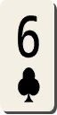         | <a href='https://raw.githubusercontent.com/abdulkadiraktas/rdr3_discoveries/master/useful_info_from_rpfs/textures//ui_minigames/cards/images/card_set_9/clubs_6.png'>Download</a>     |
| clubs_7          | -2022808479  |          | <a href='https://raw.githubusercontent.com/abdulkadiraktas/rdr3_discoveries/master/useful_info_from_rpfs/textures//ui_minigames/cards/images/card_set_9/clubs_7.png'>Download</a>     |
| clubs_8          | 1932999667   |          | <a href='https://raw.githubusercontent.com/abdulkadiraktas/rdr3_discoveries/master/useful_info_from_rpfs/textures//ui_minigames/cards/images/card_set_9/clubs_8.png'>Download</a>     |
| clubs_9          | 1804151899   |          | <a href='https://raw.githubusercontent.com/abdulkadiraktas/rdr3_discoveries/master/useful_info_from_rpfs/textures//ui_minigames/cards/images/card_set_9/clubs_9.png'>Download</a>     |
| clubs_a          | 302512466    |          | <a href='https://raw.githubusercontent.com/abdulkadiraktas/rdr3_discoveries/master/useful_info_from_rpfs/textures//ui_minigames/cards/images/card_set_9/clubs_a.png'>Download</a>     |
| clubs_j          | 2043431141   |          | <a href='https://raw.githubusercontent.com/abdulkadiraktas/rdr3_discoveries/master/useful_info_from_rpfs/textures//ui_minigames/cards/images/card_set_9/clubs_j.png'>Download</a>     |
| clubs_k          | 744762902    |          | <a href='https://raw.githubusercontent.com/abdulkadiraktas/rdr3_discoveries/master/useful_info_from_rpfs/textures//ui_minigames/cards/images/card_set_9/clubs_k.png'>Download</a>     |
| clubs_q          | -286379221   |          | <a href='https://raw.githubusercontent.com/abdulkadiraktas/rdr3_discoveries/master/useful_info_from_rpfs/textures//ui_minigames/cards/images/card_set_9/clubs_q.png'>Download</a>     |
| diamonds_10      | -67534240    |  | <a href='https://raw.githubusercontent.com/abdulkadiraktas/rdr3_discoveries/master/useful_info_from_rpfs/textures//ui_minigames/cards/images/card_set_9/diamonds_10.png'>Download</a> |
| diamonds_2       | -1065483005  |    | <a href='https://raw.githubusercontent.com/abdulkadiraktas/rdr3_discoveries/master/useful_info_from_rpfs/textures//ui_minigames/cards/images/card_set_9/diamonds_2.png'>Download</a>  |
| diamonds_3       | -1985407142  |    | <a href='https://raw.githubusercontent.com/abdulkadiraktas/rdr3_discoveries/master/useful_info_from_rpfs/textures//ui_minigames/cards/images/card_set_9/diamonds_3.png'>Download</a>  |
| diamonds_4       | -1687209242  |    | <a href='https://raw.githubusercontent.com/abdulkadiraktas/rdr3_discoveries/master/useful_info_from_rpfs/textures//ui_minigames/cards/images/card_set_9/diamonds_4.png'>Download</a>  |
| diamonds_5       | 936997816    |    | <a href='https://raw.githubusercontent.com/abdulkadiraktas/rdr3_discoveries/master/useful_info_from_rpfs/textures//ui_minigames/cards/images/card_set_9/diamonds_5.png'>Download</a>  |
| diamonds_6       | 160143133    |    | <a href='https://raw.githubusercontent.com/abdulkadiraktas/rdr3_discoveries/master/useful_info_from_rpfs/textures//ui_minigames/cards/images/card_set_9/diamonds_6.png'>Download</a>  |
| diamonds_7       | -759879311   |    | <a href='https://raw.githubusercontent.com/abdulkadiraktas/rdr3_discoveries/master/useful_info_from_rpfs/textures//ui_minigames/cards/images/card_set_9/diamonds_7.png'>Download</a>  |
| diamonds_8       | 604982308    |    | <a href='https://raw.githubusercontent.com/abdulkadiraktas/rdr3_discoveries/master/useful_info_from_rpfs/textures//ui_minigames/cards/images/card_set_9/diamonds_8.png'>Download</a>  |
| diamonds_9       | 2068085389   |    | <a href='https://raw.githubusercontent.com/abdulkadiraktas/rdr3_discoveries/master/useful_info_from_rpfs/textures//ui_minigames/cards/images/card_set_9/diamonds_9.png'>Download</a>  |
| diamonds_a       | -6192287     |    | <a href='https://raw.githubusercontent.com/abdulkadiraktas/rdr3_discoveries/master/useful_info_from_rpfs/textures//ui_minigames/cards/images/card_set_9/diamonds_a.png'>Download</a>  |
| diamonds_j       | 2135032480   |    | <a href='https://raw.githubusercontent.com/abdulkadiraktas/rdr3_discoveries/master/useful_info_from_rpfs/textures//ui_minigames/cards/images/card_set_9/diamonds_j.png'>Download</a>  |
| diamonds_k       | -184160730   |    | <a href='https://raw.githubusercontent.com/abdulkadiraktas/rdr3_discoveries/master/useful_info_from_rpfs/textures//ui_minigames/cards/images/card_set_9/diamonds_k.png'>Download</a>  |
| diamonds_q       | 450771414    |    | <a href='https://raw.githubusercontent.com/abdulkadiraktas/rdr3_discoveries/master/useful_info_from_rpfs/textures//ui_minigames/cards/images/card_set_9/diamonds_q.png'>Download</a>  |
| hearts_10        | -1236274559  |      | <a href='https://raw.githubusercontent.com/abdulkadiraktas/rdr3_discoveries/master/useful_info_from_rpfs/textures//ui_minigames/cards/images/card_set_9/hearts_10.png'>Download</a>   |
| hearts_2         | 1097864158   |        | <a href='https://raw.githubusercontent.com/abdulkadiraktas/rdr3_discoveries/master/useful_info_from_rpfs/textures//ui_minigames/cards/images/card_set_9/hearts_2.png'>Download</a>    |
| hearts_3         | 1589071468   |        | <a href='https://raw.githubusercontent.com/abdulkadiraktas/rdr3_discoveries/master/useful_info_from_rpfs/textures//ui_minigames/cards/images/card_set_9/hearts_3.png'>Download</a>    |
| hearts_4         | 1809115303   |        | <a href='https://raw.githubusercontent.com/abdulkadiraktas/rdr3_discoveries/master/useful_info_from_rpfs/textures//ui_minigames/cards/images/card_set_9/hearts_4.png'>Download</a>    |
| hearts_5         | 2064844579   |        | <a href='https://raw.githubusercontent.com/abdulkadiraktas/rdr3_discoveries/master/useful_info_from_rpfs/textures//ui_minigames/cards/images/card_set_9/hearts_5.png'>Download</a>    |
| hearts_6         | -2009620116  |        | <a href='https://raw.githubusercontent.com/abdulkadiraktas/rdr3_discoveries/master/useful_info_from_rpfs/textures//ui_minigames/cards/images/card_set_9/hearts_6.png'>Download</a>    |
| hearts_7         | -1517364198  |        | <a href='https://raw.githubusercontent.com/abdulkadiraktas/rdr3_discoveries/master/useful_info_from_rpfs/textures//ui_minigames/cards/images/card_set_9/hearts_7.png'>Download</a>    |
| hearts_8         | -1267303959  |        | <a href='https://raw.githubusercontent.com/abdulkadiraktas/rdr3_discoveries/master/useful_info_from_rpfs/textures//ui_minigames/cards/images/card_set_9/hearts_8.png'>Download</a>    |
| hearts_9         | -1036085891  |        | <a href='https://raw.githubusercontent.com/abdulkadiraktas/rdr3_discoveries/master/useful_info_from_rpfs/textures//ui_minigames/cards/images/card_set_9/hearts_9.png'>Download</a>    |
| hearts_a         | 495471607    |        | <a href='https://raw.githubusercontent.com/abdulkadiraktas/rdr3_discoveries/master/useful_info_from_rpfs/textures//ui_minigames/cards/images/card_set_9/hearts_a.png'>Download</a>    |
| hearts_j         | 1072730319   |        | <a href='https://raw.githubusercontent.com/abdulkadiraktas/rdr3_discoveries/master/useful_info_from_rpfs/textures//ui_minigames/cards/images/card_set_9/hearts_j.png'>Download</a>    |
| hearts_k         | 822342298    |        | <a href='https://raw.githubusercontent.com/abdulkadiraktas/rdr3_discoveries/master/useful_info_from_rpfs/textures//ui_minigames/cards/images/card_set_9/hearts_k.png'>Download</a>    |
| hearts_q         | -866932421   |        | <a href='https://raw.githubusercontent.com/abdulkadiraktas/rdr3_discoveries/master/useful_info_from_rpfs/textures//ui_minigames/cards/images/card_set_9/hearts_q.png'>Download</a>    |
| spades_10        | -688474420   |      | <a href='https://raw.githubusercontent.com/abdulkadiraktas/rdr3_discoveries/master/useful_info_from_rpfs/textures//ui_minigames/cards/images/card_set_9/spades_10.png'>Download</a>   |
| spades_2         | 1791671870   |        | <a href='https://raw.githubusercontent.com/abdulkadiraktas/rdr3_discoveries/master/useful_info_from_rpfs/textures//ui_minigames/cards/images/card_set_9/spades_2.png'>Download</a>    |
| spades_3         | 1049716172   |        | <a href='https://raw.githubusercontent.com/abdulkadiraktas/rdr3_discoveries/master/useful_info_from_rpfs/textures//ui_minigames/cards/images/card_set_9/spades_3.png'>Download</a>    |
| spades_4         | -652305684   |        | <a href='https://raw.githubusercontent.com/abdulkadiraktas/rdr3_discoveries/master/useful_info_from_rpfs/textures//ui_minigames/cards/images/card_set_9/spades_4.png'>Download</a>    |
| spades_5         | 566537267    |        | <a href='https://raw.githubusercontent.com/abdulkadiraktas/rdr3_discoveries/master/useful_info_from_rpfs/textures//ui_minigames/cards/images/card_set_9/spades_5.png'>Download</a>    |
| spades_6         | 734904389    | 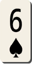       | <a href='https://raw.githubusercontent.com/abdulkadiraktas/rdr3_discoveries/master/useful_info_from_rpfs/textures//ui_minigames/cards/images/card_set_9/spades_6.png'>Download</a>    |
| spades_7         | -1400094260  |        | <a href='https://raw.githubusercontent.com/abdulkadiraktas/rdr3_discoveries/master/useful_info_from_rpfs/textures//ui_minigames/cards/images/card_set_9/spades_7.png'>Download</a>    |
| spades_8         | -1121590529  |        | <a href='https://raw.githubusercontent.com/abdulkadiraktas/rdr3_discoveries/master/useful_info_from_rpfs/textures//ui_minigames/cards/images/card_set_9/spades_8.png'>Download</a>    |
| spades_9         | -1880389493  |        | <a href='https://raw.githubusercontent.com/abdulkadiraktas/rdr3_discoveries/master/useful_info_from_rpfs/textures//ui_minigames/cards/images/card_set_9/spades_9.png'>Download</a>    |
| spades_a         | 943085858    |        | <a href='https://raw.githubusercontent.com/abdulkadiraktas/rdr3_discoveries/master/useful_info_from_rpfs/textures//ui_minigames/cards/images/card_set_9/spades_a.png'>Download</a>    |
| spades_j         | -2046036780  |        | <a href='https://raw.githubusercontent.com/abdulkadiraktas/rdr3_discoveries/master/useful_info_from_rpfs/textures//ui_minigames/cards/images/card_set_9/spades_j.png'>Download</a>    |
| spades_k         | 1122004606   |        | <a href='https://raw.githubusercontent.com/abdulkadiraktas/rdr3_discoveries/master/useful_info_from_rpfs/textures//ui_minigames/cards/images/card_set_9/spades_k.png'>Download</a>    |
| spades_q         | -1842606824  |        | <a href='https://raw.githubusercontent.com/abdulkadiraktas/rdr3_discoveries/master/useful_info_from_rpfs/textures//ui_minigames/cards/images/card_set_9/spades_q.png'>Download</a>    |
