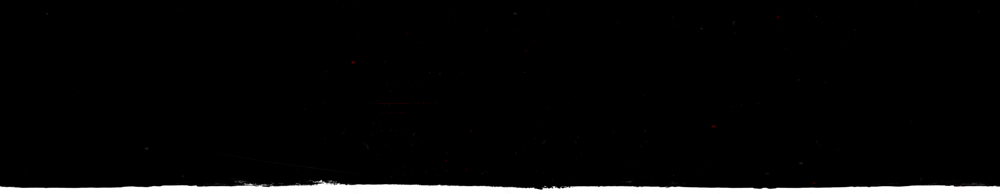
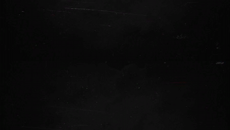
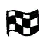
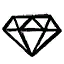
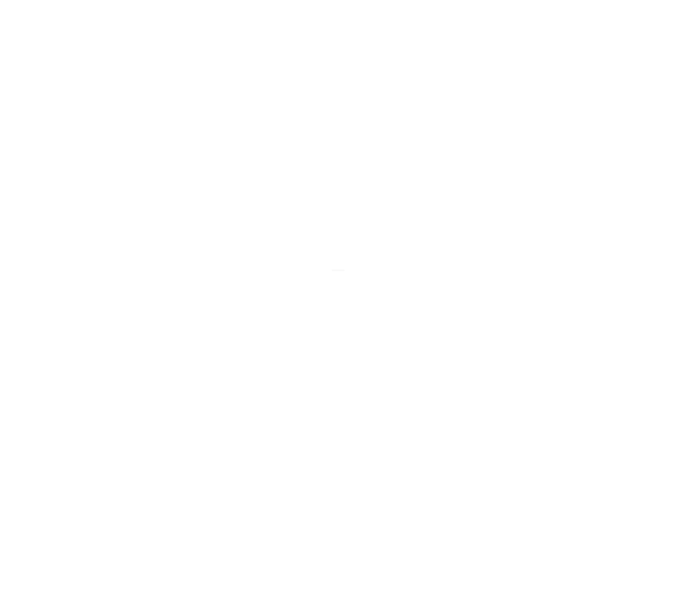
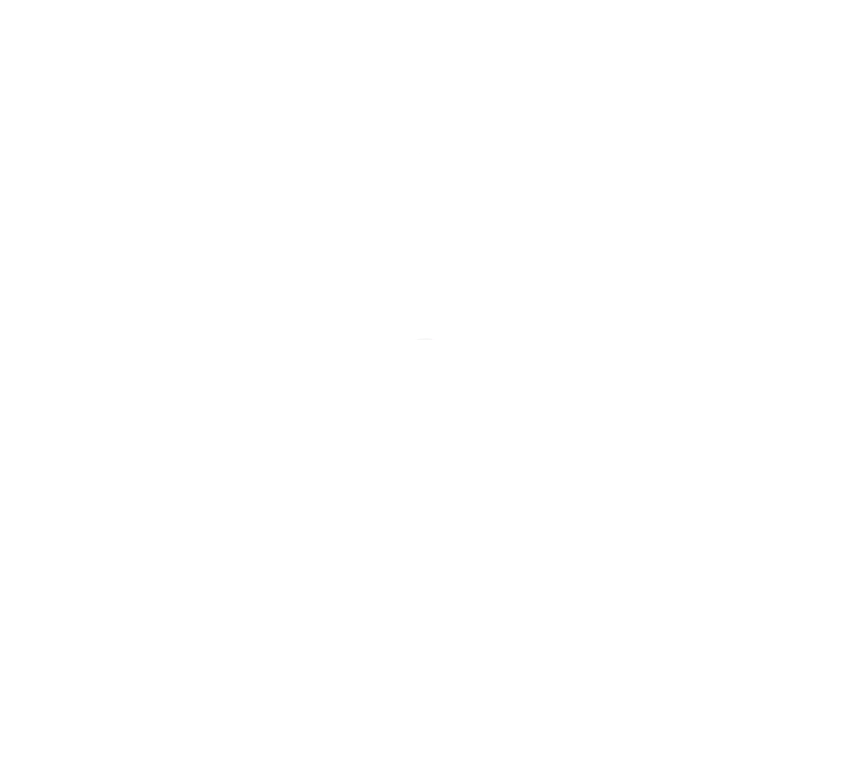
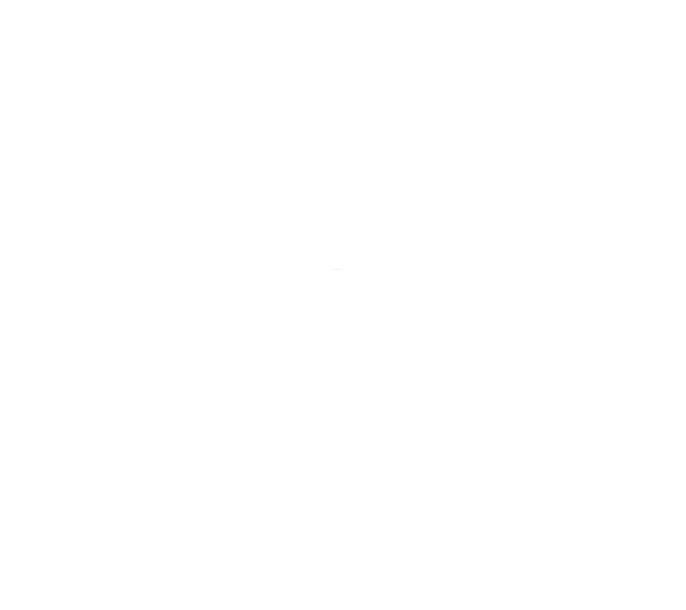
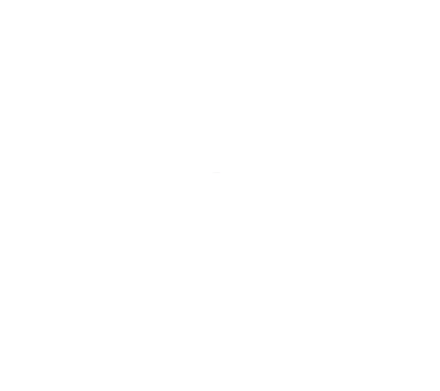
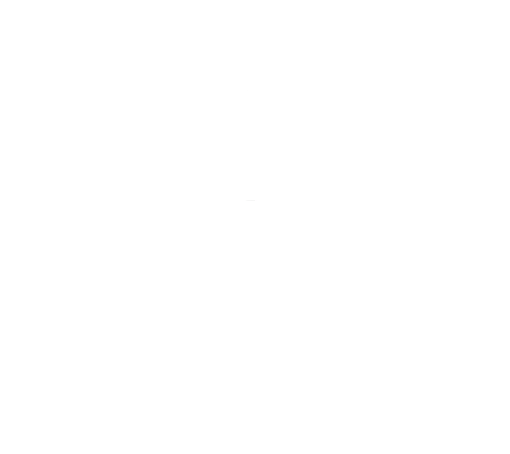

## Example of using:

```lua
local function DrawTexture(textureStreamed,textureName,x, y, width, height,rotation,r, g, b, a, p11)
    if not HasStreamedTextureDictLoaded(textureStreamed) then
       RequestStreamedTextureDict(textureStreamed, false);
    else
        DrawSprite(textureStreamed, textureName, x, y, width, height, rotation, r, g, b, a, p11);
    end
end
Citizen.CreateThread(function()
    while true do
    	Citizen.Wait(0)
		DrawTexture("big_feed", "big_feed_bg_1", 0.5, 0.5, 0.251, 0.251, 0.0, 0, 0, 0, 240, false);
	end
end)
```

<h2>big_feed (0xE095626F)</h2>

| Texture hashname                | Texture hash | Texture example                                                                                                                                  | Download Image                                                                                                                                                                                            |
| ------------------------------- | ------------ | ------------------------------------------------------------------------------------------------------------------------------------------------ | --------------------------------------------------------------------------------------------------------------------------------------------------------------------------------------------------------- |
| big_feed_bg_1                   | 0x8CE39317   |                                      | <a href='https://raw.githubusercontent.com/abdulkadiraktas/rdr3_discoveries/master/useful_info_from_rpfs/textures//ui_startup_textures/images/big_feed//big_feed_bg_1.png'>Download</a>                   |
| big_feed_placeholder_background | 0xFDD5C0DD   |  | <a href='https://raw.githubusercontent.com/abdulkadiraktas/rdr3_discoveries/master/useful_info_from_rpfs/textures//ui_startup_textures/images/big_feed//big_feed_placeholder_background.png'>Download</a> |
| feed_ink                        |              |                                                                                                        | <a href='images/big_feed//feed_ink.png'>Download</a>                                                                                                                                                      |
| feed_ink_overlay                |              |                                                                                        | <a href='https://raw.githubusercontent.com/abdulkadiraktas/rdr3_discoveries/master/useful_info_from_rpfs/textures//ui_startup_textures/images/big_feed//feed_ink_overlay.png'>Download</a>                |
| pattern                         | 0xFF0BFA79   |                                                  | <a href='https://raw.githubusercontent.com/abdulkadiraktas/rdr3_discoveries/master/useful_info_from_rpfs/textures//ui_startup_textures/images/big_feed//pattern.png'>Download</a>                         |
| pattern_corner                  | 0x9B9E9BED   |                                    | <a href='https://raw.githubusercontent.com/abdulkadiraktas/rdr3_discoveries/master/useful_info_from_rpfs/textures//ui_startup_textures/images/big_feed//pattern_corner.png'>Download</a>                  |
| pattern_left_right_border       | 0x6D551567   |              | <a href='https://raw.githubusercontent.com/abdulkadiraktas/rdr3_discoveries/master/useful_info_from_rpfs/textures//ui_startup_textures/images/big_feed//pattern_left_right_border.png'>Download</a>       |
| pattern_top_bottom_border       | 0xE45BAC5A   |              | <a href='https://raw.githubusercontent.com/abdulkadiraktas/rdr3_discoveries/master/useful_info_from_rpfs/textures//ui_startup_textures/images/big_feed//pattern_top_bottom_border.png'>Download</a>       |
| rdr_logo                        | 0x7A1AFBAE   |                                                | <a href='https://raw.githubusercontent.com/abdulkadiraktas/rdr3_discoveries/master/useful_info_from_rpfs/textures//ui_startup_textures/images/big_feed//rdr_logo.png'>Download</a>                        |

<h2>boot_flow (0xBAAB6434)</h2>

| Texture hashname        | Texture hash | Texture example                                                                                                                   | Download Image                                                                                                                                                                                     |
| ----------------------- | ------------ | --------------------------------------------------------------------------------------------------------------------------------- | -------------------------------------------------------------------------------------------------------------------------------------------------------------------------------------------------- |
| button_lang_ch          | 0xDD6FACC6   |                    | <a href='https://raw.githubusercontent.com/abdulkadiraktas/rdr3_discoveries/master/useful_info_from_rpfs/textures//ui_startup_textures/images/boot_flow//button_lang_ch.png'>Download</a>          |
| button_lang_chs         | 0x8ABDB4D1   |                  | <a href='https://raw.githubusercontent.com/abdulkadiraktas/rdr3_discoveries/master/useful_info_from_rpfs/textures//ui_startup_textures/images/boot_flow//button_lang_chs.png'>Download</a>         |
| button_lang_e           | 0xAAE0FF35   |                      | <a href='https://raw.githubusercontent.com/abdulkadiraktas/rdr3_discoveries/master/useful_info_from_rpfs/textures//ui_startup_textures/images/boot_flow//button_lang_e.png'>Download</a>           |
| button_lang_f           | 0x93ABD0CB   |                      | <a href='https://raw.githubusercontent.com/abdulkadiraktas/rdr3_discoveries/master/useful_info_from_rpfs/textures//ui_startup_textures/images/boot_flow//button_lang_f.png'>Download</a>           |
| button_lang_g           | 0x3E65A63C   |                      | <a href='https://raw.githubusercontent.com/abdulkadiraktas/rdr3_discoveries/master/useful_info_from_rpfs/textures//ui_startup_textures/images/boot_flow//button_lang_g.png'>Download</a>           |
| button_lang_i           | 0xE646F600   |                      | <a href='https://raw.githubusercontent.com/abdulkadiraktas/rdr3_discoveries/master/useful_info_from_rpfs/textures//ui_startup_textures/images/boot_flow//button_lang_i.png'>Download</a>           |
| button_lang_j           | 0xC11EABB0   |                      | <a href='https://raw.githubusercontent.com/abdulkadiraktas/rdr3_discoveries/master/useful_info_from_rpfs/textures//ui_startup_textures/images/boot_flow//button_lang_j.png'>Download</a>           |
| button_lang_k           | 0x843B31EA   |                      | <a href='https://raw.githubusercontent.com/abdulkadiraktas/rdr3_discoveries/master/useful_info_from_rpfs/textures//ui_startup_textures/images/boot_flow//button_lang_k.png'>Download</a>           |
| button_lang_mex         | 0xA46C335E   |                  | <a href='https://raw.githubusercontent.com/abdulkadiraktas/rdr3_discoveries/master/useful_info_from_rpfs/textures//ui_startup_textures/images/boot_flow//button_lang_mex.png'>Download</a>         |
| button_lang_pl          | 0x418EC49F   |                    | <a href='https://raw.githubusercontent.com/abdulkadiraktas/rdr3_discoveries/master/useful_info_from_rpfs/textures//ui_startup_textures/images/boot_flow//button_lang_pl.png'>Download</a>          |
| button_lang_pt          | 0xCF51E033   |                    | <a href='https://raw.githubusercontent.com/abdulkadiraktas/rdr3_discoveries/master/useful_info_from_rpfs/textures//ui_startup_textures/images/boot_flow//button_lang_pt.png'>Download</a>          |
| button_lang_r           | 0x470F379B   |                      | <a href='https://raw.githubusercontent.com/abdulkadiraktas/rdr3_discoveries/master/useful_info_from_rpfs/textures//ui_startup_textures/images/boot_flow//button_lang_r.png'>Download</a>           |
| button_lang_s           | 0xF85C9A37   |                      | <a href='https://raw.githubusercontent.com/abdulkadiraktas/rdr3_discoveries/master/useful_info_from_rpfs/textures//ui_startup_textures/images/boot_flow//button_lang_s.png'>Download</a>           |
| calibrationscreen       |              |                                                                       | <a href='https://raw.githubusercontent.com/abdulkadiraktas/rdr3_discoveries/master/useful_info_from_rpfs/textures//ui_startup_textures/images/boot_flow//calibrationscreen.png'>Download</a>       |
| logo_rockstar_keyline_k | 0x21BDEFAA   |  | <a href='https://raw.githubusercontent.com/abdulkadiraktas/rdr3_discoveries/master/useful_info_from_rpfs/textures//ui_startup_textures/images/boot_flow//logo_rockstar_keyline_k.png'>Download</a> |
| selection_arrow_left    | 297949742    |        | <a href='https://raw.githubusercontent.com/abdulkadiraktas/rdr3_discoveries/master/useful_info_from_rpfs/textures//ui_startup_textures/images/boot_flow//selection_arrow_left.png'>Download</a>    |
| selection_arrow_right   | -2046065591  |      | <a href='https://raw.githubusercontent.com/abdulkadiraktas/rdr3_discoveries/master/useful_info_from_rpfs/textures//ui_startup_textures/images/boot_flow//selection_arrow_right.png'>Download</a>   |
| selection_box_bg_1d     | -1655543612  |          | <a href='https://raw.githubusercontent.com/abdulkadiraktas/rdr3_discoveries/master/useful_info_from_rpfs/textures//ui_startup_textures/images/boot_flow//selection_box_bg_1d.png'>Download</a>     |
| splash_screen           | 0x5C565C48   |                      | <a href='https://raw.githubusercontent.com/abdulkadiraktas/rdr3_discoveries/master/useful_info_from_rpfs/textures//ui_startup_textures/images/boot_flow//splash_screen.png'>Download</a>           |

<h2>bootflow_tu  (--)</h2>

| Texture hashname           | Texture hash | Texture example                                                                  | Download Image                                                                                                                                                               |
| -------------------------- | ------------ | -------------------------------------------------------------------------------- | ---------------------------------------------------------------------------------------------------------------------------------------------------------------------------- |
| hdr_calibration_background |              |  | <a href='https://raw.githubusercontent.com/abdulkadiraktas/rdr3_discoveries/master/useful_info_from_rpfs/textures//ui_startup_textures/images/bootflow_tu/.png'>Download</a> |
| hdr_calibration_foreground |              |  | <a href='https://raw.githubusercontent.com/abdulkadiraktas/rdr3_discoveries/master/useful_info_from_rpfs/textures//ui_startup_textures/images/bootflow_tu/.png'>Download</a> |
| menu_header_1a             | -1478524042  |                          | <a href='https://raw.githubusercontent.com/abdulkadiraktas/rdr3_discoveries/master/useful_info_from_rpfs/textures//ui_startup_textures/images/bootflow_tu/.png'>Download</a> |
| menu_ink_large1            |              |                        | <a href='https://raw.githubusercontent.com/abdulkadiraktas/rdr3_discoveries/master/useful_info_from_rpfs/textures//ui_startup_textures/images/bootflow_tu/.png'>Download</a> |

<h2>elements_stamps_icons (0xB66E3D00)</h2>

| Texture hashname       | Texture hash | Texture example                                                                                                                             | Download Image                                                                                                                                                                                                |
| ---------------------- | ------------ | ------------------------------------------------------------------------------------------------------------------------------------------- | ------------------------------------------------------------------------------------------------------------------------------------------------------------------------------------------------------------- |
| stamp_25               | 0xDFCE4AB4   |                              | <a href='https://raw.githubusercontent.com/abdulkadiraktas/rdr3_discoveries/master/useful_info_from_rpfs/textures//ui_startup_textures/images/elements_stamps_icons//stamp_25.png'>Download</a>               |
| stamp_50               | 0xB707993F   |                              | <a href='https://raw.githubusercontent.com/abdulkadiraktas/rdr3_discoveries/master/useful_info_from_rpfs/textures//ui_startup_textures/images/elements_stamps_icons//stamp_50.png'>Download</a>               |
| stamp_cash             | 0x5B4CC879   |                          | <a href='https://raw.githubusercontent.com/abdulkadiraktas/rdr3_discoveries/master/useful_info_from_rpfs/textures//ui_startup_textures/images/elements_stamps_icons//stamp_cash.png'>Download</a>             |
| stamp_gold             | 1485653341   |                          | <a href='https://raw.githubusercontent.com/abdulkadiraktas/rdr3_discoveries/master/useful_info_from_rpfs/textures//ui_startup_textures/images/elements_stamps_icons//stamp_gold.png'>Download</a>             |
| stamp_lock             | 0x55B0B62A   |                          | <a href='https://raw.githubusercontent.com/abdulkadiraktas/rdr3_discoveries/master/useful_info_from_rpfs/textures//ui_startup_textures/images/elements_stamps_icons//stamp_lock.png'>Download</a>             |
| stamp_locked_rank      | 1511892115   |            | <a href='https://raw.githubusercontent.com/abdulkadiraktas/rdr3_discoveries/master/useful_info_from_rpfs/textures//ui_startup_textures/images/elements_stamps_icons//stamp_locked_rank.png'>Download</a>      |
| stamp_locked_rank_gold | 0x343E92DA   |  | <a href='https://raw.githubusercontent.com/abdulkadiraktas/rdr3_discoveries/master/useful_info_from_rpfs/textures//ui_startup_textures/images/elements_stamps_icons//stamp_locked_rank_gold.png'>Download</a> |
| stamp_money            | 0xC17797BF   |                        | <a href='https://raw.githubusercontent.com/abdulkadiraktas/rdr3_discoveries/master/useful_info_from_rpfs/textures//ui_startup_textures/images/elements_stamps_icons//stamp_money.png'>Download</a>            |
| stamp_new              | 0x9C1188BD   |                            | <a href='https://raw.githubusercontent.com/abdulkadiraktas/rdr3_discoveries/master/useful_info_from_rpfs/textures//ui_startup_textures/images/elements_stamps_icons//stamp_new.png'>Download</a>              |
| stamp_unlocked_rank    | 0x76EA4F45   |        | <a href='https://raw.githubusercontent.com/abdulkadiraktas/rdr3_discoveries/master/useful_info_from_rpfs/textures//ui_startup_textures/images/elements_stamps_icons//stamp_unlocked_rank.png'>Download</a>    |
| stamp_wishlist         | 0x44E3AA0E   |                  | <a href='https://raw.githubusercontent.com/abdulkadiraktas/rdr3_discoveries/master/useful_info_from_rpfs/textures//ui_startup_textures/images/elements_stamps_icons//stamp_wishlist.png'>Download</a>         |
| stamp_x2_cash          | 0x4240A0A6   |                    | <a href='https://raw.githubusercontent.com/abdulkadiraktas/rdr3_discoveries/master/useful_info_from_rpfs/textures//ui_startup_textures/images/elements_stamps_icons//stamp_x2_cash.png'>Download</a>          |
| stamp_x2_xp            | 0x79961D34   |                        | <a href='https://raw.githubusercontent.com/abdulkadiraktas/rdr3_discoveries/master/useful_info_from_rpfs/textures//ui_startup_textures/images/elements_stamps_icons//stamp_x2_xp.png'>Download</a>            |
| stamp_x3_cash          | 0x7873DFC3   |                    | <a href='https://raw.githubusercontent.com/abdulkadiraktas/rdr3_discoveries/master/useful_info_from_rpfs/textures//ui_startup_textures/images/elements_stamps_icons//stamp_x3_cash.png'>Download</a>          |
| stamp_x3_xp            | 0xAAC918A7   |                        | <a href='https://raw.githubusercontent.com/abdulkadiraktas/rdr3_discoveries/master/useful_info_from_rpfs/textures//ui_startup_textures/images/elements_stamps_icons//stamp_x3_xp.png'>Download</a>            |
| stamp_xp               | 0x9F65AA53   |                              | <a href='https://raw.githubusercontent.com/abdulkadiraktas/rdr3_discoveries/master/useful_info_from_rpfs/textures//ui_startup_textures/images/elements_stamps_icons//stamp_xp.png'>Download</a>               |

<h2>elements_stamps_icons_tu  (--)</h2>

| Texture hashname                 | Texture hash | Texture example                                                                                           | Download Image                                                                                                                                                                            |
| -------------------------------- | ------------ | --------------------------------------------------------------------------------------------------------- | ----------------------------------------------------------------------------------------------------------------------------------------------------------------------------------------- |
| stamp_2x                         |              |                                                  | <a href='https://raw.githubusercontent.com/abdulkadiraktas/rdr3_discoveries/master/useful_info_from_rpfs/textures//ui_startup_textures/images/elements_stamps_icons_tu/.png'>Download</a> |
| stamp_3x                         |              |                                                  | <a href='https://raw.githubusercontent.com/abdulkadiraktas/rdr3_discoveries/master/useful_info_from_rpfs/textures//ui_startup_textures/images/elements_stamps_icons_tu/.png'>Download</a> |
| stamp_horse_gold                 |              |                                  | <a href='https://raw.githubusercontent.com/abdulkadiraktas/rdr3_discoveries/master/useful_info_from_rpfs/textures//ui_startup_textures/images/elements_stamps_icons_tu/.png'>Download</a> |
| stamp_increase_dollar            |              |                        | <a href='https://raw.githubusercontent.com/abdulkadiraktas/rdr3_discoveries/master/useful_info_from_rpfs/textures//ui_startup_textures/images/elements_stamps_icons_tu/.png'>Download</a> |
| stamp_increase_xp                |              |                                | <a href='https://raw.githubusercontent.com/abdulkadiraktas/rdr3_discoveries/master/useful_info_from_rpfs/textures//ui_startup_textures/images/elements_stamps_icons_tu/.png'>Download</a> |
| stamp_percent_20                 |              |                                  | <a href='https://raw.githubusercontent.com/abdulkadiraktas/rdr3_discoveries/master/useful_info_from_rpfs/textures//ui_startup_textures/images/elements_stamps_icons_tu/.png'>Download</a> |
| stamp_percent_25                 |              |                                  | <a href='https://raw.githubusercontent.com/abdulkadiraktas/rdr3_discoveries/master/useful_info_from_rpfs/textures//ui_startup_textures/images/elements_stamps_icons_tu/.png'>Download</a> |
| stamp_percent_30                 |              |                                  | <a href='https://raw.githubusercontent.com/abdulkadiraktas/rdr3_discoveries/master/useful_info_from_rpfs/textures//ui_startup_textures/images/elements_stamps_icons_tu/.png'>Download</a> |
| stamp_percent_35                 |              |                                  | <a href='https://raw.githubusercontent.com/abdulkadiraktas/rdr3_discoveries/master/useful_info_from_rpfs/textures//ui_startup_textures/images/elements_stamps_icons_tu/.png'>Download</a> |
| stamp_percent_40                 |              |                                  | <a href='https://raw.githubusercontent.com/abdulkadiraktas/rdr3_discoveries/master/useful_info_from_rpfs/textures//ui_startup_textures/images/elements_stamps_icons_tu/.png'>Download</a> |
| stamp_percent_50                 |              |                                  | <a href='https://raw.githubusercontent.com/abdulkadiraktas/rdr3_discoveries/master/useful_info_from_rpfs/textures//ui_startup_textures/images/elements_stamps_icons_tu/.png'>Download</a> |
| stamp_roles_bounty_hunter_locked |              |  | <a href='https://raw.githubusercontent.com/abdulkadiraktas/rdr3_discoveries/master/useful_info_from_rpfs/textures//ui_startup_textures/images/elements_stamps_icons_tu/.png'>Download</a> |
| stamp_roles_collector_locked     |              |          | <a href='https://raw.githubusercontent.com/abdulkadiraktas/rdr3_discoveries/master/useful_info_from_rpfs/textures//ui_startup_textures/images/elements_stamps_icons_tu/.png'>Download</a> |
| stamp_roles_moonshiner_locked    |              |        | <a href='https://raw.githubusercontent.com/abdulkadiraktas/rdr3_discoveries/master/useful_info_from_rpfs/textures//ui_startup_textures/images/elements_stamps_icons_tu/.png'>Download</a> |
| stamp_roles_trader_locked        |              |                | <a href='https://raw.githubusercontent.com/abdulkadiraktas/rdr3_discoveries/master/useful_info_from_rpfs/textures//ui_startup_textures/images/elements_stamps_icons_tu/.png'>Download</a> |

<h2>elements_stamps_text_de (0x3571AD38)</h2>

| Texture hashname   | Texture hash | Texture example                                                                                                                       | Download Image                                                                                                                                                                                              |
| ------------------ | ------------ | ------------------------------------------------------------------------------------------------------------------------------------- | ----------------------------------------------------------------------------------------------------------------------------------------------------------------------------------------------------------- |
| stamp_bestvalue    | 0x405EB297   |        | <a href='https://raw.githubusercontent.com/abdulkadiraktas/rdr3_discoveries/master/useful_info_from_rpfs/textures//ui_startup_textures/images/elements_stamps_text_de//stamp_bestvalue.png'>Download</a>    |
| stamp_coupon       | 0x07DC44DC   |              | <a href='https://raw.githubusercontent.com/abdulkadiraktas/rdr3_discoveries/master/useful_info_from_rpfs/textures//ui_startup_textures/images/elements_stamps_text_de//stamp_coupon.png'>Download</a>       |
| stamp_justforyou   | 0x87239145   |      | <a href='https://raw.githubusercontent.com/abdulkadiraktas/rdr3_discoveries/master/useful_info_from_rpfs/textures//ui_startup_textures/images/elements_stamps_text_de//stamp_justforyou.png'>Download</a>   |
| stamp_last_chance  | 0xC96A9B03   |    | <a href='https://raw.githubusercontent.com/abdulkadiraktas/rdr3_discoveries/master/useful_info_from_rpfs/textures//ui_startup_textures/images/elements_stamps_text_de//stamp_last_chance.png'>Download</a>  |
| stamp_limitedstock | 0x29183E47   |  | <a href='https://raw.githubusercontent.com/abdulkadiraktas/rdr3_discoveries/master/useful_info_from_rpfs/textures//ui_startup_textures/images/elements_stamps_text_de//stamp_limitedstock.png'>Download</a> |
| stamp_options      | 0x1B5A688D   |            | <a href='https://raw.githubusercontent.com/abdulkadiraktas/rdr3_discoveries/master/useful_info_from_rpfs/textures//ui_startup_textures/images/elements_stamps_text_de//stamp_options.png'>Download</a>      |
| stamp_owned        | 0x4DCEC69D   |                | <a href='https://raw.githubusercontent.com/abdulkadiraktas/rdr3_discoveries/master/useful_info_from_rpfs/textures//ui_startup_textures/images/elements_stamps_text_de//stamp_owned.png'>Download</a>        |
| stamp_popular      | 0xE417416E   |            | <a href='https://raw.githubusercontent.com/abdulkadiraktas/rdr3_discoveries/master/useful_info_from_rpfs/textures//ui_startup_textures/images/elements_stamps_text_de//stamp_popular.png'>Download</a>      |
| stamp_sale         | 0xB8794E98   |                  | <a href='https://raw.githubusercontent.com/abdulkadiraktas/rdr3_discoveries/master/useful_info_from_rpfs/textures//ui_startup_textures/images/elements_stamps_text_de//stamp_sale.png'>Download</a>         |
| stamp_soldout      | 0x4AE60B92   |            | <a href='https://raw.githubusercontent.com/abdulkadiraktas/rdr3_discoveries/master/useful_info_from_rpfs/textures//ui_startup_textures/images/elements_stamps_text_de//stamp_soldout.png'>Download</a>      |

<h2>elements_stamps_text_de_tu  (--)</h2>

| Texture hashname | Texture hash | Texture example                                                             | Download Image                                                                                                                                                                              |
| ---------------- | ------------ | --------------------------------------------------------------------------- | ------------------------------------------------------------------------------------------------------------------------------------------------------------------------------------------- |
| stamp_comingsoon |              |  | <a href='https://raw.githubusercontent.com/abdulkadiraktas/rdr3_discoveries/master/useful_info_from_rpfs/textures//ui_startup_textures/images/elements_stamps_text_de_tu/.png'>Download</a> |
| stamp_opensoon   |              |      | <a href='https://raw.githubusercontent.com/abdulkadiraktas/rdr3_discoveries/master/useful_info_from_rpfs/textures//ui_startup_textures/images/elements_stamps_text_de_tu/.png'>Download</a> |
| stamp_outofstock |              |  | <a href='https://raw.githubusercontent.com/abdulkadiraktas/rdr3_discoveries/master/useful_info_from_rpfs/textures//ui_startup_textures/images/elements_stamps_text_de_tu/.png'>Download</a> |

<h2>elements_stamps_text_en (0x16316D9C)</h2>

| Texture hashname   | Texture hash | Texture example                                                                                                                       | Download Image                                                                                                                                                                                              |
| ------------------ | ------------ | ------------------------------------------------------------------------------------------------------------------------------------- | ----------------------------------------------------------------------------------------------------------------------------------------------------------------------------------------------------------- |
| stamp_bestvalue    | 0x405EB297   |        | <a href='https://raw.githubusercontent.com/abdulkadiraktas/rdr3_discoveries/master/useful_info_from_rpfs/textures//ui_startup_textures/images/elements_stamps_text_en//stamp_bestvalue.png'>Download</a>    |
| stamp_coupon       | 0x07DC44DC   |              | <a href='https://raw.githubusercontent.com/abdulkadiraktas/rdr3_discoveries/master/useful_info_from_rpfs/textures//ui_startup_textures/images/elements_stamps_text_en//stamp_coupon.png'>Download</a>       |
| stamp_justforyou   | 0x87239145   |      | <a href='https://raw.githubusercontent.com/abdulkadiraktas/rdr3_discoveries/master/useful_info_from_rpfs/textures//ui_startup_textures/images/elements_stamps_text_en//stamp_justforyou.png'>Download</a>   |
| stamp_last_chance  | 0xC96A9B03   |    | <a href='https://raw.githubusercontent.com/abdulkadiraktas/rdr3_discoveries/master/useful_info_from_rpfs/textures//ui_startup_textures/images/elements_stamps_text_en//stamp_last_chance.png'>Download</a>  |
| stamp_limitedstock | 0x29183E47   |  | <a href='https://raw.githubusercontent.com/abdulkadiraktas/rdr3_discoveries/master/useful_info_from_rpfs/textures//ui_startup_textures/images/elements_stamps_text_en//stamp_limitedstock.png'>Download</a> |
| stamp_options      | 0x1B5A688D   |            | <a href='https://raw.githubusercontent.com/abdulkadiraktas/rdr3_discoveries/master/useful_info_from_rpfs/textures//ui_startup_textures/images/elements_stamps_text_en//stamp_options.png'>Download</a>      |
| stamp_owned        | 0x4DCEC69D   |                | <a href='https://raw.githubusercontent.com/abdulkadiraktas/rdr3_discoveries/master/useful_info_from_rpfs/textures//ui_startup_textures/images/elements_stamps_text_en//stamp_owned.png'>Download</a>        |
| stamp_popular      | 0xE417416E   |            | <a href='https://raw.githubusercontent.com/abdulkadiraktas/rdr3_discoveries/master/useful_info_from_rpfs/textures//ui_startup_textures/images/elements_stamps_text_en//stamp_popular.png'>Download</a>      |
| stamp_sale         | 0xB8794E98   |                  | <a href='https://raw.githubusercontent.com/abdulkadiraktas/rdr3_discoveries/master/useful_info_from_rpfs/textures//ui_startup_textures/images/elements_stamps_text_en//stamp_sale.png'>Download</a>         |
| stamp_soldout      | 0x4AE60B92   |            | <a href='https://raw.githubusercontent.com/abdulkadiraktas/rdr3_discoveries/master/useful_info_from_rpfs/textures//ui_startup_textures/images/elements_stamps_text_en//stamp_soldout.png'>Download</a>      |

<h2>elements_stamps_text_en_tu  (--)</h2>

| Texture hashname | Texture hash | Texture example                                                             | Download Image                                                                                                                                                                              |
| ---------------- | ------------ | --------------------------------------------------------------------------- | ------------------------------------------------------------------------------------------------------------------------------------------------------------------------------------------- |
| stamp_comingsoon |              |  | <a href='https://raw.githubusercontent.com/abdulkadiraktas/rdr3_discoveries/master/useful_info_from_rpfs/textures//ui_startup_textures/images/elements_stamps_text_en_tu/.png'>Download</a> |
| stamp_opensoon   |              |      | <a href='https://raw.githubusercontent.com/abdulkadiraktas/rdr3_discoveries/master/useful_info_from_rpfs/textures//ui_startup_textures/images/elements_stamps_text_en_tu/.png'>Download</a> |
| stamp_outofstock |              |  | <a href='https://raw.githubusercontent.com/abdulkadiraktas/rdr3_discoveries/master/useful_info_from_rpfs/textures//ui_startup_textures/images/elements_stamps_text_en_tu/.png'>Download</a> |

<h2>elements_stamps_text_es (0x72DF26E6)</h2>

| Texture hashname   | Texture hash | Texture example                                                                                                                       | Download Image                                                                                                                                                                                              |
| ------------------ | ------------ | ------------------------------------------------------------------------------------------------------------------------------------- | ----------------------------------------------------------------------------------------------------------------------------------------------------------------------------------------------------------- |
| stamp_bestvalue    | 0x405EB297   |        | <a href='https://raw.githubusercontent.com/abdulkadiraktas/rdr3_discoveries/master/useful_info_from_rpfs/textures//ui_startup_textures/images/elements_stamps_text_es//stamp_bestvalue.png'>Download</a>    |
| stamp_coupon       | 0x07DC44DC   |              | <a href='https://raw.githubusercontent.com/abdulkadiraktas/rdr3_discoveries/master/useful_info_from_rpfs/textures//ui_startup_textures/images/elements_stamps_text_es//stamp_coupon.png'>Download</a>       |
| stamp_justforyou   | 0x87239145   |      | <a href='https://raw.githubusercontent.com/abdulkadiraktas/rdr3_discoveries/master/useful_info_from_rpfs/textures//ui_startup_textures/images/elements_stamps_text_es//stamp_justforyou.png'>Download</a>   |
| stamp_last_chance  | 0xC96A9B03   |    | <a href='https://raw.githubusercontent.com/abdulkadiraktas/rdr3_discoveries/master/useful_info_from_rpfs/textures//ui_startup_textures/images/elements_stamps_text_es//stamp_last_chance.png'>Download</a>  |
| stamp_limitedstock | 0x29183E47   |  | <a href='https://raw.githubusercontent.com/abdulkadiraktas/rdr3_discoveries/master/useful_info_from_rpfs/textures//ui_startup_textures/images/elements_stamps_text_es//stamp_limitedstock.png'>Download</a> |
| stamp_options      | 0x1B5A688D   |            | <a href='https://raw.githubusercontent.com/abdulkadiraktas/rdr3_discoveries/master/useful_info_from_rpfs/textures//ui_startup_textures/images/elements_stamps_text_es//stamp_options.png'>Download</a>      |
| stamp_owned        | 0x4DCEC69D   |                | <a href='https://raw.githubusercontent.com/abdulkadiraktas/rdr3_discoveries/master/useful_info_from_rpfs/textures//ui_startup_textures/images/elements_stamps_text_es//stamp_owned.png'>Download</a>        |
| stamp_popular      | 0xE417416E   |            | <a href='https://raw.githubusercontent.com/abdulkadiraktas/rdr3_discoveries/master/useful_info_from_rpfs/textures//ui_startup_textures/images/elements_stamps_text_es//stamp_popular.png'>Download</a>      |
| stamp_sale         | 0xB8794E98   |                  | <a href='https://raw.githubusercontent.com/abdulkadiraktas/rdr3_discoveries/master/useful_info_from_rpfs/textures//ui_startup_textures/images/elements_stamps_text_es//stamp_sale.png'>Download</a>         |
| stamp_soldout      | 0x4AE60B92   |            | <a href='https://raw.githubusercontent.com/abdulkadiraktas/rdr3_discoveries/master/useful_info_from_rpfs/textures//ui_startup_textures/images/elements_stamps_text_es//stamp_soldout.png'>Download</a>      |

<h2>elements_stamps_text_es_tu  (--)</h2>

| Texture hashname | Texture hash | Texture example                                                             | Download Image                                                                                                                                                                              |
| ---------------- | ------------ | --------------------------------------------------------------------------- | ------------------------------------------------------------------------------------------------------------------------------------------------------------------------------------------- |
| stamp_comingsoon |              |  | <a href='https://raw.githubusercontent.com/abdulkadiraktas/rdr3_discoveries/master/useful_info_from_rpfs/textures//ui_startup_textures/images/elements_stamps_text_es_tu/.png'>Download</a> |
| stamp_opensoon   |              |      | <a href='https://raw.githubusercontent.com/abdulkadiraktas/rdr3_discoveries/master/useful_info_from_rpfs/textures//ui_startup_textures/images/elements_stamps_text_es_tu/.png'>Download</a> |
| stamp_outofstock |              |  | <a href='https://raw.githubusercontent.com/abdulkadiraktas/rdr3_discoveries/master/useful_info_from_rpfs/textures//ui_startup_textures/images/elements_stamps_text_es_tu/.png'>Download</a> |

<h2>elements_stamps_text_fr (0x7490C03E)</h2>

| Texture hashname   | Texture hash | Texture example                                                                                                                       | Download Image                                                                                                                                                                                              |
| ------------------ | ------------ | ------------------------------------------------------------------------------------------------------------------------------------- | ----------------------------------------------------------------------------------------------------------------------------------------------------------------------------------------------------------- |
| stamp_bestvalue    | 0x405EB297   |        | <a href='https://raw.githubusercontent.com/abdulkadiraktas/rdr3_discoveries/master/useful_info_from_rpfs/textures//ui_startup_textures/images/elements_stamps_text_fr//stamp_bestvalue.png'>Download</a>    |
| stamp_coupon       | 0x07DC44DC   |              | <a href='https://raw.githubusercontent.com/abdulkadiraktas/rdr3_discoveries/master/useful_info_from_rpfs/textures//ui_startup_textures/images/elements_stamps_text_fr//stamp_coupon.png'>Download</a>       |
| stamp_justforyou   | 0x87239145   |      | <a href='https://raw.githubusercontent.com/abdulkadiraktas/rdr3_discoveries/master/useful_info_from_rpfs/textures//ui_startup_textures/images/elements_stamps_text_fr//stamp_justforyou.png'>Download</a>   |
| stamp_last_chance  | 0xC96A9B03   |    | <a href='https://raw.githubusercontent.com/abdulkadiraktas/rdr3_discoveries/master/useful_info_from_rpfs/textures//ui_startup_textures/images/elements_stamps_text_fr//stamp_last_chance.png'>Download</a>  |
| stamp_limitedstock | 0x29183E47   |  | <a href='https://raw.githubusercontent.com/abdulkadiraktas/rdr3_discoveries/master/useful_info_from_rpfs/textures//ui_startup_textures/images/elements_stamps_text_fr//stamp_limitedstock.png'>Download</a> |
| stamp_options      | 0x1B5A688D   |            | <a href='https://raw.githubusercontent.com/abdulkadiraktas/rdr3_discoveries/master/useful_info_from_rpfs/textures//ui_startup_textures/images/elements_stamps_text_fr//stamp_options.png'>Download</a>      |
| stamp_owned        | 0x4DCEC69D   |                | <a href='https://raw.githubusercontent.com/abdulkadiraktas/rdr3_discoveries/master/useful_info_from_rpfs/textures//ui_startup_textures/images/elements_stamps_text_fr//stamp_owned.png'>Download</a>        |
| stamp_popular      | 0xE417416E   |            | <a href='https://raw.githubusercontent.com/abdulkadiraktas/rdr3_discoveries/master/useful_info_from_rpfs/textures//ui_startup_textures/images/elements_stamps_text_fr//stamp_popular.png'>Download</a>      |
| stamp_sale         | 0xB8794E98   |                  | <a href='https://raw.githubusercontent.com/abdulkadiraktas/rdr3_discoveries/master/useful_info_from_rpfs/textures//ui_startup_textures/images/elements_stamps_text_fr//stamp_sale.png'>Download</a>         |
| stamp_soldout      | 0x4AE60B92   |            | <a href='https://raw.githubusercontent.com/abdulkadiraktas/rdr3_discoveries/master/useful_info_from_rpfs/textures//ui_startup_textures/images/elements_stamps_text_fr//stamp_soldout.png'>Download</a>      |

<h2>elements_stamps_text_fr_tu  (--)</h2>

| Texture hashname | Texture hash | Texture example                                                             | Download Image                                                                                                                                                                              |
| ---------------- | ------------ | --------------------------------------------------------------------------- | ------------------------------------------------------------------------------------------------------------------------------------------------------------------------------------------- |
| stamp_comingsoon |              |  | <a href='https://raw.githubusercontent.com/abdulkadiraktas/rdr3_discoveries/master/useful_info_from_rpfs/textures//ui_startup_textures/images/elements_stamps_text_fr_tu/.png'>Download</a> |
| stamp_opensoon   |              |      | <a href='https://raw.githubusercontent.com/abdulkadiraktas/rdr3_discoveries/master/useful_info_from_rpfs/textures//ui_startup_textures/images/elements_stamps_text_fr_tu/.png'>Download</a> |
| stamp_outofstock |              |  | <a href='https://raw.githubusercontent.com/abdulkadiraktas/rdr3_discoveries/master/useful_info_from_rpfs/textures//ui_startup_textures/images/elements_stamps_text_fr_tu/.png'>Download</a> |

<h2>elements_stamps_text_it (0x22BC972F)</h2>

| Texture hashname   | Texture hash | Texture example                                                                                                                       | Download Image                                                                                                                                                                                              |
| ------------------ | ------------ | ------------------------------------------------------------------------------------------------------------------------------------- | ----------------------------------------------------------------------------------------------------------------------------------------------------------------------------------------------------------- |
| stamp_bestvalue    | 0x405EB297   |        | <a href='https://raw.githubusercontent.com/abdulkadiraktas/rdr3_discoveries/master/useful_info_from_rpfs/textures//ui_startup_textures/images/elements_stamps_text_it//stamp_bestvalue.png'>Download</a>    |
| stamp_coupon       | 0x07DC44DC   |              | <a href='https://raw.githubusercontent.com/abdulkadiraktas/rdr3_discoveries/master/useful_info_from_rpfs/textures//ui_startup_textures/images/elements_stamps_text_it//stamp_coupon.png'>Download</a>       |
| stamp_justforyou   | 0x87239145   |      | <a href='https://raw.githubusercontent.com/abdulkadiraktas/rdr3_discoveries/master/useful_info_from_rpfs/textures//ui_startup_textures/images/elements_stamps_text_it//stamp_justforyou.png'>Download</a>   |
| stamp_last_chance  | 0xC96A9B03   |    | <a href='https://raw.githubusercontent.com/abdulkadiraktas/rdr3_discoveries/master/useful_info_from_rpfs/textures//ui_startup_textures/images/elements_stamps_text_it//stamp_last_chance.png'>Download</a>  |
| stamp_limitedstock | 0x29183E47   |  | <a href='https://raw.githubusercontent.com/abdulkadiraktas/rdr3_discoveries/master/useful_info_from_rpfs/textures//ui_startup_textures/images/elements_stamps_text_it//stamp_limitedstock.png'>Download</a> |
| stamp_options      | 0x1B5A688D   |            | <a href='https://raw.githubusercontent.com/abdulkadiraktas/rdr3_discoveries/master/useful_info_from_rpfs/textures//ui_startup_textures/images/elements_stamps_text_it//stamp_options.png'>Download</a>      |
| stamp_owned        | 0x4DCEC69D   |                | <a href='https://raw.githubusercontent.com/abdulkadiraktas/rdr3_discoveries/master/useful_info_from_rpfs/textures//ui_startup_textures/images/elements_stamps_text_it//stamp_owned.png'>Download</a>        |
| stamp_popular      | 0xE417416E   |            | <a href='https://raw.githubusercontent.com/abdulkadiraktas/rdr3_discoveries/master/useful_info_from_rpfs/textures//ui_startup_textures/images/elements_stamps_text_it//stamp_popular.png'>Download</a>      |
| stamp_sale         | 0xB8794E98   |                  | <a href='https://raw.githubusercontent.com/abdulkadiraktas/rdr3_discoveries/master/useful_info_from_rpfs/textures//ui_startup_textures/images/elements_stamps_text_it//stamp_sale.png'>Download</a>         |
| stamp_soldout      | 0x4AE60B92   |            | <a href='https://raw.githubusercontent.com/abdulkadiraktas/rdr3_discoveries/master/useful_info_from_rpfs/textures//ui_startup_textures/images/elements_stamps_text_it//stamp_soldout.png'>Download</a>      |

<h2>elements_stamps_text_it_tu  (--)</h2>

| Texture hashname | Texture hash | Texture example                                                             | Download Image                                                                                                                                                                              |
| ---------------- | ------------ | --------------------------------------------------------------------------- | ------------------------------------------------------------------------------------------------------------------------------------------------------------------------------------------- |
| stamp_comingsoon |              |  | <a href='https://raw.githubusercontent.com/abdulkadiraktas/rdr3_discoveries/master/useful_info_from_rpfs/textures//ui_startup_textures/images/elements_stamps_text_it_tu/.png'>Download</a> |
| stamp_opensoon   |              |      | <a href='https://raw.githubusercontent.com/abdulkadiraktas/rdr3_discoveries/master/useful_info_from_rpfs/textures//ui_startup_textures/images/elements_stamps_text_it_tu/.png'>Download</a> |
| stamp_outofstock |              |  | <a href='https://raw.githubusercontent.com/abdulkadiraktas/rdr3_discoveries/master/useful_info_from_rpfs/textures//ui_startup_textures/images/elements_stamps_text_it_tu/.png'>Download</a> |

<h2>elements_stamps_text_ja (0xD58D7DAE)</h2>

| Texture hashname   | Texture hash | Texture example                                                                                                                       | Download Image                                                                                                                                                                                              |
| ------------------ | ------------ | ------------------------------------------------------------------------------------------------------------------------------------- | ----------------------------------------------------------------------------------------------------------------------------------------------------------------------------------------------------------- |
| stamp_bestvalue    | 0x405EB297   |        | <a href='https://raw.githubusercontent.com/abdulkadiraktas/rdr3_discoveries/master/useful_info_from_rpfs/textures//ui_startup_textures/images/elements_stamps_text_ja//stamp_bestvalue.png'>Download</a>    |
| stamp_coupon       | 0x07DC44DC   |              | <a href='https://raw.githubusercontent.com/abdulkadiraktas/rdr3_discoveries/master/useful_info_from_rpfs/textures//ui_startup_textures/images/elements_stamps_text_ja//stamp_coupon.png'>Download</a>       |
| stamp_justforyou   | 0x87239145   |      | <a href='https://raw.githubusercontent.com/abdulkadiraktas/rdr3_discoveries/master/useful_info_from_rpfs/textures//ui_startup_textures/images/elements_stamps_text_ja//stamp_justforyou.png'>Download</a>   |
| stamp_last_chance  | 0xC96A9B03   |    | <a href='https://raw.githubusercontent.com/abdulkadiraktas/rdr3_discoveries/master/useful_info_from_rpfs/textures//ui_startup_textures/images/elements_stamps_text_ja//stamp_last_chance.png'>Download</a>  |
| stamp_limitedstock | 0x29183E47   |  | <a href='https://raw.githubusercontent.com/abdulkadiraktas/rdr3_discoveries/master/useful_info_from_rpfs/textures//ui_startup_textures/images/elements_stamps_text_ja//stamp_limitedstock.png'>Download</a> |
| stamp_options      | 0x1B5A688D   |            | <a href='https://raw.githubusercontent.com/abdulkadiraktas/rdr3_discoveries/master/useful_info_from_rpfs/textures//ui_startup_textures/images/elements_stamps_text_ja//stamp_options.png'>Download</a>      |
| stamp_owned        | 0x4DCEC69D   |                | <a href='https://raw.githubusercontent.com/abdulkadiraktas/rdr3_discoveries/master/useful_info_from_rpfs/textures//ui_startup_textures/images/elements_stamps_text_ja//stamp_owned.png'>Download</a>        |
| stamp_popular      | 0xE417416E   |            | <a href='https://raw.githubusercontent.com/abdulkadiraktas/rdr3_discoveries/master/useful_info_from_rpfs/textures//ui_startup_textures/images/elements_stamps_text_ja//stamp_popular.png'>Download</a>      |
| stamp_sale         | 0xB8794E98   |                  | <a href='https://raw.githubusercontent.com/abdulkadiraktas/rdr3_discoveries/master/useful_info_from_rpfs/textures//ui_startup_textures/images/elements_stamps_text_ja//stamp_sale.png'>Download</a>         |
| stamp_soldout      | 0x4AE60B92   |            | <a href='https://raw.githubusercontent.com/abdulkadiraktas/rdr3_discoveries/master/useful_info_from_rpfs/textures//ui_startup_textures/images/elements_stamps_text_ja//stamp_soldout.png'>Download</a>      |

<h2>elements_stamps_text_ja_tu  (--)</h2>

| Texture hashname | Texture hash | Texture example                                                             | Download Image                                                                                                                                                                              |
| ---------------- | ------------ | --------------------------------------------------------------------------- | ------------------------------------------------------------------------------------------------------------------------------------------------------------------------------------------- |
| stamp_comingsoon |              |  | <a href='https://raw.githubusercontent.com/abdulkadiraktas/rdr3_discoveries/master/useful_info_from_rpfs/textures//ui_startup_textures/images/elements_stamps_text_ja_tu/.png'>Download</a> |
| stamp_opensoon   |              |      | <a href='https://raw.githubusercontent.com/abdulkadiraktas/rdr3_discoveries/master/useful_info_from_rpfs/textures//ui_startup_textures/images/elements_stamps_text_ja_tu/.png'>Download</a> |
| stamp_outofstock |              |  | <a href='https://raw.githubusercontent.com/abdulkadiraktas/rdr3_discoveries/master/useful_info_from_rpfs/textures//ui_startup_textures/images/elements_stamps_text_ja_tu/.png'>Download</a> |

<h2>elements_stamps_text_ko (0xEBC02B7F)</h2>

| Texture hashname   | Texture hash | Texture example                                                                                                                       | Download Image                                                                                                                                                                                              |
| ------------------ | ------------ | ------------------------------------------------------------------------------------------------------------------------------------- | ----------------------------------------------------------------------------------------------------------------------------------------------------------------------------------------------------------- |
| stamp_bestvalue    | 0x405EB297   |        | <a href='https://raw.githubusercontent.com/abdulkadiraktas/rdr3_discoveries/master/useful_info_from_rpfs/textures//ui_startup_textures/images/elements_stamps_text_ko//stamp_bestvalue.png'>Download</a>    |
| stamp_coupon       | 0x07DC44DC   |              | <a href='https://raw.githubusercontent.com/abdulkadiraktas/rdr3_discoveries/master/useful_info_from_rpfs/textures//ui_startup_textures/images/elements_stamps_text_ko//stamp_coupon.png'>Download</a>       |
| stamp_justforyou   | 0x87239145   |      | <a href='https://raw.githubusercontent.com/abdulkadiraktas/rdr3_discoveries/master/useful_info_from_rpfs/textures//ui_startup_textures/images/elements_stamps_text_ko//stamp_justforyou.png'>Download</a>   |
| stamp_last_chance  | 0xC96A9B03   |    | <a href='https://raw.githubusercontent.com/abdulkadiraktas/rdr3_discoveries/master/useful_info_from_rpfs/textures//ui_startup_textures/images/elements_stamps_text_ko//stamp_last_chance.png'>Download</a>  |
| stamp_limitedstock | 0x29183E47   |  | <a href='https://raw.githubusercontent.com/abdulkadiraktas/rdr3_discoveries/master/useful_info_from_rpfs/textures//ui_startup_textures/images/elements_stamps_text_ko//stamp_limitedstock.png'>Download</a> |
| stamp_options      | 0x1B5A688D   |            | <a href='https://raw.githubusercontent.com/abdulkadiraktas/rdr3_discoveries/master/useful_info_from_rpfs/textures//ui_startup_textures/images/elements_stamps_text_ko//stamp_options.png'>Download</a>      |
| stamp_owned        | 0x4DCEC69D   |                | <a href='https://raw.githubusercontent.com/abdulkadiraktas/rdr3_discoveries/master/useful_info_from_rpfs/textures//ui_startup_textures/images/elements_stamps_text_ko//stamp_owned.png'>Download</a>        |
| stamp_popular      | 0xE417416E   |            | <a href='https://raw.githubusercontent.com/abdulkadiraktas/rdr3_discoveries/master/useful_info_from_rpfs/textures//ui_startup_textures/images/elements_stamps_text_ko//stamp_popular.png'>Download</a>      |
| stamp_sale         | 0xB8794E98   |                  | <a href='https://raw.githubusercontent.com/abdulkadiraktas/rdr3_discoveries/master/useful_info_from_rpfs/textures//ui_startup_textures/images/elements_stamps_text_ko//stamp_sale.png'>Download</a>         |
| stamp_soldout      | 0x4AE60B92   |            | <a href='https://raw.githubusercontent.com/abdulkadiraktas/rdr3_discoveries/master/useful_info_from_rpfs/textures//ui_startup_textures/images/elements_stamps_text_ko//stamp_soldout.png'>Download</a>      |

<h2>elements_stamps_text_ko_tu  (--)</h2>

| Texture hashname | Texture hash | Texture example                                                             | Download Image                                                                                                                                                                              |
| ---------------- | ------------ | --------------------------------------------------------------------------- | ------------------------------------------------------------------------------------------------------------------------------------------------------------------------------------------- |
| stamp_comingsoon |              |  | <a href='https://raw.githubusercontent.com/abdulkadiraktas/rdr3_discoveries/master/useful_info_from_rpfs/textures//ui_startup_textures/images/elements_stamps_text_ko_tu/.png'>Download</a> |
| stamp_opensoon   |              |      | <a href='https://raw.githubusercontent.com/abdulkadiraktas/rdr3_discoveries/master/useful_info_from_rpfs/textures//ui_startup_textures/images/elements_stamps_text_ko_tu/.png'>Download</a> |
| stamp_outofstock |              |  | <a href='https://raw.githubusercontent.com/abdulkadiraktas/rdr3_discoveries/master/useful_info_from_rpfs/textures//ui_startup_textures/images/elements_stamps_text_ko_tu/.png'>Download</a> |

<h2>elements_stamps_text_mx (0x84ABE884)</h2>

| Texture hashname   | Texture hash | Texture example                                                                                                                       | Download Image                                                                                                                                                                                              |
| ------------------ | ------------ | ------------------------------------------------------------------------------------------------------------------------------------- | ----------------------------------------------------------------------------------------------------------------------------------------------------------------------------------------------------------- |
| stamp_bestvalue    | 0x405EB297   |        | <a href='https://raw.githubusercontent.com/abdulkadiraktas/rdr3_discoveries/master/useful_info_from_rpfs/textures//ui_startup_textures/images/elements_stamps_text_mx//stamp_bestvalue.png'>Download</a>    |
| stamp_coupon       | 0x07DC44DC   |              | <a href='https://raw.githubusercontent.com/abdulkadiraktas/rdr3_discoveries/master/useful_info_from_rpfs/textures//ui_startup_textures/images/elements_stamps_text_mx//stamp_coupon.png'>Download</a>       |
| stamp_justforyou   | 0x87239145   |      | <a href='https://raw.githubusercontent.com/abdulkadiraktas/rdr3_discoveries/master/useful_info_from_rpfs/textures//ui_startup_textures/images/elements_stamps_text_mx//stamp_justforyou.png'>Download</a>   |
| stamp_last_chance  | 0xC96A9B03   |    | <a href='https://raw.githubusercontent.com/abdulkadiraktas/rdr3_discoveries/master/useful_info_from_rpfs/textures//ui_startup_textures/images/elements_stamps_text_mx//stamp_last_chance.png'>Download</a>  |
| stamp_limitedstock | 0x29183E47   |  | <a href='https://raw.githubusercontent.com/abdulkadiraktas/rdr3_discoveries/master/useful_info_from_rpfs/textures//ui_startup_textures/images/elements_stamps_text_mx//stamp_limitedstock.png'>Download</a> |
| stamp_options      | 0x1B5A688D   |            | <a href='https://raw.githubusercontent.com/abdulkadiraktas/rdr3_discoveries/master/useful_info_from_rpfs/textures//ui_startup_textures/images/elements_stamps_text_mx//stamp_options.png'>Download</a>      |
| stamp_owned        | 0x4DCEC69D   |                | <a href='https://raw.githubusercontent.com/abdulkadiraktas/rdr3_discoveries/master/useful_info_from_rpfs/textures//ui_startup_textures/images/elements_stamps_text_mx//stamp_owned.png'>Download</a>        |
| stamp_popular      | 0xE417416E   |            | <a href='https://raw.githubusercontent.com/abdulkadiraktas/rdr3_discoveries/master/useful_info_from_rpfs/textures//ui_startup_textures/images/elements_stamps_text_mx//stamp_popular.png'>Download</a>      |
| stamp_sale         | 0xB8794E98   |                  | <a href='https://raw.githubusercontent.com/abdulkadiraktas/rdr3_discoveries/master/useful_info_from_rpfs/textures//ui_startup_textures/images/elements_stamps_text_mx//stamp_sale.png'>Download</a>         |
| stamp_soldout      | 0x4AE60B92   |            | <a href='https://raw.githubusercontent.com/abdulkadiraktas/rdr3_discoveries/master/useful_info_from_rpfs/textures//ui_startup_textures/images/elements_stamps_text_mx//stamp_soldout.png'>Download</a>      |

<h2>elements_stamps_text_mx_tu  (--)</h2>

| Texture hashname | Texture hash | Texture example                                                             | Download Image                                                                                                                                                                              |
| ---------------- | ------------ | --------------------------------------------------------------------------- | ------------------------------------------------------------------------------------------------------------------------------------------------------------------------------------------- |
| stamp_comingsoon |              |  | <a href='https://raw.githubusercontent.com/abdulkadiraktas/rdr3_discoveries/master/useful_info_from_rpfs/textures//ui_startup_textures/images/elements_stamps_text_mx_tu/.png'>Download</a> |
| stamp_opensoon   |              |      | <a href='https://raw.githubusercontent.com/abdulkadiraktas/rdr3_discoveries/master/useful_info_from_rpfs/textures//ui_startup_textures/images/elements_stamps_text_mx_tu/.png'>Download</a> |
| stamp_outofstock |              |  | <a href='https://raw.githubusercontent.com/abdulkadiraktas/rdr3_discoveries/master/useful_info_from_rpfs/textures//ui_startup_textures/images/elements_stamps_text_mx_tu/.png'>Download</a> |

<h2>elements_stamps_text_pl (0x8728E7FE)</h2>

| Texture hashname   | Texture hash | Texture example                                                                                                                       | Download Image                                                                                                                                                                                              |
| ------------------ | ------------ | ------------------------------------------------------------------------------------------------------------------------------------- | ----------------------------------------------------------------------------------------------------------------------------------------------------------------------------------------------------------- |
| stamp_bestvalue    | 0x405EB297   |        | <a href='https://raw.githubusercontent.com/abdulkadiraktas/rdr3_discoveries/master/useful_info_from_rpfs/textures//ui_startup_textures/images/elements_stamps_text_pl//stamp_bestvalue.png'>Download</a>    |
| stamp_coupon       | 0x07DC44DC   |              | <a href='https://raw.githubusercontent.com/abdulkadiraktas/rdr3_discoveries/master/useful_info_from_rpfs/textures//ui_startup_textures/images/elements_stamps_text_pl//stamp_coupon.png'>Download</a>       |
| stamp_justforyou   | 0x87239145   |      | <a href='https://raw.githubusercontent.com/abdulkadiraktas/rdr3_discoveries/master/useful_info_from_rpfs/textures//ui_startup_textures/images/elements_stamps_text_pl//stamp_justforyou.png'>Download</a>   |
| stamp_last_chance  | 0xC96A9B03   |    | <a href='https://raw.githubusercontent.com/abdulkadiraktas/rdr3_discoveries/master/useful_info_from_rpfs/textures//ui_startup_textures/images/elements_stamps_text_pl//stamp_last_chance.png'>Download</a>  |
| stamp_limitedstock | 0x29183E47   |  | <a href='https://raw.githubusercontent.com/abdulkadiraktas/rdr3_discoveries/master/useful_info_from_rpfs/textures//ui_startup_textures/images/elements_stamps_text_pl//stamp_limitedstock.png'>Download</a> |
| stamp_options      | 0x1B5A688D   |            | <a href='https://raw.githubusercontent.com/abdulkadiraktas/rdr3_discoveries/master/useful_info_from_rpfs/textures//ui_startup_textures/images/elements_stamps_text_pl//stamp_options.png'>Download</a>      |
| stamp_owned        | 0x4DCEC69D   |                | <a href='https://raw.githubusercontent.com/abdulkadiraktas/rdr3_discoveries/master/useful_info_from_rpfs/textures//ui_startup_textures/images/elements_stamps_text_pl//stamp_owned.png'>Download</a>        |
| stamp_popular      | 0xE417416E   |            | <a href='https://raw.githubusercontent.com/abdulkadiraktas/rdr3_discoveries/master/useful_info_from_rpfs/textures//ui_startup_textures/images/elements_stamps_text_pl//stamp_popular.png'>Download</a>      |
| stamp_sale         | 0xB8794E98   |                  | <a href='https://raw.githubusercontent.com/abdulkadiraktas/rdr3_discoveries/master/useful_info_from_rpfs/textures//ui_startup_textures/images/elements_stamps_text_pl//stamp_sale.png'>Download</a>         |
| stamp_soldout      | 0x4AE60B92   |            | <a href='https://raw.githubusercontent.com/abdulkadiraktas/rdr3_discoveries/master/useful_info_from_rpfs/textures//ui_startup_textures/images/elements_stamps_text_pl//stamp_soldout.png'>Download</a>      |

<h2>elements_stamps_text_pl_tu  (--)</h2>

| Texture hashname | Texture hash | Texture example                                                             | Download Image                                                                                                                                                                              |
| ---------------- | ------------ | --------------------------------------------------------------------------- | ------------------------------------------------------------------------------------------------------------------------------------------------------------------------------------------- |
| stamp_comingsoon |              |  | <a href='https://raw.githubusercontent.com/abdulkadiraktas/rdr3_discoveries/master/useful_info_from_rpfs/textures//ui_startup_textures/images/elements_stamps_text_pl_tu/.png'>Download</a> |
| stamp_opensoon   |              |      | <a href='https://raw.githubusercontent.com/abdulkadiraktas/rdr3_discoveries/master/useful_info_from_rpfs/textures//ui_startup_textures/images/elements_stamps_text_pl_tu/.png'>Download</a> |
| stamp_outofstock |              |  | <a href='https://raw.githubusercontent.com/abdulkadiraktas/rdr3_discoveries/master/useful_info_from_rpfs/textures//ui_startup_textures/images/elements_stamps_text_pl_tu/.png'>Download</a> |

<h2>elements_stamps_text_pt (0xB0B6BB1D)</h2>

| Texture hashname   | Texture hash | Texture example                                                                                                                       | Download Image                                                                                                                                                                                              |
| ------------------ | ------------ | ------------------------------------------------------------------------------------------------------------------------------------- | ----------------------------------------------------------------------------------------------------------------------------------------------------------------------------------------------------------- |
| stamp_bestvalue    | 0x405EB297   |        | <a href='https://raw.githubusercontent.com/abdulkadiraktas/rdr3_discoveries/master/useful_info_from_rpfs/textures//ui_startup_textures/images/elements_stamps_text_pt//stamp_bestvalue.png'>Download</a>    |
| stamp_coupon       | 0x07DC44DC   |              | <a href='https://raw.githubusercontent.com/abdulkadiraktas/rdr3_discoveries/master/useful_info_from_rpfs/textures//ui_startup_textures/images/elements_stamps_text_pt//stamp_coupon.png'>Download</a>       |
| stamp_justforyou   | 0x87239145   |      | <a href='https://raw.githubusercontent.com/abdulkadiraktas/rdr3_discoveries/master/useful_info_from_rpfs/textures//ui_startup_textures/images/elements_stamps_text_pt//stamp_justforyou.png'>Download</a>   |
| stamp_last_chance  | 0xC96A9B03   |    | <a href='https://raw.githubusercontent.com/abdulkadiraktas/rdr3_discoveries/master/useful_info_from_rpfs/textures//ui_startup_textures/images/elements_stamps_text_pt//stamp_last_chance.png'>Download</a>  |
| stamp_limitedstock | 0x29183E47   |  | <a href='https://raw.githubusercontent.com/abdulkadiraktas/rdr3_discoveries/master/useful_info_from_rpfs/textures//ui_startup_textures/images/elements_stamps_text_pt//stamp_limitedstock.png'>Download</a> |
| stamp_options      | 0x1B5A688D   |            | <a href='https://raw.githubusercontent.com/abdulkadiraktas/rdr3_discoveries/master/useful_info_from_rpfs/textures//ui_startup_textures/images/elements_stamps_text_pt//stamp_options.png'>Download</a>      |
| stamp_owned        | 0x4DCEC69D   |                | <a href='https://raw.githubusercontent.com/abdulkadiraktas/rdr3_discoveries/master/useful_info_from_rpfs/textures//ui_startup_textures/images/elements_stamps_text_pt//stamp_owned.png'>Download</a>        |
| stamp_popular      | 0xE417416E   |            | <a href='https://raw.githubusercontent.com/abdulkadiraktas/rdr3_discoveries/master/useful_info_from_rpfs/textures//ui_startup_textures/images/elements_stamps_text_pt//stamp_popular.png'>Download</a>      |
| stamp_sale         | 0xB8794E98   |                  | <a href='https://raw.githubusercontent.com/abdulkadiraktas/rdr3_discoveries/master/useful_info_from_rpfs/textures//ui_startup_textures/images/elements_stamps_text_pt//stamp_sale.png'>Download</a>         |
| stamp_soldout      | 0x4AE60B92   |            | <a href='https://raw.githubusercontent.com/abdulkadiraktas/rdr3_discoveries/master/useful_info_from_rpfs/textures//ui_startup_textures/images/elements_stamps_text_pt//stamp_soldout.png'>Download</a>      |

<h2>elements_stamps_text_pt_tu  (--)</h2>

| Texture hashname | Texture hash | Texture example                                                             | Download Image                                                                                                                                                                              |
| ---------------- | ------------ | --------------------------------------------------------------------------- | ------------------------------------------------------------------------------------------------------------------------------------------------------------------------------------------- |
| stamp_comingsoon |              |  | <a href='https://raw.githubusercontent.com/abdulkadiraktas/rdr3_discoveries/master/useful_info_from_rpfs/textures//ui_startup_textures/images/elements_stamps_text_pt_tu/.png'>Download</a> |
| stamp_opensoon   |              |      | <a href='https://raw.githubusercontent.com/abdulkadiraktas/rdr3_discoveries/master/useful_info_from_rpfs/textures//ui_startup_textures/images/elements_stamps_text_pt_tu/.png'>Download</a> |
| stamp_outofstock |              |  | <a href='https://raw.githubusercontent.com/abdulkadiraktas/rdr3_discoveries/master/useful_info_from_rpfs/textures//ui_startup_textures/images/elements_stamps_text_pt_tu/.png'>Download</a> |

<h2>elements_stamps_text_ru (0x13690268)</h2>

| Texture hashname   | Texture hash | Texture example                                                                                                                       | Download Image                                                                                                                                                                                              |
| ------------------ | ------------ | ------------------------------------------------------------------------------------------------------------------------------------- | ----------------------------------------------------------------------------------------------------------------------------------------------------------------------------------------------------------- |
| stamp_bestvalue    | 0x405EB297   |        | <a href='https://raw.githubusercontent.com/abdulkadiraktas/rdr3_discoveries/master/useful_info_from_rpfs/textures//ui_startup_textures/images/elements_stamps_text_ru//stamp_bestvalue.png'>Download</a>    |
| stamp_coupon       | 0x07DC44DC   |              | <a href='https://raw.githubusercontent.com/abdulkadiraktas/rdr3_discoveries/master/useful_info_from_rpfs/textures//ui_startup_textures/images/elements_stamps_text_ru//stamp_coupon.png'>Download</a>       |
| stamp_justforyou   | 0x87239145   |      | <a href='https://raw.githubusercontent.com/abdulkadiraktas/rdr3_discoveries/master/useful_info_from_rpfs/textures//ui_startup_textures/images/elements_stamps_text_ru//stamp_justforyou.png'>Download</a>   |
| stamp_last_chance  | 0xC96A9B03   |    | <a href='https://raw.githubusercontent.com/abdulkadiraktas/rdr3_discoveries/master/useful_info_from_rpfs/textures//ui_startup_textures/images/elements_stamps_text_ru//stamp_last_chance.png'>Download</a>  |
| stamp_limitedstock | 0x29183E47   |  | <a href='https://raw.githubusercontent.com/abdulkadiraktas/rdr3_discoveries/master/useful_info_from_rpfs/textures//ui_startup_textures/images/elements_stamps_text_ru//stamp_limitedstock.png'>Download</a> |
| stamp_options      | 0x1B5A688D   |            | <a href='https://raw.githubusercontent.com/abdulkadiraktas/rdr3_discoveries/master/useful_info_from_rpfs/textures//ui_startup_textures/images/elements_stamps_text_ru//stamp_options.png'>Download</a>      |
| stamp_owned        | 0x4DCEC69D   |                | <a href='https://raw.githubusercontent.com/abdulkadiraktas/rdr3_discoveries/master/useful_info_from_rpfs/textures//ui_startup_textures/images/elements_stamps_text_ru//stamp_owned.png'>Download</a>        |
| stamp_popular      | 0xE417416E   |            | <a href='https://raw.githubusercontent.com/abdulkadiraktas/rdr3_discoveries/master/useful_info_from_rpfs/textures//ui_startup_textures/images/elements_stamps_text_ru//stamp_popular.png'>Download</a>      |
| stamp_sale         | 0xB8794E98   |                  | <a href='https://raw.githubusercontent.com/abdulkadiraktas/rdr3_discoveries/master/useful_info_from_rpfs/textures//ui_startup_textures/images/elements_stamps_text_ru//stamp_sale.png'>Download</a>         |
| stamp_soldout      | 0x4AE60B92   |            | <a href='https://raw.githubusercontent.com/abdulkadiraktas/rdr3_discoveries/master/useful_info_from_rpfs/textures//ui_startup_textures/images/elements_stamps_text_ru//stamp_soldout.png'>Download</a>      |

<h2>elements_stamps_text_ru_tu  (--)</h2>

| Texture hashname | Texture hash | Texture example                                                             | Download Image                                                                                                                                                                              |
| ---------------- | ------------ | --------------------------------------------------------------------------- | ------------------------------------------------------------------------------------------------------------------------------------------------------------------------------------------- |
| stamp_comingsoon |              |  | <a href='https://raw.githubusercontent.com/abdulkadiraktas/rdr3_discoveries/master/useful_info_from_rpfs/textures//ui_startup_textures/images/elements_stamps_text_ru_tu/.png'>Download</a> |
| stamp_opensoon   |              |      | <a href='https://raw.githubusercontent.com/abdulkadiraktas/rdr3_discoveries/master/useful_info_from_rpfs/textures//ui_startup_textures/images/elements_stamps_text_ru_tu/.png'>Download</a> |
| stamp_outofstock |              |  | <a href='https://raw.githubusercontent.com/abdulkadiraktas/rdr3_discoveries/master/useful_info_from_rpfs/textures//ui_startup_textures/images/elements_stamps_text_ru_tu/.png'>Download</a> |

<h2>elements_stamps_text_zh-hans (0x3A6D8832)</h2>

| Texture hashname   | Texture hash | Texture example                                                                                                                            | Download Image                                                                                                                                                                                                   |
| ------------------ | ------------ | ------------------------------------------------------------------------------------------------------------------------------------------ | ---------------------------------------------------------------------------------------------------------------------------------------------------------------------------------------------------------------- |
| stamp_bestvalue    | 0x405EB297   |        | <a href='https://raw.githubusercontent.com/abdulkadiraktas/rdr3_discoveries/master/useful_info_from_rpfs/textures//ui_startup_textures/images/elements_stamps_text_zh-hans//stamp_bestvalue.png'>Download</a>    |
| stamp_coupon       | 0x07DC44DC   |              | <a href='https://raw.githubusercontent.com/abdulkadiraktas/rdr3_discoveries/master/useful_info_from_rpfs/textures//ui_startup_textures/images/elements_stamps_text_zh-hans//stamp_coupon.png'>Download</a>       |
| stamp_justforyou   | 0x87239145   |      | <a href='https://raw.githubusercontent.com/abdulkadiraktas/rdr3_discoveries/master/useful_info_from_rpfs/textures//ui_startup_textures/images/elements_stamps_text_zh-hans//stamp_justforyou.png'>Download</a>   |
| stamp_last_chance  | 0xC96A9B03   |    | <a href='https://raw.githubusercontent.com/abdulkadiraktas/rdr3_discoveries/master/useful_info_from_rpfs/textures//ui_startup_textures/images/elements_stamps_text_zh-hans//stamp_last_chance.png'>Download</a>  |
| stamp_limitedstock | 0x29183E47   |  | <a href='https://raw.githubusercontent.com/abdulkadiraktas/rdr3_discoveries/master/useful_info_from_rpfs/textures//ui_startup_textures/images/elements_stamps_text_zh-hans//stamp_limitedstock.png'>Download</a> |
| stamp_options      | 0x1B5A688D   |            | <a href='https://raw.githubusercontent.com/abdulkadiraktas/rdr3_discoveries/master/useful_info_from_rpfs/textures//ui_startup_textures/images/elements_stamps_text_zh-hans//stamp_options.png'>Download</a>      |
| stamp_owned        | 0x4DCEC69D   |                | <a href='https://raw.githubusercontent.com/abdulkadiraktas/rdr3_discoveries/master/useful_info_from_rpfs/textures//ui_startup_textures/images/elements_stamps_text_zh-hans//stamp_owned.png'>Download</a>        |
| stamp_popular      | 0xE417416E   |            | <a href='https://raw.githubusercontent.com/abdulkadiraktas/rdr3_discoveries/master/useful_info_from_rpfs/textures//ui_startup_textures/images/elements_stamps_text_zh-hans//stamp_popular.png'>Download</a>      |
| stamp_sale         | 0xB8794E98   |                  | <a href='https://raw.githubusercontent.com/abdulkadiraktas/rdr3_discoveries/master/useful_info_from_rpfs/textures//ui_startup_textures/images/elements_stamps_text_zh-hans//stamp_sale.png'>Download</a>         |
| stamp_soldout      | 0x4AE60B92   |            | <a href='https://raw.githubusercontent.com/abdulkadiraktas/rdr3_discoveries/master/useful_info_from_rpfs/textures//ui_startup_textures/images/elements_stamps_text_zh-hans//stamp_soldout.png'>Download</a>      |

<h2>elements_stamps_text_zh-hans_tu  (--)</h2>

| Texture hashname | Texture hash | Texture example                                                                  | Download Image                                                                                                                                                                                   |
| ---------------- | ------------ | -------------------------------------------------------------------------------- | ------------------------------------------------------------------------------------------------------------------------------------------------------------------------------------------------ |
| stamp_comingsoon |              |  | <a href='https://raw.githubusercontent.com/abdulkadiraktas/rdr3_discoveries/master/useful_info_from_rpfs/textures//ui_startup_textures/images/elements_stamps_text_zh-hans_tu/.png'>Download</a> |
| stamp_opensoon   |              |      | <a href='https://raw.githubusercontent.com/abdulkadiraktas/rdr3_discoveries/master/useful_info_from_rpfs/textures//ui_startup_textures/images/elements_stamps_text_zh-hans_tu/.png'>Download</a> |
| stamp_outofstock |              |  | <a href='https://raw.githubusercontent.com/abdulkadiraktas/rdr3_discoveries/master/useful_info_from_rpfs/textures//ui_startup_textures/images/elements_stamps_text_zh-hans_tu/.png'>Download</a> |

<h2>elements_stamps_text_zh-hant (0x4DFB2F4D)</h2>

| Texture hashname   | Texture hash | Texture example                                                                                                                            | Download Image                                                                                                                                                                                                   |
| ------------------ | ------------ | ------------------------------------------------------------------------------------------------------------------------------------------ | ---------------------------------------------------------------------------------------------------------------------------------------------------------------------------------------------------------------- |
| stamp_bestvalue    | 0x405EB297   |        | <a href='https://raw.githubusercontent.com/abdulkadiraktas/rdr3_discoveries/master/useful_info_from_rpfs/textures//ui_startup_textures/images/elements_stamps_text_zh-hant//stamp_bestvalue.png'>Download</a>    |
| stamp_coupon       | 0x07DC44DC   |              | <a href='https://raw.githubusercontent.com/abdulkadiraktas/rdr3_discoveries/master/useful_info_from_rpfs/textures//ui_startup_textures/images/elements_stamps_text_zh-hant//stamp_coupon.png'>Download</a>       |
| stamp_justforyou   | 0x87239145   |      | <a href='https://raw.githubusercontent.com/abdulkadiraktas/rdr3_discoveries/master/useful_info_from_rpfs/textures//ui_startup_textures/images/elements_stamps_text_zh-hant//stamp_justforyou.png'>Download</a>   |
| stamp_last_chance  | 0xC96A9B03   |    | <a href='https://raw.githubusercontent.com/abdulkadiraktas/rdr3_discoveries/master/useful_info_from_rpfs/textures//ui_startup_textures/images/elements_stamps_text_zh-hant//stamp_last_chance.png'>Download</a>  |
| stamp_limitedstock | 0x29183E47   |  | <a href='https://raw.githubusercontent.com/abdulkadiraktas/rdr3_discoveries/master/useful_info_from_rpfs/textures//ui_startup_textures/images/elements_stamps_text_zh-hant//stamp_limitedstock.png'>Download</a> |
| stamp_options      | 0x1B5A688D   |            | <a href='https://raw.githubusercontent.com/abdulkadiraktas/rdr3_discoveries/master/useful_info_from_rpfs/textures//ui_startup_textures/images/elements_stamps_text_zh-hant//stamp_options.png'>Download</a>      |
| stamp_owned        | 0x4DCEC69D   |                | <a href='https://raw.githubusercontent.com/abdulkadiraktas/rdr3_discoveries/master/useful_info_from_rpfs/textures//ui_startup_textures/images/elements_stamps_text_zh-hant//stamp_owned.png'>Download</a>        |
| stamp_popular      | 0xE417416E   |            | <a href='https://raw.githubusercontent.com/abdulkadiraktas/rdr3_discoveries/master/useful_info_from_rpfs/textures//ui_startup_textures/images/elements_stamps_text_zh-hant//stamp_popular.png'>Download</a>      |
| stamp_sale         | 0xB8794E98   |                  | <a href='https://raw.githubusercontent.com/abdulkadiraktas/rdr3_discoveries/master/useful_info_from_rpfs/textures//ui_startup_textures/images/elements_stamps_text_zh-hant//stamp_sale.png'>Download</a>         |
| stamp_soldout      | 0x4AE60B92   |            | <a href='https://raw.githubusercontent.com/abdulkadiraktas/rdr3_discoveries/master/useful_info_from_rpfs/textures//ui_startup_textures/images/elements_stamps_text_zh-hant//stamp_soldout.png'>Download</a>      |

<h2>elements_stamps_text_zh-hant_tu  (--)</h2>

| Texture hashname | Texture hash | Texture example                                                                  | Download Image                                                                                                                                                                                   |
| ---------------- | ------------ | -------------------------------------------------------------------------------- | ------------------------------------------------------------------------------------------------------------------------------------------------------------------------------------------------ |
| stamp_comingsoon |              |  | <a href='https://raw.githubusercontent.com/abdulkadiraktas/rdr3_discoveries/master/useful_info_from_rpfs/textures//ui_startup_textures/images/elements_stamps_text_zh-hant_tu/.png'>Download</a> |
| stamp_opensoon   |              |      | <a href='https://raw.githubusercontent.com/abdulkadiraktas/rdr3_discoveries/master/useful_info_from_rpfs/textures//ui_startup_textures/images/elements_stamps_text_zh-hant_tu/.png'>Download</a> |
| stamp_outofstock |              |  | <a href='https://raw.githubusercontent.com/abdulkadiraktas/rdr3_discoveries/master/useful_info_from_rpfs/textures//ui_startup_textures/images/elements_stamps_text_zh-hant_tu/.png'>Download</a> |

<h2>frontend_feed (0xDCF2D04A)</h2>

| Texture hashname             | Texture hash | Texture example                                                                                                                                 | Download Image                                                                                                                                                                                              |
| ---------------------------- | ------------ | ----------------------------------------------------------------------------------------------------------------------------------------------- | ----------------------------------------------------------------------------------------------------------------------------------------------------------------------------------------------------------- |
| free_roam_last_location_bkg  | 0xE7272B21   |    | <a href='https://raw.githubusercontent.com/abdulkadiraktas/rdr3_discoveries/master/useful_info_from_rpfs/textures//ui_startup_textures/images/frontend_feed//free_roam_last_location_bkg.png'>Download</a>  |
| free_roam_last_location_tile | 0xFCA29F46   |  | <a href='https://raw.githubusercontent.com/abdulkadiraktas/rdr3_discoveries/master/useful_info_from_rpfs/textures//ui_startup_textures/images/frontend_feed//free_roam_last_location_tile.png'>Download</a> |
| join_random_posse_bkg        | 0x47024F57   |                | <a href='https://raw.githubusercontent.com/abdulkadiraktas/rdr3_discoveries/master/useful_info_from_rpfs/textures//ui_startup_textures/images/frontend_feed//join_random_posse_bkg.png'>Download</a>        |
| join_random_posse_tile       | 0xAB9D4248   |              | <a href='https://raw.githubusercontent.com/abdulkadiraktas/rdr3_discoveries/master/useful_info_from_rpfs/textures//ui_startup_textures/images/frontend_feed//join_random_posse_tile.png'>Download</a>       |
| series_12_player_bkg         | 0x61D258AF   |                  | <a href='https://raw.githubusercontent.com/abdulkadiraktas/rdr3_discoveries/master/useful_info_from_rpfs/textures//ui_startup_textures/images/frontend_feed//series_12_player_bkg.png'>Download</a>         |
| series_12_player_tile        | 0xD93E131A   |                | <a href='https://raw.githubusercontent.com/abdulkadiraktas/rdr3_discoveries/master/useful_info_from_rpfs/textures//ui_startup_textures/images/frontend_feed//series_12_player_tile.png'>Download</a>        |
| series_race_bkg              | 0xDF9B29DB   |                            | <a href='https://raw.githubusercontent.com/abdulkadiraktas/rdr3_discoveries/master/useful_info_from_rpfs/textures//ui_startup_textures/images/frontend_feed//series_race_bkg.png'>Download</a>              |
| series_race_tile             | 0xEAC50BB5   |                          | <a href='https://raw.githubusercontent.com/abdulkadiraktas/rdr3_discoveries/master/useful_info_from_rpfs/textures//ui_startup_textures/images/frontend_feed//series_race_tile.png'>Download</a>             |

<h2>frontend_store (0x38A2E0E4)</h2>

| Texture hashname           | Texture hash | Texture example                                                                                                  | Download Image                                                                                                                                                                               |
| -------------------------- | ------------ | ---------------------------------------------------------------------------------------------------------------- | -------------------------------------------------------------------------------------------------------------------------------------------------------------------------------------------- |
| divider_line               | -1129339710  |  | <a href='https://raw.githubusercontent.com/abdulkadiraktas/rdr3_discoveries/master/useful_info_from_rpfs/textures//ui_startup_textures/images/frontend_store//divider_line.png'>Download</a> |
| gold_bg                    |              |                                                                     | <a href='https://raw.githubusercontent.com/abdulkadiraktas/rdr3_discoveries/master/useful_info_from_rpfs/textures//ui_startup_textures/images/frontend_store/.png'>Download</a>              |
| menu_ink_4                 |              |                                                               | <a href='https://raw.githubusercontent.com/abdulkadiraktas/rdr3_discoveries/master/useful_info_from_rpfs/textures//ui_startup_textures/images/frontend_store/.png'>Download</a>              |
| store_background           |              |                                                   | <a href='https://raw.githubusercontent.com/abdulkadiraktas/rdr3_discoveries/master/useful_info_from_rpfs/textures//ui_startup_textures/images/frontend_store/.png'>Download</a>              |
| store_big_image            |              |                                                     | <a href='https://raw.githubusercontent.com/abdulkadiraktas/rdr3_discoveries/master/useful_info_from_rpfs/textures//ui_startup_textures/images/frontend_store/.png'>Download</a>              |
| store_med_image            |              |                                                     | <a href='https://raw.githubusercontent.com/abdulkadiraktas/rdr3_discoveries/master/useful_info_from_rpfs/textures//ui_startup_textures/images/frontend_store/.png'>Download</a>              |
| store_standalone_big_image |              |                               | <a href='https://raw.githubusercontent.com/abdulkadiraktas/rdr3_discoveries/master/useful_info_from_rpfs/textures//ui_startup_textures/images/frontend_store/.png'>Download</a>              |
| title_divider              | 152129493    |                                                         | <a href='https://raw.githubusercontent.com/abdulkadiraktas/rdr3_discoveries/master/useful_info_from_rpfs/textures//ui_startup_textures/images/frontend_store/.png'>Download</a>              |

<h2>landing_page (0xC46D3AFF)</h2>

| Texture hashname      | Texture hash | Texture example                                                                                                            | Download Image                                                                                                                                                                                      |
| --------------------- | ------------ | -------------------------------------------------------------------------------------------------------------------------- | --------------------------------------------------------------------------------------------------------------------------------------------------------------------------------------------------- |
| background_alpha      | 0x523AF5D1   |      | <a href='https://raw.githubusercontent.com/abdulkadiraktas/rdr3_discoveries/master/useful_info_from_rpfs/textures//ui_startup_textures/images/landing_page//background_alpha.png'>Download</a>      |
| bg_purchase_text      |              |                                                               | <a href='https://raw.githubusercontent.com/abdulkadiraktas/rdr3_discoveries/master/useful_info_from_rpfs/textures//ui_startup_textures/images/landing_page//bg_purchase_text.png'>Download</a>      |
| filter_dot            | -821304004   |                                                                           | <a href='https://raw.githubusercontent.com/abdulkadiraktas/rdr3_discoveries/master/useful_info_from_rpfs/textures//ui_startup_textures/images/landing_page//filter_dot.png'>Download</a>            |
| frontend_bg_scroll    | 0xA5DDD232   |  | <a href='https://raw.githubusercontent.com/abdulkadiraktas/rdr3_discoveries/master/useful_info_from_rpfs/textures//ui_startup_textures/images/landing_page//frontend_bg_scroll.png'>Download</a>    |
| gradient              | 0xC76C8678   |                      | <a href='https://raw.githubusercontent.com/abdulkadiraktas/rdr3_discoveries/master/useful_info_from_rpfs/textures//ui_startup_textures/images/landing_page//gradient.png'>Download</a>              |
| landing_page_pc_lower |              |                                                     | <a href='https://raw.githubusercontent.com/abdulkadiraktas/rdr3_discoveries/master/useful_info_from_rpfs/textures//ui_startup_textures/images/landing_page//landing_page_pc_lower.png'>Download</a> |
| landing_page_pc_upper |              |                                                     | <a href='https://raw.githubusercontent.com/abdulkadiraktas/rdr3_discoveries/master/useful_info_from_rpfs/textures//ui_startup_textures/images/landing_page//landing_page_pc_upper.png'>Download</a> |
| logo_mp               | 0x231844D7   |                        | <a href='https://raw.githubusercontent.com/abdulkadiraktas/rdr3_discoveries/master/useful_info_from_rpfs/textures//ui_startup_textures/images/landing_page//logo_mp.png'>Download</a>               |
| logo_sp               | 0xB881E8BC   |                        | <a href='https://raw.githubusercontent.com/abdulkadiraktas/rdr3_discoveries/master/useful_info_from_rpfs/textures//ui_startup_textures/images/landing_page//logo_sp.png'>Download</a>               |
| placeholder_image     | 0x00DFF1EF   |    | <a href='https://raw.githubusercontent.com/abdulkadiraktas/rdr3_discoveries/master/useful_info_from_rpfs/textures//ui_startup_textures/images/landing_page//placeholder_image.png'>Download</a>     |
| shadow_bottom_edge    | 0xB14CACC2   |  | <a href='https://raw.githubusercontent.com/abdulkadiraktas/rdr3_discoveries/master/useful_info_from_rpfs/textures//ui_startup_textures/images/landing_page//shadow_bottom_edge.png'>Download</a>    |
| shadow_side_edge      | 0x6E531BAD   |      | <a href='https://raw.githubusercontent.com/abdulkadiraktas/rdr3_discoveries/master/useful_info_from_rpfs/textures//ui_startup_textures/images/landing_page//shadow_side_edge.png'>Download</a>      |
| storylogo_small       |              |                                                                 | <a href='https://raw.githubusercontent.com/abdulkadiraktas/rdr3_discoveries/master/useful_info_from_rpfs/textures//ui_startup_textures/images/landing_page//storylogo_small.png'>Download</a>       |
| tile_highlight_bl     | 0xB9CC5CCA   |    | <a href='https://raw.githubusercontent.com/abdulkadiraktas/rdr3_discoveries/master/useful_info_from_rpfs/textures//ui_startup_textures/images/landing_page//tile_highlight_bl.png'>Download</a>     |
| tile_highlight_bot    | 0xE9FD6D56   |  | <a href='https://raw.githubusercontent.com/abdulkadiraktas/rdr3_discoveries/master/useful_info_from_rpfs/textures//ui_startup_textures/images/landing_page//tile_highlight_bot.png'>Download</a>    |
| tile_highlight_br     | 0x42D16ED6   |    | <a href='https://raw.githubusercontent.com/abdulkadiraktas/rdr3_discoveries/master/useful_info_from_rpfs/textures//ui_startup_textures/images/landing_page//tile_highlight_br.png'>Download</a>     |
| tile_highlight_l      | 0xDBA98427   |      | <a href='https://raw.githubusercontent.com/abdulkadiraktas/rdr3_discoveries/master/useful_info_from_rpfs/textures//ui_startup_textures/images/landing_page//tile_highlight_l.png'>Download</a>      |
| tile_highlight_r      | 0x330CB2F4   |      | <a href='https://raw.githubusercontent.com/abdulkadiraktas/rdr3_discoveries/master/useful_info_from_rpfs/textures//ui_startup_textures/images/landing_page//tile_highlight_r.png'>Download</a>      |
| tile_highlight_t      | 0x58887DEB   |      | <a href='https://raw.githubusercontent.com/abdulkadiraktas/rdr3_discoveries/master/useful_info_from_rpfs/textures//ui_startup_textures/images/landing_page//tile_highlight_t.png'>Download</a>      |
| tile_highlight_tl     | 0x2444E6AD   |    | <a href='https://raw.githubusercontent.com/abdulkadiraktas/rdr3_discoveries/master/useful_info_from_rpfs/textures//ui_startup_textures/images/landing_page//tile_highlight_tl.png'>Download</a>     |
| tile_highlight_tr     | 0x74F6080A   |    | <a href='https://raw.githubusercontent.com/abdulkadiraktas/rdr3_discoveries/master/useful_info_from_rpfs/textures//ui_startup_textures/images/landing_page//tile_highlight_tr.png'>Download</a>     |
| triple_cash_star      | 0x74D14C46   |      | <a href='https://raw.githubusercontent.com/abdulkadiraktas/rdr3_discoveries/master/useful_info_from_rpfs/textures//ui_startup_textures/images/landing_page//triple_cash_star.png'>Download</a>      |
| underline             | 0x70D1B303   |                    | <a href='https://raw.githubusercontent.com/abdulkadiraktas/rdr3_discoveries/master/useful_info_from_rpfs/textures//ui_startup_textures/images/landing_page//underline.png'>Download</a>             |

<h2>persistent_assets (0x19688DC0)</h2>

|                       | Texture hashname | Texture hash                                                                                                                    | Texture example                                                                                                                                                                                          | Download Image |
| --------------------- | ---------------- | ------------------------------------------------------------------------------------------------------------------------------- | -------------------------------------------------------------------------------------------------------------------------------------------------------------------------------------------------------- | -------------- |
| card_highlight_bl     | 0xEF04B62C       |    | <a href='https://raw.githubusercontent.com/abdulkadiraktas/rdr3_discoveries/master/useful_info_from_rpfs/textures//ui_startup_textures/images/persistent_assets//card_highlight_bl.png'>Download</a>     |
| card_highlight_bot    | 0x5238284D       |  | <a href='https://raw.githubusercontent.com/abdulkadiraktas/rdr3_discoveries/master/useful_info_from_rpfs/textures//ui_startup_textures/images/persistent_assets//card_highlight_bot.png'>Download</a>    |
| card_highlight_br     | 0x24A32174       |    | <a href='https://raw.githubusercontent.com/abdulkadiraktas/rdr3_discoveries/master/useful_info_from_rpfs/textures//ui_startup_textures/images/persistent_assets//card_highlight_br.png'>Download</a>     |
| card_highlight_l      | 0xDE756BF0       |      | <a href='https://raw.githubusercontent.com/abdulkadiraktas/rdr3_discoveries/master/useful_info_from_rpfs/textures//ui_startup_textures/images/persistent_assets//card_highlight_l.png'>Download</a>      |
| card_highlight_r      | 0x40D4B0B1       |      | <a href='https://raw.githubusercontent.com/abdulkadiraktas/rdr3_discoveries/master/useful_info_from_rpfs/textures//ui_startup_textures/images/persistent_assets//card_highlight_r.png'>Download</a>      |
| card_highlight_t      | 0x58195F4E       |      | <a href='https://raw.githubusercontent.com/abdulkadiraktas/rdr3_discoveries/master/useful_info_from_rpfs/textures//ui_startup_textures/images/persistent_assets//card_highlight_t.png'>Download</a>      |
| card_highlight_tl     | 0xC78326FB       |    | <a href='https://raw.githubusercontent.com/abdulkadiraktas/rdr3_discoveries/master/useful_info_from_rpfs/textures//ui_startup_textures/images/persistent_assets//card_highlight_tl.png'>Download</a>     |
| card_highlight_tr     | 0x20AD5952       |    | <a href='https://raw.githubusercontent.com/abdulkadiraktas/rdr3_discoveries/master/useful_info_from_rpfs/textures//ui_startup_textures/images/persistent_assets//card_highlight_tr.png'>Download</a>     |
| help_text_bg          | 0x5E35E2C2       |              | <a href='https://raw.githubusercontent.com/abdulkadiraktas/rdr3_discoveries/master/useful_info_from_rpfs/textures//ui_startup_textures/images/persistent_assets//help_text_bg.png'>Download</a>          |
| scroller_arrow_bottom | 1947648833       |                                                    | <a href='https://raw.githubusercontent.com/abdulkadiraktas/rdr3_discoveries/master/useful_info_from_rpfs/textures//ui_startup_textures/images/persistent_assets//scroller_arrow_bottom.png'>Download</a> |
| scroller_arrow_top    | 2059316945       |                                                          | <a href='https://raw.githubusercontent.com/abdulkadiraktas/rdr3_discoveries/master/useful_info_from_rpfs/textures//ui_startup_textures/images/persistent_assets//scroller_arrow_top.png'>Download</a>    |
| scroller_left_bottom  | 2724667          |                                                      | <a href='https://raw.githubusercontent.com/abdulkadiraktas/rdr3_discoveries/master/useful_info_from_rpfs/textures//ui_startup_textures/images/persistent_assets//scroller_left_bottom.png'>Download</a>  |
| scroller_left_top     | -273590530       |                                                            | <a href='https://raw.githubusercontent.com/abdulkadiraktas/rdr3_discoveries/master/useful_info_from_rpfs/textures//ui_startup_textures/images/persistent_assets//scroller_left_top.png'>Download</a>     |
| scroller_line_down    | -1768867050      |                                                          | <a href='https://raw.githubusercontent.com/abdulkadiraktas/rdr3_discoveries/master/useful_info_from_rpfs/textures//ui_startup_textures/images/persistent_assets//scroller_line_down.png'>Download</a>    |
| scroller_line_up      | -1222611028      |                                                              | <a href='https://raw.githubusercontent.com/abdulkadiraktas/rdr3_discoveries/master/useful_info_from_rpfs/textures//ui_startup_textures/images/persistent_assets//scroller_line_up.png'>Download</a>      |
| scroller_right_bottom | 2160390          |                                                    | <a href='https://raw.githubusercontent.com/abdulkadiraktas/rdr3_discoveries/master/useful_info_from_rpfs/textures//ui_startup_textures/images/persistent_assets//scroller_right_bottom.png'>Download</a> |
| scroller_right_top    | -1352883568      |                                                          | <a href='https://raw.githubusercontent.com/abdulkadiraktas/rdr3_discoveries/master/useful_info_from_rpfs/textures//ui_startup_textures/images/persistent_assets//scroller_right_top.png'>Download</a>    |

<h2>policies_menu (0xADC2CBAD)</h2>

| Texture hashname      | Texture hash | Texture example                                                                                                                   | Download Image                                                                                                                                                                                       |
| --------------------- | ------------ | --------------------------------------------------------------------------------------------------------------------------------- | ---------------------------------------------------------------------------------------------------------------------------------------------------------------------------------------------------- |
| selection_arrow_right | -2046065591  |  | <a href='https://raw.githubusercontent.com/abdulkadiraktas/rdr3_discoveries/master/useful_info_from_rpfs/textures//ui_startup_textures/images/policies_menu//selection_arrow_right.png'>Download</a> |
| selection_box_bg_1b   | 262950258    |      | <a href='https://raw.githubusercontent.com/abdulkadiraktas/rdr3_discoveries/master/useful_info_from_rpfs/textures//ui_startup_textures/images/policies_menu//selection_box_bg_1b.png'>Download</a>   |
| tick                  | -460811553   |                                    | <a href='https://raw.githubusercontent.com/abdulkadiraktas/rdr3_discoveries/master/useful_info_from_rpfs/textures//ui_startup_textures/images/policies_menu//tick.png'>Download</a>                  |
| tick_box              | 1385084899   |                            | <a href='https://raw.githubusercontent.com/abdulkadiraktas/rdr3_discoveries/master/useful_info_from_rpfs/textures//ui_startup_textures/images/policies_menu//tick_box.png'>Download</a>              |

<h2>Social_Club (0xCD9297B5)</h2>

| Texture hashname             | Texture hash | Texture example                                                                                                                               | Download Image                                                                                                                                                                                            |
| ---------------------------- | ------------ | --------------------------------------------------------------------------------------------------------------------------------------------- | --------------------------------------------------------------------------------------------------------------------------------------------------------------------------------------------------------- |
| achievement_background       | 0x3738D3A7   |              | <a href='https://raw.githubusercontent.com/abdulkadiraktas/rdr3_discoveries/master/useful_info_from_rpfs/textures//ui_startup_textures/images/Social_Club//achievement_background.png'>Download</a>       |
| add_to_game_placeholder_icon | 0x5C557D0C   |  | <a href='https://raw.githubusercontent.com/abdulkadiraktas/rdr3_discoveries/master/useful_info_from_rpfs/textures//ui_startup_textures/images/Social_Club//add_to_game_placeholder_icon.png'>Download</a> |
| alert_icon                   | 0x5EF824C6   |                                      | <a href='https://raw.githubusercontent.com/abdulkadiraktas/rdr3_discoveries/master/useful_info_from_rpfs/textures//ui_startup_textures/images/Social_Club//alert_icon.png'>Download</a>                   |
| award_background             | 0x046BF0BF   |                          | <a href='https://raw.githubusercontent.com/abdulkadiraktas/rdr3_discoveries/master/useful_info_from_rpfs/textures//ui_startup_textures/images/Social_Club//award_background.png'>Download</a>             |
| broken_image                 | 0x0C1FB7BB   |                                  | <a href='https://raw.githubusercontent.com/abdulkadiraktas/rdr3_discoveries/master/useful_info_from_rpfs/textures//ui_startup_textures/images/Social_Club//broken_image.png'>Download</a>                 |
| challenge_background         | 0xB809B7B8   |                  | <a href='https://raw.githubusercontent.com/abdulkadiraktas/rdr3_discoveries/master/useful_info_from_rpfs/textures//ui_startup_textures/images/Social_Club//challenge_background.png'>Download</a>         |
| circle                       | 0xC6AE4953   |                                              | <a href='https://raw.githubusercontent.com/abdulkadiraktas/rdr3_discoveries/master/useful_info_from_rpfs/textures//ui_startup_textures/images/Social_Club//circle.png'>Download</a>                       |
| crew_demote_icon             | 0x64700AE3   |                          | <a href='https://raw.githubusercontent.com/abdulkadiraktas/rdr3_discoveries/master/useful_info_from_rpfs/textures//ui_startup_textures/images/Social_Club//crew_demote_icon.png'>Download</a>             |
| crew_left_icon               | 0x88D55205   |                              | <a href='https://raw.githubusercontent.com/abdulkadiraktas/rdr3_discoveries/master/useful_info_from_rpfs/textures//ui_startup_textures/images/Social_Club//crew_left_icon.png'>Download</a>               |
| crew_promote_icon            | 0x58A3CF5D   |                        | <a href='https://raw.githubusercontent.com/abdulkadiraktas/rdr3_discoveries/master/useful_info_from_rpfs/textures//ui_startup_textures/images/Social_Club//crew_promote_icon.png'>Download</a>            |
| crew_tag                     | 0x2A438136   |                                          | <a href='https://raw.githubusercontent.com/abdulkadiraktas/rdr3_discoveries/master/useful_info_from_rpfs/textures//ui_startup_textures/images/Social_Club//crew_tag.png'>Download</a>                     |
| disconnected_controller_icon | 0xF49F10CC   |  | <a href='https://raw.githubusercontent.com/abdulkadiraktas/rdr3_discoveries/master/useful_info_from_rpfs/textures//ui_startup_textures/images/Social_Club//disconnected_controller_icon.png'>Download</a> |
| feed                         | 0x6BAD79F2   |                                                  | <a href='https://raw.githubusercontent.com/abdulkadiraktas/rdr3_discoveries/master/useful_info_from_rpfs/textures//ui_startup_textures/images/Social_Club//feed.png'>Download</a>                         |
| feed_menu_selection          | 0xAE4C7EAB   |                    | <a href='https://raw.githubusercontent.com/abdulkadiraktas/rdr3_discoveries/master/useful_info_from_rpfs/textures//ui_startup_textures/images/Social_Club//feed_menu_selection.png'>Download</a>          |
| kicked_icon                  | 0xF0C484D4   |                                    | <a href='https://raw.githubusercontent.com/abdulkadiraktas/rdr3_discoveries/master/useful_info_from_rpfs/textures//ui_startup_textures/images/Social_Club//kicked_icon.png'>Download</a>                  |
| loading_image                | 0xB381FBD1   |                                | <a href='https://raw.githubusercontent.com/abdulkadiraktas/rdr3_discoveries/master/useful_info_from_rpfs/textures//ui_startup_textures/images/Social_Club//loading_image.png'>Download</a>                |
| loading_image_square         | 0x704EAC8B   |                  | <a href='https://raw.githubusercontent.com/abdulkadiraktas/rdr3_discoveries/master/useful_info_from_rpfs/textures//ui_startup_textures/images/Social_Club//loading_image_square.png'>Download</a>         |
| message_icon                 | 0x5C94EDDD   |                                  | <a href='https://raw.githubusercontent.com/abdulkadiraktas/rdr3_discoveries/master/useful_info_from_rpfs/textures//ui_startup_textures/images/Social_Club//message_icon.png'>Download</a>                 |
| missing_image                | 0xFDF8759C   |                                | <a href='https://raw.githubusercontent.com/abdulkadiraktas/rdr3_discoveries/master/useful_info_from_rpfs/textures//ui_startup_textures/images/Social_Club//missing_image.png'>Download</a>                |
| mission_shared               | 0x1C82F0AF   |                              | <a href='https://raw.githubusercontent.com/abdulkadiraktas/rdr3_discoveries/master/useful_info_from_rpfs/textures//ui_startup_textures/images/Social_Club//mission_shared.png'>Download</a>               |
| no_crew_emblem               | 0xE259A925   |                              | <a href='https://raw.githubusercontent.com/abdulkadiraktas/rdr3_discoveries/master/useful_info_from_rpfs/textures//ui_startup_textures/images/Social_Club//no_crew_emblem.png'>Download</a>               |
| photo                        | 0x610E1503   |                                                | <a href='https://raw.githubusercontent.com/abdulkadiraktas/rdr3_discoveries/master/useful_info_from_rpfs/textures//ui_startup_textures/images/Social_Club//photo.png'>Download</a>                        |
| play_icon                    | 0x0EA29AF7   |                                        | <a href='https://raw.githubusercontent.com/abdulkadiraktas/rdr3_discoveries/master/useful_info_from_rpfs/textures//ui_startup_textures/images/Social_Club//play_icon.png'>Download</a>                    |
| playlist_shared              | 0xB818463A   |                            | <a href='https://raw.githubusercontent.com/abdulkadiraktas/rdr3_discoveries/master/useful_info_from_rpfs/textures//ui_startup_textures/images/Social_Club//playlist_shared.png'>Download</a>              |
| profile_image                | 0x33E91E3F   |                                | <a href='https://raw.githubusercontent.com/abdulkadiraktas/rdr3_discoveries/master/useful_info_from_rpfs/textures//ui_startup_textures/images/Social_Club//profile_image.png'>Download</a>                |
| radio_off                    | 0x2BA428DE   |                                        | <a href='https://raw.githubusercontent.com/abdulkadiraktas/rdr3_discoveries/master/useful_info_from_rpfs/textures//ui_startup_textures/images/Social_Club//radio_off.png'>Download</a>                    |
| radio_on                     | 0xCCA1C511   |                                          | <a href='https://raw.githubusercontent.com/abdulkadiraktas/rdr3_discoveries/master/useful_info_from_rpfs/textures//ui_startup_textures/images/Social_Club//radio_on.png'>Download</a>                     |
| ribbon_icon                  | 0xB2538412   |                                    | <a href='https://raw.githubusercontent.com/abdulkadiraktas/rdr3_discoveries/master/useful_info_from_rpfs/textures//ui_startup_textures/images/Social_Club//ribbon_icon.png'>Download</a>                  |
| rockstar_icon                | 0xB77386FD   |                                | <a href='https://raw.githubusercontent.com/abdulkadiraktas/rdr3_discoveries/master/useful_info_from_rpfs/textures//ui_startup_textures/images/Social_Club//rockstar_icon.png'>Download</a>                |
| sc_background_gradient       | 0x55AA5727   |              | <a href='https://raw.githubusercontent.com/abdulkadiraktas/rdr3_discoveries/master/useful_info_from_rpfs/textures//ui_startup_textures/images/Social_Club//sc_background_gradient.png'>Download</a>       |
| sc_background_top_gradient   | 0xBE33E297   |      | <a href='https://raw.githubusercontent.com/abdulkadiraktas/rdr3_discoveries/master/useful_info_from_rpfs/textures//ui_startup_textures/images/Social_Club//sc_background_top_gradient.png'>Download</a>   |
| sc_button                    | 0xE58031ED   |                                        | <a href='https://raw.githubusercontent.com/abdulkadiraktas/rdr3_discoveries/master/useful_info_from_rpfs/textures//ui_startup_textures/images/Social_Club//sc_button.png'>Download</a>                    |
| sc_logo                      | 0x76C7E5AE   |                                            | <a href='https://raw.githubusercontent.com/abdulkadiraktas/rdr3_discoveries/master/useful_info_from_rpfs/textures//ui_startup_textures/images/Social_Club//sc_logo.png'>Download</a>                      |
| sc_logo_full                 | 0x9D9490EB   |                                  | <a href='https://raw.githubusercontent.com/abdulkadiraktas/rdr3_discoveries/master/useful_info_from_rpfs/textures//ui_startup_textures/images/Social_Club//sc_logo_full.png'>Download</a>                 |
| sc_outlink_icon              | 0xA24EC49C   |                            | <a href='https://raw.githubusercontent.com/abdulkadiraktas/rdr3_discoveries/master/useful_info_from_rpfs/textures//ui_startup_textures/images/Social_Club//sc_outlink_icon.png'>Download</a>              |
| sc_repeat_pattern            | 0xD01FD658   |                        | <a href='https://raw.githubusercontent.com/abdulkadiraktas/rdr3_discoveries/master/useful_info_from_rpfs/textures//ui_startup_textures/images/Social_Club//sc_repeat_pattern.png'>Download</a>            |
| sc_repeat_pattern_corner     | 0x47425459   |          | <a href='https://raw.githubusercontent.com/abdulkadiraktas/rdr3_discoveries/master/useful_info_from_rpfs/textures//ui_startup_textures/images/Social_Club//sc_repeat_pattern_corner.png'>Download</a>     |
| sc_repeat_pattern_left_right | 0xBCDACB86   |  | <a href='https://raw.githubusercontent.com/abdulkadiraktas/rdr3_discoveries/master/useful_info_from_rpfs/textures//ui_startup_textures/images/Social_Club//sc_repeat_pattern_left_right.png'>Download</a> |
| sc_repeat_pattern_top_bottom | 0x16C1B7C5   |  | <a href='https://raw.githubusercontent.com/abdulkadiraktas/rdr3_discoveries/master/useful_info_from_rpfs/textures//ui_startup_textures/images/Social_Club//sc_repeat_pattern_top_bottom.png'>Download</a> |
| settings                     | 0xA4FEB6F7   |                                          | <a href='https://raw.githubusercontent.com/abdulkadiraktas/rdr3_discoveries/master/useful_info_from_rpfs/textures//ui_startup_textures/images/Social_Club//settings.png'>Download</a>                     |
| shadow_bottom_edge           | 0xB14CACC2   |                      | <a href='https://raw.githubusercontent.com/abdulkadiraktas/rdr3_discoveries/master/useful_info_from_rpfs/textures//ui_startup_textures/images/Social_Club//shadow_bottom_edge.png'>Download</a>           |
| star_icon                    | 0x81AE3C10   |                                        | <a href='https://raw.githubusercontent.com/abdulkadiraktas/rdr3_discoveries/master/useful_info_from_rpfs/textures//ui_startup_textures/images/Social_Club//star_icon.png'>Download</a>                    |
| star_icon_on                 | 0x6C2012C0   |                                  | <a href='https://raw.githubusercontent.com/abdulkadiraktas/rdr3_discoveries/master/useful_info_from_rpfs/textures//ui_startup_textures/images/Social_Club//star_icon_on.png'>Download</a>                 |
| staryellow                   | 0xA8E32004   |                                      | <a href='https://raw.githubusercontent.com/abdulkadiraktas/rdr3_discoveries/master/useful_info_from_rpfs/textures//ui_startup_textures/images/Social_Club//staryellow.png'>Download</a>                   |
| tag_fade                     | 0xE129E6CF   |                                          | <a href='https://raw.githubusercontent.com/abdulkadiraktas/rdr3_discoveries/master/useful_info_from_rpfs/textures//ui_startup_textures/images/Social_Club//tag_fade.png'>Download</a>                     |
| tag_icon                     | 0x5DBA7961   |                                          | <a href='https://raw.githubusercontent.com/abdulkadiraktas/rdr3_discoveries/master/useful_info_from_rpfs/textures//ui_startup_textures/images/Social_Club//tag_icon.png'>Download</a>                     |

<h2>social_club_tu  (--)</h2>

| Texture hashname                      | Texture hash | Texture example                                                                                           | Download Image                                                                                                                                                                  |
| ------------------------------------- | ------------ | --------------------------------------------------------------------------------------------------------- | ------------------------------------------------------------------------------------------------------------------------------------------------------------------------------- |
| bookmark_icon_off_tu                  |              |                                    | <a href='https://raw.githubusercontent.com/abdulkadiraktas/rdr3_discoveries/master/useful_info_from_rpfs/textures//ui_startup_textures/images/social_club_tu/.png'>Download</a> |
| bookmark_icon_on_tu                   |              |                                      | <a href='https://raw.githubusercontent.com/abdulkadiraktas/rdr3_discoveries/master/useful_info_from_rpfs/textures//ui_startup_textures/images/social_club_tu/.png'>Download</a> |
| cloud_icon_tu                         |              |                                                  | <a href='https://raw.githubusercontent.com/abdulkadiraktas/rdr3_discoveries/master/useful_info_from_rpfs/textures//ui_startup_textures/images/social_club_tu/.png'>Download</a> |
| creator_tu                            |              |                                                        | <a href='https://raw.githubusercontent.com/abdulkadiraktas/rdr3_discoveries/master/useful_info_from_rpfs/textures//ui_startup_textures/images/social_club_tu/.png'>Download</a> |
| feed_generic_background_texture_tu    |              |        | <a href='https://raw.githubusercontent.com/abdulkadiraktas/rdr3_discoveries/master/useful_info_from_rpfs/textures//ui_startup_textures/images/social_club_tu/.png'>Download</a> |
| feed_posse_entry_background_tu        |              |                | <a href='https://raw.githubusercontent.com/abdulkadiraktas/rdr3_discoveries/master/useful_info_from_rpfs/textures//ui_startup_textures/images/social_club_tu/.png'>Download</a> |
| loading_image_square_for_achievements |              |  | <a href='https://raw.githubusercontent.com/abdulkadiraktas/rdr3_discoveries/master/useful_info_from_rpfs/textures//ui_startup_textures/images/social_club_tu/.png'>Download</a> |
| loading_image_square_for_challenges   |              |      | <a href='https://raw.githubusercontent.com/abdulkadiraktas/rdr3_discoveries/master/useful_info_from_rpfs/textures//ui_startup_textures/images/social_club_tu/.png'>Download</a> |
| mission_stat_played_tu                |              |                                | <a href='https://raw.githubusercontent.com/abdulkadiraktas/rdr3_discoveries/master/useful_info_from_rpfs/textures//ui_startup_textures/images/social_club_tu/.png'>Download</a> |
| mission_stat_thumbs_down_tu           |              |                      | <a href='https://raw.githubusercontent.com/abdulkadiraktas/rdr3_discoveries/master/useful_info_from_rpfs/textures//ui_startup_textures/images/social_club_tu/.png'>Download</a> |
| mission_stat_thumbs_up_tu             |              |                          | <a href='https://raw.githubusercontent.com/abdulkadiraktas/rdr3_discoveries/master/useful_info_from_rpfs/textures//ui_startup_textures/images/social_club_tu/.png'>Download</a> |
| mission_stats_background_tu           |              |                      | <a href='https://raw.githubusercontent.com/abdulkadiraktas/rdr3_discoveries/master/useful_info_from_rpfs/textures//ui_startup_textures/images/social_club_tu/.png'>Download</a> |
| pedshot_overlay_highlight_tu          |              |                    | <a href='https://raw.githubusercontent.com/abdulkadiraktas/rdr3_discoveries/master/useful_info_from_rpfs/textures//ui_startup_textures/images/social_club_tu/.png'>Download</a> |
| playlist_browse_tu                    |              |                                        | <a href='https://raw.githubusercontent.com/abdulkadiraktas/rdr3_discoveries/master/useful_info_from_rpfs/textures//ui_startup_textures/images/social_club_tu/.png'>Download</a> |
| playlist_icon_tu                      |              |                                            | <a href='https://raw.githubusercontent.com/abdulkadiraktas/rdr3_discoveries/master/useful_info_from_rpfs/textures//ui_startup_textures/images/social_club_tu/.png'>Download</a> |
| rockstar_icon_small_tu                |              |                                | <a href='https://raw.githubusercontent.com/abdulkadiraktas/rdr3_discoveries/master/useful_info_from_rpfs/textures//ui_startup_textures/images/social_club_tu/.png'>Download</a> |
| rockstar_icon_tu                      |              |                                            | <a href='https://raw.githubusercontent.com/abdulkadiraktas/rdr3_discoveries/master/useful_info_from_rpfs/textures//ui_startup_textures/images/social_club_tu/.png'>Download</a> |
| sc_icon_mp_playlist_elimination       |              |              | <a href='https://raw.githubusercontent.com/abdulkadiraktas/rdr3_discoveries/master/useful_info_from_rpfs/textures//ui_startup_textures/images/social_club_tu/.png'>Download</a> |
| sc_icon_mp_playlist_featured          |              |                    | <a href='https://raw.githubusercontent.com/abdulkadiraktas/rdr3_discoveries/master/useful_info_from_rpfs/textures//ui_startup_textures/images/social_club_tu/.png'>Download</a> |
| sc_icon_mp_playlist_races             |              |                          | <a href='https://raw.githubusercontent.com/abdulkadiraktas/rdr3_discoveries/master/useful_info_from_rpfs/textures//ui_startup_textures/images/social_club_tu/.png'>Download</a> |
| sc_icon_mp_playlist_shootout          |              |                    | <a href='https://raw.githubusercontent.com/abdulkadiraktas/rdr3_discoveries/master/useful_info_from_rpfs/textures//ui_startup_textures/images/social_club_tu/.png'>Download</a> |
| sc_icon_mp_playlist_special           |              |                      | <a href='https://raw.githubusercontent.com/abdulkadiraktas/rdr3_discoveries/master/useful_info_from_rpfs/textures//ui_startup_textures/images/social_club_tu/.png'>Download</a> |
| sc_icon_mp_playlist_takeover          |              |                    | <a href='https://raw.githubusercontent.com/abdulkadiraktas/rdr3_discoveries/master/useful_info_from_rpfs/textures//ui_startup_textures/images/social_club_tu/.png'>Download</a> |
| sc_loading_logo_tu                    |              |                                        | <a href='https://raw.githubusercontent.com/abdulkadiraktas/rdr3_discoveries/master/useful_info_from_rpfs/textures//ui_startup_textures/images/social_club_tu/.png'>Download</a> |
| sc_logo_tu                            |              |                                                        | <a href='https://raw.githubusercontent.com/abdulkadiraktas/rdr3_discoveries/master/useful_info_from_rpfs/textures//ui_startup_textures/images/social_club_tu/.png'>Download</a> |
| shared_icon_bg_tu                     |              |                                          | <a href='https://raw.githubusercontent.com/abdulkadiraktas/rdr3_discoveries/master/useful_info_from_rpfs/textures//ui_startup_textures/images/social_club_tu/.png'>Download</a> |
| shared_mission_icon_tu                |              |                                | <a href='https://raw.githubusercontent.com/abdulkadiraktas/rdr3_discoveries/master/useful_info_from_rpfs/textures//ui_startup_textures/images/social_club_tu/.png'>Download</a> |
| shared_photo_icon_tu                  |              |                                    | <a href='https://raw.githubusercontent.com/abdulkadiraktas/rdr3_discoveries/master/useful_info_from_rpfs/textures//ui_startup_textures/images/social_club_tu/.png'>Download</a> |

<h2>pausemenu_settings_startup  (--)</h2>

| Texture hashname                      | Texture hash | Texture example                                                                                                       | Download Image                                                                                                                                                                              |
| ------------------------------------- | ------------ | --------------------------------------------------------------------------------------------------------------------- | ------------------------------------------------------------------------------------------------------------------------------------------------------------------------------------------- |
| divider_line                          | -1129339710  |                                                    | <a href='https://raw.githubusercontent.com/abdulkadiraktas/rdr3_discoveries/master/useful_info_from_rpfs/textures//ui_startup_textures/images/pausemenu_settings_startup/.png'>Download</a> |
| divider_line_short                    |              |                                        | <a href='https://raw.githubusercontent.com/abdulkadiraktas/rdr3_discoveries/master/useful_info_from_rpfs/textures//ui_startup_textures/images/pausemenu_settings_startup/.png'>Download</a> |
| menu_bar                              | 41016830     |                                                            | <a href='https://raw.githubusercontent.com/abdulkadiraktas/rdr3_discoveries/master/useful_info_from_rpfs/textures//ui_startup_textures/images/pausemenu_settings_startup/.png'>Download</a> |
| menu_icon_info_warning                | -199662542   |                                | <a href='https://raw.githubusercontent.com/abdulkadiraktas/rdr3_discoveries/master/useful_info_from_rpfs/textures//ui_startup_textures/images/pausemenu_settings_startup/.png'>Download</a> |
| menu_icon_lock                        | 566347780    |                                                | <a href='https://raw.githubusercontent.com/abdulkadiraktas/rdr3_discoveries/master/useful_info_from_rpfs/textures//ui_startup_textures/images/pausemenu_settings_startup/.png'>Download</a> |
| menu_icon_tick                        | -1725710676  |                                                | <a href='https://raw.githubusercontent.com/abdulkadiraktas/rdr3_discoveries/master/useful_info_from_rpfs/textures//ui_startup_textures/images/pausemenu_settings_startup/.png'>Download</a> |
| menu_icon_tick_sc                     |              |                                          | <a href='https://raw.githubusercontent.com/abdulkadiraktas/rdr3_discoveries/master/useful_info_from_rpfs/textures//ui_startup_textures/images/pausemenu_settings_startup/.png'>Download</a> |
| pause_settings_display_reticle_dot    |              |        | <a href='https://raw.githubusercontent.com/abdulkadiraktas/rdr3_discoveries/master/useful_info_from_rpfs/textures//ui_startup_textures/images/pausemenu_settings_startup/.png'>Download</a> |
| pause_settings_display_reticle_off    |              |        | <a href='https://raw.githubusercontent.com/abdulkadiraktas/rdr3_discoveries/master/useful_info_from_rpfs/textures//ui_startup_textures/images/pausemenu_settings_startup/.png'>Download</a> |
| pause_settings_display_reticle_simple |              |  | <a href='https://raw.githubusercontent.com/abdulkadiraktas/rdr3_discoveries/master/useful_info_from_rpfs/textures//ui_startup_textures/images/pausemenu_settings_startup/.png'>Download</a> |
| pause_settings_display_second_screen  |              |    | <a href='https://raw.githubusercontent.com/abdulkadiraktas/rdr3_discoveries/master/useful_info_from_rpfs/textures//ui_startup_textures/images/pausemenu_settings_startup/.png'>Download</a> |
| selection_arrow_left                  | 297949742    |                                    | <a href='https://raw.githubusercontent.com/abdulkadiraktas/rdr3_discoveries/master/useful_info_from_rpfs/textures//ui_startup_textures/images/pausemenu_settings_startup/.png'>Download</a> |
| selection_arrow_right                 | -2046065591  |                                  | <a href='https://raw.githubusercontent.com/abdulkadiraktas/rdr3_discoveries/master/useful_info_from_rpfs/textures//ui_startup_textures/images/pausemenu_settings_startup/.png'>Download</a> |
| selection_box_bg_1b                   | 262950258    |                                      | <a href='https://raw.githubusercontent.com/abdulkadiraktas/rdr3_discoveries/master/useful_info_from_rpfs/textures//ui_startup_textures/images/pausemenu_settings_startup/.png'>Download</a> |
| settings_headphones                   |              |                                      | <a href='https://raw.githubusercontent.com/abdulkadiraktas/rdr3_discoveries/master/useful_info_from_rpfs/textures//ui_startup_textures/images/pausemenu_settings_startup/.png'>Download</a> |
| settings_stereo                       |              |                                              | <a href='https://raw.githubusercontent.com/abdulkadiraktas/rdr3_discoveries/master/useful_info_from_rpfs/textures//ui_startup_textures/images/pausemenu_settings_startup/.png'>Download</a> |
| settings_tv                           |              |                                                      | <a href='https://raw.githubusercontent.com/abdulkadiraktas/rdr3_discoveries/master/useful_info_from_rpfs/textures//ui_startup_textures/images/pausemenu_settings_startup/.png'>Download</a> |
| speakers_surround_0_0                 |              |                                  | <a href='https://raw.githubusercontent.com/abdulkadiraktas/rdr3_discoveries/master/useful_info_from_rpfs/textures//ui_startup_textures/images/pausemenu_settings_startup/.png'>Download</a> |
| speakers_surround_0_1                 |              |                                  | <a href='https://raw.githubusercontent.com/abdulkadiraktas/rdr3_discoveries/master/useful_info_from_rpfs/textures//ui_startup_textures/images/pausemenu_settings_startup/.png'>Download</a> |
| speakers_surround_0_2                 |              |                                  | <a href='https://raw.githubusercontent.com/abdulkadiraktas/rdr3_discoveries/master/useful_info_from_rpfs/textures//ui_startup_textures/images/pausemenu_settings_startup/.png'>Download</a> |
| speakers_surround_1_0                 |              |                                  | <a href='https://raw.githubusercontent.com/abdulkadiraktas/rdr3_discoveries/master/useful_info_from_rpfs/textures//ui_startup_textures/images/pausemenu_settings_startup/.png'>Download</a> |
| speakers_surround_1_1                 |              |                                  | <a href='https://raw.githubusercontent.com/abdulkadiraktas/rdr3_discoveries/master/useful_info_from_rpfs/textures//ui_startup_textures/images/pausemenu_settings_startup/.png'>Download</a> |
| speakers_surround_1_2                 |              |                                  | <a href='https://raw.githubusercontent.com/abdulkadiraktas/rdr3_discoveries/master/useful_info_from_rpfs/textures//ui_startup_textures/images/pausemenu_settings_startup/.png'>Download</a> |
| speakers_surround_2_0                 |              |                                  | <a href='https://raw.githubusercontent.com/abdulkadiraktas/rdr3_discoveries/master/useful_info_from_rpfs/textures//ui_startup_textures/images/pausemenu_settings_startup/.png'>Download</a> |
| speakers_surround_2_1                 |              |                                  | <a href='https://raw.githubusercontent.com/abdulkadiraktas/rdr3_discoveries/master/useful_info_from_rpfs/textures//ui_startup_textures/images/pausemenu_settings_startup/.png'>Download</a> |
| speakers_surround_2_2                 |              |                                  | <a href='https://raw.githubusercontent.com/abdulkadiraktas/rdr3_discoveries/master/useful_info_from_rpfs/textures//ui_startup_textures/images/pausemenu_settings_startup/.png'>Download</a> |
| star                                  | -1674006702  |                                                                    | <a href='https://raw.githubusercontent.com/abdulkadiraktas/rdr3_discoveries/master/useful_info_from_rpfs/textures//ui_startup_textures/images/pausemenu_settings_startup/.png'>Download</a> |
| store_card_bg                         |              |                                                  | <a href='https://raw.githubusercontent.com/abdulkadiraktas/rdr3_discoveries/master/useful_info_from_rpfs/textures//ui_startup_textures/images/pausemenu_settings_startup/.png'>Download</a> |
| swatch_bg_1a                          | -1330017215  |                                                    | <a href='https://raw.githubusercontent.com/abdulkadiraktas/rdr3_discoveries/master/useful_info_from_rpfs/textures//ui_startup_textures/images/pausemenu_settings_startup/.png'>Download</a> |
