## Example of using:

```lua
local function DrawTexture(textureStreamed,textureName,x, y, width, height,rotation,r, g, b, a, p11)
    if not HasStreamedTextureDictLoaded(textureStreamed) then
       RequestStreamedTextureDict(textureStreamed, false);
    else
        DrawSprite(textureStreamed, textureName, x, y, width, height, rotation, r, g, b, a, p11);
    end
end
Citizen.CreateThread(function()
    while true do
    	Citizen.Wait(0)
		DrawTexture("ui_swatches", "uisw_canvas_000", 0.5, 0.5, 0.251, 0.251, 0.0, 0, 0, 0, 240, false);
	end
end)
```

<h3>Texture dictionary hashname (hash):</h3>
<h2>ui_swatches (-191519043)</h2>

| Texture hashname              | Texture hash | Texture example                                                                                                             | Download Image                                                                                                                                                                                     |
| ----------------------------- | ------------ | --------------------------------------------------------------------------------------------------------------------------- | -------------------------------------------------------------------------------------------------------------------------------------------------------------------------------------------------- |
| uisw_canvas_000               | 1458438352   |                              | <a href='https://raw.githubusercontent.com/abdulkadiraktas/rdr3_discoveries/master/useful_info_from_rpfs/textures//ui_swatches/images/ui_swatches//uisw_canvas_000.png'>Download</a>               |
| uisw_canvas_ck000             | 1052156246   |                          | <a href='https://raw.githubusercontent.com/abdulkadiraktas/rdr3_discoveries/master/useful_info_from_rpfs/textures//ui_swatches/images/ui_swatches//uisw_canvas_ck000.png'>Download</a>             |
| uisw_canvas_ck001             | 1837498100   |                          | <a href='https://raw.githubusercontent.com/abdulkadiraktas/rdr3_discoveries/master/useful_info_from_rpfs/textures//ui_swatches/images/ui_swatches//uisw_canvas_ck001.png'>Download</a>             |
| uisw_canvas_ck002             | 590604881    |                          | <a href='https://raw.githubusercontent.com/abdulkadiraktas/rdr3_discoveries/master/useful_info_from_rpfs/textures//ui_swatches/images/ui_swatches//uisw_canvas_ck002.png'>Download</a>             |
| uisw_canvas_ck003             | 301057997    |                          | <a href='https://raw.githubusercontent.com/abdulkadiraktas/rdr3_discoveries/master/useful_info_from_rpfs/textures//ui_swatches/images/ui_swatches//uisw_canvas_ck003.png'>Download</a>             |
| uisw_canvas_sv000             | -429698485   |                          | <a href='https://raw.githubusercontent.com/abdulkadiraktas/rdr3_discoveries/master/useful_info_from_rpfs/textures//ui_swatches/images/ui_swatches//uisw_canvas_sv000.png'>Download</a>             |
| uisw_canvas_sv001             | -136841932   |                          | <a href='https://raw.githubusercontent.com/abdulkadiraktas/rdr3_discoveries/master/useful_info_from_rpfs/textures//ui_swatches/images/ui_swatches//uisw_canvas_sv001.png'>Download</a>             |
| uisw_canvas_sv003             | -730976671   |                          | <a href='https://raw.githubusercontent.com/abdulkadiraktas/rdr3_discoveries/master/useful_info_from_rpfs/textures//ui_swatches/images/ui_swatches//uisw_canvas_sv003.png'>Download</a>             |
| uisw_cotton_000               | 2049179388   |                              | <a href='https://raw.githubusercontent.com/abdulkadiraktas/rdr3_discoveries/master/useful_info_from_rpfs/textures//ui_swatches/images/ui_swatches//uisw_cotton_000.png'>Download</a>               |
| uisw_cotton_ck000             | -2123634861  |                          | <a href='https://raw.githubusercontent.com/abdulkadiraktas/rdr3_discoveries/master/useful_info_from_rpfs/textures//ui_swatches/images/ui_swatches//uisw_cotton_ck000.png'>Download</a>             |
| uisw_cotton_ck001             | 702494771    |                          | <a href='https://raw.githubusercontent.com/abdulkadiraktas/rdr3_discoveries/master/useful_info_from_rpfs/textures//ui_swatches/images/ui_swatches//uisw_cotton_ck001.png'>Download</a>             |
| uisw_cotton_ck002             | 471112862    |                          | <a href='https://raw.githubusercontent.com/abdulkadiraktas/rdr3_discoveries/master/useful_info_from_rpfs/textures//ui_swatches/images/ui_swatches//uisw_cotton_ck002.png'>Download</a>             |
| uisw_cotton_ck003             | 1180430636   |                          | <a href='https://raw.githubusercontent.com/abdulkadiraktas/rdr3_discoveries/master/useful_info_from_rpfs/textures//ui_swatches/images/ui_swatches//uisw_cotton_ck003.png'>Download</a>             |
| uisw_cotton_pd000             | 104900511    |                          | <a href='https://raw.githubusercontent.com/abdulkadiraktas/rdr3_discoveries/master/useful_info_from_rpfs/textures//ui_swatches/images/ui_swatches//uisw_cotton_pd000.png'>Download</a>             |
| uisw_cotton_pt000             | 2146053187   |                          | <a href='https://raw.githubusercontent.com/abdulkadiraktas/rdr3_discoveries/master/useful_info_from_rpfs/textures//ui_swatches/images/ui_swatches//uisw_cotton_pt000.png'>Download</a>             |
| uisw_cotton_pt001             | 1323059752   |                          | <a href='https://raw.githubusercontent.com/abdulkadiraktas/rdr3_discoveries/master/useful_info_from_rpfs/textures//ui_swatches/images/ui_swatches//uisw_cotton_pt001.png'>Download</a>             |
| uisw_cotton_pt002             | 1702066006   |                          | <a href='https://raw.githubusercontent.com/abdulkadiraktas/rdr3_discoveries/master/useful_info_from_rpfs/textures//ui_swatches/images/ui_swatches//uisw_cotton_pt002.png'>Download</a>             |
| uisw_cotton_pt003             | 878744881    |                          | <a href='https://raw.githubusercontent.com/abdulkadiraktas/rdr3_discoveries/master/useful_info_from_rpfs/textures//ui_swatches/images/ui_swatches//uisw_cotton_pt003.png'>Download</a>             |
| uisw_cotton_pt004             | 1117663660   |                          | <a href='https://raw.githubusercontent.com/abdulkadiraktas/rdr3_discoveries/master/useful_info_from_rpfs/textures//ui_swatches/images/ui_swatches//uisw_cotton_pt004.png'>Download</a>             |
| uisw_cotton_sv000             | 635701943    |                          | <a href='https://raw.githubusercontent.com/abdulkadiraktas/rdr3_discoveries/master/useful_info_from_rpfs/textures//ui_swatches/images/ui_swatches//uisw_cotton_sv000.png'>Download</a>             |
| uisw_cotton_sv001             | 339273569    |                          | <a href='https://raw.githubusercontent.com/abdulkadiraktas/rdr3_discoveries/master/useful_info_from_rpfs/textures//ui_swatches/images/ui_swatches//uisw_cotton_sv001.png'>Download</a>             |
| uisw_cotton_sv003             | -2129739509  |                          | <a href='https://raw.githubusercontent.com/abdulkadiraktas/rdr3_discoveries/master/useful_info_from_rpfs/textures//ui_swatches/images/ui_swatches//uisw_cotton_sv003.png'>Download</a>             |
| uisw_denim_000                | 1624788690   |                                | <a href='https://raw.githubusercontent.com/abdulkadiraktas/rdr3_discoveries/master/useful_info_from_rpfs/textures//ui_swatches/images/ui_swatches//uisw_denim_000.png'>Download</a>                |
| uisw_denim_ck000              | -458020220   |                            | <a href='https://raw.githubusercontent.com/abdulkadiraktas/rdr3_discoveries/master/useful_info_from_rpfs/textures//ui_swatches/images/ui_swatches//uisw_denim_ck000.png'>Download</a>              |
| uisw_denim_ck001              | -146223185   |                            | <a href='https://raw.githubusercontent.com/abdulkadiraktas/rdr3_discoveries/master/useful_info_from_rpfs/textures//ui_swatches/images/ui_swatches//uisw_denim_ck001.png'>Download</a>              |
| uisw_denim_ck002              | -87173451    |                            | <a href='https://raw.githubusercontent.com/abdulkadiraktas/rdr3_discoveries/master/useful_info_from_rpfs/textures//ui_swatches/images/ui_swatches//uisw_denim_ck002.png'>Download</a>              |
| uisw_denim_ck003              | 209779227    |                            | <a href='https://raw.githubusercontent.com/abdulkadiraktas/rdr3_discoveries/master/useful_info_from_rpfs/textures//ui_swatches/images/ui_swatches//uisw_denim_ck003.png'>Download</a>              |
| uisw_denim_sv000              | -703720800   |                            | <a href='https://raw.githubusercontent.com/abdulkadiraktas/rdr3_discoveries/master/useful_info_from_rpfs/textures//ui_swatches/images/ui_swatches//uisw_denim_sv000.png'>Download</a>              |
| uisw_denim_sv001              | 758268163    |                            | <a href='https://raw.githubusercontent.com/abdulkadiraktas/rdr3_discoveries/master/useful_info_from_rpfs/textures//ui_swatches/images/ui_swatches//uisw_denim_sv001.png'>Download</a>              |
| uisw_denim_sv003              | 465542686    |                            | <a href='https://raw.githubusercontent.com/abdulkadiraktas/rdr3_discoveries/master/useful_info_from_rpfs/textures//ui_swatches/images/ui_swatches//uisw_denim_sv003.png'>Download</a>              |
| uisw_flat_ck000               | 1793385910   |                              | <a href='https://raw.githubusercontent.com/abdulkadiraktas/rdr3_discoveries/master/useful_info_from_rpfs/textures//ui_swatches/images/ui_swatches//uisw_flat_ck000.png'>Download</a>               |
| uisw_horse_000                | 1223202389   |                                | <a href='https://raw.githubusercontent.com/abdulkadiraktas/rdr3_discoveries/master/useful_info_from_rpfs/textures//ui_swatches/images/ui_swatches//uisw_horse_000.png'>Download</a>                |
| uisw_horse_cotton_new000      | -952586304   |            | <a href='https://raw.githubusercontent.com/abdulkadiraktas/rdr3_discoveries/master/useful_info_from_rpfs/textures//ui_swatches/images/ui_swatches//uisw_horse_cotton_new000.png'>Download</a>      |
| uisw_horse_cotton_pt001       | -1017130533  |              | <a href='https://raw.githubusercontent.com/abdulkadiraktas/rdr3_discoveries/master/useful_info_from_rpfs/textures//ui_swatches/images/ui_swatches//uisw_horse_cotton_pt001.png'>Download</a>       |
| uisw_horse_cotton_pt002       | -1732477807  |              | <a href='https://raw.githubusercontent.com/abdulkadiraktas/rdr3_discoveries/master/useful_info_from_rpfs/textures//ui_swatches/images/ui_swatches//uisw_horse_cotton_pt002.png'>Download</a>       |
| uisw_horse_cotton_pt003       | 1727895828   |              | <a href='https://raw.githubusercontent.com/abdulkadiraktas/rdr3_discoveries/master/useful_info_from_rpfs/textures//ui_swatches/images/ui_swatches//uisw_horse_cotton_pt003.png'>Download</a>       |
| uisw_horse_cotton_pt004       | 86365542     |              | <a href='https://raw.githubusercontent.com/abdulkadiraktas/rdr3_discoveries/master/useful_info_from_rpfs/textures//ui_swatches/images/ui_swatches//uisw_horse_cotton_pt004.png'>Download</a>       |
| uisw_horse_cotton_pt005       | 325612011    |              | <a href='https://raw.githubusercontent.com/abdulkadiraktas/rdr3_discoveries/master/useful_info_from_rpfs/textures//ui_swatches/images/ui_swatches//uisw_horse_cotton_pt005.png'>Download</a>       |
| uisw_horse_cotton_pt006       | -1670708238  |              | <a href='https://raw.githubusercontent.com/abdulkadiraktas/rdr3_discoveries/master/useful_info_from_rpfs/textures//ui_swatches/images/ui_swatches//uisw_horse_cotton_pt006.png'>Download</a>       |
| uisw_horse_cotton_pt007       | -1231538100  |              | <a href='https://raw.githubusercontent.com/abdulkadiraktas/rdr3_discoveries/master/useful_info_from_rpfs/textures//ui_swatches/images/ui_swatches//uisw_horse_cotton_pt007.png'>Download</a>       |
| uisw_horse_cotton_pt008       | 1340599021   |              | <a href='https://raw.githubusercontent.com/abdulkadiraktas/rdr3_discoveries/master/useful_info_from_rpfs/textures//ui_swatches/images/ui_swatches//uisw_horse_cotton_pt008.png'>Download</a>       |
| uisw_horse_cotton_pt009       | 506300281    |              | <a href='https://raw.githubusercontent.com/abdulkadiraktas/rdr3_discoveries/master/useful_info_from_rpfs/textures//ui_swatches/images/ui_swatches//uisw_horse_cotton_pt009.png'>Download</a>       |
| uisw_horse_cotton_pt010       | 65163775     |              | <a href='https://raw.githubusercontent.com/abdulkadiraktas/rdr3_discoveries/master/useful_info_from_rpfs/textures//ui_swatches/images/ui_swatches//uisw_horse_cotton_pt010.png'>Download</a>       |
| uisw_horse_cotton_pt011       | 291794179    |              | <a href='https://raw.githubusercontent.com/abdulkadiraktas/rdr3_discoveries/master/useful_info_from_rpfs/textures//ui_swatches/images/ui_swatches//uisw_horse_cotton_pt011.png'>Download</a>       |
| uisw_horse_cotton_pt012       | -1503881483  |              | <a href='https://raw.githubusercontent.com/abdulkadiraktas/rdr3_discoveries/master/useful_info_from_rpfs/textures//ui_swatches/images/ui_swatches//uisw_horse_cotton_pt012.png'>Download</a>       |
| uisw_horse_cotton_used000     | -1269143707  |          | <a href='https://raw.githubusercontent.com/abdulkadiraktas/rdr3_discoveries/master/useful_info_from_rpfs/textures//ui_swatches/images/ui_swatches//uisw_horse_cotton_used000.png'>Download</a>     |
| uisw_horse_hair_000           | 2012564403   |                      | <a href='https://raw.githubusercontent.com/abdulkadiraktas/rdr3_discoveries/master/useful_info_from_rpfs/textures//ui_swatches/images/ui_swatches//uisw_horse_hair_000.png'>Download</a>           |
| uisw_horse_hair_001           | -2004685618  |                      | <a href='https://raw.githubusercontent.com/abdulkadiraktas/rdr3_discoveries/master/useful_info_from_rpfs/textures//ui_swatches/images/ui_swatches//uisw_horse_hair_001.png'>Download</a>           |
| uisw_horse_leather_new000     | 2081404945   |          | <a href='https://raw.githubusercontent.com/abdulkadiraktas/rdr3_discoveries/master/useful_info_from_rpfs/textures//ui_swatches/images/ui_swatches//uisw_horse_leather_new000.png'>Download</a>     |
| uisw_horse_leather_used000    | -572148064   |        | <a href='https://raw.githubusercontent.com/abdulkadiraktas/rdr3_discoveries/master/useful_info_from_rpfs/textures//ui_swatches/images/ui_swatches//uisw_horse_leather_used000.png'>Download</a>    |
| uisw_horse_metal_000          | 1185401359   |                    | <a href='https://raw.githubusercontent.com/abdulkadiraktas/rdr3_discoveries/master/useful_info_from_rpfs/textures//ui_swatches/images/ui_swatches//uisw_horse_metal_000.png'>Download</a>          |
| uisw_horse_trapperblanket_001 | 1262476316   |  | <a href='https://raw.githubusercontent.com/abdulkadiraktas/rdr3_discoveries/master/useful_info_from_rpfs/textures//ui_swatches/images/ui_swatches//uisw_horse_trapperblanket_001.png'>Download</a> |
| uisw_horse_trapperblanket_002 | 1444475342   |  | <a href='https://raw.githubusercontent.com/abdulkadiraktas/rdr3_discoveries/master/useful_info_from_rpfs/textures//ui_swatches/images/ui_swatches//uisw_horse_trapperblanket_002.png'>Download</a> |
| uisw_horse_trapperblanket_003 | -288775379   |  | <a href='https://raw.githubusercontent.com/abdulkadiraktas/rdr3_discoveries/master/useful_info_from_rpfs/textures//ui_swatches/images/ui_swatches//uisw_horse_trapperblanket_003.png'>Download</a> |
| uisw_horse_trapperblanket_004 | 1502771389   |  | <a href='https://raw.githubusercontent.com/abdulkadiraktas/rdr3_discoveries/master/useful_info_from_rpfs/textures//ui_swatches/images/ui_swatches//uisw_horse_trapperblanket_004.png'>Download</a> |
| uisw_horse_trapperblanket_005 | 309226102    |  | <a href='https://raw.githubusercontent.com/abdulkadiraktas/rdr3_discoveries/master/useful_info_from_rpfs/textures//ui_swatches/images/ui_swatches//uisw_horse_trapperblanket_005.png'>Download</a> |
| uisw_leather_000              | -485941338   |                            | <a href='https://raw.githubusercontent.com/abdulkadiraktas/rdr3_discoveries/master/useful_info_from_rpfs/textures//ui_swatches/images/ui_swatches//uisw_leather_000.png'>Download</a>              |
| uisw_leather_pt000            | -1553297925  |                        | <a href='https://raw.githubusercontent.com/abdulkadiraktas/rdr3_discoveries/master/useful_info_from_rpfs/textures//ui_swatches/images/ui_swatches//uisw_leather_pt000.png'>Download</a>            |
| uisw_leather_pt001            | -1282396602  |                        | <a href='https://raw.githubusercontent.com/abdulkadiraktas/rdr3_discoveries/master/useful_info_from_rpfs/textures//ui_swatches/images/ui_swatches//uisw_leather_pt001.png'>Download</a>            |
| uisw_leather_pt002            | -99796161    |                        | <a href='https://raw.githubusercontent.com/abdulkadiraktas/rdr3_discoveries/master/useful_info_from_rpfs/textures//ui_swatches/images/ui_swatches//uisw_leather_pt002.png'>Download</a>            |

<h2>0x189C5DA4  (--)</h2>

| Texture hashname              | Texture hash | Texture example                                                                       | Download Image                                                                                                                                                      |
| ----------------------------- | ------------ | ------------------------------------------------------------------------------------- | ------------------------------------------------------------------------------------------------------------------------------------------------------------------- |
| uisw_canvas_000               | 1458438352   |                              | <a href='https://raw.githubusercontent.com/abdulkadiraktas/rdr3_discoveries/master/useful_info_from_rpfs/textures//ui_swatches/images/0x189C5DA4/.png'>Download</a> |
| uisw_canvas_ck000             | 1052156246   |                          | <a href='https://raw.githubusercontent.com/abdulkadiraktas/rdr3_discoveries/master/useful_info_from_rpfs/textures//ui_swatches/images/0x189C5DA4/.png'>Download</a> |
| uisw_canvas_ck001             | 1837498100   |                          | <a href='https://raw.githubusercontent.com/abdulkadiraktas/rdr3_discoveries/master/useful_info_from_rpfs/textures//ui_swatches/images/0x189C5DA4/.png'>Download</a> |
| uisw_canvas_ck002             | 590604881    | 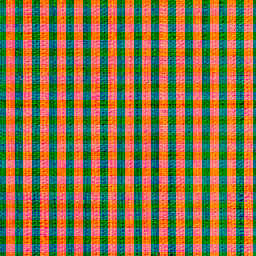                         | <a href='https://raw.githubusercontent.com/abdulkadiraktas/rdr3_discoveries/master/useful_info_from_rpfs/textures//ui_swatches/images/0x189C5DA4/.png'>Download</a> |
| uisw_canvas_ck003             | 301057997    |                          | <a href='https://raw.githubusercontent.com/abdulkadiraktas/rdr3_discoveries/master/useful_info_from_rpfs/textures//ui_swatches/images/0x189C5DA4/.png'>Download</a> |
| uisw_canvas_sv000             | -429698485   | 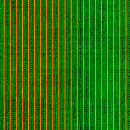                         | <a href='https://raw.githubusercontent.com/abdulkadiraktas/rdr3_discoveries/master/useful_info_from_rpfs/textures//ui_swatches/images/0x189C5DA4/.png'>Download</a> |
| uisw_canvas_sv001             | -136841932   | 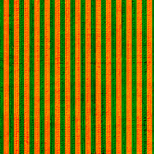                         | <a href='https://raw.githubusercontent.com/abdulkadiraktas/rdr3_discoveries/master/useful_info_from_rpfs/textures//ui_swatches/images/0x189C5DA4/.png'>Download</a> |
| uisw_canvas_sv003             | -730976671   |                          | <a href='https://raw.githubusercontent.com/abdulkadiraktas/rdr3_discoveries/master/useful_info_from_rpfs/textures//ui_swatches/images/0x189C5DA4/.png'>Download</a> |
| uisw_cotton_000               | 2049179388   | 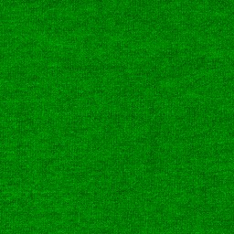                             | <a href='https://raw.githubusercontent.com/abdulkadiraktas/rdr3_discoveries/master/useful_info_from_rpfs/textures//ui_swatches/images/0x189C5DA4/.png'>Download</a> |
| uisw_cotton_ck000             | -2123634861  |                          | <a href='https://raw.githubusercontent.com/abdulkadiraktas/rdr3_discoveries/master/useful_info_from_rpfs/textures//ui_swatches/images/0x189C5DA4/.png'>Download</a> |
| uisw_cotton_ck001             | 702494771    |                          | <a href='https://raw.githubusercontent.com/abdulkadiraktas/rdr3_discoveries/master/useful_info_from_rpfs/textures//ui_swatches/images/0x189C5DA4/.png'>Download</a> |
| uisw_cotton_ck002             | 471112862    |                          | <a href='https://raw.githubusercontent.com/abdulkadiraktas/rdr3_discoveries/master/useful_info_from_rpfs/textures//ui_swatches/images/0x189C5DA4/.png'>Download</a> |
| uisw_cotton_ck003             | 1180430636   |                          | <a href='https://raw.githubusercontent.com/abdulkadiraktas/rdr3_discoveries/master/useful_info_from_rpfs/textures//ui_swatches/images/0x189C5DA4/.png'>Download</a> |
| uisw_cotton_pd000             | 104900511    | 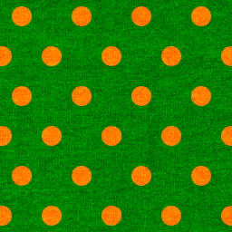                         | <a href='https://raw.githubusercontent.com/abdulkadiraktas/rdr3_discoveries/master/useful_info_from_rpfs/textures//ui_swatches/images/0x189C5DA4/.png'>Download</a> |
| uisw_cotton_pt000             | 2146053187   |                          | <a href='https://raw.githubusercontent.com/abdulkadiraktas/rdr3_discoveries/master/useful_info_from_rpfs/textures//ui_swatches/images/0x189C5DA4/.png'>Download</a> |
| uisw_cotton_pt001             | 1323059752   | 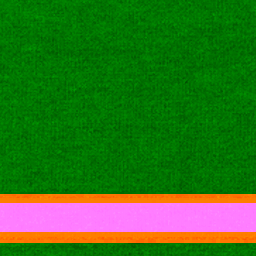                         | <a href='https://raw.githubusercontent.com/abdulkadiraktas/rdr3_discoveries/master/useful_info_from_rpfs/textures//ui_swatches/images/0x189C5DA4/.png'>Download</a> |
| uisw_cotton_pt002             | 1702066006   |                          | <a href='https://raw.githubusercontent.com/abdulkadiraktas/rdr3_discoveries/master/useful_info_from_rpfs/textures//ui_swatches/images/0x189C5DA4/.png'>Download</a> |
| uisw_cotton_pt003             | 878744881    |                          | <a href='https://raw.githubusercontent.com/abdulkadiraktas/rdr3_discoveries/master/useful_info_from_rpfs/textures//ui_swatches/images/0x189C5DA4/.png'>Download</a> |
| uisw_cotton_pt004             | 1117663660   | 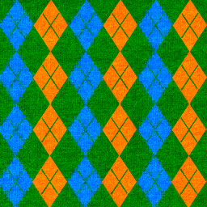                         | <a href='https://raw.githubusercontent.com/abdulkadiraktas/rdr3_discoveries/master/useful_info_from_rpfs/textures//ui_swatches/images/0x189C5DA4/.png'>Download</a> |
| uisw_cotton_sv000             | 635701943    |                          | <a href='https://raw.githubusercontent.com/abdulkadiraktas/rdr3_discoveries/master/useful_info_from_rpfs/textures//ui_swatches/images/0x189C5DA4/.png'>Download</a> |
| uisw_cotton_sv001             | 339273569    | 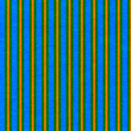                         | <a href='https://raw.githubusercontent.com/abdulkadiraktas/rdr3_discoveries/master/useful_info_from_rpfs/textures//ui_swatches/images/0x189C5DA4/.png'>Download</a> |
| uisw_cotton_sv003             | -2129739509  |                          | <a href='https://raw.githubusercontent.com/abdulkadiraktas/rdr3_discoveries/master/useful_info_from_rpfs/textures//ui_swatches/images/0x189C5DA4/.png'>Download</a> |
| uisw_denim_000                | 1624788690   | 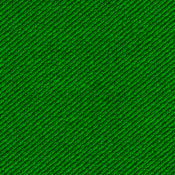                               | <a href='https://raw.githubusercontent.com/abdulkadiraktas/rdr3_discoveries/master/useful_info_from_rpfs/textures//ui_swatches/images/0x189C5DA4/.png'>Download</a> |
| uisw_denim_ck000              | -458020220   |                            | <a href='https://raw.githubusercontent.com/abdulkadiraktas/rdr3_discoveries/master/useful_info_from_rpfs/textures//ui_swatches/images/0x189C5DA4/.png'>Download</a> |
| uisw_denim_ck001              | -146223185   | 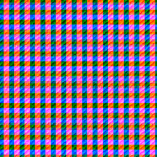                           | <a href='https://raw.githubusercontent.com/abdulkadiraktas/rdr3_discoveries/master/useful_info_from_rpfs/textures//ui_swatches/images/0x189C5DA4/.png'>Download</a> |
| uisw_denim_ck002              | -87173451    | 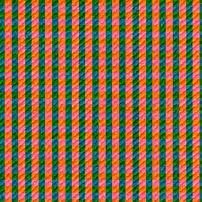                           | <a href='https://raw.githubusercontent.com/abdulkadiraktas/rdr3_discoveries/master/useful_info_from_rpfs/textures//ui_swatches/images/0x189C5DA4/.png'>Download</a> |
| uisw_denim_ck003              | 209779227    |                            | <a href='https://raw.githubusercontent.com/abdulkadiraktas/rdr3_discoveries/master/useful_info_from_rpfs/textures//ui_swatches/images/0x189C5DA4/.png'>Download</a> |
| uisw_denim_sv000              | -703720800   | 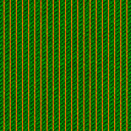                           | <a href='https://raw.githubusercontent.com/abdulkadiraktas/rdr3_discoveries/master/useful_info_from_rpfs/textures//ui_swatches/images/0x189C5DA4/.png'>Download</a> |
| uisw_denim_sv001              | 758268163    |                            | <a href='https://raw.githubusercontent.com/abdulkadiraktas/rdr3_discoveries/master/useful_info_from_rpfs/textures//ui_swatches/images/0x189C5DA4/.png'>Download</a> |
| uisw_denim_sv003              | 465542686    |                            | <a href='https://raw.githubusercontent.com/abdulkadiraktas/rdr3_discoveries/master/useful_info_from_rpfs/textures//ui_swatches/images/0x189C5DA4/.png'>Download</a> |
| uisw_flat_ck000               | 1793385910   |                              | <a href='https://raw.githubusercontent.com/abdulkadiraktas/rdr3_discoveries/master/useful_info_from_rpfs/textures//ui_swatches/images/0x189C5DA4/.png'>Download</a> |
| uisw_horse_000                | 1223202389   |                                | <a href='https://raw.githubusercontent.com/abdulkadiraktas/rdr3_discoveries/master/useful_info_from_rpfs/textures//ui_swatches/images/0x189C5DA4/.png'>Download</a> |
| uisw_horse_cotton_new000      | -952586304   |            | <a href='https://raw.githubusercontent.com/abdulkadiraktas/rdr3_discoveries/master/useful_info_from_rpfs/textures//ui_swatches/images/0x189C5DA4/.png'>Download</a> |
| uisw_horse_cotton_pt001       | -1017130533  | 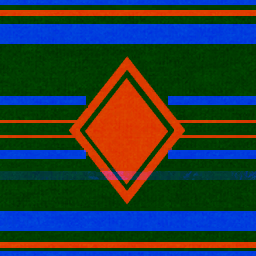             | <a href='https://raw.githubusercontent.com/abdulkadiraktas/rdr3_discoveries/master/useful_info_from_rpfs/textures//ui_swatches/images/0x189C5DA4/.png'>Download</a> |
| uisw_horse_cotton_pt002       | -1732477807  |              | <a href='https://raw.githubusercontent.com/abdulkadiraktas/rdr3_discoveries/master/useful_info_from_rpfs/textures//ui_swatches/images/0x189C5DA4/.png'>Download</a> |
| uisw_horse_cotton_pt003       | 1727895828   | 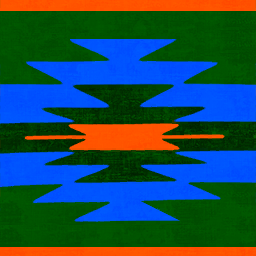             | <a href='https://raw.githubusercontent.com/abdulkadiraktas/rdr3_discoveries/master/useful_info_from_rpfs/textures//ui_swatches/images/0x189C5DA4/.png'>Download</a> |
| uisw_horse_cotton_pt004       | 86365542     | 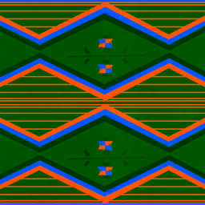             | <a href='https://raw.githubusercontent.com/abdulkadiraktas/rdr3_discoveries/master/useful_info_from_rpfs/textures//ui_swatches/images/0x189C5DA4/.png'>Download</a> |
| uisw_horse_cotton_pt005       | 325612011    |              | <a href='https://raw.githubusercontent.com/abdulkadiraktas/rdr3_discoveries/master/useful_info_from_rpfs/textures//ui_swatches/images/0x189C5DA4/.png'>Download</a> |
| uisw_horse_cotton_pt006       | -1670708238  | 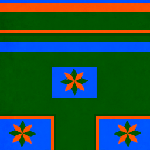             | <a href='https://raw.githubusercontent.com/abdulkadiraktas/rdr3_discoveries/master/useful_info_from_rpfs/textures//ui_swatches/images/0x189C5DA4/.png'>Download</a> |
| uisw_horse_cotton_pt007       | -1231538100  | 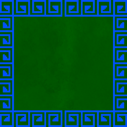             | <a href='https://raw.githubusercontent.com/abdulkadiraktas/rdr3_discoveries/master/useful_info_from_rpfs/textures//ui_swatches/images/0x189C5DA4/.png'>Download</a> |
| uisw_horse_cotton_pt008       | 1340599021   | 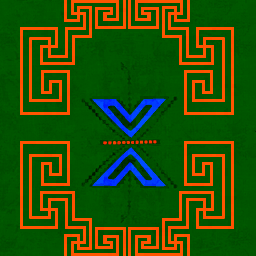             | <a href='https://raw.githubusercontent.com/abdulkadiraktas/rdr3_discoveries/master/useful_info_from_rpfs/textures//ui_swatches/images/0x189C5DA4/.png'>Download</a> |
| uisw_horse_cotton_pt009       | 506300281    | 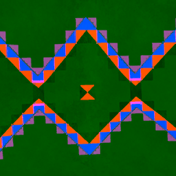             | <a href='https://raw.githubusercontent.com/abdulkadiraktas/rdr3_discoveries/master/useful_info_from_rpfs/textures//ui_swatches/images/0x189C5DA4/.png'>Download</a> |
| uisw_horse_cotton_pt010       | 65163775     | 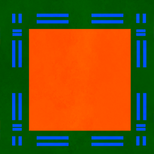             | <a href='https://raw.githubusercontent.com/abdulkadiraktas/rdr3_discoveries/master/useful_info_from_rpfs/textures//ui_swatches/images/0x189C5DA4/.png'>Download</a> |
| uisw_horse_cotton_pt011       | 291794179    | 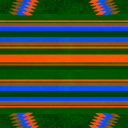             | <a href='https://raw.githubusercontent.com/abdulkadiraktas/rdr3_discoveries/master/useful_info_from_rpfs/textures//ui_swatches/images/0x189C5DA4/.png'>Download</a> |
| uisw_horse_cotton_pt012       | -1503881483  | 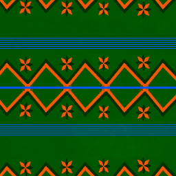             | <a href='https://raw.githubusercontent.com/abdulkadiraktas/rdr3_discoveries/master/useful_info_from_rpfs/textures//ui_swatches/images/0x189C5DA4/.png'>Download</a> |
| uisw_horse_cotton_used000     | -1269143707  |          | <a href='https://raw.githubusercontent.com/abdulkadiraktas/rdr3_discoveries/master/useful_info_from_rpfs/textures//ui_swatches/images/0x189C5DA4/.png'>Download</a> |
| uisw_horse_hair_000           | 2012564403   | 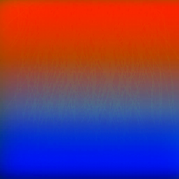                     | <a href='https://raw.githubusercontent.com/abdulkadiraktas/rdr3_discoveries/master/useful_info_from_rpfs/textures//ui_swatches/images/0x189C5DA4/.png'>Download</a> |
| uisw_horse_hair_001           | -2004685618  | 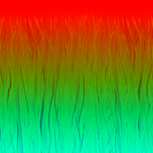                     | <a href='https://raw.githubusercontent.com/abdulkadiraktas/rdr3_discoveries/master/useful_info_from_rpfs/textures//ui_swatches/images/0x189C5DA4/.png'>Download</a> |
| uisw_horse_hair_002           |              | 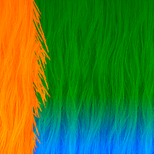                     | <a href='https://raw.githubusercontent.com/abdulkadiraktas/rdr3_discoveries/master/useful_info_from_rpfs/textures//ui_swatches/images/0x189C5DA4/.png'>Download</a> |
| uisw_horse_hair_003           |              | 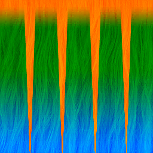                     | <a href='https://raw.githubusercontent.com/abdulkadiraktas/rdr3_discoveries/master/useful_info_from_rpfs/textures//ui_swatches/images/0x189C5DA4/.png'>Download</a> |
| uisw_horse_hair_004           |              | 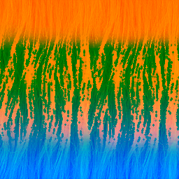                     | <a href='https://raw.githubusercontent.com/abdulkadiraktas/rdr3_discoveries/master/useful_info_from_rpfs/textures//ui_swatches/images/0x189C5DA4/.png'>Download</a> |
| uisw_horse_leather_new000     | 2081404945   |          | <a href='https://raw.githubusercontent.com/abdulkadiraktas/rdr3_discoveries/master/useful_info_from_rpfs/textures//ui_swatches/images/0x189C5DA4/.png'>Download</a> |
| uisw_horse_leather_used000    | -572148064   | 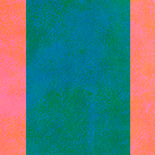       | <a href='https://raw.githubusercontent.com/abdulkadiraktas/rdr3_discoveries/master/useful_info_from_rpfs/textures//ui_swatches/images/0x189C5DA4/.png'>Download</a> |
| uisw_horse_mask_hm000         |              | 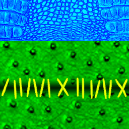                 | <a href='https://raw.githubusercontent.com/abdulkadiraktas/rdr3_discoveries/master/useful_info_from_rpfs/textures//ui_swatches/images/0x189C5DA4/.png'>Download</a> |
| uisw_horse_mask_hm001         |              | 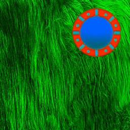                 | <a href='https://raw.githubusercontent.com/abdulkadiraktas/rdr3_discoveries/master/useful_info_from_rpfs/textures//ui_swatches/images/0x189C5DA4/.png'>Download</a> |
| uisw_horse_mask_hm002         |              |                  | <a href='https://raw.githubusercontent.com/abdulkadiraktas/rdr3_discoveries/master/useful_info_from_rpfs/textures//ui_swatches/images/0x189C5DA4/.png'>Download</a> |
| uisw_horse_metal_000          | 1185401359   |                    | <a href='https://raw.githubusercontent.com/abdulkadiraktas/rdr3_discoveries/master/useful_info_from_rpfs/textures//ui_swatches/images/0x189C5DA4/.png'>Download</a> |
| uisw_horse_trapperblanket_001 | 1262476316   | 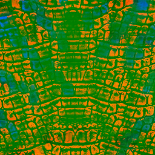 | <a href='https://raw.githubusercontent.com/abdulkadiraktas/rdr3_discoveries/master/useful_info_from_rpfs/textures//ui_swatches/images/0x189C5DA4/.png'>Download</a> |
| uisw_horse_trapperblanket_002 | 1444475342   | 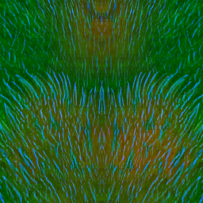 | <a href='https://raw.githubusercontent.com/abdulkadiraktas/rdr3_discoveries/master/useful_info_from_rpfs/textures//ui_swatches/images/0x189C5DA4/.png'>Download</a> |
| uisw_horse_trapperblanket_003 | -288775379   |  | <a href='https://raw.githubusercontent.com/abdulkadiraktas/rdr3_discoveries/master/useful_info_from_rpfs/textures//ui_swatches/images/0x189C5DA4/.png'>Download</a> |
| uisw_horse_trapperblanket_004 | 1502771389   | 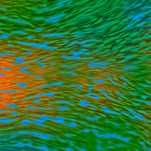 | <a href='https://raw.githubusercontent.com/abdulkadiraktas/rdr3_discoveries/master/useful_info_from_rpfs/textures//ui_swatches/images/0x189C5DA4/.png'>Download</a> |
| uisw_horse_trapperblanket_005 | 309226102    | 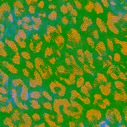 | <a href='https://raw.githubusercontent.com/abdulkadiraktas/rdr3_discoveries/master/useful_info_from_rpfs/textures//ui_swatches/images/0x189C5DA4/.png'>Download</a> |
| uisw_leather_000              | -485941338   | 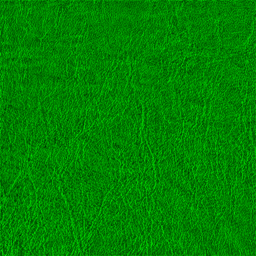                           | <a href='https://raw.githubusercontent.com/abdulkadiraktas/rdr3_discoveries/master/useful_info_from_rpfs/textures//ui_swatches/images/0x189C5DA4/.png'>Download</a> |
| uisw_leather_cow_000          |              |                    | <a href='https://raw.githubusercontent.com/abdulkadiraktas/rdr3_discoveries/master/useful_info_from_rpfs/textures//ui_swatches/images/0x189C5DA4/.png'>Download</a> |
| uisw_leather_pt000            | -1553297925  |                        | <a href='https://raw.githubusercontent.com/abdulkadiraktas/rdr3_discoveries/master/useful_info_from_rpfs/textures//ui_swatches/images/0x189C5DA4/.png'>Download</a> |
| uisw_leather_pt001            | -1282396602  |                        | <a href='https://raw.githubusercontent.com/abdulkadiraktas/rdr3_discoveries/master/useful_info_from_rpfs/textures//ui_swatches/images/0x189C5DA4/.png'>Download</a> |
| uisw_leather_pt002            | -99796161    |                        | <a href='https://raw.githubusercontent.com/abdulkadiraktas/rdr3_discoveries/master/useful_info_from_rpfs/textures//ui_swatches/images/0x189C5DA4/.png'>Download</a> |
